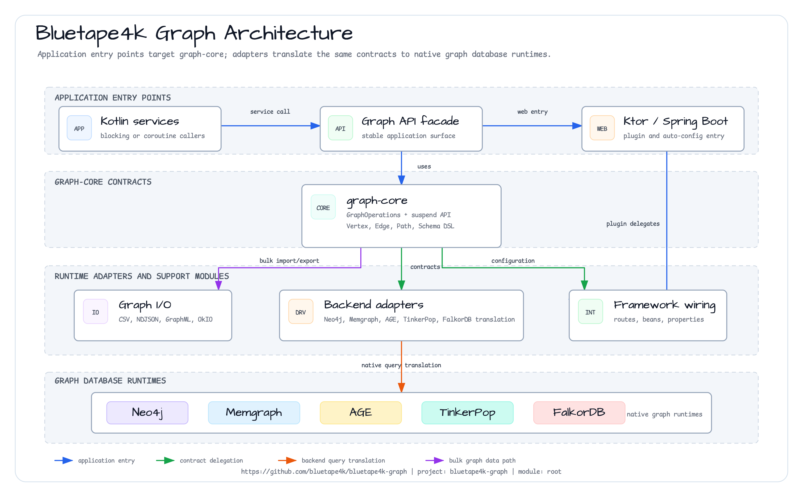
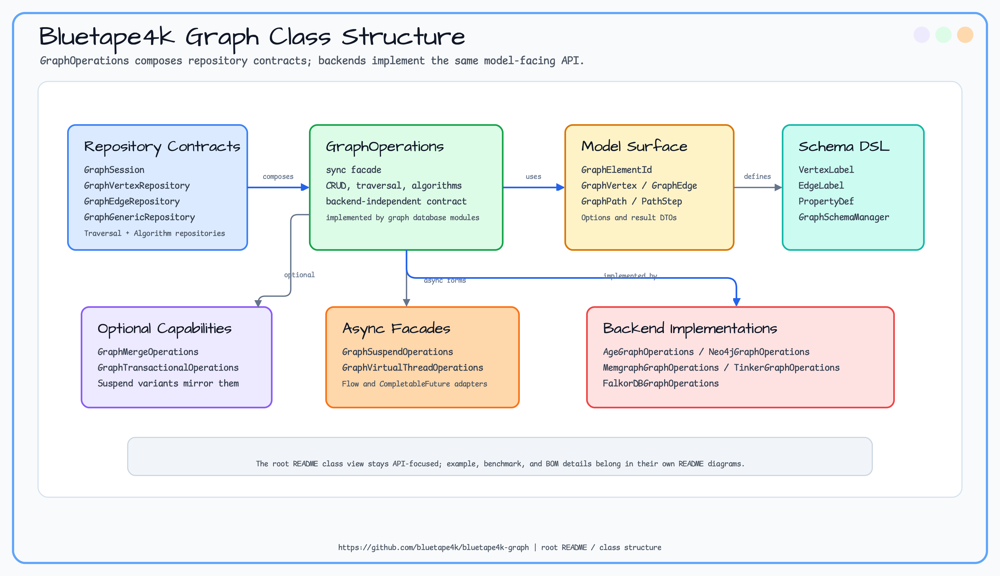

# bluetape4k-graph

[](https://github.com/bluetape4k/bluetape4k-graph/actions/workflows/ci.yml)
[](https://kotlinlang.org)
[](https://openjdk.org)
[](LICENSE)


Graph database integration library for the bluetape4k ecosystem. It provides a unified Kotlin API over Apache AGE, Neo4j, Memgraph, Apache TinkerPop, and FalkorDB, plus bulk import/export, Ktor integration, Spring Boot 4 auto-configuration, examples, benchmarks, and a BOM for dependency alignment.

> 🇰🇷 [한국어 문서](README.ko.md)

## What This Project Provides

`bluetape4k-graph` lets application code describe graph work once and run it against several graph databases. The core module owns the stable domain model, repository contracts, traversal APIs, schema DSL, and optional capability interfaces. Backend modules translate those contracts to each database's native driver and query model.

Use this project when you need:

- a shared graph abstraction for services that may move between Neo4j, Memgraph, AGE, TinkerGraph, or FalkorDB
- paired blocking and coroutine APIs, with virtual-thread adapters for blocking backends
- common graph capabilities such as batch insert, schema/index management, merge/upsert, transaction blocks, weighted paths, and graph algorithms
- portable graph bulk I/O in CSV, NDJSON, GraphML, and OkIO streams
- ready-to-run domain examples for code graphs, social graphs, fraud detection, recommendations, knowledge graphs, and Ktor integration

## Architecture





## Supported Graph Databases

| Database | Module | Query model | Local testing | Best fit |
|----------|--------|-------------|---------------|----------|
| Neo4j | `graph-neo4j` | Cypher through Neo4j Java Driver | Testcontainers `neo4j:5` | Production graph database with mature tooling, indexes, transactions, and Cypher support |
| Memgraph | `graph-memgraph` | Cypher through Neo4j-compatible protocol | Testcontainers `memgraph/memgraph` | Low-latency graph workloads and Neo4j-like development with Memgraph runtime behavior |
| Apache AGE | `graph-age` | Cypher-over-SQL through PostgreSQL/JDBC | Testcontainers `apache/age:PG16_latest` | PostgreSQL-centered deployments that need graph modeling without running a separate graph server |
| TinkerPop / TinkerGraph | `graph-tinkerpop` | Gremlin | In-memory JVM graph, no external service | Fast tests, examples, local demos, and Gremlin-style graph traversal |
| FalkorDB | `graph-falkordb` | openCypher subset over Redis module | Testcontainers `falkordb/falkordb:v4.18.1` | Redis-backed graph workloads and lightweight graph service deployment |

Amazon Neptune is tracked separately as future backend work. Because meaningful support depends on local/integration testability, feasibility research is handled before implementing `graph-neptune`.

## Module Structure

```
bom/             # BOM project for coordinated module versions (`bluetape4k-graph-bom`)
graph/
  graph-core       # Backend-independent models and interfaces (foundation for all modules)
  graph-age        # Apache AGE (PostgreSQL graph extension) implementation
  graph-neo4j      # Neo4j Java Driver implementation
  graph-memgraph   # Memgraph (Neo4j protocol compatible) implementation
  graph-tinkerpop  # Apache TinkerPop / TinkerGraph in-memory implementation
  graph-falkordb   # FalkorDB (Redis-based) implementation — jfalkordb 0.7.0
graph-io/
  core             # Shared contracts, models, options, and helpers for bulk I/O
  csv              # CSV bulk import/export (Sync / VirtualThread / Coroutine)
  jackson2         # Jackson 2.x NDJSON bulk import/export
  jackson3         # Jackson 3.x NDJSON bulk import/export
  graphml          # GraphML (XML/StAX) bulk import/export
  okio             # OkIO streaming, compression chaining, DAEAD encryption
benchmark/
  graph-benchmark     # JMH benchmarks — Sync vs VirtualThread graph operations
  graph-io-benchmark  # JMH benchmarks — CSV / NDJSON / GraphML bulk I/O performance
  graph-age-benchmark # Apache AGE backend benchmarks
  graph-neo4j-benchmark # Neo4j backend benchmarks
spring-boot/
  graph-spring-boot  # Spring Boot 4.x AutoConfiguration
ktor/
  graph-ktor                  # Ktor 3.x ApplicationPlugin integration
examples/
  code-graph-examples     # Code dependency graph examples (AGE, Neo4j, Memgraph, TinkerGraph, FalkorDB integration)
  fraud-detection-examples # Transaction fraud graph examples
  knowledge-graph-examples # Document/entity knowledge graph examples
  linkedin-graph-examples # LinkedIn social graph examples (AGE, Neo4j, Memgraph, TinkerGraph, FalkorDB integration)
  recommendation-examples # Product/user recommendation graph examples
  ktor-graph-examples     # Ktor GraphPlugin example using TinkerGraph
```

## Core Abstraction (`graph-core`)

The common interface layer that every backend implementation adheres to.

### Dual API Pattern

Provides both synchronous (blocking) and coroutine (suspend/Flow) APIs.

```
GraphOperations        = GraphSession + GraphVertexRepository + GraphEdgeRepository + GraphTraversalRepository
GraphSuspendOperations = GraphSuspendSession + ... (suspend function versions)
```

### Domain Model

```kotlin
data class GraphVertex(val id: GraphElementId, val label: String, val properties: Map<String, Any?>)
data class GraphEdge(val id: GraphElementId, val label: String, val startId: GraphElementId, val endId: GraphElementId, val properties: Map<String, Any?>)
data class GraphPath(val steps: List<PathStep>)   // VertexStep | EdgeStep
```

### Schema DSL

Declarative schema definition in the Exposed Table style. Works backend-independently.

```kotlin
object PersonLabel : VertexLabel("Person") {
    val name = string("name")
    val age  = integer("age")
}

object KnowsLabel : EdgeLabel("KNOWS") {
    val since = localDate("since")
}
```

### Batch Insert API

`GraphVertexRepository.createVertices(...)` and `GraphEdgeRepository.createEdges(...)` create multiple elements with one call. The default interface methods preserve source compatibility by looping over the single-row APIs, while Neo4j, Memgraph, FalkorDB, AGE, and TinkerGraph provide backend-specific batch paths.

Return order matches input order. Native edge batches validate endpoints before writing so a missing endpoint fails the whole batch instead of leaving partial edges.

```kotlin
val people = ops.createVertices(
    "Person",
    listOf(
        mapOf("name" to "Alice"),
        mapOf("name" to "Bob"),
    )
)

val edges = ops.createEdges(
    "KNOWS",
    listOf(BatchEdge(people[0].id, people[1].id, mapOf("since" to 2026)))
)
```

The same contract is exposed on sync, suspend, and virtual-thread adapters (`createVertices`, `createEdges`, `createVerticesAsync`, `createEdgesAsync`). Smoke evidence for 10k-row inserts is tracked in [2026-05 test logs](docs/testlogs/2026-05.md).

### Schema, Merge, and Transaction Capabilities

`graph-core` also defines optional capability interfaces that backends implement when they can provide stronger
write-time guarantees without changing the base `GraphOperations` source contract.

| Capability | API | Purpose |
|------------|-----|---------|
| Schema manager | `ops.schemaManager()` / `suspendOps.schemaManager()` | Create/list/drop indexes and constraints through common metadata models |
| Merge / Upsert | `ops.mergeVertex(...)`, `ops.mergeEdge(...)` | Idempotent vertex and edge writes using stable `matchProperties` |
| Transaction DSL | `ops.transaction { }`, `suspendOps.suspendTransaction { }` | Atomic repository-style vertex/edge work blocks |

```kotlin
import io.bluetape4k.graph.repository.mergeVertex
import io.bluetape4k.graph.repository.transaction
import io.bluetape4k.graph.schema.schemaManager

ops.schemaManager().createIndex("Person", "email")

val alice = ops.mergeVertex(
    label = "Person",
    matchProperties = mapOf("email" to "alice@example.com"),
    setProperties = mapOf("name" to "Alice"),
)

val edge = ops.transaction {
    val bob = createVertex("Person", mapOf("email" to "bob@example.com"))
    createEdge(alice.id, bob.id, "KNOWS")
}
```

## Bulk Import / Export (`graph-io`)

The `graph-io` family provides format-independent bulk I/O with three execution models (Sync, VirtualThread, Coroutine).

```kotlin
// CSV export — sync
val sink = CsvGraphExportSink(
    GraphExportSink.PathSink(Path.of("vertices.csv")),
    GraphExportSink.PathSink(Path.of("edges.csv"))
)
CsvGraphBulkExporter().exportGraph(sink, ops, GraphExportOptions(
    vertexLabels = setOf("Person"),
    edgeLabels   = setOf("KNOWS")
))

// Jackson2 NDJSON export — virtual thread
Jackson2NdJsonVirtualThreadBulkExporter()
    .exportGraphAsync(GraphExportSink.PathSink(Path.of("graph.ndjson")), ops, options)
    .get()

// GraphML export — coroutine suspend
SuspendGraphMlBulkExporter().exportGraphSuspending(
    GraphExportSink.PathSink(Path.of("graph.graphml")), suspendOps, options
)
```

Importers use `GraphImportOptions.batchSize` as the backend write flush size. Pending vertices and edges are grouped by label and flushed through `createVertices`/`createEdges`; duplicate-ID and missing-endpoint policies keep their existing semantics.

| Module | Format | Docs |
|--------|--------|------|
| `graph-io-core` | Shared contracts, models, options, and helpers (`GraphBulkImporter`, `GraphBulkExporter`, `GraphIoPaths`, `GraphIoExternalIdMap`) | [README](graph-io/core/README.md) |
| `graph-io-csv` | CSV (split vertex/edge files) | [README](graph-io/csv/README.md) |
| `graph-io-jackson2` | NDJSON (Jackson 2.x) | [README](graph-io/jackson2/README.md) |
| `graph-io-jackson3` | NDJSON (Jackson 3.x) | [README](graph-io/jackson3/README.md) |
| `graph-io-graphml` | GraphML XML (StAX) | [README](graph-io/graphml/README.md) |
| `graph-okio` | OkIO-based adapter — segment streaming, compression chaining, FakeFileSystem support, and DAEAD chunk encryption | [README](graph-io/okio/README.md) |

> **Benchmark results**: [2026-04-18 graph-io bulk I/O results](docs/benchmark/2026-04-18-graph-io-bulk-results.md)

---

## Adding Dependencies

### BOM (Recommended)

```kotlin
// build.gradle.kts
dependencyManagement {
    imports {
        mavenBom("io.github.bluetape4k.graph:bluetape4k-graph-bom:<version>")
    }
}

dependencies {
    implementation("io.github.bluetape4k.graph:bluetape4k-graph-neo4j")   // version can be omitted
    implementation("io.github.bluetape4k.graph:bluetape4k-graph-age")
}
```

### Individual Modules

```kotlin
dependencies {
    implementation("io.github.bluetape4k.graph:bluetape4k-graph-core:<version>")
    implementation("io.github.bluetape4k.graph:bluetape4k-graph-neo4j:<version>")
    // graph-age | graph-memgraph | graph-tinkerpop | graph-ktor
}
```

## Quick Start

### Neo4j

```kotlin
val driver = GraphDatabase.driver(Neo4jServer.Launcher.neo4j.boltUrl, AuthTokens.none())
val ops = Neo4jGraphOperations(driver)

val alice = ops.createVertex("Person", mapOf("name" to "Alice", "age" to 30))
val bob   = ops.createVertex("Person", mapOf("name" to "Bob",   "age" to 28))
ops.createEdge(alice.id, bob.id, "KNOWS", mapOf("since" to LocalDate.now()))

val path = ops.shortestPath(alice.id, bob.id, "KNOWS", maxDepth = 5)
```

### Apache AGE (PostgreSQL)

```kotlin
val hikariConfig = HikariConfig().apply {
    jdbcUrl = "jdbc:postgresql://localhost:5432/postgres"
    connectionInitSql = "LOAD 'age'; SET search_path = ag_catalog, \"${'$'}user\", public"
}
val db = Database.connect(HikariDataSource(hikariConfig))
val ops = AgeGraphOperations("my_graph")

ops.createGraph("my_graph")
val alice = ops.createVertex("Person", mapOf("name" to "Alice"))
```

### TinkerPop (In-Memory, No External Server Required)

```kotlin
val ops = TinkerGraphOperations()
val alice = ops.createVertex("Person", mapOf("name" to "Alice"))
val bob   = ops.createVertex("Person", mapOf("name" to "Bob"))
ops.createEdge(alice.id, bob.id, "KNOWS", emptyMap())

val neighbors = ops.neighbors(alice.id, "KNOWS", Direction.OUTGOING, depth = 1)
ops.close()
```

### FalkorDB (Redis-based)

```kotlin
import com.falkordb.FalkorDB
import io.bluetape4k.graph.falkordb.FalkorDBGraphOperations

val driver = FalkorDB.driver("localhost", 6379)
val ops = FalkorDBGraphOperations(driver, graphName = "social")

val alice = ops.createVertex("Person", mapOf("name" to "Alice", "age" to 30))
val bob   = ops.createVertex("Person", mapOf("name" to "Bob",   "age" to 25))
ops.createEdge(alice.id, bob.id, "KNOWS", mapOf("since" to 2024))

val path = ops.shortestPath(alice.id, bob.id, "KNOWS", maxDepth = 5)
driver.close()
```

## Backend Comparison

| Item | graph-age | graph-neo4j | graph-memgraph | graph-tinkerpop | graph-falkordb |
|------|-----------|-------------|----------------|-----------------|----------------|
| Query Language | Cypher-over-SQL | Cypher | Cypher | Gremlin | openCypher (subset) |
| Infrastructure | PostgreSQL + AGE | Neo4j | Memgraph | JVM in-memory | Redis module |
| Driver | JDBC + Exposed | Neo4j Java Driver | Neo4j Java Driver (compatible) | TinkerPop | jfalkordb 0.7.0 |
| Test Container | `apache/age:PG16_latest` | `neo4j:5` | `memgraph/memgraph:latest` | not required | `falkordb/falkordb:v4.18.1` |
| Strongest local role | PostgreSQL-native graph | Mature graph server | Low-latency Cypher server | Unit/integration tests | Redis-backed graph service |

## Running Tests

Tests automatically launch Docker containers via Testcontainers. Docker is required.

```bash
# All tests
./gradlew test

# Specific module tests
./gradlew :graph-neo4j:test
./gradlew :graph-age:test
./gradlew :code-graph-examples:test
./gradlew :linkedin-graph-examples:test
./gradlew :fraud-detection-examples:test
./gradlew :recommendation-examples:test
./gradlew :knowledge-graph-examples:test

# Specific class
./gradlew :graph-neo4j:test --tests "io.bluetape4k.graph.neo4j.Neo4jGraphOperationsTest"
```

GitHub Actions also runs a dedicated `Examples` workflow daily and on changes to example, graph, graph-io, Ktor, Gradle, or workflow files. The examples are intentionally excluded from the Nightly workflow so the daily example signal stays separate from backend/integration smoke coverage.

## Example Module Structure (`examples/`)

Each example module uses the **abstract test class pattern**. Common test logic lives in one place, while each concrete class only overrides backend-specific setup.

| Abstract Class | Concrete Classes (Backend) |
|----------------|---------------------------|
| `AbstractCodeGraphTest` | `Neo4j/Memgraph/TinkerGraph/Age/FalkorDBCodeGraphTest` |
| `AbstractCodeGraphSuspendTest` | `Neo4j/Memgraph/TinkerGraph/Age/FalkorDBCodeGraphSuspendTest` |
| `AbstractFraudDetectionTest` | Fraud-ring, merchant, card, and transaction graph examples |
| `AbstractKnowledgeGraphTest` | Document/entity/relation knowledge graph examples |
| `AbstractLinkedInGraphTest` | `Neo4j/Memgraph/TinkerGraph/Age/FalkorDBLinkedInGraphTest` |
| `AbstractLinkedInGraphSuspendTest` | `Neo4j/Memgraph/TinkerGraph/Age/FalkorDBLinkedInGraphSuspendTest` |
| `AbstractRecommendationTest` | User/product/category recommendation graph examples |
| `KtorGraphAppTest` | TinkerGraph-backed Ktor `GraphPlugin` smoke example |
| `FalkorDBKtorGraphAppTest` | FalkorDB-backed Ktor `GraphPlugin` smoke example |

Concrete classes only need to implement `ops` (`GraphOperations` or `GraphSuspendOperations`) and the server lifecycle (`@BeforeAll`/`@AfterAll`).

## Requirements

- Java 21 (with preview features enabled)
- Kotlin 2.3
- Docker (for integration tests)

## Tech Stack

- **Kotlin** 2.3 + Coroutines 1.10
- **Neo4j Java Driver** 5.x
- **JetBrains Exposed** (JDBC for Apache AGE)
- **Apache TinkerPop** (Gremlin)
- **Ktor** 3.x (ApplicationPlugin integration)
- **jfalkordb** 0.7.0 (FalkorDB / Redis-module graph)
- **Testcontainers** (integration tests)
- **bluetape4k** 1.7.x (common utilities)

## Documentation

- [Graph Database Pros & Cons and Selection Guide](docs/graphdb-tradeoffs.md) — GraphDB trade-offs and backend selection guide for bluetape4k-graph (Neo4j, Memgraph, AGE, TinkerPop)
