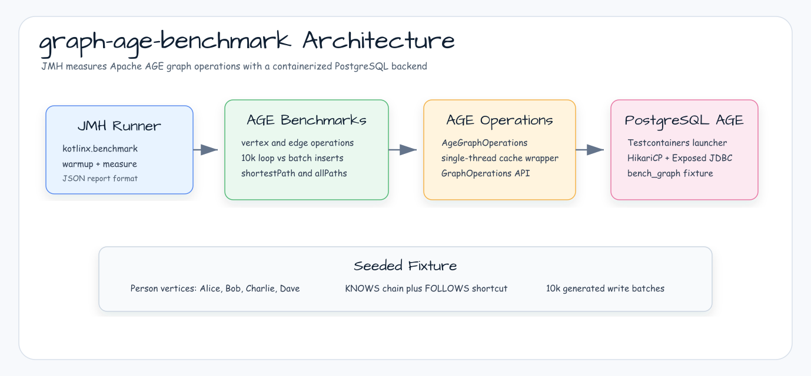

# graph-age-benchmark

[English](README.md) | [한국어](README.ko.md)

`bluetape4k-graph` Apache AGE 백엔드를 위한 JMH 벤치마크 모듈입니다.

## Architecture



## 측정 대상

`graph-age-benchmark`는 벤치마크 상태가 시작한 PostgreSQL + Apache AGE 데이터베이스 위에서 `AgeGraphOperations`를 측정합니다.

- 정점 읽기/쓰기: 정점 생성, 라벨 조회, ID 조회, 이웃 조회.
- 간선 쓰기: 간선 생성, 루프 삽입과 배치 삽입 비교.
- 경로 탐색: 최단 경로와 전체 경로.
- 백엔드 수명주기: Testcontainers가 PostgreSQL AGE를 시작하고, HikariCP가 JDBC 풀을 제공하며, Exposed가 `Database`를 바인딩합니다.

## 소스 근거

- `build.gradle.kts`는 `kotlinx.benchmark`와 `kotlin("plugin.allopen")`을 적용하고, JMH `@State`를 all-open 처리하며 JSON 리포트를 사용합니다.
- `AgeBenchmarkState`는 `PostgreSQLAgeServer.Launcher.postgresqlAge`를 시작하고, JDBC 초기화 SQL로 AGE를 로드한 뒤 `bench_graph`와 `Person` 정점 4개, 간선 4개를 시드합니다.
- `AgeVertexBenchmark`는 읽기/쓰기, 이웃 조회, 10k 루프-vs-배치 삽입 경로를 다룹니다.
- `AgeTraversalBenchmark`는 `PathOptions`로 `shortestPath`와 `allPaths`를 측정합니다.
- `BenchmarkSingleThreadedCachingAgeGraphOperations`는 단일 스레드 JMH 상태 안에서 반복 조회 오버헤드를 측정 대상에서 분리합니다.

## 실행

```bash
./gradlew :graph-age-benchmark:benchmark
```

이 벤치마크는 로컬 컨테이너 PostgreSQL AGE 인스턴스를 시작합니다. 다른 Testcontainers 기반 Gradle 실행과 병렬로 돌리지 마세요.

## 참고

- 픽스처 그래프는 operation-level latency 비교를 위해 의도적으로 작게 유지됩니다.
- 배치 삽입 벤치마크는 10k 정점 또는 간선을 만들어 루프 쓰기와 백엔드 배치 API를 비교합니다.
