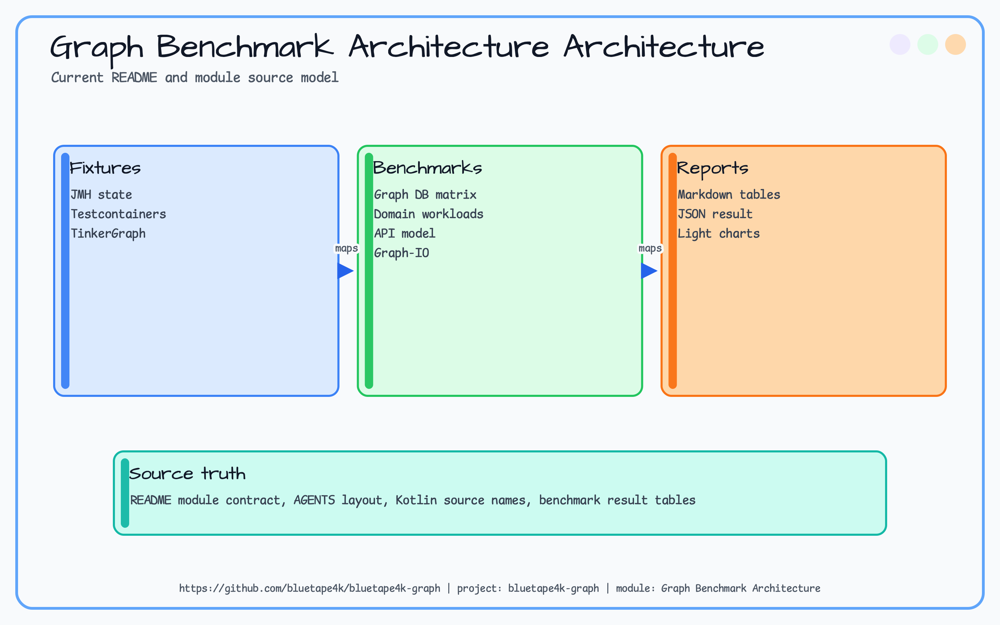
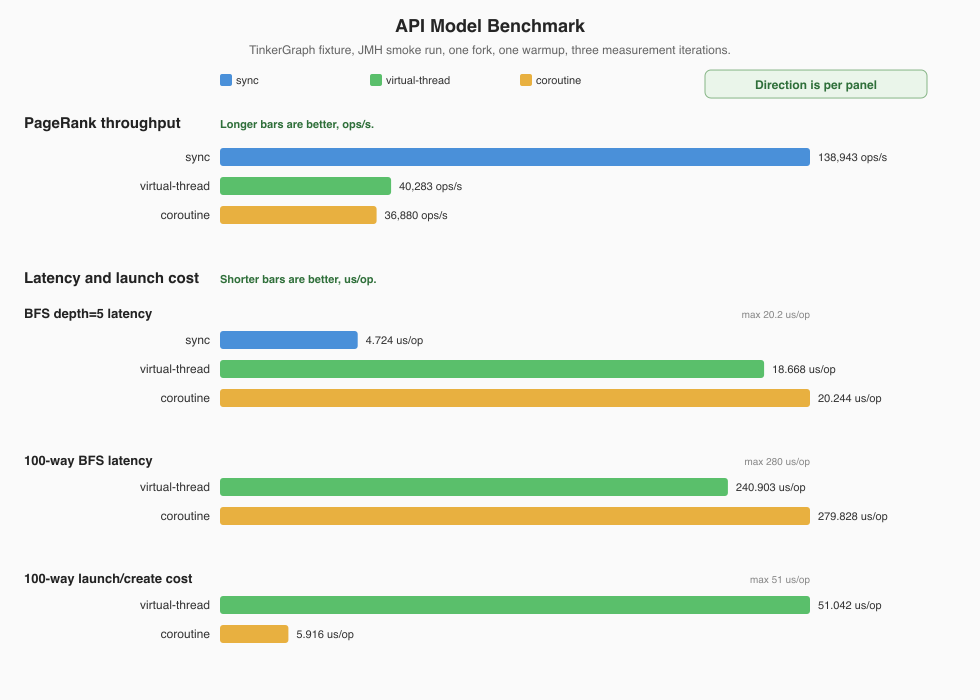
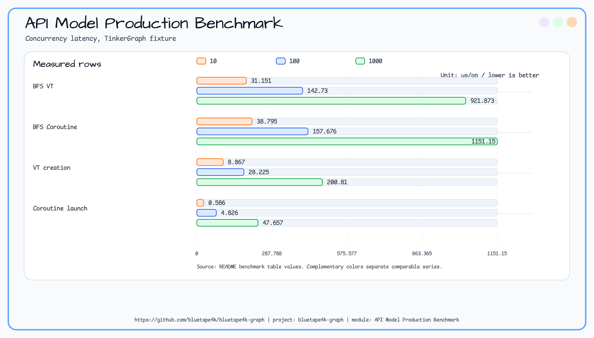
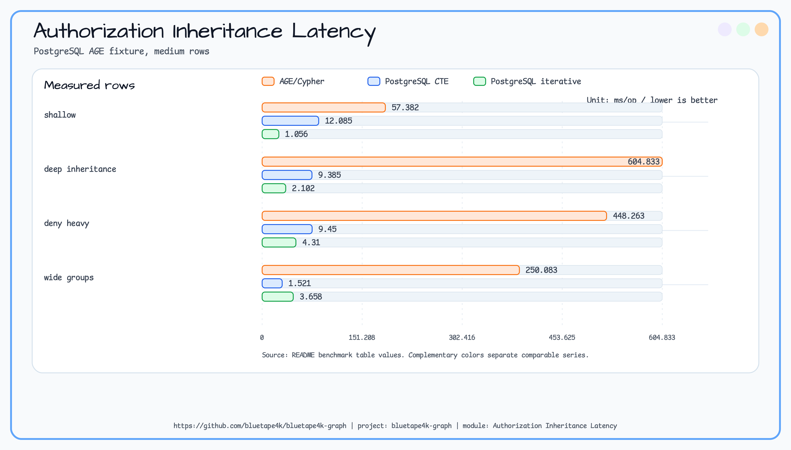
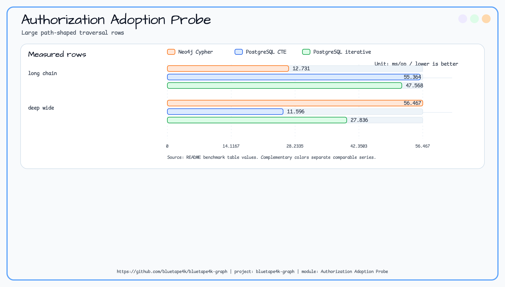
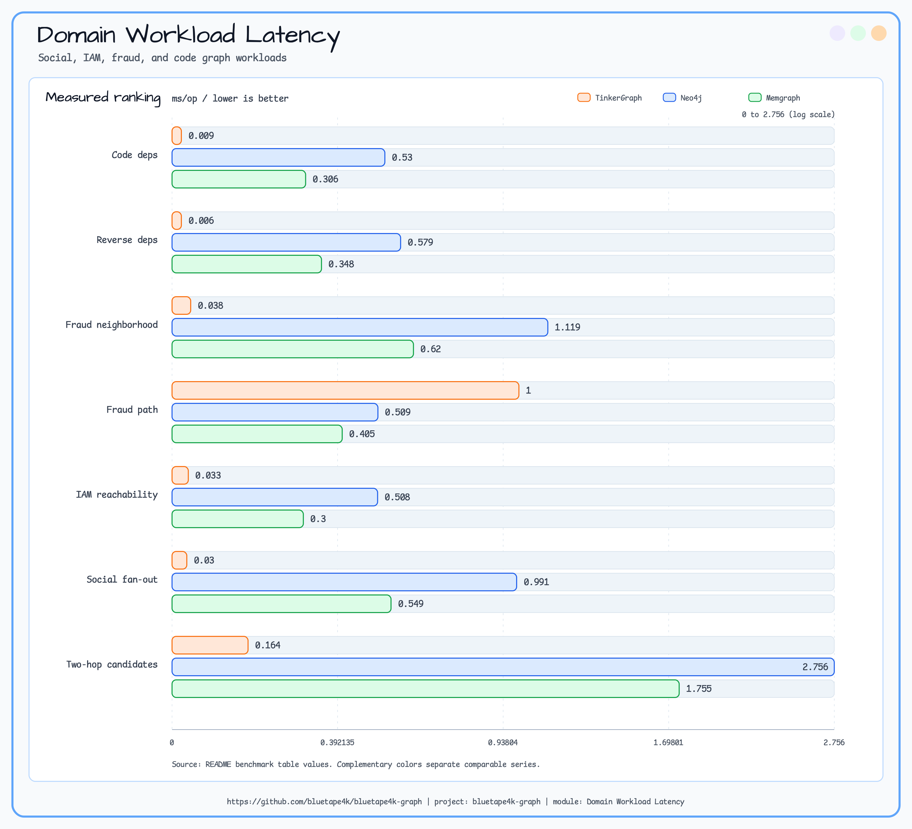
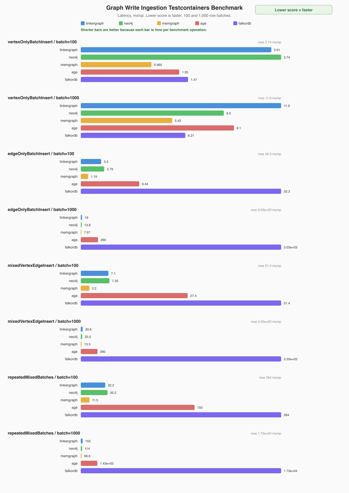
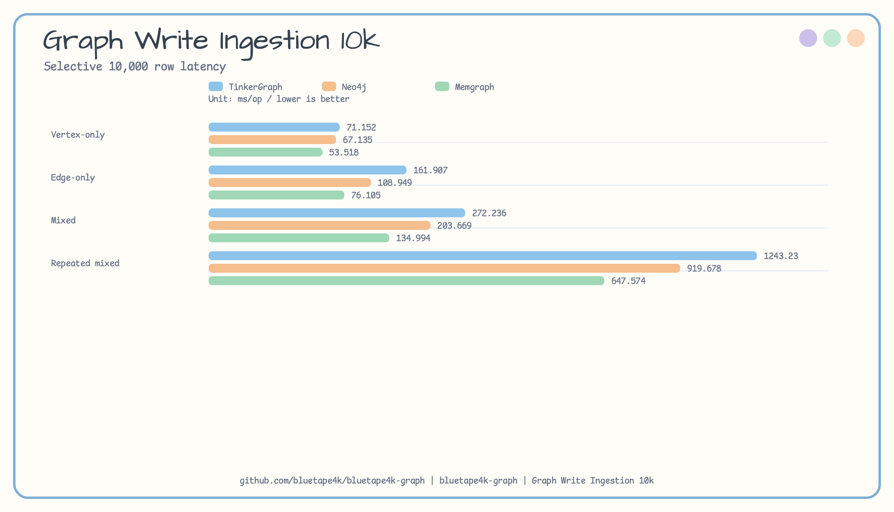
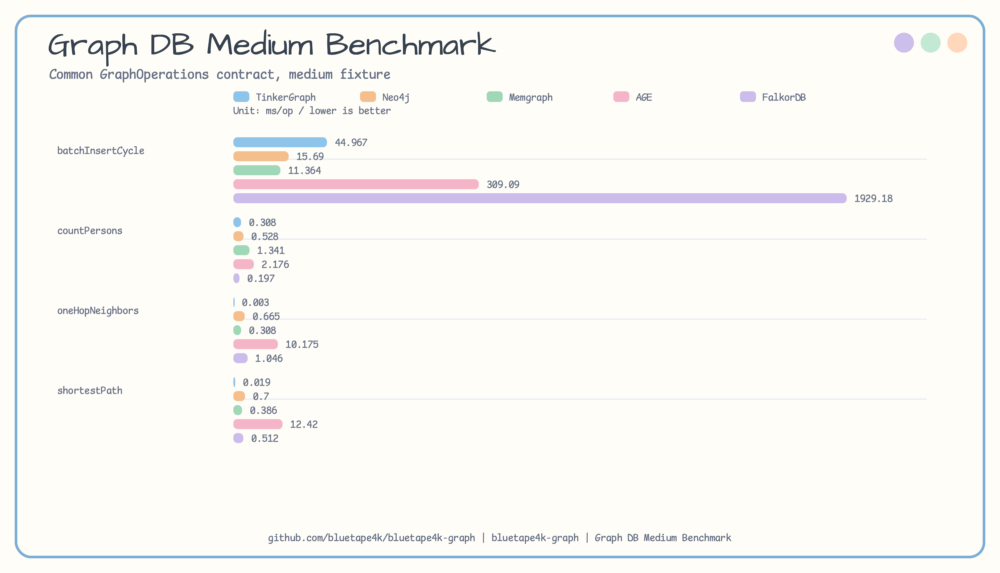
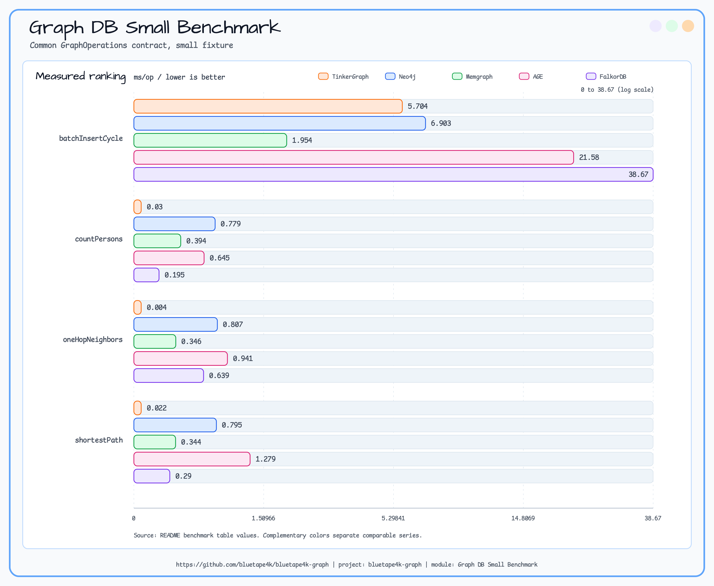

# graph-benchmark

[English](README.md) | [한국어](README.ko.md)

그래프 성능 비교를 위한 kotlinx-benchmark 모듈입니다. 현재 아홉 가지 측정 축을 포함합니다.

- 기존 TinkerGraph Sync vs Virtual Thread 그래프 연산.
- 동일한 TinkerGraph fixture에서 Sync, Virtual Thread, Coroutine API model 비교.
- 공통 `GraphOperations` 계약을 통한 Graph DB backend 비교.
- social, IAM, fraud, code graph query를 반영한 domain-shaped workload 비교.
- 공통 `GraphOperations` 계약을 통한 sustained graph write와 batch ingestion 비교.
- 동시성 10, 100, 1,000 단위의 production-shaped API model 비교.
- AGE/Cypher, recursive CTE, iterative traversal의 PostgreSQL authorization inheritance 비교.
- AGE/Cypher, Exposed JDBC, JPA/Hibernate의 PostgreSQL bounded fraud/abuser detection 비교.
- 동일한 TinkerGraph 생성 데이터셋을 사용하는 graph-io 포맷 비교.

## Architecture



## 측정 대상

- `GraphDbComparisonBenchmark`: `tinkergraph`, `neo4j`, `memgraph`, `age`, `falkordb` backend.
- `GraphDomainWorkloadBenchmark`: `tinkergraph`, `neo4j`, `memgraph`의 social high fan-out, IAM reachability, fraud path, code dependency workload.
- `GraphWriteIngestionBenchmark`: 동일 backend matrix에서 vertex-only, edge-only, mixed, repeated mixed write batch.
- `AuthzInheritanceBenchmark`: 하나의 deterministic user/group/role/resource fixture를 사용하는 native Neo4j Cypher, PostgreSQL AGE/Cypher, recursive CTE, iterative traversal.
- `AbuserDetectionBenchmark`: 하나의 deterministic account-transfer fixture를 사용하는 PostgreSQL AGE/Cypher, Exposed JDBC, JPA/Hibernate fraud-detection backend.
- `GraphIoComparisonBenchmark`: `csv`, `jackson2`, `jackson3`, `graphml`, `okio-jackson3`, `okio-graphml`.
- `ApiModelBenchmark`: 동일한 in-memory TinkerGraph fixture에서 sync, virtual-thread, coroutine API overhead.
- 기존 operation benchmark: batch insert, shortest path, neighbors, traversal, algorithm, vertex operations.

컨테이너 기반 backend benchmark는 bluetape4k Testcontainers launcher 또는 wrapper를 사용합니다. 순차 실행해야 하며 초기 기동 시간이 더 깁니다.

## 실행

```bash
./gradlew :graph-benchmark:benchmark
```

kotlinx-benchmark는 JMH JSON을 `benchmark/graph-benchmark/build/reports/benchmarks/**/main.json` 아래에 기록합니다. 기본 실행 경로는 Gradle task입니다. raw JMH jar 실행은 로컬 진단용으로만 사용합니다.

Graph DB backend matrix:

```bash
./gradlew :graph-benchmark:mainGraphDbSmallBenchmark
./gradlew :graph-benchmark:mainGraphDbMediumBenchmark
```

Domain-shaped workload matrix:

```bash
./gradlew :graph-benchmark:mainGraphDomainWorkloadBenchmark
```

Sustained write ingestion profile:

```bash
./gradlew :graph-benchmark:mainGraphWriteIngestion10kBenchmark
```

Docker-free API model production matrix:

```bash
./gradlew :graph-benchmark:mainApiModelProductionBenchmark
```

PostgreSQL authorization inheritance smoke와 comparison matrix:

```bash
./gradlew :graph-benchmark:authzInheritanceSmokeBenchmark
./gradlew :graph-benchmark:authzInheritanceBenchmark
./gradlew :graph-benchmark:authzInheritanceAdoptionBenchmark
```

Smoke task는 `sizeName=smoke`, `scenarioName=deep-inheritance`를 Neo4j, Memgraph, AGE, PostgreSQL CTE, PostgreSQL iterative engine 전체에 대해 실행합니다. Comparison task는 기존 PostgreSQL AGE/CTE/iterative matrix를 `small`, `medium` dataset과 `shallow`, `deep-inheritance`, `deny-heavy`, `wide-groups` scenario에 대해 실행합니다. Adoption task는 `large` dataset에서 `long-chain`, `deep-wide`를 `neo4j-cypher`, `postgres-cte`, `postgres-iterative`로 실행하므로, 도입 판단은 in-memory TinkerGraph baseline 없이 훨씬 큰 데이터와 10-12 hop traversal path를 기준으로 봅니다.

이번 GraphDB 도입 판단용 benchmark에서는 TinkerGraph를 의도적으로 제외합니다. TinkerGraph는 별도 in-memory API/contract benchmark track에는 남지만, persistent database 도입 판단에는 포함하지 않습니다.

PostgreSQL abuser detection smoke와 comparison matrix:

```bash
./gradlew :graph-benchmark:abuserDetectionSmokeBenchmark
./gradlew :graph-benchmark:abuserDetectionBenchmark
```

Smoke task는 `sizeName=smoke`, `scenarioName=shared`를 실행합니다. Comparison task는 `small`, `medium` dataset을 `shared`, `transfer`, `noisy-dense`, `wide-fanout` scenario 전체에 대해 실행합니다. Account 수와 검사 edge 수가 커질 때 latency가 어떻게 변하는지가 핵심 질문이면 로컬 stress run용 `large` fixture도 사용할 수 있습니다.

## 최신 API Model 결과



실행 조건: macOS arm64, GraalVM JDK 25.0.3, JMH 1.37, fork 1회, warmup 1회, 1초 measurement 3회, TinkerGraph fixture, 2026-05-21. 짧은 로컬 smoke run이므로 release-grade 주장에는 raw JSON 확인과 재측정이 필요합니다.

PageRank throughput은 `ops/s`이며 높을수록 좋습니다.

| API model | Score | Error | Allocation |
|---|---:|---:|---:|
| Sync | **138,943.484 ops/s** | ±40,362.146 | 28,451 B/op |
| Virtual Thread | 40,283.460 ops/s | ±9,678.720 | 29,456 B/op |
| Coroutine Flow | 36,879.554 ops/s | ±85,084.781 | 29,516 B/op |

BFS와 launch/create 행은 `us/op`이며 낮을수록 좋습니다.

| Scenario | API model | Score | Error | Allocation |
|---|---|---:|---:|---:|
| BFS depth=5 | Sync | **4.724 us/op** | ±3.022 | 21,990 B/op |
| BFS depth=5 | Virtual Thread | 18.668 us/op | ±8.229 | 23,152 B/op |
| BFS depth=5 | Coroutine Flow | 20.244 us/op | ±11.268 | 23,455 B/op |
| BFS 100-way | Virtual Thread | **240.903 us/op** | ±167.502 | 2,318,801 B/op |
| BFS 100-way | Coroutine async | 279.828 us/op | ±329.942 | 2,367,754 B/op |
| 100-way launch/create | Virtual Thread | 51.042 us/op | ±173.745 | 61,464 B/op |
| 100-way launch/create | Coroutine async | **5.916 us/op** | ±3.127 | 28,373 B/op |

결과 산출물:

- [Chart PNG](../../docs/images/readme-charts/graph-api-model-chart-01.png)
- [Chart SVG](../../docs/images/readme-charts/graph-api-model-chart-01.svg)
- [Raw JMH JSON](../../docs/benchmark/2026-05-21-api-model-jmh.json)
- [Markdown result table](../../docs/benchmark/2026-05-21-api-model-results.md)

## 최신 API Production 결과



실행 조건: macOS arm64, GraalVM JDK 25.0.3, kotlinx-benchmark/JMH 1.37, fork 1회, warmup 5회, 3초 measurement 10회, TinkerGraph fixture, 2026-05-21. 모든 값은 `us/op`이며 낮을수록 좋습니다.

| Scenario | 동시성 10 | 동시성 100 | 동시성 1,000 |
|---|---:|---:|---:|
| BFS with Virtual Threads | **31.151** | **142.730** | **921.873** |
| BFS with Coroutines | 38.795 | 157.676 | 1151.154 |
| Virtual Thread creation | 8.867 | 28.225 | 200.810 |
| Coroutine launch | **0.586** | **4.826** | **47.657** |

해석: 이 fixture의 blocking-style concurrent graph work에서는 Virtual Thread가 낮은 latency를 보입니다. Coroutine은 launch overhead가 훨씬 낮으므로, 주변 application이 coroutine-native이거나 graph call을 다른 suspend 작업과 합성할 때 선택합니다.

결과 산출물:

- [Chart PNG](../../docs/images/readme-charts/graph-api-model-production-chart-01.png)
- [Chart SVG](../../docs/images/readme-charts/graph-api-model-production-chart-01.svg)
- [Raw JMH JSON](../../docs/benchmark/api-model-production-gradle-2026-05-21.json)

## 최신 Authorization Inheritance 결과



실행 조건: macOS arm64, Java HotSpot 21.0.11, kotlinx-benchmark/JMH 1.37, fork 1회, warmup 2회, 2초 measurement 3회, PostgreSQL AGE Testcontainer, 2026-05-28. 모든 latency 값은 `ms/op`이며 낮을수록 좋습니다. Benchmark 전에 smoke test로 AGE/Cypher, PostgreSQL recursive CTE, PostgreSQL iterative traversal 모두 result-set equivalence와 F1 `1.0`을 확인했습니다.

Scenario matrix:

| Scenario | Shape |
|---|---|
| `shallow` | 짧은 user/group/role/resource inheritance path |
| `deep-inheritance` | cycle edge가 포함된 더 깊은 inheritance chain |
| `deny-heavy` | deny grant edge가 많고 deny-overrides-allow 의미론이 강한 fixture |
| `wide-groups` | group membership fan-out이 넓은 fixture |
| `long-chain` | 강제 target chain이 있는 10-hop traversal |
| `deep-wide` | fan-out과 cycle이 더 큰 12-hop traversal |

Medium fixture `resolveResources` latency:

| Scenario | AGE/Cypher | PostgreSQL CTE | PostgreSQL iterative | Winner |
|---|---:|---:|---:|---|
| `shallow` | 57.382 | 12.085 | **1.056** | PostgreSQL iterative |
| `deep-inheritance` | 604.833 | 9.385 | **2.102** | PostgreSQL iterative |
| `deny-heavy` | 448.263 | 9.450 | **4.310** | PostgreSQL iterative |
| `wide-groups` | 250.083 | **1.521** | 3.658 | PostgreSQL CTE |

해석: 이 PostgreSQL AGE fixture에서는 AGE/Cypher가 latency에서 이기지 못했습니다. 측정된 authorization-inheritance matrix 전체에서 PostgreSQL recursive CTE와 iterative batched traversal이 더 빨랐습니다. 이 결과는 얕은/중간 규모의 negative baseline이며, 더 강한 GraphDB 도입 판단은 새 adoption task의 `large` 데이터와 10-12 hop path 기준으로 다시 봐야 합니다.

도입 판단 기준: TinkerGraph는 in-memory이므로 이번 GraphDB 도입 판단 benchmark에서만 제외합니다. 기존 TinkerGraph micro/contract benchmark track은 별도 범위로 유지합니다.

Large fixture adoption-scope `resolveResources` latency:



| Scenario | Neo4j Cypher | Memgraph Cypher | AGE/Cypher | PostgreSQL CTE | PostgreSQL iterative | Winner |
|---|---:|---:|---:|---:|---:|---|
| `long-chain` | **12.731** | load failure | timeout >75s | 55.364 | 47.568 | Neo4j Cypher |
| `deep-wide` | 56.467 | load failure | timeout >75s | **11.596** | 27.836 | PostgreSQL CTE |

실행 조건: macOS arm64, GraalVM JDK 25.0.3, kotlinx-benchmark/JMH 1.37, fork 1회, warmup 없음, 1초 measurement 1회, Testcontainers, 2026-05-28. 모든 latency 값은 `ms/op`이며 낮을수록 좋습니다. 이 결과는 adoption 방향성 probe이며 release-grade benchmark는 아닙니다.

Adoption probe 해석:

- `long-chain`은 속도 기준 GraphDB 신호가 처음 나온 row입니다. Neo4j Cypher가 PostgreSQL iterative보다 3.74배, PostgreSQL recursive CTE보다 4.35배 빠릅니다.
- `deep-wide`는 여전히 PostgreSQL CTE가 이깁니다. GraphDB 도입 대상은 모든 권한/fraud query가 아니라 길고 선택적인 path-shaped traversal이어야 합니다.
- AGE/Cypher는 이 로컬 실행에서 `large + long-chain`과 `large + deep-wide` 모두 75초 외부 timeout 안에 완료하지 못했습니다.
- Memgraph는 smoke parity test는 통과했지만, 로컬 large adoption 실행에서 load 중 Bolt connection이 종료되어 latency row가 아니라 실패한 adoption 후보로 표시합니다.

결과 산출물:

- [Chart PNG](../../docs/images/readme-charts/authz-inheritance-postgresql-latency-chart-01.png)
- [Chart SVG](../../docs/images/readme-charts/authz-inheritance-postgresql-latency-chart-01.svg)
- [Adoption Chart PNG](../../docs/images/readme-charts/authz-inheritance-adoption-latency-chart-01.png)
- [Adoption Chart SVG](../../docs/images/readme-charts/authz-inheritance-adoption-latency-chart-01.svg)
- [Raw JMH JSON](../../docs/benchmark/2026-05-28-authz-inheritance-main.json)
- [Adoption Neo4j JMH JSON](../../docs/benchmark/2026-05-28-authz-inheritance-adoption-neo4j.json)
- [Adoption PostgreSQL JMH JSON](../../docs/benchmark/2026-05-28-authz-inheritance-adoption-postgres.json)
- [Adoption AGE long-chain timeout log](../../docs/benchmark/2026-05-28-authz-inheritance-adoption-age-timeout.txt)
- [Adoption AGE deep-wide timeout log](../../docs/benchmark/2026-05-28-authz-inheritance-adoption-age-deep-wide-timeout.txt)
- [Adoption Memgraph failure log](../../docs/benchmark/2026-05-28-authz-inheritance-adoption-memgraph-failure.txt)
- [Markdown result table](../../docs/benchmark/2026-05-28-authz-inheritance-results.md)
- [GraphDB adoption decision report](../../docs/benchmark/2026-05-28-graphdb-adoption-decision-report.md)

## 최신 Testcontainers 결과

### Domain workload



실행 조건: macOS arm64, GraalVM JDK 25.0.3, kotlinx-benchmark/JMH 1.37, fork 1회, warmup 2회, 2초 measurement 4회, 실제 Neo4j/Memgraph Testcontainers와 in-memory TinkerGraph, 2026-05-21. 모든 값은 `ms/op`이며 낮을수록 좋습니다.

| Workload | TinkerGraph | Neo4j | Memgraph |
|---|---:|---:|---:|
| Code dependency traversal | **0.009** | 0.530 | 0.306 |
| Code reverse dependency lookup | **0.006** | 0.579 | 0.348 |
| Fraud high-degree neighborhood | **0.038** | 1.119 | 0.620 |
| Fraud suspicious path exists | 1.000 | 0.509 | **0.405** |
| IAM permission reachability | **0.033** | 0.508 | 0.300 |
| Social high fan-out expansion | **0.030** | 0.991 | 0.549 |
| Social two-hop candidate lookup | **0.164** | 2.756 | 1.755 |

해석: TinkerGraph는 in-memory domain fixture의 local analysis engine으로 여전히 가장 빠릅니다. Persistent backend 중에서는 Memgraph가 이 local domain matrix에서 Neo4j보다 일관되게 빠르지만, ecosystem, operations, query tooling이 중요하면 Neo4j가 더 안전한 기본값입니다.

결과 산출물:

- [Chart PNG](../../docs/images/readme-charts/graph-domain-workload-testcontainers-latency-chart-01.png)
- [Chart SVG](../../docs/images/readme-charts/graph-domain-workload-testcontainers-latency-chart-01.svg)
- [Raw JMH JSON](../../docs/benchmark/graph-domain-workload-testcontainers-2026-05-21.json)

### Sustained write ingestion



실행 조건: macOS arm64, GraalVM JDK 25.0.3, JMH 1.37, fork 1회, warmup 1회, 1초 measurement 3회, 실제 Testcontainers backend, GC profiler 활성화, 2026-05-21. `Repeated mixed batches`는 benchmark operation 하나에서 mixed vertex+edge batch를 5회 반복합니다.

모든 값은 `ms/op`이며 낮을수록 좋습니다. 굵은 값은 이번 실행에서 가장 빠른 backend입니다.

| Scenario | Batch | TinkerGraph | Neo4j | Memgraph | AGE | FalkorDB |
|---|---:|---:|---:|---:|---:|---:|
| Vertex-only batch insert | 100 | 2.606 | 2.740 | **0.965** | 1.347 | 1.467 |
| Vertex-only batch insert | 1,000 | 11.902 | 8.499 | **5.429** | 9.100 | 6.210 |
| Edge-only batch insert | 100 | 3.298 | 3.788 | **1.190** | 9.436 | 32.347 |
| Edge-only batch insert | 1,000 | 18.971 | 13.762 | **7.572** | 260.430 | 3026.397 |
| Mixed vertex+edge insert | 100 | 7.102 | 7.352 | **2.199** | 27.426 | 51.437 |
| Mixed vertex+edge insert | 1,000 | 30.819 | 23.510 | **13.336** | 279.704 | 3354.140 |
| Repeated mixed batches (5x) | 100 | 32.221 | 35.181 | **11.456** | 149.935 | 263.976 |
| Repeated mixed batches (5x) | 1,000 | 154.891 | 113.940 | **66.612** | 1428.239 | 17285.768 |

해석: Memgraph는 모든 latency row에서 가장 빠른 persistent backend입니다. Neo4j는 raw ingestion latency보다 운영 성숙도가 더 중요할 때 낮은 risk의 production 기본값으로 유지합니다. FalkorDB는 vertex-only insert에서는 경쟁력이 있지만, edge-heavy와 repeated mixed write profile은 이 공통 contract benchmark에서 너무 느립니다. FalkorDB가 1,000-row repeated mixed profile에서 이미 17.286 s/op까지 올라갔으므로 전체 10k matrix는 [#201](https://github.com/bluetape4k/bluetape4k-graph/issues/201)에서 별도로 추적합니다.

결과 산출물:

- [Chart PNG](../../docs/images/readme-charts/graph-write-ingestion-testcontainers-latency-chart-01.png)
- [Chart SVG](../../docs/images/readme-charts/graph-write-ingestion-testcontainers-latency-chart-01.svg)
- [Raw JMH JSON](../../docs/benchmark/graph-write-ingestion-testcontainers-2026-05-21.json)
- [Markdown result table](../../docs/benchmark/2026-05-21-graph-write-ingestion-testcontainers-results.md)

### 10k Sustained write ingestion



실행 조건: macOS arm64, GraalVM JDK 25.0.3, kotlinx-benchmark/JMH 1.37, fork 1회, warmup 1회, 1초 measurement 3회, 10,000-row write batch, 실제 Neo4j/Memgraph Testcontainers와 in-memory TinkerGraph, 2026-05-21. 모든 값은 `ms/op`이며 낮을수록 좋습니다. AGE와 FalkorDB는 1,000-row repeated mixed profile에서 이미 multi-second latency가 나왔고, 유용한 local window를 가장 빠른 운영 후보 3개에 집중하기 위해 이번 selective 10k run에서 제외했습니다.

| Scenario | TinkerGraph | Neo4j | Memgraph |
|---|---:|---:|---:|
| Vertex-only batch insert | 71.152 | 67.135 | **53.518** |
| Edge-only batch insert | 161.907 | 108.949 | **76.105** |
| Mixed vertex+edge insert | 272.236 | 203.669 | **134.994** |
| Repeated mixed batches (5x) | 1243.229 | 919.678 | **647.574** |

해석: 대규모 sustained ingestion에서도 Memgraph가 latency 기준 1순위 후보입니다. Neo4j는 느리지만, 운영 성숙도가 peak ingestion speed보다 중요할 때 여전히 유효합니다.

결과 산출물:

- [Chart PNG](../../docs/images/readme-charts/graph-write-ingestion-10k-testcontainers-latency-chart-01.png)
- [Chart SVG](../../docs/images/readme-charts/graph-write-ingestion-10k-testcontainers-latency-chart-01.svg)
- [Raw JMH JSON](../../docs/benchmark/graph-write-ingestion-10k-testcontainers-2026-05-21.json)

### Medium dataset



실행 조건: macOS arm64, GraalVM JDK 25.0.3, JMH 1.37, fork 1회, warmup 3회, 3초 measurement 5회, `medium` dataset, 2026-05-21. FalkorDB는 기본 `jfalkordb` timeout이 이 fixture에서 실패해서 benchmark driver에 60초 Jedis read timeout을 적용해 재측정했습니다.

| Operation | TinkerGraph | Neo4j | Memgraph | AGE | FalkorDB |
|---|---:|---:|---:|---:|---:|
| `batchInsertCycle` | 44.967 | 15.690 | **11.364** | 309.090 | 1929.180 |
| `countPersons` | 0.308 | 0.528 | 1.341 | 2.176 | **0.197** |
| `oneHopNeighbors` | **0.003** | 0.665 | 0.308 | 10.175 | 1.046 |
| `shortestPath` | **0.019** | 0.700 | 0.386 | 12.420 | 0.512 |

모든 값은 `ms/op`이며 낮을수록 좋습니다. 굵은 값은 이번 실행에서 가장 빠른 backend입니다.

결과 산출물:

- [Chart PNG](../../docs/images/readme-charts/graph-db-medium-testcontainers-latency-chart-01.png)
- [Chart SVG](../../docs/images/readme-charts/graph-db-medium-testcontainers-latency-chart-01.svg)
- [Raw JMH JSON](../../docs/benchmark/graph-db-medium-testcontainers-2026-05-21.json)
- [FalkorDB timeout 재측정 JSON](../../docs/benchmark/graph-db-medium-falkordb-testcontainers-2026-05-21.json)
- [Markdown result table](../../docs/benchmark/2026-05-21-graph-db-medium-testcontainers-results.md)

### Small dataset



실행 조건: macOS arm64, GraalVM JDK 25.0.3, JMH 1.37, fork 1회, warmup 1회, 1초 measurement 3회, `small` dataset, 2026-05-21.

| Operation | TinkerGraph | Neo4j | Memgraph | AGE | FalkorDB |
|---|---:|---:|---:|---:|---:|
| `batchInsertCycle` | 5.704 | 6.903 | **1.954** | 21.580 | 38.670 |
| `countPersons` | **0.030** | 0.779 | 0.394 | 0.645 | 0.195 |
| `oneHopNeighbors` | **0.004** | 0.807 | 0.346 | 0.941 | 0.639 |
| `shortestPath` | **0.022** | 0.795 | 0.344 | 1.279 | 0.290 |

모든 값은 `ms/op`이며 낮을수록 좋습니다. 굵은 값은 이번 실행에서 가장 빠른 backend입니다.

결과 산출물:

- [Chart PNG](../../docs/images/readme-charts/graph-db-testcontainers-latency-chart-01.png)
- [Chart SVG](../../docs/images/readme-charts/graph-db-testcontainers-latency-chart-01.svg)
- [Raw JMH JSON](../../docs/benchmark/graph-db-small-gradle-testcontainers-2026-05-21.json)
- [Legacy raw JMH JSON](../../docs/benchmark/graph-db-testcontainers-2026-05-21.json)
- [Normalized baseline JSON](../../docs/benchmark/graph-benchmark-baseline.json)
- [Markdown result table](../../docs/benchmark/2026-05-21-graph-db-testcontainers-results.md)

## 리포트

JMH JSON을 전/후 비교용 안정 스키마로 정규화합니다.

```bash
python3 benchmark/graph-benchmark/scripts/normalize_jmh_report.py \
  benchmark/graph-benchmark/build/reports/benchmarks/main/main.json \
  --markdown docs/benchmark/graph-benchmark-latest.md
```

baseline과 candidate를 비교할 때:

```bash
python3 benchmark/graph-benchmark/scripts/normalize_jmh_report.py candidate.json \
  --baseline baseline.json \
  --metric score \
  --direction lower_is_better \
  --markdown docs/benchmark/graph-benchmark-candidate.md
```

위 README 차트를 렌더링합니다.

```bash
python3 benchmark/graph-benchmark/scripts/render_graph_db_backend_chart.py \
  docs/benchmark/graph-db-small-gradle-testcontainers-2026-05-21.json
```

위 API model 차트를 렌더링합니다.

```bash
python3 benchmark/graph-benchmark/scripts/render_api_model_chart.py \
  docs/benchmark/2026-05-21-api-model-jmh.json
```

위 API production 차트를 렌더링합니다.

```bash
python3 benchmark/graph-benchmark/scripts/render_api_model_production_chart.py \
  docs/benchmark/api-model-production-gradle-2026-05-21.json
```

위 domain workload 차트를 렌더링합니다.

```bash
python3 benchmark/graph-benchmark/scripts/render_graph_domain_workload_chart.py \
  docs/benchmark/graph-domain-workload-testcontainers-2026-05-21.json
```

위 sustained write ingestion 차트를 렌더링합니다.

```bash
python3 benchmark/graph-benchmark/scripts/render_graph_write_ingestion_chart.py \
  docs/benchmark/graph-write-ingestion-10k-testcontainers-2026-05-21.json
```

## Self-Improve Gate

`bluetape4k-self-improve`는 fresh baseline이 생긴 뒤 사용합니다. 최적화 round에서 봉인할 파일은 다음과 같습니다.

- `benchmark/graph-benchmark/src/main/kotlin/io/bluetape4k/graph/benchmark/GraphDbComparisonBenchmark.kt`
- `benchmark/graph-benchmark/src/main/kotlin/io/bluetape4k/graph/benchmark/GraphDomainWorkloadBenchmark.kt`
- `benchmark/graph-benchmark/src/main/kotlin/io/bluetape4k/graph/benchmark/GraphWriteIngestionBenchmark.kt`
- `benchmark/graph-benchmark/src/main/kotlin/io/bluetape4k/graph/benchmark/GraphIoComparisonBenchmark.kt`
- `benchmark/graph-benchmark/scripts/normalize_jmh_report.py`
- `benchmark/graph-benchmark/scripts/render_graph_domain_workload_chart.py`
- `benchmark/graph-benchmark/scripts/render_graph_write_ingestion_chart.py`
- `docs/benchmark/graph-benchmark-baseline.json`

candidate를 채택하기 전 sealed-file validator를 실행합니다.

```bash
scripts/validate-graph-benchmark-sealed.sh
```

## 참고

- Amazon Neptune은 신뢰 가능한 로컬/통합 테스트 가능성이 확보될 때까지 제외합니다.
- Graph DB benchmark는 vendor별 튜닝 쿼리가 아니라 공통 repository contract 성능을 비교합니다.
