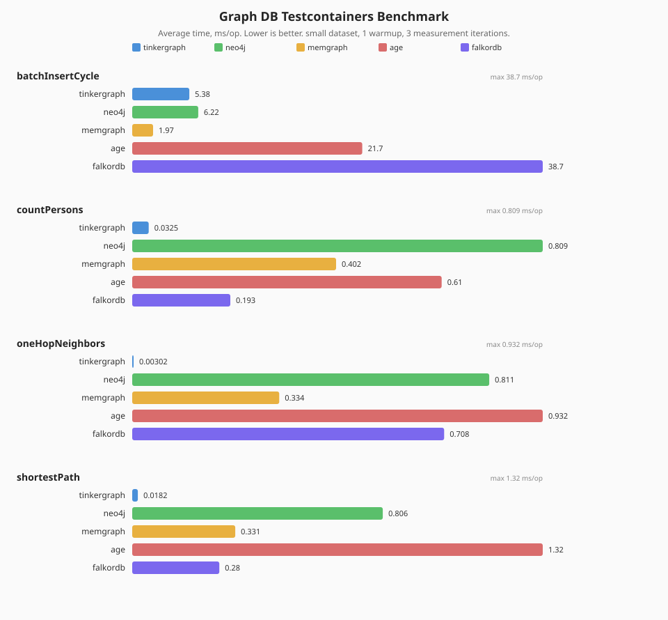

# graph-benchmark

[English](README.md) | [한국어](README.ko.md)

그래프 성능 비교를 위한 JMH/kotlinx-benchmark 모듈입니다. 현재 세 가지 측정 축을 포함합니다.

- 기존 TinkerGraph Sync vs Virtual Thread 그래프 연산.
- 공통 `GraphOperations` 계약을 통한 Graph DB backend 비교.
- 동일한 TinkerGraph 생성 데이터셋을 사용하는 graph-io 포맷 비교.

## Architecture


## 측정 대상

- `GraphDbComparisonBenchmark`: `tinkergraph`, `neo4j`, `memgraph`, `age`, `falkordb` backend.
- `GraphIoComparisonBenchmark`: `csv`, `jackson2`, `jackson3`, `graphml`, `okio-jackson3`, `okio-graphml`.
- 기존 operation benchmark: batch insert, shortest path, neighbors, traversal, algorithm, vertex operations.

컨테이너 기반 backend benchmark는 bluetape4k Testcontainers singleton launcher를 사용합니다. 순차 실행해야 하며 초기 기동 시간이 더 깁니다.

## 실행

```bash
./gradlew :graph-benchmark:benchmark
```

kotlinx-benchmark는 JMH JSON을 `benchmark/graph-benchmark/build/reports/benchmarks/**/main.json` 아래에 기록합니다.

Graph DB backend matrix는 실제 Testcontainers 기반 JMH target으로 실행합니다.

```bash
java -jar benchmark/graph-benchmark/build/benchmarks/main/jars/graph-benchmark-main-jmh-*-JMH.jar \
  '.*GraphDbComparisonBenchmark.*' \
  -wi 1 -i 3 -r 1s -w 1s -f 1 \
  -p backend=tinkergraph,neo4j,memgraph,age,falkordb \
  -p sizeName=small \
  -rf json \
  -rff docs/benchmark/graph-db-testcontainers-2026-05-21.json
```

## 최신 Testcontainers 결과



실행 조건: macOS arm64, GraalVM JDK 25.0.3, JMH 1.37, fork 1회, warmup 1회, 1초 measurement 3회, `small` dataset, 2026-05-21.

결과 산출물:

- [Raw JMH JSON](../../docs/benchmark/graph-db-testcontainers-2026-05-21.json)
- [Normalized baseline JSON](../../docs/benchmark/graph-benchmark-baseline.json)
- [Markdown result table](../../docs/benchmark/2026-05-21-graph-db-testcontainers-results.md)

## 리포트

JMH JSON을 전/후 비교용 안정 스키마로 정규화합니다.

```bash
python3 benchmark/graph-benchmark/scripts/normalize_jmh_report.py \
  benchmark/graph-benchmark/build/reports/benchmarks/main/main.json \
  --markdown docs/benchmark/graph-benchmark-latest.md
```

baseline과 candidate를 비교할 때:

```bash
python3 benchmark/graph-benchmark/scripts/normalize_jmh_report.py candidate.json \
  --baseline baseline.json \
  --metric score \
  --direction lower_is_better \
  --markdown docs/benchmark/graph-benchmark-candidate.md
```

위 README 차트를 렌더링합니다.

```bash
python3 benchmark/graph-benchmark/scripts/render_graph_db_backend_chart.py \
  docs/benchmark/graph-db-testcontainers-2026-05-21.json
```

## Self-Improve Gate

`bluetape4k-self-improve`는 fresh baseline이 생긴 뒤 사용합니다. 최적화 round에서 봉인할 파일은 다음과 같습니다.

- `benchmark/graph-benchmark/src/main/kotlin/io/bluetape4k/graph/benchmark/GraphDbComparisonBenchmark.kt`
- `benchmark/graph-benchmark/src/main/kotlin/io/bluetape4k/graph/benchmark/GraphIoComparisonBenchmark.kt`
- `benchmark/graph-benchmark/scripts/normalize_jmh_report.py`
- `docs/benchmark/graph-benchmark-baseline.json`

candidate를 채택하기 전 sealed-file validator를 실행합니다.

```bash
scripts/validate-graph-benchmark-sealed.sh
```

## 참고

- Amazon Neptune은 신뢰 가능한 로컬/통합 테스트 가능성이 확보될 때까지 제외합니다.
- Graph DB benchmark는 vendor별 튜닝 쿼리가 아니라 공통 repository contract 성능을 비교합니다.
