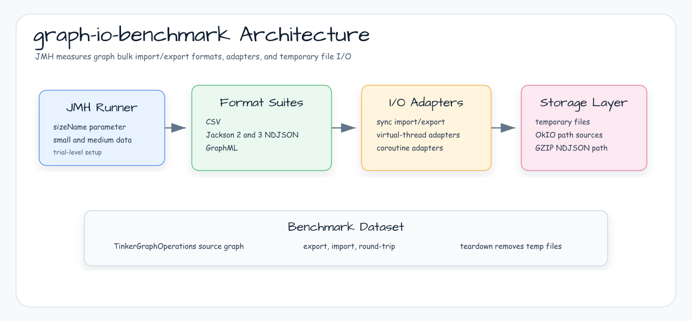

# graph-io-benchmark

[English](README.md) | [한국어](README.ko.md)

graph bulk import/export format과 I/O adapter를 측정하는 JMH 벤치마크 모듈입니다.

## Architecture



## 측정 대상

`graph-io-benchmark`는 인메모리 TinkerGraph 데이터셋과 임시 파일을 사용해 graph bulk I/O를 측정합니다.

- CSV, Jackson 2 NDJSON, Jackson 3 NDJSON, GraphML export/import/round-trip 경로.
- 지원되는 동기, virtual-thread, coroutine bulk I/O adapter.
- GZIP NDJSON을 포함한 OkIO 기반 Jackson 3 및 GraphML 경로.
- JMH `sizeName` 파라미터로 선택하는 `small`, `medium` 데이터셋.

## 소스 근거

- `build.gradle.kts`는 `graph-io-core`, `graph-io-csv`, `graph-io-jackson2`, `graph-io-jackson3`, `graph-io-graphml`, `graph-okio`, `graph-tinkerpop`, coroutines, virtual-thread 지원에 의존합니다.
- `BulkGraphIoBenchmarkState`는 임시 디렉터리를 만들고 TinkerGraph 데이터셋을 구성하며 trial 종료 시 디렉터리를 정리합니다.
- `BulkGraphIoBenchmark`는 java.io 스타일 CSV, NDJSON, GraphML의 동기, virtual-thread, coroutine, import, export, round-trip 경로를 다룹니다.
- `OkioGraphIoBenchmark`는 OkIO path sink/source, Jackson 3 NDJSON, GZIP NDJSON, GraphML, virtual-thread OkIO adapter를 다룹니다.

## 실행

```bash
./gradlew :graph-io-benchmark:benchmark
```

벤치마크는 각 trial 동안 임시 파일을 쓰고 teardown에서 제거합니다.

## 참고

- graph bulk I/O serializer, importer, exporter, OkIO 통합을 변경할 때 이 모듈을 사용하세요.
- 외부 graph database 컨테이너를 시작하지 않으며, workload는 파일 I/O와 인메모리 graph operation입니다.
