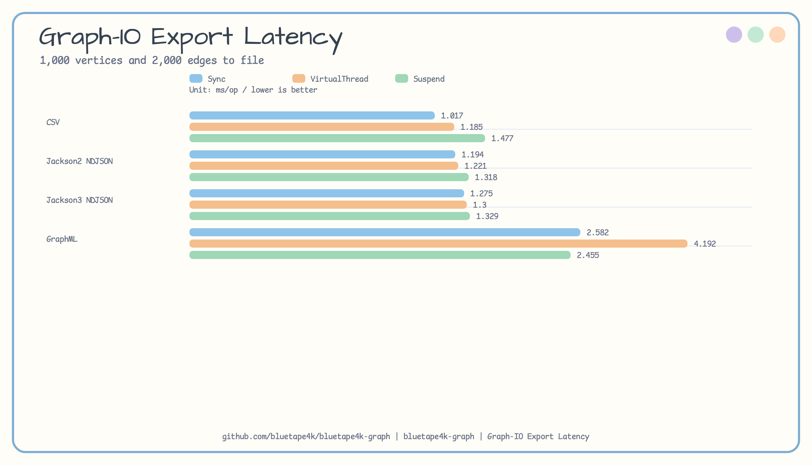
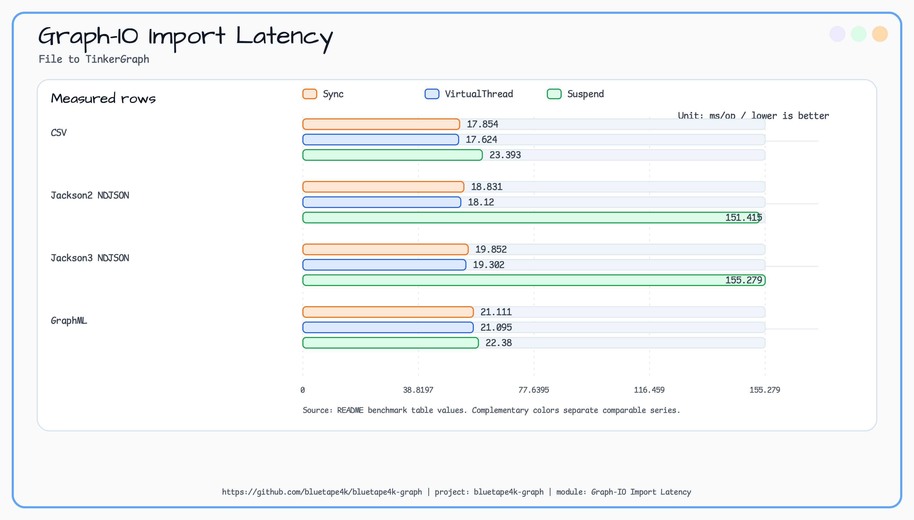
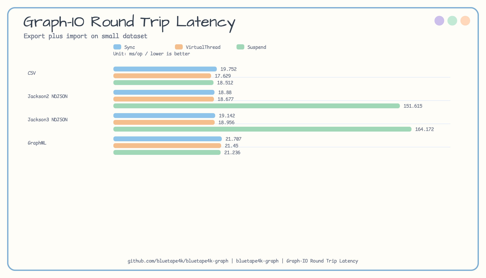

# graph-io-benchmark

[English](README.md) | [한국어](README.ko.md)

graph bulk import/export format과 I/O adapter를 측정하는 JMH 벤치마크 모듈입니다.

## Architecture


## 측정 대상

`graph-io-benchmark`는 인메모리 TinkerGraph 데이터셋과 임시 파일을 사용해 graph bulk I/O를 측정합니다.

- CSV, Jackson 2 NDJSON, Jackson 3 NDJSON, GraphML export/import/round-trip 경로.
- 지원되는 동기, virtual-thread, coroutine bulk I/O adapter.
- GZIP NDJSON을 포함한 OkIO 기반 Jackson 3 및 GraphML 경로.
- JMH `sizeName` 파라미터로 선택하는 `small`, `medium` 데이터셋.

## 소스 근거

- `build.gradle.kts`는 `graph-io-core`, `graph-io-csv`, `graph-io-jackson2`, `graph-io-jackson3`, `graph-io-graphml`, `graph-okio`, `graph-tinkerpop`, coroutines, virtual-thread 지원에 의존합니다.
- `BulkGraphIoBenchmarkState`는 임시 디렉터리를 만들고 TinkerGraph 데이터셋을 구성하며 trial 종료 시 디렉터리를 정리합니다.
- `BulkGraphIoBenchmark`는 java.io 스타일 CSV, NDJSON, GraphML의 동기, virtual-thread, coroutine, import, export, round-trip 경로를 다룹니다.
- `OkioGraphIoBenchmark`는 OkIO path sink/source, Jackson 3 NDJSON, GZIP NDJSON, GraphML, virtual-thread OkIO adapter를 다룹니다.

## 실행

```bash
./gradlew :graph-io-benchmark:benchmark
```

벤치마크는 각 trial 동안 임시 파일을 쓰고 teardown에서 제거합니다.

## 최신 결과

최신 공개 `small` dataset 결과는 `docs/benchmark/2026-04-18-graph-io-bulk-results.md`에 있습니다.
모든 값은 `ms/op`이며 낮을수록 좋습니다.

### Export

| Format | Sync | VirtualThread | Suspend |
|---|---:|---:|---:|
| CSV | **1.017** | 1.185 | 1.477 |
| Jackson2 NDJSON | **1.194** | 1.221 | 1.318 |
| Jackson3 NDJSON | **1.275** | 1.300 | 1.329 |
| GraphML | 2.582 | 4.192 | **2.455** |



### Import

| Format | Sync | VirtualThread | Suspend |
|---|---:|---:|---:|
| CSV | 17.854 | **17.624** | 23.393 |
| Jackson2 NDJSON | 18.831 | **18.120** | 151.415 |
| Jackson3 NDJSON | 19.852 | **19.302** | 155.279 |
| GraphML | 21.111 | **21.095** | 22.380 |



### Round Trip

| Format | Sync | VirtualThread | Suspend |
|---|---:|---:|---:|
| CSV | 19.752 | **17.629** | 18.512 |
| Jackson2 NDJSON | 18.880 | **18.677** | 151.615 |
| Jackson3 NDJSON | 19.142 | **18.956** | 164.172 |
| GraphML | 21.707 | 21.450 | **21.236** |



해석:

- CSV와 Jackson NDJSON export는 small dataset에서 약 1-1.5 ms/op로 비슷합니다.
- Import와 round-trip은 parser 선택보다 TinkerGraph 정점/간선 생성 비용의 영향을 크게 받습니다.
- Jackson2/3 suspend import의 큰 값은 quick-run benchmark 형태에서 coroutine dispatcher 초기화 비용이 드러난 이상값입니다. 실제 production coroutine context는 별도로 측정해야 합니다.
- GraphML은 XML factory 캐싱과 buffered I/O가 적용되어야 2-22 ms/op 범위에 머뭅니다.

## 참고

- graph bulk I/O serializer, importer, exporter, OkIO 통합을 변경할 때 이 모듈을 사용하세요.
- 외부 graph database 컨테이너를 시작하지 않으며, workload는 파일 I/O와 인메모리 graph operation입니다.
