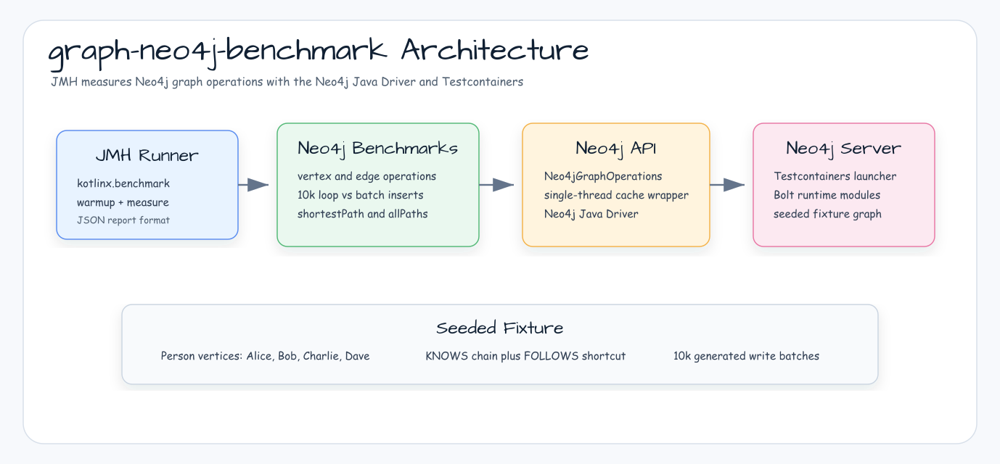

# graph-neo4j-benchmark

[English](README.md) | [한국어](README.ko.md)

`bluetape4k-graph` Neo4j 백엔드를 위한 JMH 벤치마크 모듈입니다.

## Architecture



## 측정 대상

`graph-neo4j-benchmark`는 컨테이너 Neo4j 서버 위에서 `Neo4jGraphOperations`를 측정합니다.

- 정점 읽기/쓰기: 정점 생성, 라벨 조회, ID 조회, 이웃 조회.
- 간선 쓰기: 간선 생성, 루프 삽입과 배치 삽입 비교.
- 경로 탐색: 최단 경로와 전체 경로.
- 백엔드 수명주기: Testcontainers가 Neo4j를 시작하고, Neo4j Java Driver가 session을 열며, benchmark state가 작은 그래프를 시드합니다.

## 소스 근거

- `build.gradle.kts`는 `kotlinx.benchmark`와 `kotlin("plugin.allopen")`을 적용하고, JMH `@State`를 all-open 처리하며 JSON 리포트를 사용합니다.
- 이 모듈은 `graph-core`, `graph-neo4j`, Neo4j Java Driver, Bolt runtime module, Neo4j Testcontainers에 의존합니다.
- `Neo4jBenchmarkState`는 Neo4j 컨테이너를 시작하고 `Neo4jGraphOperations`를 만든 뒤 `Person` 정점 4개와 간선 4개를 시드합니다.
- `Neo4jVertexBenchmark`는 읽기/쓰기, 이웃 조회, 10k 루프-vs-배치 삽입 경로를 다룹니다.
- `Neo4jTraversalBenchmark`는 `shortestPath`와 `allPaths`를 측정합니다.
- `BenchmarkSingleThreadedCachingNeo4jGraphOperations`는 단일 스레드 JMH 상태 안에서 반복 조회 오버헤드를 측정 대상에서 분리합니다.

## 실행

```bash
./gradlew :graph-neo4j-benchmark:benchmark
```

이 벤치마크는 로컬 컨테이너 Neo4j 인스턴스를 시작합니다. 다른 Testcontainers 기반 Gradle 실행과 병렬로 돌리지 마세요.

## 참고

- 픽스처 그래프는 AGE benchmark와 같은 형태라 백엔드 operation 결과를 비교하기 쉽습니다.
- 배치 삽입 벤치마크는 10k 정점 또는 간선을 만들어 루프 쓰기와 Neo4j 배치 API를 비교합니다.
