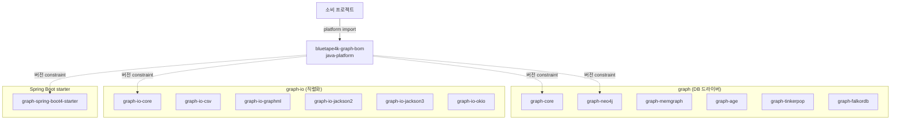

# bluetape4k-graph-bom

한국어 | [English](./README.md)

**bluetape4k-graph** 생태계용 Maven BOM (Bill of Materials). 모든 `io.github.bluetape4k.graph:*`
모듈의 버전을 중앙 관리한다.

## Architecture



BOM은 Gradle `java-platform` 으로 `<dependencyManagement>` constraint 만 게시한다.

## 핵심 기능

- 모든 `bluetape4k-graph` 모듈 버전 중앙 관리
- 그래프 DB 드라이버 (Neo4j / Memgraph / AGE / TinkerPop / FalkorDB) 버전 일관성 보장
- `bluetape4k-dependencies` 가 상위에서 통합

## 관리 모듈

| 그룹 | 모듈 |
|------|------|
| `graph/*` | `graph-core`, `graph-neo4j`, `graph-memgraph`, `graph-age`, `graph-tinkerpop`, `graph-falkordb` |
| `graph-io/*` | `graph-io-core`, `graph-io-csv`, `graph-io-graphml`, `graph-io-jackson2`, `graph-io-jackson3`, `graph-io-okio` |
| `spring-boot4/*` | `graph-spring-boot4-starter` |

> 참고: `examples/*` 및 `benchmark/*` 모듈은 BOM constraint 에서 제외된다.

## 사용 예제

### Gradle Kotlin DSL

```kotlin
plugins {
    id("io.spring.dependency-management") version "1.1.x"
}

dependencyManagement {
    imports {
        mavenBom("io.github.bluetape4k.graph:bluetape4k-graph-bom:<version>")
    }
}

dependencies {
    implementation("io.github.bluetape4k.graph:bluetape4k-graph-neo4j")
    implementation("io.github.bluetape4k.graph:bluetape4k-graph-spring-boot4-starter")
}
```

### 순수 Gradle

```kotlin
dependencies {
    implementation(platform("io.github.bluetape4k.graph:bluetape4k-graph-bom:<version>"))
    implementation("io.github.bluetape4k.graph:bluetape4k-graph-neo4j")
}
```

### Maven

```xml
<dependencyManagement>
    <dependencies>
        <dependency>
            <groupId>io.github.bluetape4k.graph</groupId>
            <artifactId>bluetape4k-graph-bom</artifactId>
            <version>${bluetape4k-graph.version}</version>
            <type>pom</type>
            <scope>import</scope>
        </dependency>
    </dependencies>
</dependencyManagement>
```

## 설정 옵션

BOM 자체는 별도 설정이 없다. SNAPSHOT 사용 시 Sonatype Central Snapshots 저장소 추가:

```kotlin
repositories {
    mavenCentral()
    maven {
        name = "central-snapshots"
        url = uri("https://central.sonatype.com/repository/maven-snapshots/")
    }
}
```

## 의존성

이 BOM은 `bluetape4k-dependencies` 에서 자동 통합된다. 여러 bluetape4k 생태계를 함께 사용한다면
`io.github.bluetape4k:bluetape4k-dependencies` import 권장.
