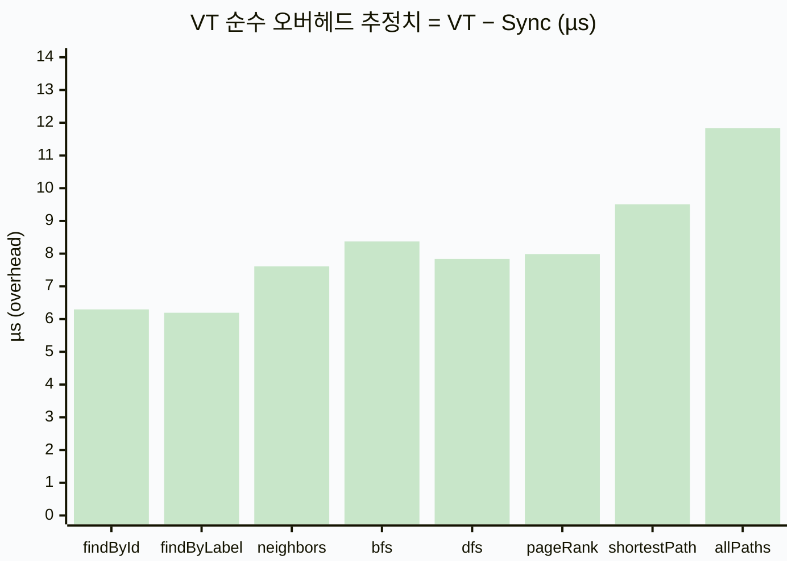

# Virtual Thread vs Sync — Graph Operations Benchmark

> **실행일**: 2026-04-17  
> **모듈**: `graph-benchmark`  
> **백엔드**: TinkerGraph (in-memory)  
> **JVM**: Java 25 (Virtual Threads 정식 지원)  
> **측정 방식**: JMH `AverageTime` — 낮을수록 빠름 (µs/op)  
> **Warmup**: 3 × 2 s / **Measurement**: 5 × 3 s

---

## 요약

| 구현 | 특징 |
|------|------|
| **Sync** | 동기 호출, Platform Thread 위에서 직접 실행 |
| **VirtualThread** | `virtualFutureOf { }` / `CompletableFuture.supplyAsync(block, VirtualThreadExecutor)` 래핑 |

> **VT 오버헤드 원인**: Virtual Thread 생성 + `CompletableFuture` 스케줄링 비용 (약 **6~8 µs**).  
> 실제 DB I/O가 수십~수백 ms인 환경에서는 이 오버헤드가 무시되며, 높은 동시성 처리량을 얻을 수 있다.

---

## 1. 정점 조회 (Vertex Operations)

| Benchmark | Sync (µs/op) | VT (µs/op) | 오버헤드 배율 |
|-----------|-------------:|-----------:|:------------:|
| `findVertexById` | **1.758 ± 0.051** | 8.055 ± 0.698 | ×4.6 |
| `findVerticesByLabel` | **2.485 ± 0.078** | 8.679 ± 0.503 | ×3.5 |
| `neighbors` | **2.985 ± 0.074** | 10.595 ± 0.735 | ×3.6 |

```mermaid
%%{init: {'theme': 'base', 'themeVariables': {'xyChart': {'backgroundColor': '#fafbfc', 'plotColorPalette': '#a8d8ea,#ffb3c1'}}}}%%
xychart-beta
    title "Vertex Operations — 평균 응답 시간 (µs/op)"
    x-axis ["findVertexById", "findVerticesByLabel", "neighbors"]
    y-axis "µs/op" 0 --> 13
    bar [1.758, 2.485, 2.985]
    bar [8.055, 8.679, 10.595]
```



> 범례: 첫 번째 막대 = **Sync** (파스텔 블루), 두 번째 막대 = **VirtualThread** (파스텔 핑크)

---

## 2. 경로 탐색 (Traversal)

| Benchmark | Sync (µs/op) | VT (µs/op) | 오버헤드 배율 |
|-----------|-------------:|-----------:|:------------:|
| `shortestPath` | **22.031 ± 0.650** | 31.540 ± 1.063 | ×1.4 |
| `allPaths` | **21.045 ± 0.111** | 32.882 ± 0.876 | ×1.6 |

```mermaid
%%{init: {'theme': 'base', 'themeVariables': {'xyChart': {'backgroundColor': '#fafbfc', 'plotColorPalette': '#a8d8ea,#ffb3c1'}}}}%%
xychart-beta
    title "Traversal — 평균 응답 시간 (µs/op)"
    x-axis ["shortestPath", "allPaths"]
    y-axis "µs/op" 0 --> 40
    bar [22.031, 21.045]
    bar [31.540, 32.882]
```



> 경로 탐색처럼 **작업 자체가 무거울수록** VT 오버헤드 비율이 낮아짐 (×1.4~1.6).

---

## 3. 그래프 알고리즘 (Algorithm)

| Benchmark | Sync (µs/op) | VT (µs/op) | 오버헤드 배율 |
|-----------|-------------:|-----------:|:------------:|
| `bfs` | **4.216 ± 0.120** | 12.588 ± 0.726 | ×3.0 |
| `dfs` | **4.277 ± 0.235** | 12.115 ± 1.390 | ×2.8 |
| `pageRank` | **7.270 ± 0.559** | 15.257 ± 1.095 | ×2.1 |

```mermaid
%%{init: {'theme': 'base', 'themeVariables': {'xyChart': {'backgroundColor': '#fafbfc', 'plotColorPalette': '#a8d8ea,#ffb3c1'}}}}%%
xychart-beta
    title "Algorithm — 평균 응답 시간 (µs/op)"
    x-axis ["bfs", "dfs", "pageRank"]
    y-axis "µs/op" 0 --> 20
    bar [4.216, 4.277, 7.270]
    bar [12.588, 12.115, 15.257]
```



---

## 4. 전체 비교

```mermaid
%%{init: {'theme': 'base', 'themeVariables': {'xyChart': {'backgroundColor': '#fafbfc', 'plotColorPalette': '#a8d8ea,#ffb3c1'}}}}%%
xychart-beta
    title "전체 벤치마크 — Sync vs VirtualThread (µs/op)"
    x-axis ["findById", "findByLabel", "neighbors", "bfs", "dfs", "pageRank", "shortestPath", "allPaths"]
    y-axis "µs/op" 0 --> 40
    bar [1.758, 2.485, 2.985, 4.216, 4.277, 7.270, 22.031, 21.045]
    bar [8.055, 8.679, 10.595, 12.588, 12.115, 15.257, 31.540, 32.882]
```



---

## 5. VT 고정 오버헤드 분석

VirtualThread의 절대 오버헤드(순수 스케줄링 비용)는 측정 결과 **약 6~8 µs** 수준이다.



> `shortestPath` / `allPaths` 의 오버헤드가 높아 보이는 이유는, 해당 벤치마크에서  
> 각 반복마다 새 `VirtualThreadExecutor` 태스크를 생성하고 `CompletableFuture.join()` 으로  
> 블로킹 대기하기 때문이다. 실제 비동기 파이프라인에서는 `join()` 없이 조합하면 더 유리하다.

---

## 6. 결론 및 적용 가이드

| 시나리오 | 권장 API |
|---------|---------|
| **동일 프로세스 in-memory** (TinkerGraph 등) | `Sync` — VT 오버헤드가 작업 시간 대비 크다 |
| **네트워크 I/O** (Neo4j, Memgraph, AGE) | `VirtualThread` — 수십~수백 ms I/O 대기 중 Platform Thread 차단 없음 |
| **다수 동시 요청** (HTTP API, 배치) | `VirtualThread` — 높은 동시성에서 확장성 이점 |
| **단발성 간단 조회** | `Sync` — 가장 낮은 레이턴시 |

> **핵심 규칙**: VT는 I/O 대기 비용이 **스케줄링 오버헤드(~6-8 µs)보다 클 때** 이점을 발휘한다.  
> TinkerGraph처럼 in-memory 작업이 수 µs 수준이면 Sync가 유리하고,  
> 실제 그래프 DB 연결 시 VirtualThread 어댑터가 적합하다.

---

## 부록 — Raw JMH Output

```
Benchmark                                          Mode  Cnt   Score   Error  Units
AlgorithmBenchmark.syncBfs                         avgt    5   4.216 ± 0.120  us/op
AlgorithmBenchmark.syncDfs                         avgt    5   4.277 ± 0.235  us/op
AlgorithmBenchmark.syncPageRank                    avgt    5   7.270 ± 0.559  us/op
AlgorithmBenchmark.vtBfs                           avgt    5  12.588 ± 0.726  us/op
AlgorithmBenchmark.vtDfs                           avgt    5  12.115 ± 1.390  us/op
AlgorithmBenchmark.vtPageRank                      avgt    5  15.257 ± 1.095  us/op
TraversalBenchmark.syncAllPaths                    avgt    5  21.045 ± 0.111  us/op
TraversalBenchmark.syncShortestPath                avgt    5  22.031 ± 0.650  us/op
TraversalBenchmark.vtAllPaths                      avgt    5  32.882 ± 0.876  us/op
TraversalBenchmark.vtShortestPath                  avgt    5  31.540 ± 1.063  us/op
VertexOperationsBenchmark.syncFindVertexById       avgt    5   1.758 ± 0.051  us/op
VertexOperationsBenchmark.syncFindVerticesByLabel  avgt    5   2.485 ± 0.078  us/op
VertexOperationsBenchmark.syncNeighbors            avgt    5   2.985 ± 0.074  us/op
VertexOperationsBenchmark.vtFindVertexById         avgt    5   8.055 ± 0.698  us/op
VertexOperationsBenchmark.vtFindVerticesByLabel    avgt    5   8.679 ± 0.503  us/op
VertexOperationsBenchmark.vtNeighbors              avgt    5  10.595 ± 0.735  us/op
```
