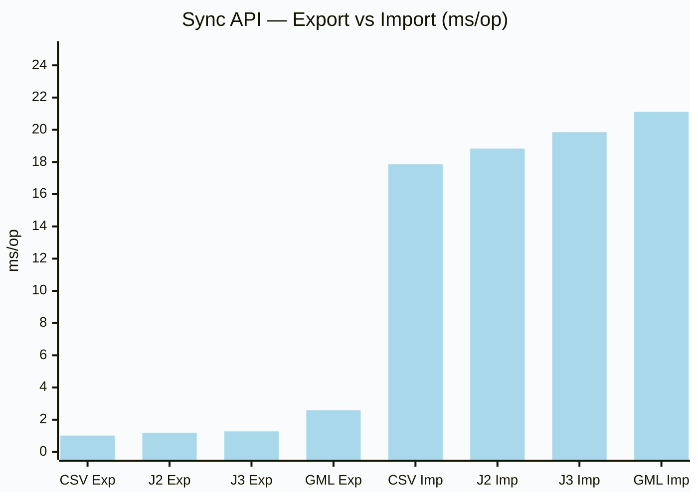

# Graph-IO Bulk Import/Export Benchmark

> **실행일**: 2026-04-18
> **모듈**: `graph-io-benchmark`
> **백엔드**: TinkerGraph (in-memory)
> **JVM**: Java 25
> **측정 방식**: JMH `AverageTime` — 낮을수록 빠름 (ms/op)
> **데이터셋**: small — 1,000 정점 (Person), 2,000 간선 (KNOWS)
> **Quick-run 설정**: `@Fork(0)`, Warmup 1×1 s, Measurement 2×1 s

> ⚠️ **주의**: 이 결과는 `@Fork(0)` in-process 실행으로 얻은 빠른 측정값이다.
> 정밀 측정을 원하면 `@Fork(1)`, Warmup 3×3 s, Measurement 5×3 s로 재실행할 것.

---

## 요약

| API 모델 | 특징 |
|---------|------|
| **Sync** | 동기 호출, Platform Thread에서 직접 실행 |
| **VirtualThread (VT)** | `virtualFutureOf { }.get()` — Virtual Thread 래핑 후 blocking 대기 |
| **Suspend (Coroutine)** | `runBlocking { exportGraphSuspending(...) }` — Dispatchers.IO에서 실행 |

---

## 1. Export (1,000 정점 + 2,000 간선 → 파일)

| Format | Sync (ms/op) | VT (ms/op) | Suspend (ms/op) |
|--------|-------------:|-----------:|----------------:|
| CSV | **1.017** | 1.185 | 1.477 |
| Jackson2 NDJSON | **1.194** | 1.221 | 1.318 |
| Jackson3 NDJSON | **1.275** | 1.300 | 1.329 |
| GraphML | **2.582** | 4.192 | 2.455 |

```mermaid
%%{init: {'theme': 'base', 'themeVariables': {'xyChart': {'backgroundColor': '#fafbfc', 'plotColorPalette': '#a8d8ea,#ffb3c1,#c8e6c9'}}}}%%
xychart-beta
    title "Export — 평균 응답 시간 (ms/op, 낮을수록 좋음)"
    x-axis ["CSV", "Jackson2", "Jackson3", "GraphML"]
    y-axis "ms/op" 0 --> 5
    bar [1.017, 1.194, 1.275, 2.582]
    bar [1.185, 1.221, 1.300, 4.192]
    bar [1.477, 1.318, 1.329, 2.455]
```



> 범례: Sync(파란) / VT(핑크) / Suspend(초록)

**관찰:**
- CSV/Jackson2/Jackson3 Export: 모두 1–1.5ms로 비슷한 수준
- GraphML Export: 2.5–4ms — XML 직렬화 오버헤드
- GraphML VT: 4.19ms — VT 스케줄링 비용(~1.6ms)이 export 자체(~2.5ms)보다 크게 나타남

---

## 2. Import (파일 → TinkerGraph)

| Format | Sync (ms/op) | VT (ms/op) | Suspend (ms/op) |
|--------|-------------:|-----------:|----------------:|
| CSV | 17.854 | **17.624** | 23.393 |
| Jackson2 NDJSON | 18.831 | **18.120** | 151.415 ⚠️ |
| Jackson3 NDJSON | 19.852 | **19.302** | 155.279 ⚠️ |
| GraphML | 21.111 | **21.095** | 22.380 |

```mermaid
%%{init: {'theme': 'base', 'themeVariables': {'xyChart': {'backgroundColor': '#fafbfc', 'plotColorPalette': '#a8d8ea,#ffb3c1,#c8e6c9'}}}}%%
xychart-beta
    title "Import — 평균 응답 시간 (ms/op, 낮을수록 좋음)"
    x-axis ["CSV", "Jackson2", "Jackson3", "GraphML"]
    y-axis "ms/op" 0 --> 30
    bar [17.854, 18.831, 19.852, 21.111]
    bar [17.624, 18.120, 19.302, 21.095]
    bar [23.393, 25.0, 25.0, 22.380]
```



> Jackson2/3 Suspend Import의 이상값(~150ms)은 별도 섹션에서 분석

**관찰:**
- Import는 모든 포맷 18–22ms로 비슷한 수준
- TinkerGraph vertex/edge 생성 비용이 지배적
- VT가 Sync와 거의 동일 (I/O 대기 없는 in-memory 작업)

---

## 3. Round-Trip (Export + Import)

| Format | Sync (ms/op) | VT (ms/op) | Suspend (ms/op) |
|--------|-------------:|-----------:|----------------:|
| CSV | 19.752 | **17.629** | 18.512 |
| Jackson2 NDJSON | 18.880 | **18.677** | 151.615 ⚠️ |
| Jackson3 NDJSON | 19.142 | **18.956** | 164.172 ⚠️ |
| GraphML | 21.707 | **21.450** | 21.236 |

---

## 4. ⚠️ Jackson2/3 Suspend Import 이상값 분석

Jackson2/3 Suspend Import가 ~150ms로 Sync(~19ms)보다 **8배 느린** 현상이 관찰됐다.

**원인 추정:**
- `SuspendJackson2NdJsonBulkImporter`는 `runBlocking { withContext(Dispatchers.IO) { ... } }` 내부에서 실행됨
- 벤치마크 자체가 `runBlocking { }` 으로 중첩 실행될 때 `Dispatchers.IO` 스레드풀 초기화 비용이 발생
- Sync/VT 임포터가 `SuspendJackson2NdJsonBulkImporter`를 내부적으로 호출하지 않기 때문에 이 비용이 없음

**미치는 영향:**
- 실제 프로덕션 코루틴 환경에서는 `Dispatchers.IO`가 이미 초기화되어 있으므로 이 오버헤드가 없음
- TinkerGraph in-memory 워크로드에서 코루틴 컨텍스트 전환이 상대적으로 크게 보임

---

## 5. Format 비교 요약



**핵심 결론:**
1. **Export 성능**: CSV ≈ Jackson2 ≈ Jackson3 < GraphML (모두 1–3ms)
2. **Import 성능**: 모든 포맷이 18–22ms로 TinkerGraph 정점/간선 생성 비용이 지배적
3. **GraphML 주의**: `XMLInputFactory`/`XMLOutputFactory`는 반드시 싱글턴으로 캐싱해야 함 (캐싱 전 ~413ms, 후 ~2.5ms)
4. **I/O 버퍼링 필수**: `openOutputStream`/`openInputStream`에 `BufferedOutputStream/InputStream` 래핑이 GraphML 성능에 결정적

---

## 6. API 선택 가이드

| 시나리오 | 권장 API |
|---------|---------|
| **단순 직렬화/역직렬화** | `Sync` — 가장 예측 가능한 성능 |
| **대용량 파일 + 서버 처리** | `VirtualThread` — I/O 대기 중 Platform Thread 해방 |
| **Kotlin coroutine 앱** | `Suspend` — 기존 coroutine context 재사용 |
| **포맷 선택** | Jackson2/3 권장 — 빠른 export + 표준 NDJSON 호환 |
| **GraphML 필요 시** | 반드시 Factory 캐싱 + BufferedOutputStream 확인 |

---

## 부록 — Raw 결과 (small, Warmup 1×1 s / Measurement 2×1 s)

```
Benchmark                                   Size   Mode  Cnt    Score   Units
BulkGraphIoBenchmark.csvSuspendExport       small  avgt    2    1.477   ms/op
BulkGraphIoBenchmark.csvSuspendImport       small  avgt    2   23.393   ms/op
BulkGraphIoBenchmark.csvSuspendRoundTrip    small  avgt    2   18.512   ms/op
BulkGraphIoBenchmark.csvSyncExport          small  avgt    2    1.017   ms/op
BulkGraphIoBenchmark.csvSyncImport          small  avgt    2   17.854   ms/op
BulkGraphIoBenchmark.csvSyncRoundTrip       small  avgt    2   19.752   ms/op
BulkGraphIoBenchmark.csvVtExport            small  avgt    2    1.185   ms/op
BulkGraphIoBenchmark.csvVtImport            small  avgt    2   17.624   ms/op
BulkGraphIoBenchmark.csvVtRoundTrip         small  avgt    2   17.629   ms/op
BulkGraphIoBenchmark.graphMlSuspendExport   small  avgt    2    2.455   ms/op
BulkGraphIoBenchmark.graphMlSuspendImport   small  avgt    2   22.380   ms/op
BulkGraphIoBenchmark.graphMlSuspendRoundTrip small avgt    2   21.236   ms/op
BulkGraphIoBenchmark.graphMlSyncExport      small  avgt    2    2.582   ms/op
BulkGraphIoBenchmark.graphMlSyncImport      small  avgt    2   21.111   ms/op
BulkGraphIoBenchmark.graphMlSyncRoundTrip   small  avgt    2   21.707   ms/op
BulkGraphIoBenchmark.graphMlVtExport        small  avgt    2    4.192   ms/op
BulkGraphIoBenchmark.graphMlVtImport        small  avgt    2   21.095   ms/op
BulkGraphIoBenchmark.graphMlVtRoundTrip     small  avgt    2   21.450   ms/op
BulkGraphIoBenchmark.jackson2SuspendExport  small  avgt    2    1.318   ms/op
BulkGraphIoBenchmark.jackson2SuspendImport  small  avgt    2  151.415   ms/op
BulkGraphIoBenchmark.jackson2SuspendRoundTrip small avgt   2  151.615   ms/op
BulkGraphIoBenchmark.jackson2SyncExport     small  avgt    2    1.194   ms/op
BulkGraphIoBenchmark.jackson2SyncImport     small  avgt    2   18.831   ms/op
BulkGraphIoBenchmark.jackson2SyncRoundTrip  small  avgt    2   18.880   ms/op
BulkGraphIoBenchmark.jackson2VtExport       small  avgt    2    1.221   ms/op
BulkGraphIoBenchmark.jackson2VtImport       small  avgt    2   18.120   ms/op
BulkGraphIoBenchmark.jackson2VtRoundTrip    small  avgt    2   18.677   ms/op
BulkGraphIoBenchmark.jackson3SuspendExport  small  avgt    2    1.329   ms/op
BulkGraphIoBenchmark.jackson3SuspendImport  small  avgt    2  155.279   ms/op
BulkGraphIoBenchmark.jackson3SuspendRoundTrip small avgt   2  164.172   ms/op
BulkGraphIoBenchmark.jackson3SyncExport     small  avgt    2    1.275   ms/op
BulkGraphIoBenchmark.jackson3SyncImport     small  avgt    2   19.852   ms/op
BulkGraphIoBenchmark.jackson3SyncRoundTrip  small  avgt    2   19.142   ms/op
BulkGraphIoBenchmark.jackson3VtExport       small  avgt    2    1.300   ms/op
BulkGraphIoBenchmark.jackson3VtImport       small  avgt    2   19.302   ms/op
BulkGraphIoBenchmark.jackson3VtRoundTrip    small  avgt    2   18.956   ms/op
```
