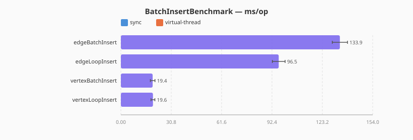
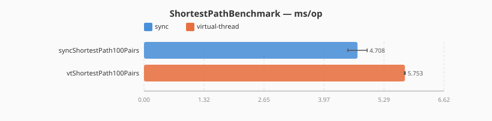
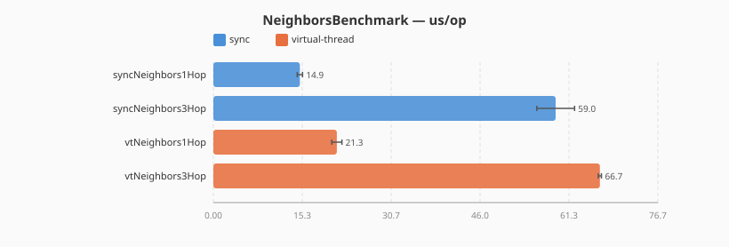

# Graph Database 장단점 및 선택 가이드

> bluetape4k-graph 프로젝트에서 지원하는 Neo4j, Memgraph, Apache AGE, Apache TinkerPop 백엔드를 기준으로 정리한 문서입니다.

## 개요

Graph Database(이하 GraphDB)는 데이터를 **정점(Vertex/Node)** 과 **간선(Edge/Relationship)** 으로 모델링하는 DBMS 카테고리입니다. 관계 자체가 1급 객체이므로 연결 중심의 데이터 도메인에서 RDBMS 대비 강점을 갖습니다.

## 장점

| 항목 | 설명 |
|------|------|
| **관계 탐색 성능** | Index-free Adjacency로 다단계 JOIN 없이 O(1)에 근접한 이웃 조회 |
| **데이터 모델 직관성** | 소셜 그래프, 추천, 지식 그래프, 코드 의존성 등 "연결"이 본질인 도메인 표현이 자연스러움 |
| **스키마 유연성** | 노드/엣지에 속성을 자유롭게 추가, 도메인 진화에 유연하게 대응 |
| **경로/패턴 질의** | 최단 경로, 커뮤니티 탐지, PageRank 등 그래프 알고리즘을 내장 |
| **쿼리 표현력** | Cypher/Gremlin은 JOIN 체인보다 관계 패턴을 훨씬 간결하게 표현 |
| **동적 관계** | 관계 타입 추가/변경 시 DDL 마이그레이션 부담이 적음 |

## 단점

| 항목 | 설명 |
|------|------|
| **집계/분석 쿼리 약세** | GROUP BY, 윈도우 함수 등 OLAP성 작업은 RDBMS/컬럼나 DB 대비 불리 |
| **수평 확장 난이도** | 간선이 파티션을 넘나들면 성능 저하. RDBMS보다 샤딩이 어려움 |
| **생태계 규모** | RDBMS 대비 도구, ORM, 운영 노하우가 상대적으로 부족 |
| **학습 곡선** | Cypher/Gremlin 숙련과 그래프 기반 모델링 철학 학습 필요 |
| **저장 오버헤드** | 간선이 1급 객체이므로 관계당 저장 비용이 큼 |
| **트랜잭션 일관성** | 백엔드별 ACID 보장 수준 차이 (Neo4j=ACID, 일부 분산 엔진은 제한적) |

## 사용처 판단 기준

### 적합한 경우
- 소셜 네트워크, 팔로우/친구 관계, 콘텐츠 추천
- 사기 탐지(Fraud Detection), 금융 거래 네트워크 분석
- 지식 그래프, 온톨로지, 엔티티 링킹
- IAM/권한 그래프, 조직도, RBAC
- 코드 의존성, 아키텍처 분석, 공급망 추적
- 네트워크/인프라 토폴로지

### 부적합한 경우
- 단순 CRUD 애플리케이션
- 대량 집계 및 리포팅/BI (OLAP)
- 로그/시계열 분석
- 대규모 배치 ETL 중심 워크로드

## bluetape4k-graph 백엔드 비교

| 백엔드 | 쿼리 언어 | 드라이버 | 특징 | 적합한 상황 |
|--------|-----------|----------|------|-------------|
| **Neo4j** | Cypher | Neo4j Java Driver (Bolt) | 성숙한 생태계, ACID, 풍부한 그래프 알고리즘 | 엔터프라이즈 프로덕션, 복잡한 패턴 매칭 |
| **Memgraph** | Cypher | Neo4j Java Driver (Bolt 호환) | 인메모리, 스트리밍 친화, 저지연 | 실시간 분석, 저지연 질의, CEP |
| **Apache AGE** | Cypher over SQL | PostgreSQL JDBC + Exposed | 기존 PostgreSQL 위에 그래프 레이어 추가 | RDBMS와 그래프 혼합, 기존 PG 인프라 재활용 |
| **Apache TinkerPop** | Gremlin | TinkerGraph (인메모리) | 표준 그래프 API, 프로퍼티 그래프 | 테스트/프로토타입, 벤더 중립성 필요 |

## 선택 가이드

1. **이미 PostgreSQL을 운영 중이고 그래프는 보조 역할** → `graph-age`
2. **그래프가 주 워크로드이고 ACID 필수** → `graph-neo4j`
3. **실시간 스트리밍/저지연 분석** → `graph-memgraph`
4. **벤더 중립성, 테스트, 프로토타이핑** → `graph-tinkerpop`

## 실측 벤치마크 결과 (TinkerGraph 기준선)

> **환경**: macOS Darwin 25.4.0 / JDK 21 (preview), kotlinx-benchmark + JMH
> **측정 설정**: warmup 3회 × 2초, measurement 5회 × 3초, fork=1
> **재실행**: `./gradlew :graph-benchmark:benchmark`
> **SVG 재생성**: `python3 benchmark/scripts/render_benchmark_svg.py <build/reports/benchmarks/.../main.json>`

Neo4j / Memgraph / AGE 백엔드 벤치마크는 Testcontainers 기반이므로 CI `benchmark.yml`
워크플로우의 수동 트리거(`workflow_dispatch`)로 실행합니다.

### 정점 삽입 1만 건 — `BatchInsertBenchmark`

10,000개 `Person` 노드와 cycle 토폴로지 `KNOWS` 간선에 대한 단건 vs 배치 처리량 비교.

| 작업 | 단건 루프 | 배치 | 비고 |
|------|-----------|------|------|
| 정점 1만 건 | 19.6 ms/op | 19.4 ms/op | TinkerGraph in-memory에서는 거의 동일 |
| 간선 1만 건 | 96.5 ms/op | 133.9 ms/op | TinkerGraph는 인덱스 갱신 오버헤드로 배치가 더 느림 |

Neo4j/Memgraph/AGE는 트랜잭션 비용이 크므로 배치 효과가 훨씬 큽니다(별도 측정 예정).

### 최단경로 100쌍 — `ShortestPathBenchmark`

1,000-노드 체인 그래프(0→1→…→999)에서 100쌍 무작위 forward `shortestPath` 비교 (`from.index < to.index` 보장).

| 구현 | 평균 지연 | 비고 |
|------|----------|------|
| sync (호출 스레드) | 4.7 ms/op | 단일 스레드 직렬 처리 |
| virtual-thread (`shortestPathAsync.join()`) | 5.8 ms/op | VT 어댑터 오버헤드 (단일 쌍 대기) |

100쌍을 코루틴으로 병렬화하면 VT 변형이 유리하지만, 단일 join 패턴에서는 스케줄링 비용이 누적됩니다.

### 이웃 탐색 1홉/3홉 — `NeighborsBenchmark`

스타 그래프(hub 1 + leaf 100, leaf 체인 99) 기준으로 hub의 `neighbors(maxDepth=N)` 측정.

| 깊이 | sync | virtual-thread |
|------|------|----------------|
| 1-hop | 14.9 µs/op | 21.3 µs/op |
| 3-hop | 59.0 µs/op | 66.7 µs/op |

깊이가 깊어질수록 팬아웃 비용이 선형적으로 증가하며, VT 오버헤드는 절대값으로 일정합니다.

### 기존 벤치마크 결과

| 벤치마크 | 결과 SVG |
|---------|----------|
| Algorithm (BFS/DFS/PageRank) | [AlgorithmBenchmark.svg](benchmark-results/AlgorithmBenchmark.svg) |
| Traversal (shortestPath/allPaths) | [TraversalBenchmark.svg](benchmark-results/TraversalBenchmark.svg) |
| Vertex/Edge CRUD | [VertexOperationsBenchmark.svg](benchmark-results/VertexOperationsBenchmark.svg) |

## 참고

- 본 프로젝트의 추상화 레이어(`graph-core`)는 위 4개 백엔드를 공통 인터페이스(`GraphOperations` / `GraphSuspendOperations`)로 추상화하여, 비즈니스 로직을 변경하지 않고 백엔드 전환을 가능하게 합니다.
- 동기/코루틴 이중 API 패턴을 제공하므로 Spring MVC와 WebFlux 양쪽에서 모두 활용 가능합니다.
- 예시는 `examples/code-graph-examples`, `examples/linkedin-graph-examples` 모듈을 참고하세요.
