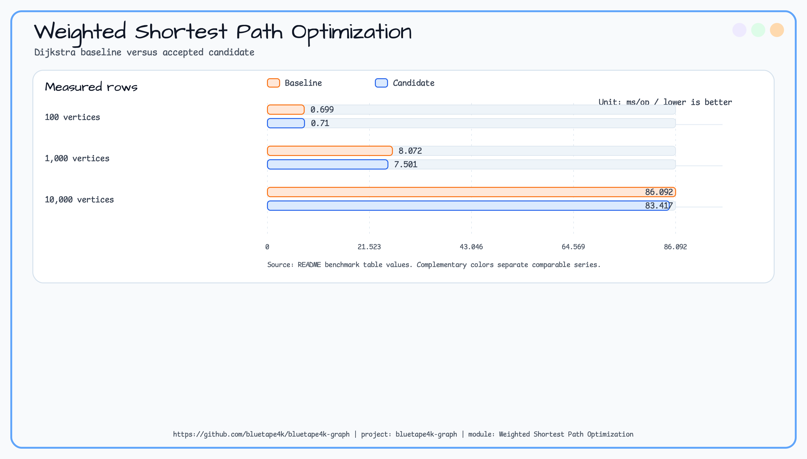

# 2026-05-22 - Weighted Shortest Path Benchmark and First Optimization Pass

## 맥락

Milestone `0.3.1` needed issue #41 as the benchmark prerequisite for #192 and #193. The benchmark harness had to use
`kotlinx-benchmark`, not direct JMH annotations in Kotlin source.

## 결정

- `benchmark/graph-benchmark` benchmark source now imports `kotlinx.benchmark.*` annotations and
  `BenchmarkTimeUnit`; direct `org.openjdk.jmh.annotations.*` imports are kept out of source.
- `WeightedShortestPathBench` uses deterministic TinkerGraph weighted datasets at 100, 1,000, and 10,000 vertices.
- A* uses a zero heuristic so it stays admissible and comparable to Dijkstra on the same graph.
- Benchmark main resources include WARN-level Logback configuration so algorithm DEBUG logs do not contaminate
  measurement output.

## 최적화 결과

Issue #192 tested one narrow candidate: replace `DijkstraRunner` priority queue entries from
`Pair<Double, GraphElementId>` plus comparator dispatch to a dedicated comparable `DijkstraNode`.

Primary metric: `WeightedShortestPathBench.dijkstra`, 10,000 vertices, lower is better.

Chart:


| Metric | Baseline | Candidate | Delta |
|---|---:|---:|---:|
| Dijkstra 100 vertices | 0.699 ms/op | 0.710 ms/op | -1.6% |
| Dijkstra 1,000 vertices | 8.072 ms/op | 7.501 ms/op | +7.1% |
| Dijkstra 10,000 vertices | 86.092 ms/op | 83.417 ms/op | +3.1% |

결정: accept. The primary metric improved beyond the 1% threshold, and the small 100-vertex regression stayed
inside the 5% guard.

## 검증

```bash
./gradlew :graph-benchmark:test --tests "io.bluetape4k.graph.benchmark.WeightedShortestPathBenchTest"
./gradlew :bluetape4k-graph-core:compileKotlin :bluetape4k-graph-tinkerpop:test --tests "io.bluetape4k.graph.tinkerpop.TinkerGraphWeightedPathTest" --tests "io.bluetape4k.graph.tinkerpop.TinkerGraphSuspendWeightedPathTest"
./gradlew :graph-benchmark:mainBenchmark
```

All commands passed. The first graph-core compile hit a Kotlin daemon incremental cache race while two Gradle commands
ran concurrently; Gradle fallback compilation and later benchmark compilation both succeeded.

## 향후 지침

- Keep graph benchmark execution on Gradle `kotlinx-benchmark` tasks such as `:graph-benchmark:mainBenchmark`.
- Do not add direct JMH annotation imports to Kotlin source.
- Do not run Gradle compile/test commands for the same modules concurrently when graph-core classes are being rewritten;
  it can trigger a Kotlin daemon incremental fallback.
- For the next pass, prefer larger graph metrics as primary targets. Very small graph sizes are sensitive to queue entry
  allocation and JVM noise.
