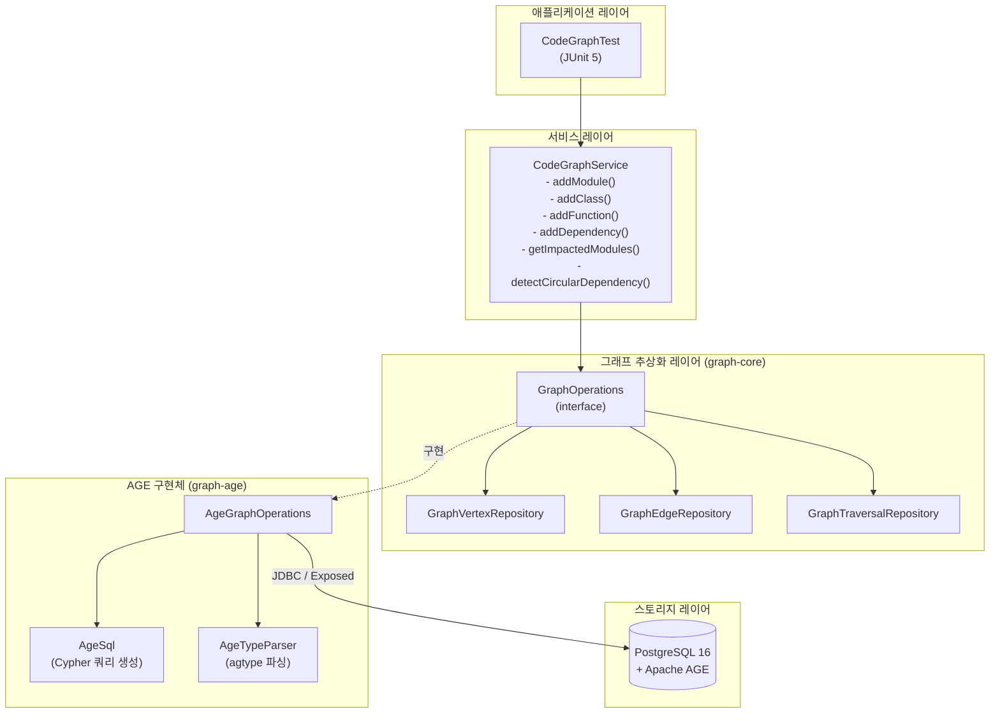
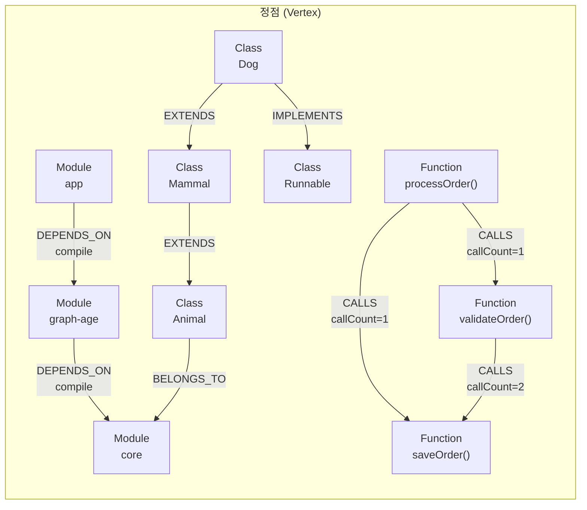
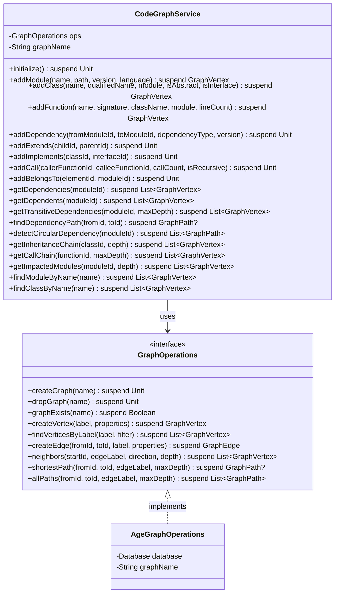
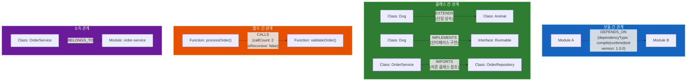
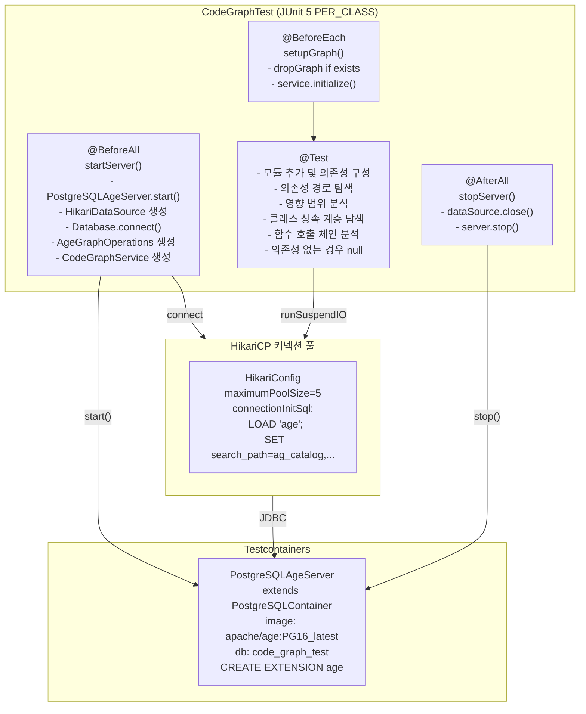

# code-graph-age

소스 코드 의존성 관리 시스템을 Apache AGE + graph-age 라이브러리로 구현한 예제 모듈.
모듈, 클래스, 함수 간의 의존 관계를 그래프로 표현하여 영향 범위 분석, 순환 의존성 탐지 등을 수행합니다.

## 목차

- [아키텍처](#아키텍처)
- [데이터 모델](#데이터-모델)
- [스키마 클래스 다이어그램](#스키마-클래스-다이어그램)
- [서비스 클래스 다이어그램](#서비스-클래스-다이어그램)
- [의존성 분석 시퀀스](#의존성-분석-시퀀스)
- [순환 의존성 탐지 시퀀스](#순환-의존성-탐지-시퀀스)
- [코드 관계 유형](#코드-관계-유형)
- [테스트 환경 구성](#테스트-환경-구성)
- [사용 방법](#사용-방법)

---

## 아키텍처

애플리케이션 레이어부터 PostgreSQL/AGE 스토리지까지의 전체 스택 구성입니다.



---

## 데이터 모델

코드 요소(Module, Class, Function)와 관계(DEPENDS_ON, EXTENDS, IMPLEMENTS, CALLS, BELONGS_TO)를 그래프로 표현합니다.



---

## 스키마 클래스 다이어그램

`CodeGraphSchema.kt`에 정의된 VertexLabel/EdgeLabel 객체 구조입니다.

```mermaid
classDiagram
    class VertexLabel {
        +String label
        +List~PropertyDef~ properties
        +string(name) PropertyDef~String~
        +integer(name) PropertyDef~Int~
        +boolean(name) PropertyDef~Boolean~
    }

    class EdgeLabel {
        +String label
        +VertexLabel from
        +VertexLabel to
        +List~PropertyDef~ properties
    }

    class ModuleLabel {
        <<object>>
        +PropertyDef~String~ name
        +PropertyDef~String~ path
        +PropertyDef~String~ version
        +PropertyDef~String~ language
    }

    class ClassLabel {
        <<object>>
        +PropertyDef~String~ name
        +PropertyDef~String~ qualifiedName
        +PropertyDef~String~ module
        +PropertyDef~Boolean~ isAbstract
        +PropertyDef~Boolean~ isInterface
    }

    class FunctionLabel {
        <<object>>
        +PropertyDef~String~ name
        +PropertyDef~String~ signature
        +PropertyDef~String~ className
        +PropertyDef~String~ module
        +PropertyDef~Int~ lineCount
    }

    class DependsOnLabel {
        <<object>>
        from: ModuleLabel
        to: ModuleLabel
        +PropertyDef~String~ dependencyType
        +PropertyDef~String~ version
    }

    class ImportsLabel {
        <<object>>
        from: ClassLabel
        to: ClassLabel
    }

    class ExtendsLabel {
        <<object>>
        from: ClassLabel
        to: ClassLabel
    }

    class ImplementsLabel {
        <<object>>
        from: ClassLabel
        to: ClassLabel
    }

    class CallsLabel {
        <<object>>
        from: FunctionLabel
        to: FunctionLabel
        +PropertyDef~Int~ callCount
        +PropertyDef~Boolean~ isRecursive
    }

    class BelongsToLabel {
        <<object>>
        from: ClassLabel
        to: ModuleLabel
    }

    VertexLabel <|-- ModuleLabel
    VertexLabel <|-- ClassLabel
    VertexLabel <|-- FunctionLabel
    EdgeLabel <|-- DependsOnLabel
    EdgeLabel <|-- ImportsLabel
    EdgeLabel <|-- ExtendsLabel
    EdgeLabel <|-- ImplementsLabel
    EdgeLabel <|-- CallsLabel
    EdgeLabel <|-- BelongsToLabel
```



---

## 서비스 클래스 다이어그램

`CodeGraphService`의 전체 메서드 목록과 의존 관계입니다.



---

## 의존성 분석 시퀀스

특정 모듈 변경 시 영향받는 모듈을 역방향 탐색으로 분석하는 흐름입니다.

```mermaid
sequenceDiagram
    actor Developer
    participant Service as CodeGraphService
    participant Ops as AgeGraphOperations
    participant AGE as PostgreSQL/AGE

    Developer->>Service: getImpactedModules(coreModuleId, depth=3)
    Service->>Ops: neighbors(coreModuleId, "DEPENDS_ON", INCOMING, depth=3)
    Ops->>AGE: LOAD 'age';\nSET search_path
    Ops->>AGE: MATCH (start) WHERE id(start)=$id\nMATCH (n)-[:DEPENDS_ON*1..3]->(start)\nRETURN DISTINCT n
    AGE-->>Ops: ResultSet (agtype rows)
    Ops->>Ops: AgeTypeParser.parseVertex(row)
    Ops-->>Service: List~GraphVertex~
    Service-->>Developer: [moduleA, moduleB, moduleC]

    Note over Developer,AGE: core 모듈이 변경되면\nmoduleA, moduleB, moduleC가 영향받음
```

---

## 순환 의존성 탐지 시퀀스

A → B → C → A 형태의 순환 의존성을 탐지하는 흐름입니다.

```mermaid
sequenceDiagram
    actor Developer
    participant Service as CodeGraphService
    participant Ops as AgeGraphOperations
    participant AGE as PostgreSQL/AGE

    Developer->>Service: detectCircularDependency(moduleAId)
    Service->>Ops: allPaths(moduleAId, moduleAId, "DEPENDS_ON", maxDepth=5)

    Ops->>AGE: LOAD 'age';\nSET search_path
    Ops->>AGE: MATCH p=(a)-[:DEPENDS_ON*1..5]-(b)\nWHERE id(a)=$id AND id(b)=$id\nRETURN p
    AGE-->>Ops: ResultSet (순환 경로들)
    Ops->>Ops: AgeTypeParser.parsePath(row)
    Ops-->>Service: List~GraphPath~

    alt 순환 경로 발견
        Service-->>Developer: [pathA→B→C→A, ...]
        Note over Developer: 순환 의존성 경고!
    else 순환 없음
        Service-->>Developer: []
        Note over Developer: 의존성 그래프 정상
    end
```

---

## 코드 관계 유형

각 엣지 타입의 의미와 적용 대상을 설명합니다.



---

## 테스트 환경 구성

Testcontainers를 이용한 Apache AGE 테스트 환경 구성입니다.



---

## 사용 방법

### 의존성 설정

```kotlin
// build.gradle.kts
dependencies {
    implementation(project(":graph-core"))
    implementation(project(":graph-age"))
    implementation(Libs.kotlinx_coroutines_core)
}
```

### 서비스 초기화 및 데이터 입력

```kotlin
val dataSource = HikariDataSource(HikariConfig().apply {
    jdbcUrl = "jdbc:postgresql://localhost:5432/mydb"
    username = "user"
    password = "pass"
    connectionInitSql = "LOAD 'age'; SET search_path = ag_catalog, \"\$user\", public;"
})
val database = Database.connect(dataSource)
val ops = AgeGraphOperations(database, "code_graph")
val service = CodeGraphService(ops, "code_graph")

// 그래프 초기화
service.initialize()

// 모듈 추가
val coreModule = service.addModule("core", "graph/graph-core", "1.0.0")
val appModule  = service.addModule("app", "examples/app", "1.0.0")

// 의존성 설정
service.addDependency(appModule.id, coreModule.id, "compile")
```

### 분석 쿼리 예시

```kotlin
// 전이 의존성 탐색 (최대 3단계)
val deps = service.getTransitiveDependencies(appModule.id, maxDepth = 3)

// 영향 범위 분석 (core가 변경되면 누가 영향받는가)
val impacted = service.getImpactedModules(coreModule.id, depth = 2)

// 두 모듈 간 최단 경로
val path = service.findDependencyPath(appModule.id, coreModule.id)

// 순환 의존성 탐지
val cycles = service.detectCircularDependency(appModule.id)
if (cycles.isNotEmpty()) println("순환 의존성 발견!")

// 클래스 상속 계층
val baseClass = service.addClass("Animal", "io.example.Animal")
val leafClass = service.addClass("Dog", "io.example.Dog")
service.addExtends(leafClass.id, baseClass.id)
val chain = service.getInheritanceChain(leafClass.id, depth = 5)
```

### 테스트 실행

```bash
./gradlew :code-graph-age:test
```

---

## 모듈 구조

```
code-graph-age/
├── build.gradle.kts
├── src/
│   ├── main/kotlin/io/bluetape4k/graph/examples/code/
│   │   ├── schema/
│   │   │   └── CodeGraphSchema.kt     # VertexLabel/EdgeLabel 스키마 정의
│   │   └── service/
│   │       └── CodeGraphService.kt    # 코드 그래프 서비스 (CRUD + 분석)
│   └── test/kotlin/io/bluetape4k/graph/examples/code/
│       ├── PostgreSQLAgeServer.kt     # Testcontainers AGE 서버
│       └── CodeGraphTest.kt           # 통합 테스트
└── README.md
```
