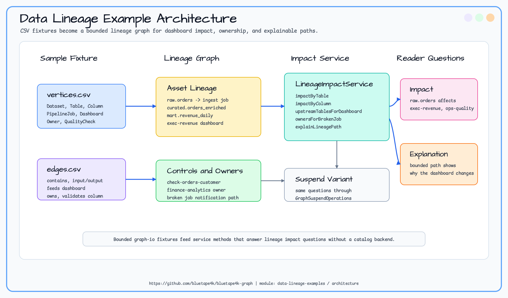

# data-lineage-examples

> 🇺🇸 [English](README.md)

Dataset, table, column, pipeline job, dashboard, owner, data quality check를 작은 data lineage graph로 모델링하는 예제입니다.
전체 catalog product를 만들지 않고 schema 변경 영향 분석에 필요한 bounded graph traversal만 보여줍니다.

## 예제 시나리오

샘플 그래프는 `raw.orders`가 ingestion job과 revenue mart job을 거쳐 executive/operations dashboard로 전달되는 흐름을
추적합니다. source table 또는 column 변경이 어떤 dashboard에 영향을 주는지, dashboard metric의 upstream table이
무엇인지, broken job과 영향받는 dashboard의 owner가 누구인지, failing data quality check가 business metric에 왜
영향을 주는지 답합니다.

## 아키텍처



## Graph Model

| 요소 | Label | 주요 속성 | 목적 |
|---|---|---|---|
| Dataset | `Dataset` | `datasetId`, `domain`, `status` | physical/curated table을 묶습니다. |
| Table | `Table` | `tableId`, `domain`, `status` | source, curated, mart asset입니다. |
| Column | `Column` | `columnId`, `dataType`, `status` | column-level impact root입니다. |
| Pipeline job | `PipelineJob` | `jobId`, `schedule`, `status` | upstream asset을 downstream table로 변환합니다. |
| Dashboard | `Dashboard` | `dashboardId`, `metric`, `status` | business-facing metric endpoint입니다. |
| Owner | `Owner` | `ownerId`, `team`, `channel` | job/dashboard 책임 팀입니다. |
| Quality check | `QualityCheck` | `checkId`, `severity`, `status` | source column에 연결된 failing control입니다. |

## Traversal Goals

| 질문 | API |
|---|---|
| source table 변경이 어떤 dashboard에 영향을 주는가? | `impactedDashboardsBySourceTable(tableId)` |
| source column 변경이 어떤 dashboard에 영향을 주는가? | `impactedDashboardsByColumn(columnId)` |
| dashboard metric의 upstream table은 무엇인가? | `upstreamTablesForDashboard(dashboardId)` |
| broken job에서 어떤 owner에게 알려야 하는가? | `ownersForBrokenJob(jobId)` |
| failing data quality check가 어떤 dashboard에 영향을 주는가? | `dashboardsAffectedByQualityCheck(checkId)` |
| 영향 경로를 bounded lineage path로 어떻게 설명하는가? | `explainLineagePath(sourceTableId, dashboardId)` |

## Sample Dataset

모듈은 `src/main/resources/sample-data/data-lineage/` 아래에 graph-io CSV fixture를 포함합니다.

| 파일 | 내용 |
|---|---|
| `vertices.csv` | dataset, table, column, pipeline job, dashboard, owner, check. |
| `edges.csv` | containment, job input/output, dashboard feed, owner, validation edge. |

```kotlin
val ops = TinkerGraphOperations()
val service = DataLineageImpactService(ops)
service.initialize()

DataLineageSampleDatasetLoader.importCsv(ops)
val dashboards = service.impactedDashboardsBySourceTable("raw.orders")
val paths = service.explainLineagePath("raw.orders", "exec-revenue")
```

## Expected Output

| Query | Expected IDs |
|---|---|
| `impactedDashboardsBySourceTable("raw.orders")` | `exec-revenue`, `ops-quality` |
| `impactedDashboardsByColumn("raw.orders.customer_id")` | `exec-revenue`, `ops-quality` |
| `upstreamTablesForDashboard("exec-revenue")` | `mart.revenue_daily`, `curated.orders_enriched`, `raw.orders`, `raw.payments` |
| `ownersForBrokenJob("build-revenue-mart")` | `finance-analytics` |
| `dashboardsAffectedByQualityCheck("check-orders-customer")` | `exec-revenue`, `ops-quality` |

## 테스트 실행

```bash
./gradlew :data-lineage-examples:test
```

첫 slice는 TinkerGraph smoke coverage와 graph-io CSV loader test를 사용합니다.
