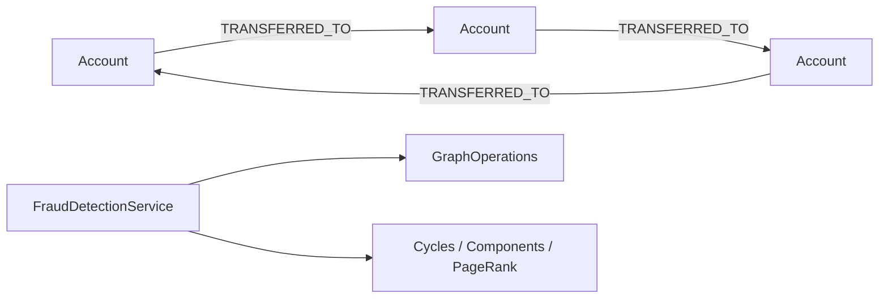

# fraud-detection-examples

> 🇺🇸 [English](README.md)

계좌 이체를 그래프로 모델링하고, bluetape4k-graph의 백엔드 독립 API로 이상 거래 분석을 수행하는 예제입니다.

## 아키텍처



## 주요 기능

| 기능 | Graph API |
|---|---|
| 순환 이체 탐지 | `detectCycles(CycleOptions)` |
| 의심 클러스터 탐지 | `connectedComponents(ComponentOptions)` |
| 고위험 계좌 랭킹 | `pageRank(PageRankOptions)` |
| 코루틴 지원 | `FraudDetectionSuspendService`와 `Flow` 결과 |

## 사용 예

```kotlin
val service = FraudDetectionService(ops)
service.initialize()

val alice = service.addAccount("acct-alice", "Alice")
val bob = service.addAccount("acct-bob", "Bob")
val carol = service.addAccount("acct-carol", "Carol")

service.recordTransfer(alice.id, bob.id, amount = 100)
service.recordTransfer(bob.id, carol.id, amount = 75)
service.recordTransfer(carol.id, alice.id, amount = 50)

val cycles = service.detectCircularTransfers()
val clusters = service.detectSuspiciousClusters(minSize = 3)
val ranked = service.rankHighRiskAccounts(limit = 10)
```

## 테스트 실행

```bash
./gradlew :fraud-detection-examples:test
./gradlew :fraud-detection-examples:test --tests "*TinkerGraph*"
```

TinkerGraph 테스트는 메모리에서 실행됩니다. Neo4j, Memgraph, Apache AGE, FalkorDB 테스트는 Docker/Testcontainers가 필요합니다.

## 의존성

```kotlin
implementation(project(":graph-core"))
implementation(project(":graph-neo4j"))
implementation(project(":graph-memgraph"))
implementation(project(":graph-age"))
implementation(project(":graph-falkordb"))
implementation(project(":graph-tinkerpop"))
```
