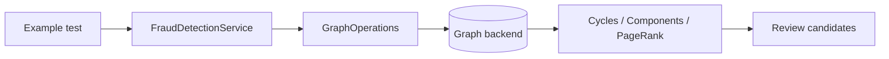
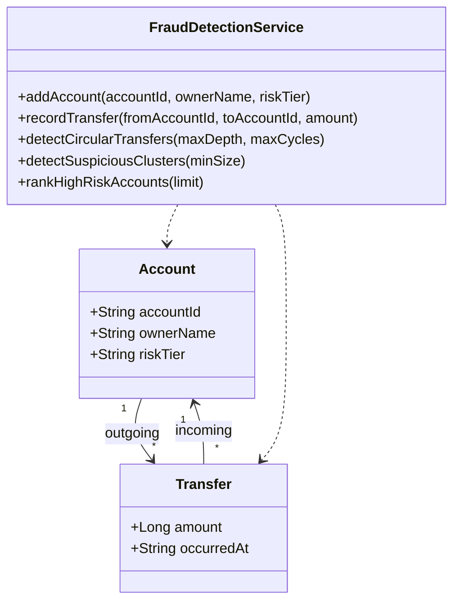
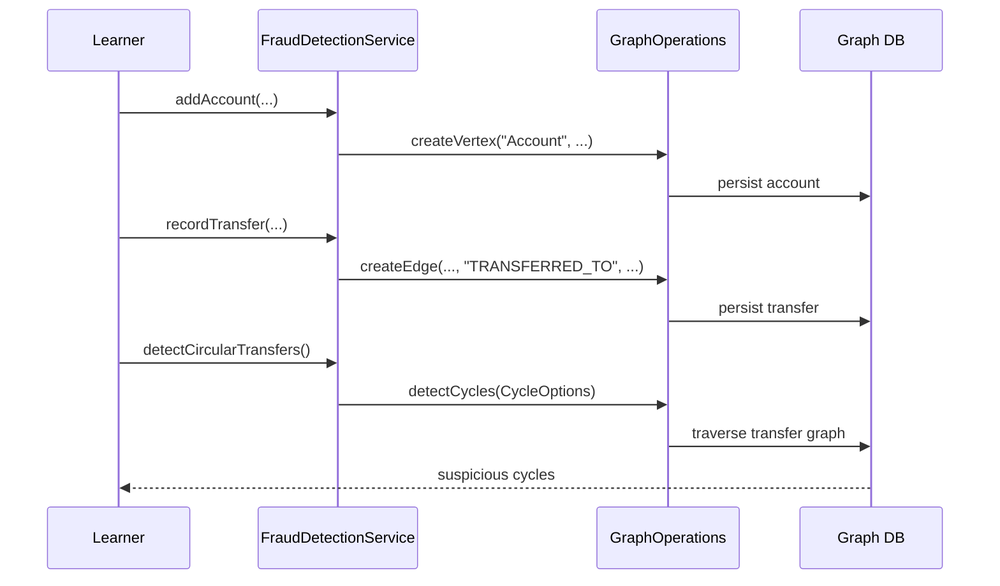

# fraud-detection-examples

> 🇺🇸 [English](README.md)

계좌 이체를 그래프로 모델링하고, bluetape4k-graph의 백엔드 독립 API로 이상 거래 분석을 수행하는 방법을 배우는 예제입니다.

## 무엇을 배우나?

| 주제 | 의미 |
|---|---|
| 이체 그래프 모델링 | 돈의 이동은 계좌 사이의 방향성 있는 관계로 표현하기 좋습니다. |
| 순환 탐지 | `A -> B -> C -> A` 같은 이체 고리는 layering 또는 wash activity 신호가 될 수 있습니다. |
| 연결 컴포넌트 | 서로 강하게 연결된 계좌 묶음을 의심 클러스터로 볼 수 있습니다. |
| PageRank | 중요한 자금 흐름을 많이 받는 계좌를 검토 우선순위로 올릴 수 있습니다. |
| 백엔드 이식성 | 같은 서비스가 TinkerGraph, Neo4j, Memgraph, Apache AGE, FalkorDB에서 동작합니다. |

## 왜 Graph DB가 좋은가?

이상 거래 신호는 단일 row보다 관계에서 나오는 경우가 많습니다. 이체 테이블만으로도 데이터를 저장할 수는 있지만,
"어떤 계좌가 고리를 이루는가?", "어떤 계좌들이 같은 의심 클러스터에 속하는가?", "네트워크 중심에 있는 수신 계좌는
무엇인가?" 같은 질문은 반복 self-join과 별도 traversal 로직이 필요합니다.

Graph DB를 사용하면 도메인 언어가 그대로 모델이 됩니다.

- 계좌는 vertex,
- 이체는 방향성 edge,
- 의심 행위는 path, cycle, component, centrality로 표현됩니다.

그래서 분석 규칙을 도메인 모델 가까이에 둘 수 있고, 여러 Graph DB 백엔드에서도 같은 계약으로 실행할 수 있습니다.

## 아키텍처



## 도메인 UML



## 분석 흐름



## 주요 기능

| 기능 | Graph API |
|---|---|
| 순환 이체 탐지 | `detectCycles(CycleOptions)` |
| 의심 클러스터 탐지 | `connectedComponents(ComponentOptions)` |
| 고위험 계좌 랭킹 | `pageRank(PageRankOptions)` |
| 코루틴 지원 | `FraudDetectionSuspendService`와 `Flow` 결과 |

## 사용 예

```kotlin
val service = FraudDetectionService(ops)
service.initialize()

val alice = service.addAccount("acct-alice", "Alice")
val bob = service.addAccount("acct-bob", "Bob")
val carol = service.addAccount("acct-carol", "Carol")

service.recordTransfer(alice.id, bob.id, amount = 100)
service.recordTransfer(bob.id, carol.id, amount = 75)
service.recordTransfer(carol.id, alice.id, amount = 50)

val cycles = service.detectCircularTransfers()
val clusters = service.detectSuspiciousClusters(minSize = 3)
val ranked = service.rankHighRiskAccounts(limit = 10)
```

## 테스트 읽는 법

`AbstractFraudDetectionTest`와 `AbstractFraudDetectionSuspendTest`가 학습 시나리오입니다. 구체 backend test class는
backend별 `GraphOperations` 구현만 제공합니다.

| 테스트 종류 | 목적 |
|---|---|
| Abstract tests | 이상 거래 분석 동작을 한 번만 설명합니다. |
| TinkerGraph tests | 빠른 메모리 기반 smoke test입니다. |
| Neo4j/Memgraph/AGE/FalkorDB tests | 실제 backend에서도 같은 도메인 동작이 유지되는지 검증합니다. |

## 테스트 실행

```bash
./gradlew :fraud-detection-examples:test
./gradlew :fraud-detection-examples:test --tests "*TinkerGraph*"
```

TinkerGraph 테스트는 메모리에서 실행됩니다. Neo4j, Memgraph, Apache AGE, FalkorDB 테스트는 Docker/Testcontainers가 필요합니다.

## 의존성

```kotlin
implementation(project(":graph-core"))
implementation(project(":graph-neo4j"))
implementation(project(":graph-memgraph"))
implementation(project(":graph-age"))
implementation(project(":graph-falkordb"))
implementation(project(":graph-tinkerpop"))
```
