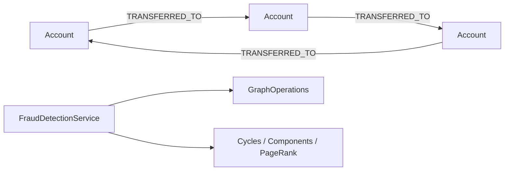

# fraud-detection-examples

> 🇰🇷 [한국어 문서](README.ko.md)

Fraud detection example showing how to model account transfers as a graph and run backend-independent analytics with bluetape4k-graph.

## Architecture



## Core Features

| Feature | Graph API |
|---|---|
| Circular transfer detection | `detectCycles(CycleOptions)` |
| Suspicious cluster detection | `connectedComponents(ComponentOptions)` |
| High-risk account ranking | `pageRank(PageRankOptions)` |
| Coroutine support | `FraudDetectionSuspendService` with `Flow` results |

## Usage

```kotlin
val service = FraudDetectionService(ops)
service.initialize()

val alice = service.addAccount("acct-alice", "Alice")
val bob = service.addAccount("acct-bob", "Bob")
val carol = service.addAccount("acct-carol", "Carol")

service.recordTransfer(alice.id, bob.id, amount = 100)
service.recordTransfer(bob.id, carol.id, amount = 75)
service.recordTransfer(carol.id, alice.id, amount = 50)

val cycles = service.detectCircularTransfers()
val clusters = service.detectSuspiciousClusters(minSize = 3)
val ranked = service.rankHighRiskAccounts(limit = 10)
```

## Running Tests

```bash
./gradlew :fraud-detection-examples:test
./gradlew :fraud-detection-examples:test --tests "*TinkerGraph*"
```

TinkerGraph tests run in memory. Neo4j, Memgraph, Apache AGE, and FalkorDB tests require Docker/Testcontainers.

## Dependencies

```kotlin
implementation(project(":graph-core"))
implementation(project(":graph-neo4j"))
implementation(project(":graph-memgraph"))
implementation(project(":graph-age"))
implementation(project(":graph-falkordb"))
implementation(project(":graph-tinkerpop"))
```
