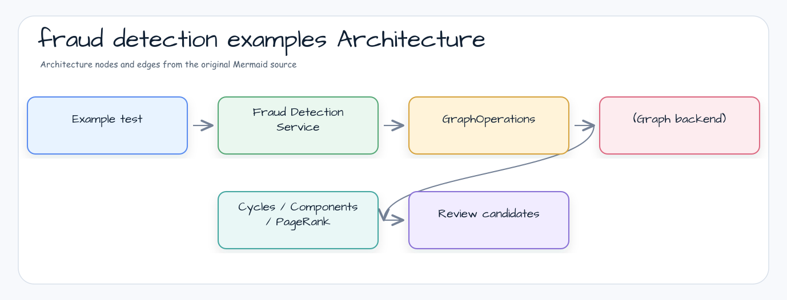
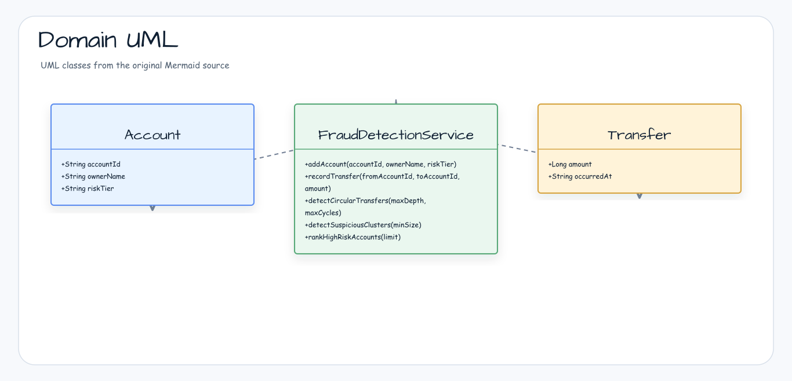
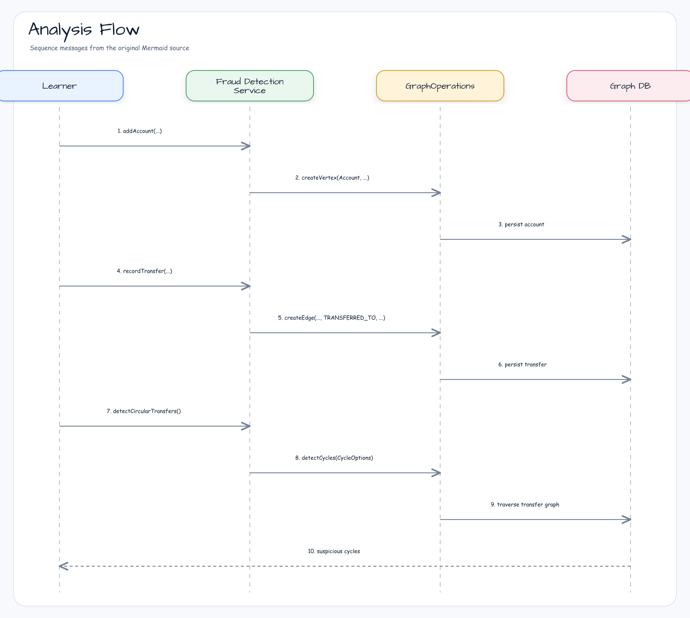

# fraud-detection-examples

> 🇰🇷 [한국어 문서](README.ko.md)

This example teaches how to model money transfers as a graph and run fraud-oriented analytics through the
backend-independent bluetape4k-graph API.

## What You Learn

| Topic | Why it matters |
|---|---|
| Transfer graph modeling | Money movement is naturally a directed relationship between accounts. |
| Cycle detection | Circular transfer chains can indicate layering or wash activity. |
| Connected components | Dense account groups can reveal suspicious clusters. |
| PageRank | Accounts receiving many important flows can be ranked for review. |
| Backend portability | The same service runs on TinkerGraph, Neo4j, Memgraph, Apache AGE, and FalkorDB. |

## Why Use a Graph Database?

Fraud signals are often relationship signals, not single-row signals. A relational table can store transfers, but
questions such as "which accounts form a loop?", "which accounts belong to the same suspicious cluster?", or "which
receiver is central in this transfer network?" require repeated self-joins and custom traversal logic.

A graph database makes these questions explicit:

- accounts are vertices,
- transfers are directed edges,
- suspicious behavior is expressed as paths, cycles, components, and centrality.

That keeps the domain language close to the query language and lets the same analytics contract run across multiple
graph backends.

## Architecture



## Domain UML



## Analysis Flow



## Core Features

| Feature | Graph API |
|---|---|
| Circular transfer detection | `detectCycles(CycleOptions)` |
| Suspicious cluster detection | `connectedComponents(ComponentOptions)` |
| High-risk account ranking | `pageRank(PageRankOptions)` |
| Coroutine support | `FraudDetectionSuspendService` with `Flow` results |

## Usage

```kotlin
val service = FraudDetectionService(ops)
service.initialize()

val alice = service.addAccount("acct-alice", "Alice")
val bob = service.addAccount("acct-bob", "Bob")
val carol = service.addAccount("acct-carol", "Carol")

service.recordTransfer(alice.id, bob.id, amount = 100)
service.recordTransfer(bob.id, carol.id, amount = 75)
service.recordTransfer(carol.id, alice.id, amount = 50)

val cycles = service.detectCircularTransfers()
val clusters = service.detectSuspiciousClusters(minSize = 3)
val ranked = service.rankHighRiskAccounts(limit = 10)
```

## Sample Dataset Import

`FraudDetectionSampleDatasetLoader` imports the bundled graph-io CSV fixture into any `GraphOperations`
implementation. The fixture contains three accounts and a circular transfer chain, so it is immediately usable with the
analysis methods above.

```kotlin
val service = FraudDetectionService(ops)
service.initialize()

val report = FraudDetectionSampleDatasetLoader.importCsv(ops)

check(report.status == GraphIoStatus.COMPLETED)
val cycles = service.detectCircularTransfers(maxDepth = 5)
```

The TinkerGraph smoke test covers this import flow because the loader exercises graph-io through the backend-independent
`GraphOperations` contract. Container-backed backend behavior remains covered by the existing domain test matrix.

## How to Read the Tests

Start with `AbstractFraudDetectionTest` and `AbstractFraudDetectionSuspendTest`. They contain the learning scenarios.
Concrete backend classes only provide the backend-specific `GraphOperations` implementation.

| Test class type | Purpose |
|---|---|
| Abstract tests | Explain the fraud detection behavior once. |
| TinkerGraph tests | Fast in-memory smoke path. |
| Neo4j/Memgraph/AGE/FalkorDB tests | Prove the same domain behavior works against real backends. |

## Running Tests

```bash
./gradlew :fraud-detection-examples:test
./gradlew :fraud-detection-examples:test --tests "*TinkerGraph*"
```

TinkerGraph tests run in memory. Neo4j, Memgraph, Apache AGE, and FalkorDB tests require Docker/Testcontainers.

## Dependencies

```kotlin
implementation(project(":bluetape4k-graph-core"))
implementation(project(":bluetape4k-graph-neo4j"))
implementation(project(":bluetape4k-graph-memgraph"))
implementation(project(":bluetape4k-graph-age"))
implementation(project(":bluetape4k-graph-falkordb"))
implementation(project(":bluetape4k-graph-tinkerpop"))
implementation(project(":bluetape4k-graph-io-csv"))
```
