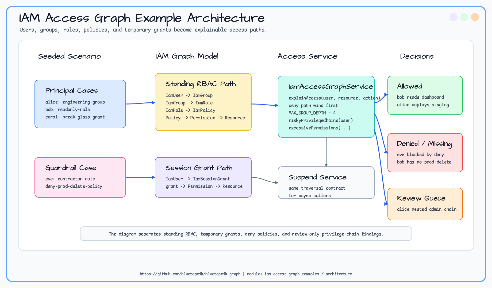

# iam-access-graph-examples

> 🇰🇷 [한국어 문서](README.ko.md)

This example models IAM access analysis as a graph of users, groups, roles, policies, permissions, resources, and
temporary grants. It demonstrates how to explain why a user can access a resource, where access is absent or explicitly
denied, and which inherited privilege chains need review.

## Scenario

An engineering user inherits staging deploy access through a group, then inherits production administrator access through a
nested privileged group. An auditor receives a direct read-only role, an operations user receives a temporary break-glass
grant, and a contractor is blocked by a deny policy.

## Architecture



## Graph Model

| Element | Label | Key properties | Purpose |
|---|---|---|---|
| User | `IamUser` | `userId`, `displayName`, `department` | Human identity being evaluated. |
| Group | `IamGroup` | `groupId`, `name`, `riskTier` | Membership and nested privilege boundary. |
| Role | `IamRole` | `roleId`, `name`, `privilege` | Assignable permission bundle. |
| Policy | `IamPolicy` | `policyId`, `name`, `effect` | Allow or deny policy attached to a role. |
| Permission | `IamPermission` | `permissionId`, `action` | Action such as `read`, `deploy`, or `delete`. |
| Resource | `IamResource` | `resourceId`, `resourceType`, `classification` | Protected target. |
| Session grant | `IamSessionGrant` | `grantId`, `reason`, `expiresAt` | Temporary break-glass access. |

## Traversal Goals

| Question | API |
|---|---|
| Why can this user perform an action on a resource? | `explainAccess(userId, resourceId, action)` |
| Which nested groups grant admin access? | `riskyPrivilegeChains(userId)` |
| Which grants exceed the approved least-privilege set? | `excessivePermissions(userId, approvedActionsByResource)` |

## Walkthrough

```kotlin
val ops = TinkerGraphOperations()
val service = IamAccessGraphService(ops)
service.initialize()
IamAccessSampleGraph.seed(service)

val deploy = service.explainAccess("alice", "staging-service", "deploy")
check(deploy.allowed)
println(deploy.path)

val risky = service.riskyPrivilegeChains("alice")
val denied = service.explainAccess("eve", "prod-db", "delete")
```

## Expected Output

| Query | Expected result |
|---|---|
| `explainAccess("bob", "audit-dashboard", "read")` | Direct role path through `readonly-role`. |
| `explainAccess("alice", "staging-service", "deploy")` | Group-inherited path through `engineering` and `deployer-role`. |
| `explainAccess("eve", "prod-db", "delete")` | Denied by `deny-prod-delete-policy`. |
| `explainAccess("bob", "prod-db", "delete")` | No matching grant path. |
| `riskyPrivilegeChains("alice")` | Nested `engineering -> platform-admins -> prod-admin-role` chain. |
| `explainAccess("carol", "prod-db", "read")` | Temporary `break-glass-1001` path. |

## Running Tests

```bash
./gradlew :iam-access-graph-examples:test
./gradlew :iam-access-graph-examples:test --tests "*TinkerGraph*"
```

TinkerGraph tests run in memory. Neo4j, Memgraph, Apache AGE, and FalkorDB tests require Docker/Testcontainers.
