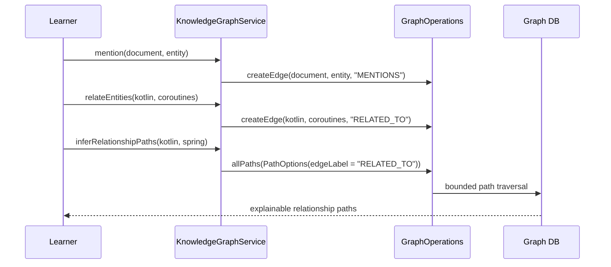

# knowledge-graph-examples

> 🇺🇸 [English](README.md)

문서, 엔티티, 개념을 지식 그래프로 모델링하고 엔티티 사이의 제한된 관계 경로를 추론하는 방법을 배우는 예제입니다.

## 무엇을 배우나?

| 주제 | 의미 |
|---|---|
| 지식 그래프 모델링 | 문서, 엔티티, 개념을 연결된 사실로 표현합니다. |
| mention 조회 | 문서가 언급하는 엔티티를 `MENTIONS` edge로 찾습니다. |
| 관련 엔티티 탐색 | 도메인 관계를 중첩 레코드가 아니라 path로 표현합니다. |
| 개념 분류 | `IS_A` 링크로 구체 엔티티를 정규화된 개념에 연결합니다. |
| 제한된 경로 추론 | `allPaths`로 안전한 깊이와 결과 수 안에서 관계 설명을 얻습니다. |

## 왜 Graph DB가 좋은가?

지식 그래프의 가치는 사실 사이의 연결에 있습니다. 문서 저장소는 문서 본문을 저장할 수 있고, 관계형 DB는 엔티티 테이블을
저장할 수 있습니다. 하지만 "Kotlin이 어떤 중간 개념을 통해 Spring과 연결되는가?"는 자연스럽게 path 질문입니다.

Graph DB를 사용하면 다음을 직접 표현할 수 있습니다.

- 문서, 엔티티, 개념은 vertex,
- mention, 분류, 관계는 typed edge,
- 발견 과정은 traversal과 path inference,
- 같은 모델을 검색 보강, 설명, 추천에 재사용할 수 있습니다.

이 예제는 작은 그래프를 사용해 관계 경로가 왜 생기는지 학습자가 직접 확인할 수 있게 구성되어 있습니다.

## 아키텍처



## 도메인 UML



## 경로 추론 흐름



## 주요 기능

| 기능 | Graph API |
|---|---|
| mention 조회 | `MENTIONS` 간선의 `neighbors` 탐색 |
| 관련 엔티티 탐색 | `RELATED_TO` 간선의 `neighbors` 탐색 |
| 관계 경로 추론 | service-side `maxPaths`가 적용된 `allPaths(PathOptions)` |
| 코루틴 지원 | `KnowledgeGraphSuspendService`와 `Flow` 결과 |

## 사용 예

```kotlin
val service = KnowledgeGraphService(ops)
service.initialize()

val doc = service.addDocument("doc-1", "Graph API Guide", "docs")
val kotlin = service.addEntity("entity-kotlin", "Kotlin", "Language")
val coroutines = service.addEntity("entity-coroutines", "Coroutines", "Library")

service.mention(doc.id, kotlin.id, confidence = 95)
service.relateEntities(kotlin.id, coroutines.id, relationType = "has-feature")

val mentioned = service.findMentionedEntities(doc.id)
val paths = service.inferRelationshipPaths(kotlin.id, coroutines.id)
```

## 샘플 데이터셋 Import

`KnowledgeGraphSampleDatasetLoader`는 번들된 graph-io CSV fixture를 임의의 `GraphOperations` 구현체로 import합니다.
fixture에는 바로 조회할 수 있는 문서, 엔티티, 개념, mention, 관련 엔티티 edge, 분류 edge가 포함되어 있습니다.

```kotlin
val service = KnowledgeGraphService(ops)
service.initialize()

val report = KnowledgeGraphSampleDatasetLoader.importCsv(ops)
val document = ops.findVerticesByLabel("Document", mapOf("documentId" to "doc-graph")).single()

check(report.status == GraphIoStatus.COMPLETED)
val mentioned = service.findMentionedEntities(document.id)
```

TinkerGraph smoke test는 컨테이너 비용 없이 graph-io import 계약을 검증합니다. 기존 backend 도메인 테스트는 Neo4j,
Memgraph, Apache AGE, FalkorDB에서 traversal 동작을 계속 검증합니다.

## 테스트 읽는 법

Abstract test는 작은 지식 그래프를 만들고, mention 조회, 관련 엔티티 탐색, 개념 분류, 제한된 관계 경로 추론을 한 흐름으로
보여줍니다.

| 테스트 종류 | 목적 |
|---|---|
| Abstract tests | 지식 그래프 동작을 한 번만 설명합니다. |
| TinkerGraph tests | 빠른 메모리 기반 smoke test입니다. |
| Neo4j/Memgraph/AGE/FalkorDB tests | 실제 backend에서도 같은 path/lookup 동작이 유지되는지 검증합니다. |

## 테스트 실행

```bash
./gradlew :knowledge-graph-examples:test
./gradlew :knowledge-graph-examples:test --tests "*TinkerGraph*"
```

TinkerGraph 테스트는 메모리에서 실행됩니다. Neo4j, Memgraph, Apache AGE, FalkorDB 테스트는 Docker/Testcontainers가 필요합니다.

## 의존성

```kotlin
implementation(project(":bluetape4k-graph-core"))
implementation(project(":bluetape4k-graph-neo4j"))
implementation(project(":bluetape4k-graph-memgraph"))
implementation(project(":bluetape4k-graph-age"))
implementation(project(":bluetape4k-graph-falkordb"))
implementation(project(":bluetape4k-graph-tinkerpop"))
implementation(project(":bluetape4k-graph-io-csv"))
```
