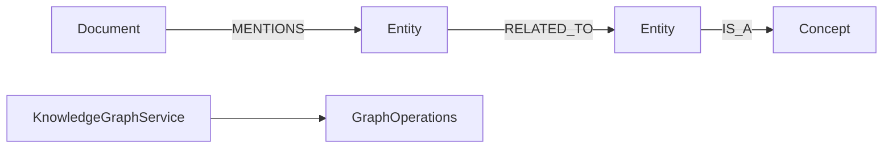

# knowledge-graph-examples

> 🇺🇸 [English](README.md)

문서 mention, 엔티티 관계, 개념 분류, 제한된 관계 경로 추론을 보여주는 지식 그래프 예제입니다.

## 아키텍처



## 주요 기능

| 기능 | Graph API |
|---|---|
| mention 조회 | `MENTIONS` 간선의 `neighbors` 탐색 |
| 관련 엔티티 탐색 | `RELATED_TO` 간선의 `neighbors` 탐색 |
| 관계 경로 추론 | service-side `maxPaths`가 적용된 `allPaths(PathOptions)` |
| 코루틴 지원 | `KnowledgeGraphSuspendService`와 `Flow` 결과 |

## 사용 예

```kotlin
val service = KnowledgeGraphService(ops)
service.initialize()

val doc = service.addDocument("doc-1", "Graph API Guide", "docs")
val kotlin = service.addEntity("entity-kotlin", "Kotlin", "Language")
val coroutines = service.addEntity("entity-coroutines", "Coroutines", "Library")

service.mention(doc.id, kotlin.id, confidence = 95)
service.relateEntities(kotlin.id, coroutines.id, relationType = "has-feature")

val mentioned = service.findMentionedEntities(doc.id)
val paths = service.inferRelationshipPaths(kotlin.id, coroutines.id)
```

## 테스트 실행

```bash
./gradlew :knowledge-graph-examples:test
./gradlew :knowledge-graph-examples:test --tests "*TinkerGraph*"
```

TinkerGraph 테스트는 메모리에서 실행됩니다. Neo4j, Memgraph, Apache AGE, FalkorDB 테스트는 Docker/Testcontainers가 필요합니다.

## 의존성

```kotlin
implementation(project(":graph-core"))
implementation(project(":graph-neo4j"))
implementation(project(":graph-memgraph"))
implementation(project(":graph-age"))
implementation(project(":graph-falkordb"))
implementation(project(":graph-tinkerpop"))
```
