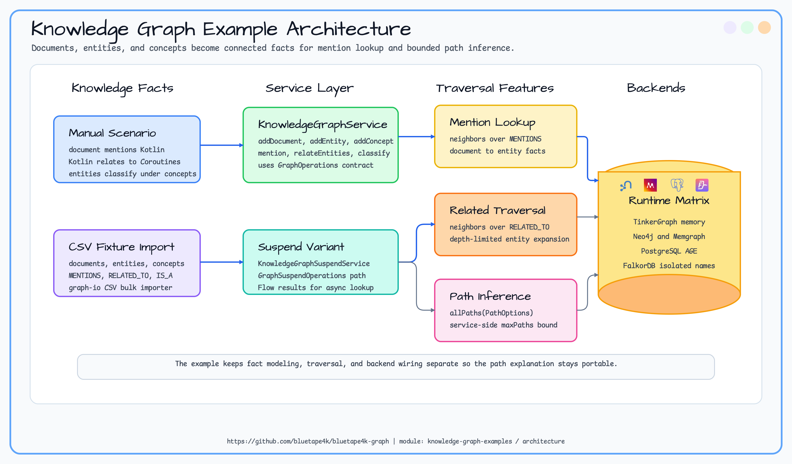
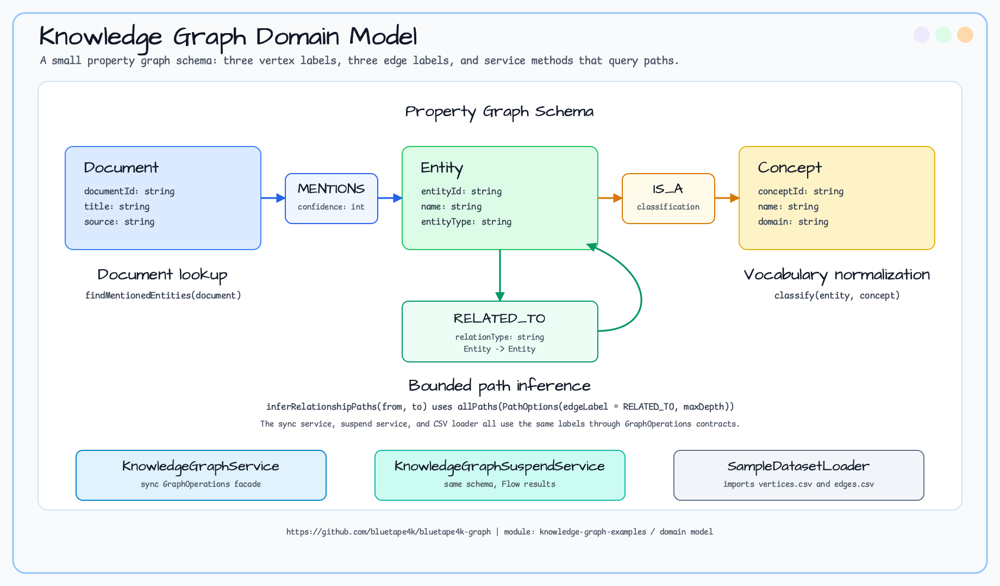
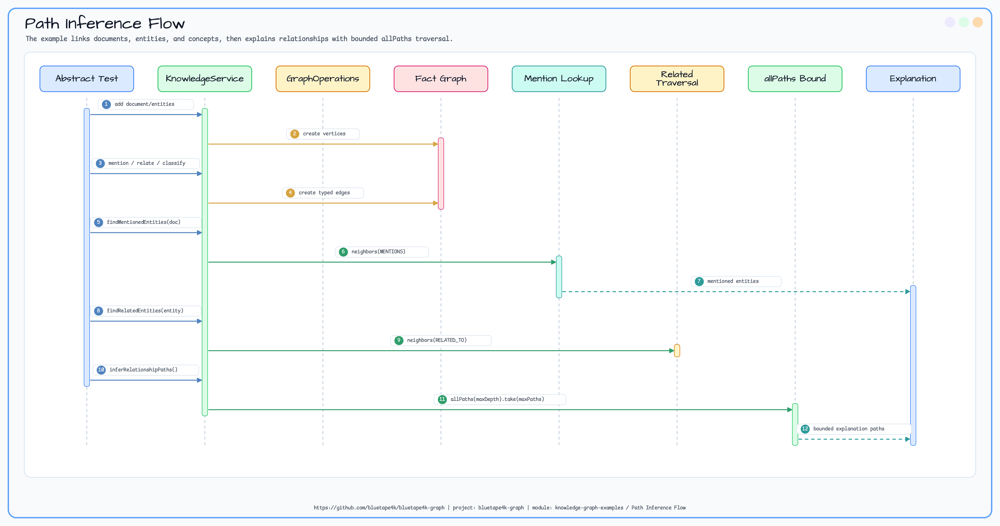

# knowledge-graph-examples

> 🇰🇷 [한국어 문서](README.ko.md)

This example teaches how to model documents, entities, and concepts as a knowledge graph and infer bounded relationship
paths between entities.

## Scenario

A document mentions Kotlin and Spring-related entities. The example links documents to entities, classifies entities
under concepts, and infers bounded paths that explain how two entities are connected through intermediate facts.

## What You Learn

| Topic | Why it matters |
|---|---|
| Knowledge graph modeling | Documents, entities, and concepts become connected facts. |
| Mention lookup | A document can reveal the entities it discusses through `MENTIONS` edges. |
| Related entity traversal | Domain relationships are represented as paths, not nested records. |
| Concept classification | `IS_A` links connect concrete entities to normalized concepts. |
| Bounded path inference | `allPaths` explains how two entities are connected within a safe depth and result limit. |

## Why Use a Graph Database?

Knowledge graphs are useful when the value is in the connection between facts. A document store can keep document text,
and a relational database can store entity tables, but "how is Kotlin connected to Spring through intermediate concepts?"
is naturally a path question.

With a graph database:

- documents, entities, and concepts are first-class vertices,
- mentions, classifications, and relationships are typed edges,
- discovery is expressed through traversal and path inference,
- the same model supports search enrichment, explanation, and recommendation.

This example focuses on small, explainable graphs so learners can see why the path exists.

## Architecture Diagram



## Domain Model Diagram



## Data Flow



## Core Features

| Feature | Graph API |
|---|---|
| Mention lookup | `neighbors` over `MENTIONS` |
| Related entity traversal | `neighbors` over `RELATED_TO` |
| Relationship path inference | `allPaths(PathOptions)` with service-side `maxPaths` |
| Coroutine support | `KnowledgeGraphSuspendService` with `Flow` results |

## Usage

```kotlin
val service = KnowledgeGraphService(ops)
service.initialize()

val doc = service.addDocument("doc-1", "Graph API Guide", "docs")
val kotlin = service.addEntity("entity-kotlin", "Kotlin", "Language")
val coroutines = service.addEntity("entity-coroutines", "Coroutines", "Library")

service.mention(doc.id, kotlin.id, confidence = 95)
service.relateEntities(kotlin.id, coroutines.id, relationType = "has-feature")

val mentioned = service.findMentionedEntities(doc.id)
val paths = service.inferRelationshipPaths(kotlin.id, coroutines.id)
```

## Sample Dataset Import

`KnowledgeGraphSampleDatasetLoader` imports the bundled graph-io CSV fixture into any `GraphOperations`
implementation. The fixture contains documents, entities, concepts, mentions, related-entity edges, and classifications
that can be queried immediately.

```kotlin
val service = KnowledgeGraphService(ops)
service.initialize()

val report = KnowledgeGraphSampleDatasetLoader.importCsv(ops)
val document = ops.findVerticesByLabel("Document", mapOf("documentId" to "doc-graph")).single()

check(report.status == GraphIoStatus.COMPLETED)
val mentioned = service.findMentionedEntities(document.id)
```

The TinkerGraph smoke test covers the graph-io import contract without adding container cost. Existing backend domain
tests continue to prove traversal behavior on Neo4j, Memgraph, Apache AGE, and FalkorDB.

## How to Read the Tests

The abstract tests show the complete story: load a small knowledge graph, query mentioned entities, traverse related
entities, classify an entity under a concept, and infer relationship paths with a fixed bound.

| Test class type | Purpose |
|---|---|
| Abstract tests | Explain knowledge graph behavior once. |
| TinkerGraph tests | Fast in-memory smoke path. |
| Neo4j/Memgraph/AGE/FalkorDB tests | Prove the same path and lookup behavior on real backends. |

## Running Tests

```bash
./gradlew :knowledge-graph-examples:test
./gradlew :knowledge-graph-examples:test --tests "*TinkerGraph*"
```

TinkerGraph tests run in memory. Neo4j, Memgraph, Apache AGE, and FalkorDB tests require Docker/Testcontainers.

## Expected Output

| Scenario | Expected result |
|---|---|
| Mention lookup | A document returns the entities it mentions. |
| Related entity traversal | `RELATED_TO` traversal finds neighboring facts. |
| Concept classification | An entity can be connected to a normalized concept. |
| Path inference | Bounded `allPaths` explains how two entities are connected. |

## Dependencies

```kotlin
implementation(project(":bluetape4k-graph-core"))
implementation(project(":bluetape4k-graph-neo4j"))
implementation(project(":bluetape4k-graph-memgraph"))
implementation(project(":bluetape4k-graph-age"))
implementation(project(":bluetape4k-graph-falkordb"))
implementation(project(":bluetape4k-graph-tinkerpop"))
implementation(project(":bluetape4k-graph-io-csv"))
```
