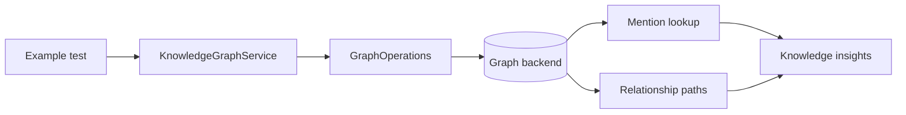
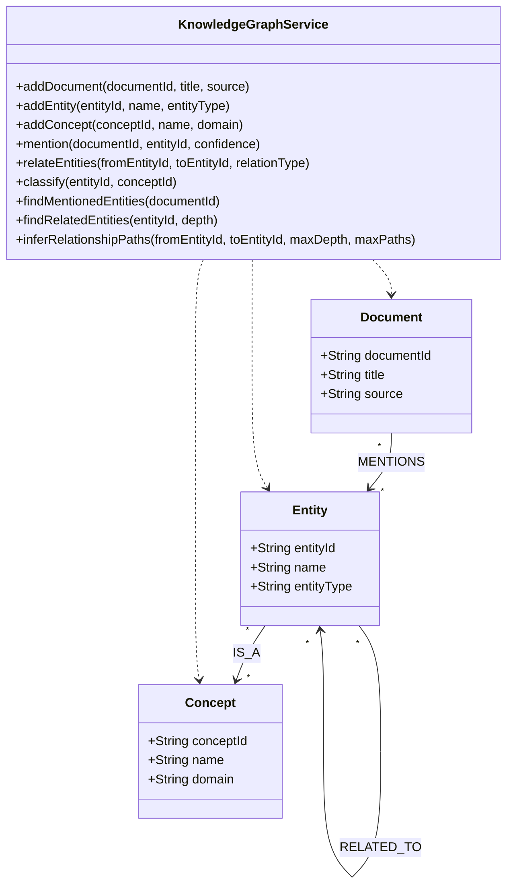
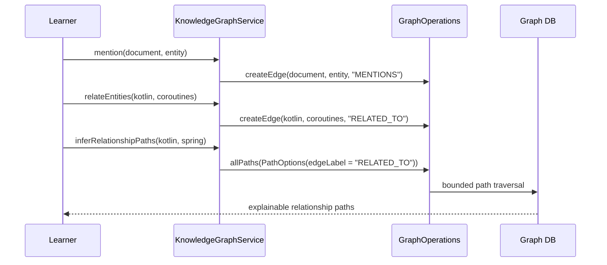

# knowledge-graph-examples

> 🇰🇷 [한국어 문서](README.ko.md)

This example teaches how to model documents, entities, and concepts as a knowledge graph and infer bounded relationship
paths between entities.

## What You Learn

| Topic | Why it matters |
|---|---|
| Knowledge graph modeling | Documents, entities, and concepts become connected facts. |
| Mention lookup | A document can reveal the entities it discusses through `MENTIONS` edges. |
| Related entity traversal | Domain relationships are represented as paths, not nested records. |
| Concept classification | `IS_A` links connect concrete entities to normalized concepts. |
| Bounded path inference | `allPaths` explains how two entities are connected within a safe depth and result limit. |

## Why Use a Graph Database?

Knowledge graphs are useful when the value is in the connection between facts. A document store can keep document text,
and a relational database can store entity tables, but "how is Kotlin connected to Spring through intermediate concepts?"
is naturally a path question.

With a graph database:

- documents, entities, and concepts are first-class vertices,
- mentions, classifications, and relationships are typed edges,
- discovery is expressed through traversal and path inference,
- the same model supports search enrichment, explanation, and recommendation.

This example focuses on small, explainable graphs so learners can see why the path exists.

## Architecture



## Domain UML



## Path Inference Flow



## Core Features

| Feature | Graph API |
|---|---|
| Mention lookup | `neighbors` over `MENTIONS` |
| Related entity traversal | `neighbors` over `RELATED_TO` |
| Relationship path inference | `allPaths(PathOptions)` with service-side `maxPaths` |
| Coroutine support | `KnowledgeGraphSuspendService` with `Flow` results |

## Usage

```kotlin
val service = KnowledgeGraphService(ops)
service.initialize()

val doc = service.addDocument("doc-1", "Graph API Guide", "docs")
val kotlin = service.addEntity("entity-kotlin", "Kotlin", "Language")
val coroutines = service.addEntity("entity-coroutines", "Coroutines", "Library")

service.mention(doc.id, kotlin.id, confidence = 95)
service.relateEntities(kotlin.id, coroutines.id, relationType = "has-feature")

val mentioned = service.findMentionedEntities(doc.id)
val paths = service.inferRelationshipPaths(kotlin.id, coroutines.id)
```

## How to Read the Tests

The abstract tests show the complete story: load a small knowledge graph, query mentioned entities, traverse related
entities, classify an entity under a concept, and infer relationship paths with a fixed bound.

| Test class type | Purpose |
|---|---|
| Abstract tests | Explain knowledge graph behavior once. |
| TinkerGraph tests | Fast in-memory smoke path. |
| Neo4j/Memgraph/AGE/FalkorDB tests | Prove the same path and lookup behavior on real backends. |

## Running Tests

```bash
./gradlew :knowledge-graph-examples:test
./gradlew :knowledge-graph-examples:test --tests "*TinkerGraph*"
```

TinkerGraph tests run in memory. Neo4j, Memgraph, Apache AGE, and FalkorDB tests require Docker/Testcontainers.

## Dependencies

```kotlin
implementation(project(":graph-core"))
implementation(project(":graph-neo4j"))
implementation(project(":graph-memgraph"))
implementation(project(":graph-age"))
implementation(project(":graph-falkordb"))
implementation(project(":graph-tinkerpop"))
```
