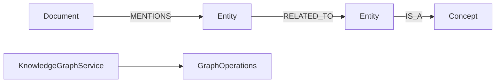

# knowledge-graph-examples

> 🇰🇷 [한국어 문서](README.ko.md)

Knowledge graph example showing document mentions, entity relationships, concept classification, and bounded relationship path inference.

## Architecture



## Core Features

| Feature | Graph API |
|---|---|
| Mention lookup | `neighbors` over `MENTIONS` |
| Related entity traversal | `neighbors` over `RELATED_TO` |
| Relationship path inference | `allPaths(PathOptions)` with service-side `maxPaths` |
| Coroutine support | `KnowledgeGraphSuspendService` with `Flow` results |

## Usage

```kotlin
val service = KnowledgeGraphService(ops)
service.initialize()

val doc = service.addDocument("doc-1", "Graph API Guide", "docs")
val kotlin = service.addEntity("entity-kotlin", "Kotlin", "Language")
val coroutines = service.addEntity("entity-coroutines", "Coroutines", "Library")

service.mention(doc.id, kotlin.id, confidence = 95)
service.relateEntities(kotlin.id, coroutines.id, relationType = "has-feature")

val mentioned = service.findMentionedEntities(doc.id)
val paths = service.inferRelationshipPaths(kotlin.id, coroutines.id)
```

## Running Tests

```bash
./gradlew :knowledge-graph-examples:test
./gradlew :knowledge-graph-examples:test --tests "*TinkerGraph*"
```

TinkerGraph tests run in memory. Neo4j, Memgraph, Apache AGE, and FalkorDB tests require Docker/Testcontainers.

## Dependencies

```kotlin
implementation(project(":graph-core"))
implementation(project(":graph-neo4j"))
implementation(project(":graph-memgraph"))
implementation(project(":graph-age"))
implementation(project(":graph-falkordb"))
implementation(project(":graph-tinkerpop"))
```
