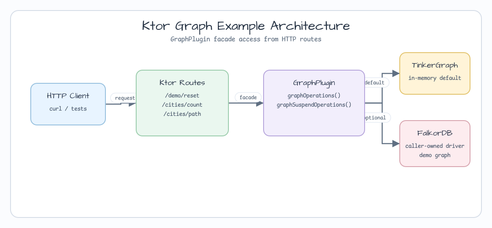
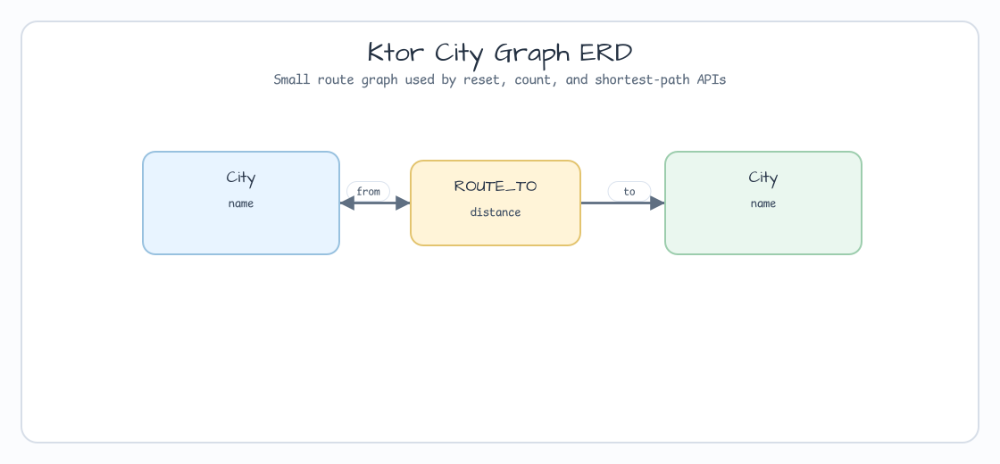
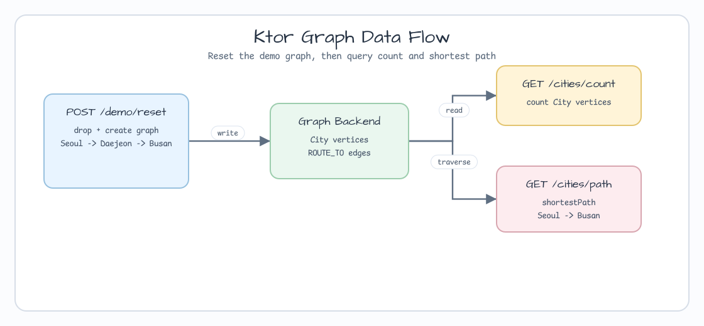

# ktor-graph-examples

> 🇰🇷 [한국어 문서](README.ko.md)

Runnable Ktor example for `graph-ktor`. It uses TinkerGraph so the application can run without Docker or an external graph database.

## Scenario

The application installs `GraphPlugin`, exposes a small city graph over HTTP, and uses route handlers to access
`GraphOperations` and `GraphSuspendOperations`. `POST /demo/reset` recreates `Seoul -> Daejeon -> Busan`, while
`GET /cities/count` and `GET /cities/path` read the graph back through the plugin facade. A separate FalkorDB module
shows the same route surface with a caller-owned driver.

## Architecture Diagram



## ERD



## Data Flow



## Routes

| Route | Method | Description |
|---|---|---|
| `/health` | GET | Returns `UP`. |
| `/demo/reset` | POST | Recreates the demo city graph. |
| `/cities/count` | GET | Returns the number of `City` vertices. |
| `/cities/path` | GET | Returns the shortest path from Seoul to Busan. |

## Run

```bash
./gradlew :ktor-graph-examples:run
```

```bash
curl -X POST http://localhost:8080/demo/reset
curl http://localhost:8080/cities/count
curl http://localhost:8080/cities/path
```

## Expected Output

| Request | Expected response |
|---|---|
| `GET /health` | `UP` |
| `POST /demo/reset` | `reset` |
| `GET /cities/count` | `3` |
| `GET /cities/path` | `Seoul -> Daejeon -> Busan` |

## Test

```bash
./gradlew :ktor-graph-examples:test
```
