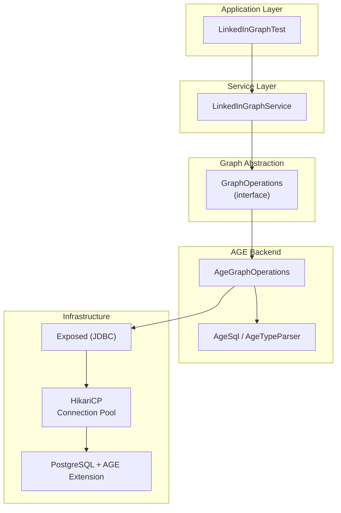
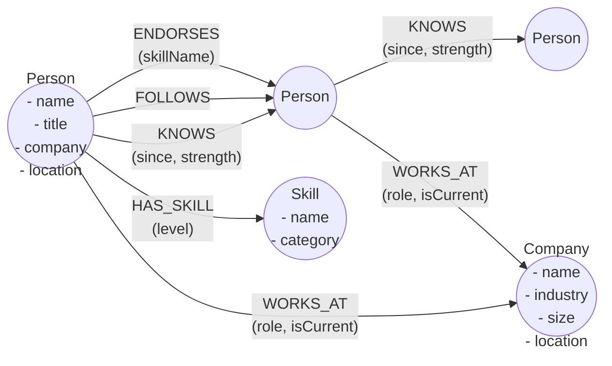
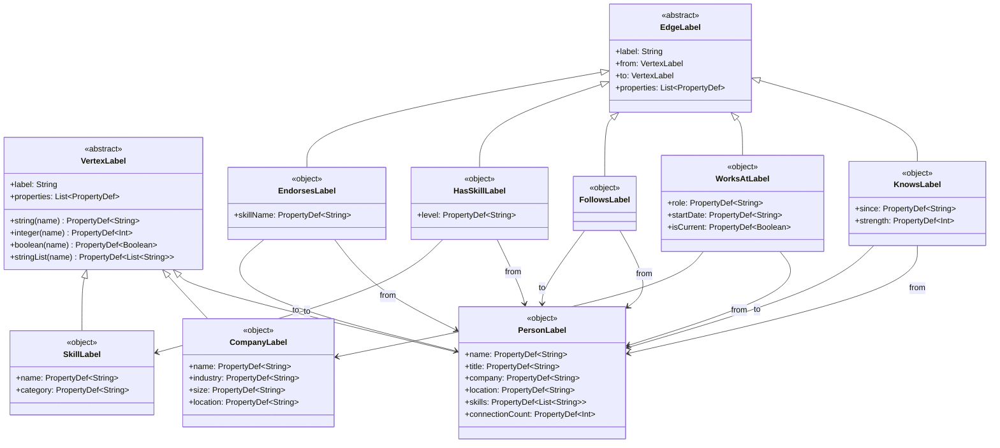
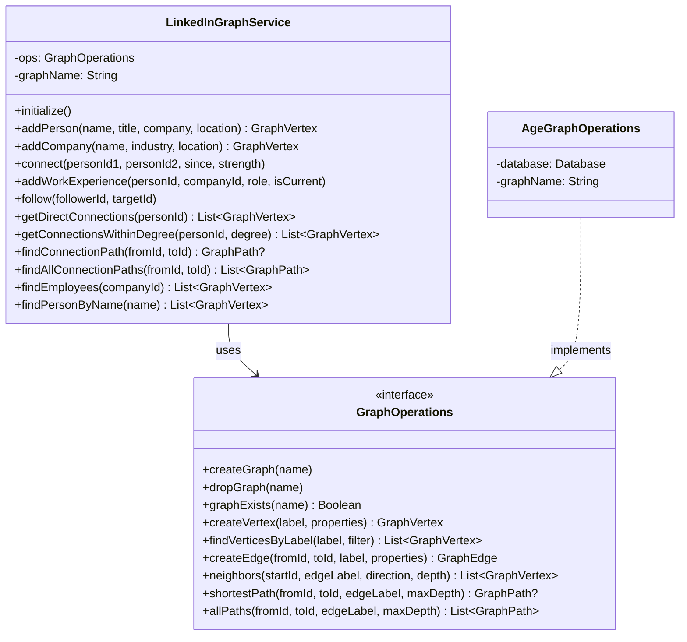
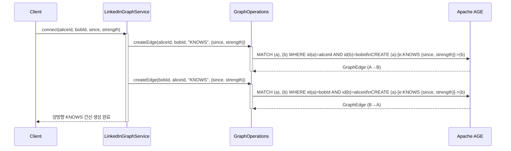
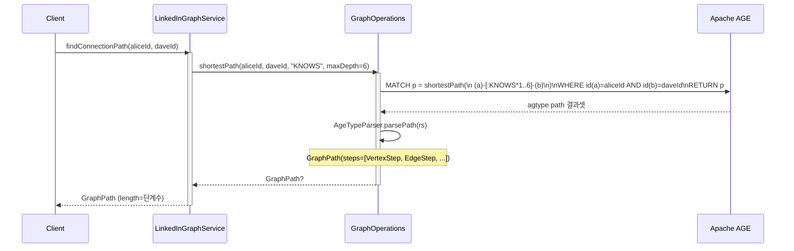
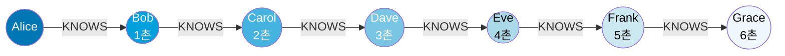
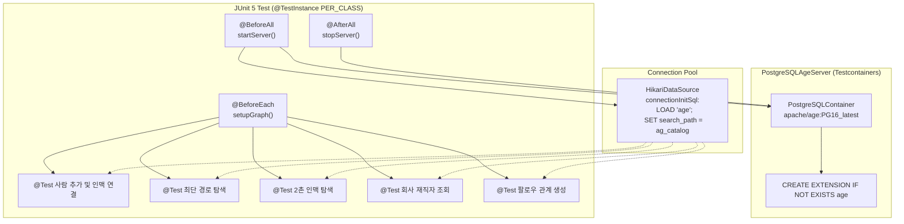

# linkedin-graph-age

LinkedIn 스타일 인맥 관리 시스템을 Apache AGE + graph-age 라이브러리로 구현한 예제 모듈입니다.

소셜 네트워크의 핵심 기능(인맥 연결, 최단 경로 탐색, N촌 인맥, 재직 정보)을 그래프 데이터베이스로 구현합니다.

---

## 아키텍처



---

## 소셜 네트워크 데이터 모델



---

## 스키마 클래스 다이어그램



---

## LinkedInGraphService 클래스 다이어그램



---

## 인맥 연결 시퀀스 다이어그램



---

## 최단 경로 탐색 시퀀스 다이어그램



---

## 6단계 분리 이론 (Six Degrees of Separation)



> 세상의 모든 사람은 최대 6단계의 인맥으로 연결되어 있다는 이론입니다.
> `findConnectionPath()`는 AGE의 `shortestPath()` Cypher 함수로 이를 구현합니다.

---

## 테스트 환경 구성



---

## 모듈 의존성

```
:linkedin-graph-age
├── implementation :graph-core       ← GraphOperations, GraphVertex, GraphPath 등 추상화
├── implementation :graph-age        ← AgeGraphOperations (AGE 백엔드 구현체)
├── implementation kotlinx-coroutines-core
├── testImplementation bluetape4k-junit5       ← runSuspendIO
├── testImplementation bluetape4k-testcontainers
├── testImplementation testcontainers-postgresql
├── testImplementation hikaricp
└── testImplementation kotlinx-coroutines-test
```

---

## 주요 기능

| 기능 | 메서드 | Cypher 패턴 |
|------|--------|-------------|
| 인맥 연결 (양방향) | `connect()` | `CREATE (a)-[:KNOWS]->(b)` × 2 |
| 1촌 인맥 조회 | `getDirectConnections()` | `MATCH (a)-[:KNOWS]->(n)` |
| N촌 인맥 조회 | `getConnectionsWithinDegree()` | `MATCH (a)-[:KNOWS*1..N]->(n)` |
| 최단 인맥 경로 | `findConnectionPath()` | `shortestPath((a)-[:KNOWS*1..6]-(b))` |
| 모든 연결 경로 | `findAllConnectionPaths()` | `MATCH p=(a)-[:KNOWS*1..3]-(b)` |
| 재직자 조회 | `findEmployees()` | `MATCH (p)-[:WORKS_AT]->(c)` |
| 팔로우 | `follow()` | `CREATE (a)-[:FOLLOWS]->(b)` |
| 이름으로 검색 | `findPersonByName()` | `MATCH (v:Person {name: $name})` |

---

## 실행 방법

```bash
# 테스트 실행 (Testcontainers가 자동으로 PostgreSQL+AGE 컨테이너 시작)
./gradlew :linkedin-graph-age:test

# 특정 테스트만 실행
./gradlew :linkedin-graph-age:test --tests "io.bluetape4k.graph.examples.linkedin.LinkedInGraphTest"
```

> Docker가 실행 중이어야 합니다. Testcontainers가 `apache/age:PG16_latest` 이미지를 자동으로 pull합니다.
