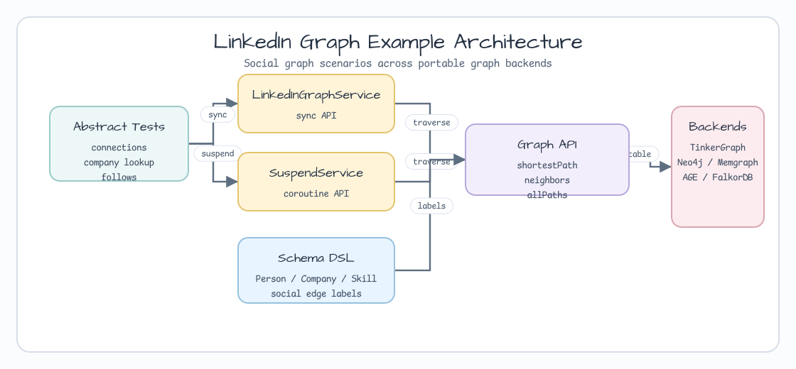
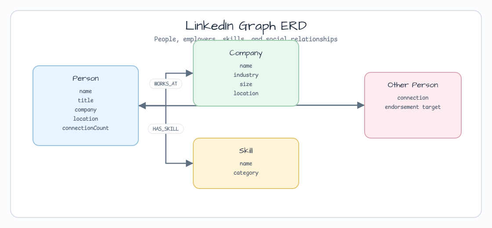
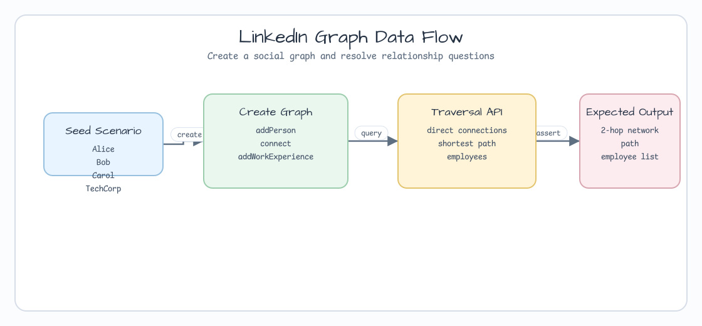

# linkedin-graph-examples

bluetape4k-graph의 백엔드 독립 API를 사용해 사람, 회사, 스킬 및 그 관계를 프로퍼티 그래프로 모델링하는 방법을 보여주는 LinkedIn 스타일 소셜 그래프 예시 모듈.

> 🇺🇸 [English](README.md)

## 개요

이 예시는 LinkedIn과 유사한 소셜 네트워크를 프로퍼티 그래프로 모델링하고, 추상 테스트 클래스 패턴을 통해 동일한 코드가 Neo4j, Memgraph, Apache AGE, TinkerGraph 백엔드에서 동일하게 동작하는지를 검증한다.

- **공통 로직**: `LinkedInGraphService` / `LinkedInGraphSuspendService`가 그래프 연산을 담고 있음
- **추상 테스트**: `AbstractLinkedInGraphTest` / `AbstractLinkedInGraphSuspendTest`가 공유 테스트 시나리오를 캡슐화
- **구체 테스트**: 각 백엔드(Neo4j, Memgraph, AGE, TinkerGraph)는 `GraphOperations` 팩토리만 제공

## 예제 시나리오

샘플 네트워크에는 Alice, Bob, Carol, Dave 같은 사람과 TechCorp 같은 회사가 있다. 그래프는 양방향 `KNOWS` edge,
단방향 `FOLLOWS` edge, `WORKS_AT` employment edge를 만든다. 이 예제는 direct connection, 2촌 connection,
shortest path, follower lookup, employee lookup 질문을 해결한다.

## Architecture Diagram



## ERD



## Data Flow



## 도메인 모델

### 정점 라벨

| 라벨 | 설명 | 주요 속성 |
|------|------|-----------|
| `Person` | 사용자 프로필 | `name`, `title`, `company`, `location`, `skills`, `connectionCount` |
| `Company` | 회사 | `name`, `industry`, `size`, `location` |
| `Skill` | 전문 스킬 | `name`, `category` |

### 간선 라벨

| 라벨 | From → To | 설명 |
|------|-----------|------|
| `KNOWS` | `Person → Person` | 상호 연결 (`since`, `strength`) |
| `WORKS_AT` | `Person → Company` | 재직 (`role`, `startDate`, `isCurrent`) |
| `FOLLOWS` | `Person → Person` | 팔로우 관계 (비상호) |
| `HAS_SKILL` | `Person → Skill` | 스킬 보유 (`level`: beginner / intermediate / expert) |
| `ENDORSES` | `Person → Person` | 스킬 추천 (`skillName`) |

## 추상 테스트 클래스 패턴

공통 테스트 시나리오는 `AbstractLinkedInGraphTest`에, 각 구체 클래스는 백엔드 연결만 담당한다.

```kotlin
// 추상 클래스 (공통 로직)
abstract class AbstractLinkedInGraphTest {
    abstract val ops: GraphOperations
    // ... 공유 테스트 케이스 ...
}

// Neo4j 구현
class Neo4jLinkedInGraphTest : AbstractLinkedInGraphTest() {
    private val driver = GraphDatabase.driver(Neo4jServer.Launcher.neo4j.boltUrl, AuthTokens.none())
    override val ops = Neo4jGraphOperations(driver)

    @AfterAll fun teardown() { driver.close() }
}
```

| 추상 클래스 | 구체 클래스 |
|------------|------------|
| `AbstractLinkedInGraphTest` | `Neo4jLinkedInGraphTest`, `MemgraphLinkedInGraphTest`, `AgeLinkedInGraphTest`, `TinkerGraphLinkedInGraphTest` |
| `AbstractLinkedInGraphSuspendTest` | `Neo4jLinkedInGraphSuspendTest`, `MemgraphLinkedInGraphSuspendTest`, `AgeLinkedInGraphSuspendTest`, `TinkerGraphLinkedInGraphSuspendTest` |

## 샘플 쿼리

- **친구의 친구**: 특정 인물로부터 2-홉 `KNOWS` 탐색
- **최단 연결 경로**: `KNOWS` 간선 기반 `shortestPath`
- **스킬 추천**: 현재 사용자와 스킬을 공유하는 사람 찾기
- **추천 집계**: 인물/스킬별 수신 `ENDORSES` 간선 수 집계

## 테스트 실행

```bash
# 전체 테스트
./gradlew :linkedin-graph-examples:test

# 특정 백엔드
./gradlew :linkedin-graph-examples:test --tests "io.bluetape4k.graph.examples.linkedin.Neo4jLinkedInGraphTest"
./gradlew :linkedin-graph-examples:test --tests "io.bluetape4k.graph.examples.linkedin.AgeLinkedInGraphSuspendTest"
```

통합 테스트에는 Docker가 필요하다(Neo4j, Memgraph, Apache AGE). TinkerGraph는 인메모리로 실행된다.

## Expected Output

| 시나리오 | 예상 결과 |
|---|---|
| Direct connections | 양방향 `KNOWS` edge 생성 후 Alice가 Bob을 반환한다. |
| Six-degree path | Alice가 Bob, Carol을 거쳐 Dave에 도달한다. |
| Second-degree network | Alice가 Bob을 거쳐 Carol에 도달한다. |
| Company lookup | TechCorp가 현재 재직자를 반환한다. |
| Followers | incoming `FOLLOWS` traversal로 profile follower를 찾는다. |

## 모듈 참고 사항

- 예시 모듈은 Maven Central에 배포 **대상이 아니다**
- 스키마 DSL과 서비스 계층은 `src/main`에, 테스트는 `src/test`에 위치
- bluetape4k-graph 기반 소셜 그래프 애플리케이션을 구축할 때 참고 자료로 활용할 것
