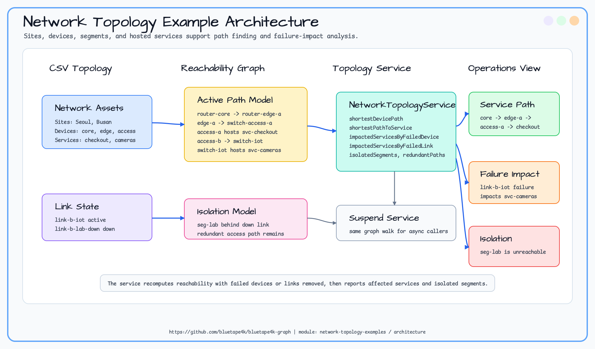

# network-topology-examples

> 🇺🇸 [English](README.md)

Site, device, routed segment, reachable service를 작은 network topology graph로 모델링하는 예제입니다. 네트워크
시뮬레이터를 만들지 않고 path finding과 failure-impact analysis에 필요한 backend-independent traversal을 보여줍니다.

## 예제 시나리오

샘플 그래프는 core router, 두 edge router, 이중화된 access switch, IoT segment, isolated lab segment를 연결합니다.
서비스까지 도달하는 path, device/link 장애 후 새로 unreachable이 되는 service, core에서 고립된 segment, redundant
route candidate를 확인합니다.

## 아키텍처



## Graph Model

| 요소 | Label | 주요 속성 | 목적 |
|---|---|---|---|
| Site | `Site` | `siteId`, `region`, `status` | facility 또는 region별 device 그룹입니다. |
| Device | `Device` | `deviceId`, `role`, `status` | router, switch, service attachment point입니다. |
| Segment | `Segment` | `segmentId`, `cidr`, `status` | routed/switched network zone입니다. |
| Service | `Service` | `serviceId`, `tier`, `status` | host device를 통해 도달 가능한 business service입니다. |

## Traversal Goals

| 질문 | API |
|---|---|
| 두 device 사이의 최단 active path는 무엇인가? | `shortestDevicePath(sourceDeviceId, targetDeviceId)` |
| core에서 service까지 어떤 path로 도달하는가? | `shortestPathToService(serviceId)` |
| device 장애로 새로 영향받는 service는 무엇인가? | `impactedServicesByFailedDevice(failedDeviceId)` |
| link 장애로 새로 영향받는 service는 무엇인가? | `impactedServicesByFailedLink(failedLinkId)` |
| core에서 고립된 segment는 무엇인가? | `isolatedSegments()` |
| 두 device를 잇는 redundant path 후보는 무엇인가? | `redundantDevicePaths(sourceDeviceId, targetDeviceId)` |

## Sample Dataset

모듈은 `src/main/resources/sample-data/network-topology/` 아래에 graph-io CSV fixture를 포함합니다.

| 파일 | 내용 |
|---|---|
| `vertices.csv` | site, router, switch, segment, service. |
| `edges.csv` | site membership, device link, segment membership, service hosting edge. |

```kotlin
val ops = TinkerGraphOperations()
val service = NetworkTopologyImpactService(ops)
service.initialize()

NetworkTopologySampleDatasetLoader.importCsv(ops)
val checkoutPath = service.shortestPathToService("svc-checkout")
val impacted = service.impactedServicesByFailedLink("link-b-iot")
```

## Expected Output

| Query | Expected IDs |
|---|---|
| `shortestDevicePath("router-core", "switch-access-a")` | `router-core`, `router-edge-a`, `switch-access-a` |
| `shortestPathToService("svc-checkout")` | `router-core`, `router-edge-a`, `switch-access-a`, `svc-checkout` |
| `impactedServicesByFailedLink("link-b-iot")` | `svc-cameras` |
| `isolatedSegments()` | `seg-lab` |
| `redundantDevicePaths("router-core", "switch-access-a")` | edge-A 직접 경로와 edge-B/access-B 우회 경로 |

## 테스트 실행

```bash
./gradlew :network-topology-examples:test
```

첫 slice는 TinkerGraph smoke coverage와 graph-io CSV loader test를 사용합니다.
