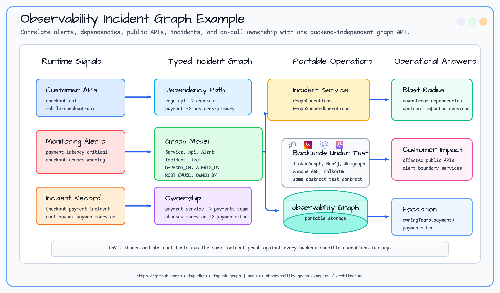
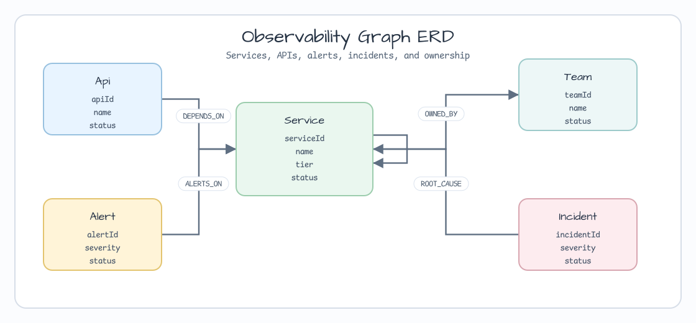
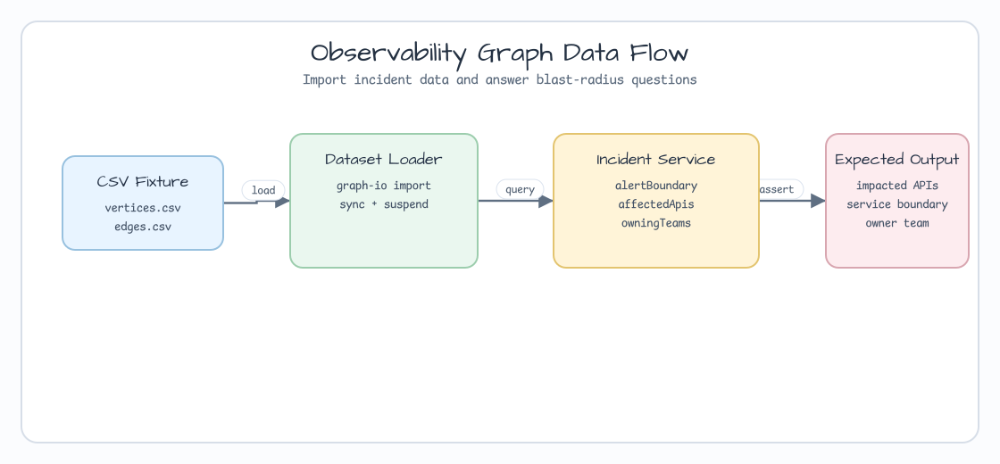

# observability-graph-examples

> 🇰🇷 [한국어 문서](README.ko.md)

This example models an incident-response graph for service dependencies, public APIs, alerts, incidents, and on-call
ownership. It shows how to use the backend-independent bluetape4k-graph API to answer operational questions such as
"what is downstream of this failing service?", "which public APIs are impacted?", and "who owns the incident boundary?".

## Scenario

A checkout outage starts with latency alerts on the payment service. The incident commander needs to correlate alerting
signals with the runtime dependency graph before paging more teams or notifying customer-facing API owners.

The sample graph contains:

- `checkout-service -> payment-service -> postgres-primary`,
- public `checkout-api` and `mobile-checkout-api` paths through `edge-api`,
- `payment-latency` and `checkout-errors` alerts,
- a `Checkout payment incident` root-cause edge to `payment-service`,
- `payments-team` ownership for the affected services.

## Architecture Diagram



## ERD



## Data Flow



## Graph Model

| Element | Label | Key properties | Purpose |
|---|---|---|---|
| Runtime service | `Service` | `serviceId`, `name`, `tier`, `status` | Dependency graph node for services and infrastructure. |
| Public API | `Api` | `apiId`, `name`, `tier`, `status` | Customer-facing entry point affected by service failures. |
| On-call team | `Team` | `teamId`, `name`, `status` | Ownership target for escalation. |
| Monitoring alert | `Alert` | `alertId`, `name`, `severity`, `status` | Signal correlated to a service boundary. |
| Incident | `Incident` | `incidentId`, `name`, `severity`, `status` | Incident-response record. |
| Dependency | `DEPENDS_ON` | `kind` | Directed caller-to-callee runtime dependency. |
| Ownership | `OWNED_BY` | `kind` | Service-to-team escalation path. |
| Alert correlation | `ALERTS_ON` | `kind` | Alert-to-service signal edge. |
| Root cause | `ROOT_CAUSE` | `kind` | Incident-to-service root-cause marker. |

## Traversal Goals

| Question | API |
|---|---|
| What is downstream of a failing service? | `downstreamDependencies(serviceId, maxDepth)` |
| Which services are upstream callers? | `upstreamImpactedServices(serviceId, maxDepth)` |
| Which public APIs are customer-visible blast radius? | `affectedApis(serviceId, maxDepth)` |
| Which services form the alert boundary? | `alertBoundary(alertIds, maxDepth)` |
| Which team owns the failing service? | `owningTeams(serviceId)` |

## Sample Dataset

The module bundles graph-io CSV fixtures under `src/main/resources/sample-data/observability/`.

| File | Contents |
|---|---|
| `vertices.csv` | 4 services, 2 public APIs, 1 team, 2 alerts, 1 incident. |
| `edges.csv` | dependency, ownership, alert correlation, and root-cause edges. |

`ObservabilitySampleDatasetLoader` imports this fixture into any `GraphOperations` or `GraphSuspendOperations`
implementation.

```kotlin
val ops = TinkerGraphOperations()
val service = ObservabilityIncidentService(ops)
service.initialize()

val report = ObservabilitySampleDatasetLoader.importCsv(ops)
check(report.status == GraphIoStatus.COMPLETED)

val affectedApis = service.affectedApis("payment-service")
val owners = service.owningTeams("payment-service")
```

## Expected Output

For the bundled incident dataset:

| Query | Expected IDs |
|---|---|
| `downstreamDependencies("checkout-service", maxDepth = 2)` | `payment-service`, `postgres-primary` |
| `upstreamImpactedServices("payment-service", maxDepth = 3)` | `checkout-service`, `edge-api` |
| `affectedApis("payment-service", maxDepth = 5)` | `checkout-api`, `mobile-checkout-api` |
| `alertBoundary(listOf("payment-latency", "checkout-errors"))` | `payment-service`, `checkout-service` plus adjacent services |
| `owningTeams("payment-service")` | `payments-team` |

## How to Read the Tests

Start with `AbstractObservabilityIncidentTest` and `AbstractObservabilityIncidentSuspendTest`. They define the learning
scenarios once. Concrete backend classes only supply `GraphOperations` or `GraphSuspendOperations` setup for TinkerGraph,
Neo4j, Memgraph, Apache AGE, and FalkorDB.

`ObservabilitySampleDatasetLoaderTest` is the fast TinkerGraph smoke path for the bundled CSV fixture.

## Running Tests

```bash
./gradlew :observability-graph-examples:test
./gradlew :observability-graph-examples:test --tests "*TinkerGraph*"
```

TinkerGraph tests run in memory. Neo4j, Memgraph, Apache AGE, and FalkorDB tests require Docker/Testcontainers.

## Dependencies

```kotlin
implementation(project(":bluetape4k-graph-core"))
implementation(project(":bluetape4k-graph-neo4j"))
implementation(project(":bluetape4k-graph-memgraph"))
implementation(project(":bluetape4k-graph-age"))
implementation(project(":bluetape4k-graph-falkordb"))
implementation(project(":bluetape4k-graph-tinkerpop"))
implementation(project(":bluetape4k-graph-io-csv"))
```
