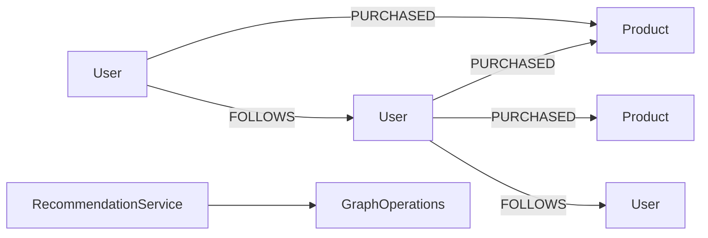

# recommendation-examples

> 🇺🇸 [English](README.md)

상품 추천과 소셜 팔로우 추천을 그래프 탐색 및 PageRank로 구현하는 예제입니다.

## 아키텍처



## 주요 기능

| 기능 | Graph API |
|---|---|
| 상품 추천 | `PURCHASED` 간선의 paired `neighbors` 탐색 |
| 팔로우 추천 | `FOLLOWS` 간선의 2-hop `neighbors` 탐색 |
| 인기 상품 랭킹 | `pageRank(PageRankOptions)` |
| 코루틴 지원 | `RecommendationSuspendService`와 `Flow` 결과 |

## 사용 예

```kotlin
val service = RecommendationService(ops)
service.initialize()

val alice = service.addUser("u-alice", "Alice")
val bob = service.addUser("u-bob", "Bob")
val camera = service.addProduct("p-camera", "Camera")
val tripod = service.addProduct("p-tripod", "Tripod")

service.recordPurchase(alice.id, camera.id)
service.recordPurchase(bob.id, camera.id)
service.recordPurchase(bob.id, tripod.id)

val products = service.recommendProducts(alice.id)
val popular = service.rankPopularProducts(limit = 10)
```

## 테스트 실행

```bash
./gradlew :recommendation-examples:test
./gradlew :recommendation-examples:test --tests "*TinkerGraph*"
```

TinkerGraph 테스트는 메모리에서 실행됩니다. Neo4j, Memgraph, Apache AGE, FalkorDB 테스트는 Docker/Testcontainers가 필요합니다.

## 의존성

```kotlin
implementation(project(":graph-core"))
implementation(project(":graph-neo4j"))
implementation(project(":graph-memgraph"))
implementation(project(":graph-age"))
implementation(project(":graph-falkordb"))
implementation(project(":graph-tinkerpop"))
```
