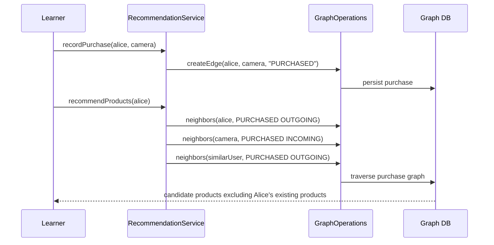

# recommendation-examples

> 🇺🇸 [English](README.md)

상품 추천과 소셜 팔로우 추천을 그래프 탐색 및 PageRank로 구현하는 방법을 배우는 예제입니다.

## 무엇을 배우나?

| 주제 | 의미 |
|---|---|
| 구매 그래프 모델링 | 구매는 사용자에서 상품으로 향하는 관계입니다. |
| traversal 기반 협업 필터링 | 같은 상품을 구매한 사용자를 통해 유사 사용자를 찾을 수 있습니다. |
| 팔로우 추천 | 2-hop 소셜 경로는 새 팔로우 후보를 제안하는 데 유용합니다. |
| 인기 상품 랭킹 | PageRank로 구매 그래프 안에서 중요한 상품을 찾습니다. |
| 백엔드 이식성 | 같은 추천 서비스가 지원되는 모든 Graph DB backend에서 동작합니다. |

## 왜 Graph DB가 좋은가?

추천은 관계 문제입니다. 중요한 질문은 "Alice가 무엇을 샀는가?"에서 끝나지 않습니다. "Alice와 같은 상품을 산 사람은
누구이고, 그 사람은 또 무엇을 샀는가?", "Alice가 팔로우하는 사람이 팔로우하는 사람은 누구인가?"처럼 multi-hop
traversal이 필요합니다.

Graph DB를 사용하면 다음처럼 표현할 수 있습니다.

- 사용자와 상품은 vertex,
- 구매와 팔로우는 edge,
- 추천 후보는 짧은 path와 제외 규칙,
- 상품 랭킹은 graph algorithm입니다.

그래서 실제 추천 시스템의 핵심 아이디어를 작은 코드로 학습할 수 있습니다.

## 아키텍처



## 도메인 UML



## 추천 흐름



## 주요 기능

| 기능 | Graph API |
|---|---|
| 상품 추천 | `PURCHASED` 간선의 paired `neighbors` 탐색 |
| 팔로우 추천 | `FOLLOWS` 간선의 2-hop `neighbors` 탐색 |
| 인기 상품 랭킹 | `pageRank(PageRankOptions)` |
| 코루틴 지원 | `RecommendationSuspendService`와 `Flow` 결과 |

## 사용 예

```kotlin
val service = RecommendationService(ops)
service.initialize()

val alice = service.addUser("u-alice", "Alice")
val bob = service.addUser("u-bob", "Bob")
val camera = service.addProduct("p-camera", "Camera")
val tripod = service.addProduct("p-tripod", "Tripod")

service.recordPurchase(alice.id, camera.id)
service.recordPurchase(bob.id, camera.id)
service.recordPurchase(bob.id, tripod.id)

val products = service.recommendProducts(alice.id)
val popular = service.rankPopularProducts(limit = 10)
```

## 샘플 데이터셋 Import

`RecommendationSampleDatasetLoader`는 번들된 graph-io CSV fixture를 임의의 `GraphOperations` 구현체로 import합니다.
fixture에는 안정적인 상품 추천과 팔로우 추천을 만드는 사용자, 상품, 구매 edge, 팔로우 edge가 포함되어 있습니다.

```kotlin
val service = RecommendationService(ops)
service.initialize()

val report = RecommendationSampleDatasetLoader.importCsv(ops)
val alice = ops.findVerticesByLabel("User", mapOf("userId" to "u-alice")).single()

check(report.status == GraphIoStatus.COMPLETED)
val products = service.recommendProducts(alice.id)
val follows = service.recommendFollows(alice.id)
```

이 loader 경로는 TinkerGraph smoke test로 충분합니다. graph-io가 공통 `GraphOperations` 계약을 통해 데이터를 쓰기
때문입니다. 컨테이너 기반 backend 동작은 기존 도메인 test matrix가 계속 담당합니다.

## 테스트 읽는 법

Abstract test가 튜토리얼입니다. 작은 그래프를 만들고 추천을 실행한 뒤, backend별 점수나 정렬에 의존하지 않고 안정적인
후보 포함 여부를 검증합니다.

| 테스트 종류 | 목적 |
|---|---|
| Abstract tests | 상품 추천, 팔로우 추천, 랭킹 동작을 한 번만 설명합니다. |
| TinkerGraph tests | 빠른 메모리 기반 smoke test입니다. |
| Neo4j/Memgraph/AGE/FalkorDB tests | backend 독립 추천 동작을 검증합니다. |

## 테스트 실행

```bash
./gradlew :recommendation-examples:test
./gradlew :recommendation-examples:test --tests "*TinkerGraph*"
```

TinkerGraph 테스트는 메모리에서 실행됩니다. Neo4j, Memgraph, Apache AGE, FalkorDB 테스트는 Docker/Testcontainers가 필요합니다.

## 의존성

```kotlin
implementation(project(":bluetape4k-graph-core"))
implementation(project(":bluetape4k-graph-neo4j"))
implementation(project(":bluetape4k-graph-memgraph"))
implementation(project(":bluetape4k-graph-age"))
implementation(project(":bluetape4k-graph-falkordb"))
implementation(project(":bluetape4k-graph-tinkerpop"))
implementation(project(":bluetape4k-graph-io-csv"))
```
