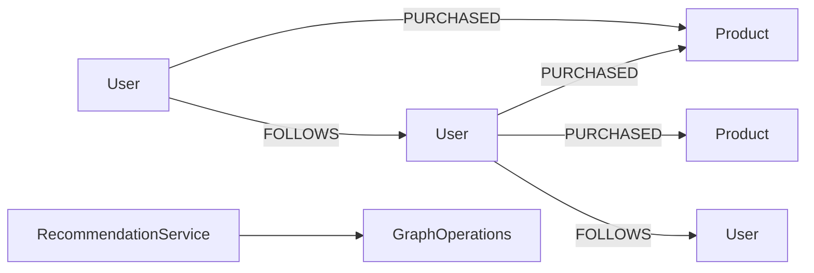

# recommendation-examples

> 🇰🇷 [한국어 문서](README.ko.md)

Recommendation example showing product and social recommendations with graph traversal and PageRank.

## Architecture



## Core Features

| Feature | Graph API |
|---|---|
| Product recommendations | paired `neighbors` traversal over `PURCHASED` |
| Follow recommendations | two-hop `neighbors` traversal over `FOLLOWS` |
| Popular product ranking | `pageRank(PageRankOptions)` |
| Coroutine support | `RecommendationSuspendService` with `Flow` results |

## Usage

```kotlin
val service = RecommendationService(ops)
service.initialize()

val alice = service.addUser("u-alice", "Alice")
val bob = service.addUser("u-bob", "Bob")
val camera = service.addProduct("p-camera", "Camera")
val tripod = service.addProduct("p-tripod", "Tripod")

service.recordPurchase(alice.id, camera.id)
service.recordPurchase(bob.id, camera.id)
service.recordPurchase(bob.id, tripod.id)

val products = service.recommendProducts(alice.id)
val popular = service.rankPopularProducts(limit = 10)
```

## Running Tests

```bash
./gradlew :recommendation-examples:test
./gradlew :recommendation-examples:test --tests "*TinkerGraph*"
```

TinkerGraph tests run in memory. Neo4j, Memgraph, Apache AGE, and FalkorDB tests require Docker/Testcontainers.

## Dependencies

```kotlin
implementation(project(":graph-core"))
implementation(project(":graph-neo4j"))
implementation(project(":graph-memgraph"))
implementation(project(":graph-age"))
implementation(project(":graph-falkordb"))
implementation(project(":graph-tinkerpop"))
```
