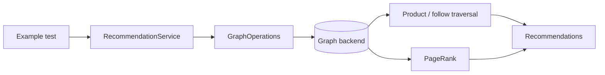
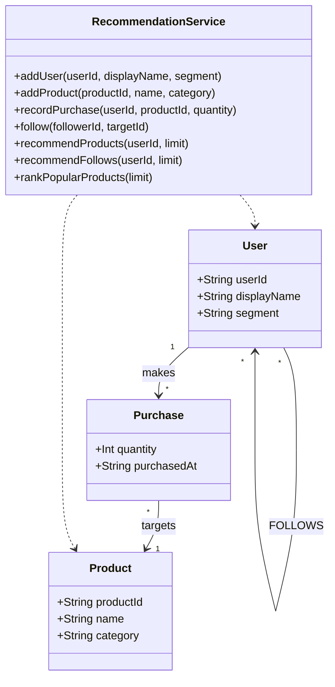
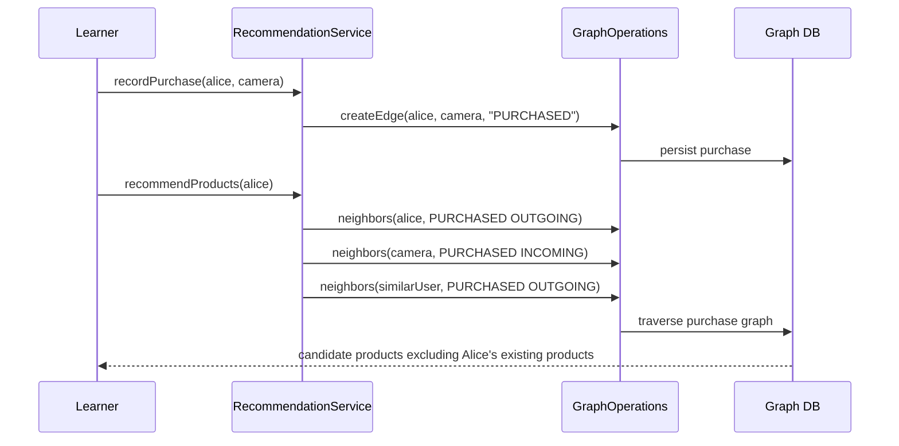

# recommendation-examples

> 🇰🇷 [한국어 문서](README.ko.md)

This example teaches how to build product and social recommendations with graph traversal and PageRank.

## What You Learn

| Topic | Why it matters |
|---|---|
| Purchase graph modeling | A purchase is a relationship from a user to a product. |
| Collaborative filtering by traversal | Similar users can be found through shared purchased products. |
| Follow recommendations | Two-hop social paths suggest people a user may want to follow. |
| Product popularity ranking | PageRank ranks products by their position in the purchase graph. |
| Backend portability | The same recommendation service runs across all supported graph backends. |

## Why Use a Graph Database?

Recommendations are relationship problems. The interesting question is not only "what did Alice buy?", but "who bought
the same thing as Alice, and what else did they buy?" or "who is followed by people Alice already follows?" These are
multi-hop traversals.

With a graph database:

- users and products are vertices,
- purchases and follows are edges,
- recommendations are short paths with clear exclusion rules,
- graph algorithms can rank candidate products without rewriting the domain model.

This makes the example close to real recommendation systems while keeping the implementation small enough to study.

## Architecture



## Domain UML



## Recommendation Flow



## Core Features

| Feature | Graph API |
|---|---|
| Product recommendations | paired `neighbors` traversal over `PURCHASED` |
| Follow recommendations | two-hop `neighbors` traversal over `FOLLOWS` |
| Popular product ranking | `pageRank(PageRankOptions)` |
| Coroutine support | `RecommendationSuspendService` with `Flow` results |

## Usage

```kotlin
val service = RecommendationService(ops)
service.initialize()

val alice = service.addUser("u-alice", "Alice")
val bob = service.addUser("u-bob", "Bob")
val camera = service.addProduct("p-camera", "Camera")
val tripod = service.addProduct("p-tripod", "Tripod")

service.recordPurchase(alice.id, camera.id)
service.recordPurchase(bob.id, camera.id)
service.recordPurchase(bob.id, tripod.id)

val products = service.recommendProducts(alice.id)
val popular = service.rankPopularProducts(limit = 10)
```

## How to Read the Tests

The abstract tests are the tutorial. They build a tiny graph, run a recommendation, and assert stable membership rather
than exact score values or backend-specific ordering.

| Test class type | Purpose |
|---|---|
| Abstract tests | Explain product, follow, and ranking behavior once. |
| TinkerGraph tests | Fast in-memory smoke path. |
| Neo4j/Memgraph/AGE/FalkorDB tests | Prove backend-independent recommendation behavior. |

## Running Tests

```bash
./gradlew :recommendation-examples:test
./gradlew :recommendation-examples:test --tests "*TinkerGraph*"
```

TinkerGraph tests run in memory. Neo4j, Memgraph, Apache AGE, and FalkorDB tests require Docker/Testcontainers.

## Dependencies

```kotlin
implementation(project(":graph-core"))
implementation(project(":graph-neo4j"))
implementation(project(":graph-memgraph"))
implementation(project(":graph-age"))
implementation(project(":graph-falkordb"))
implementation(project(":graph-tinkerpop"))
```
