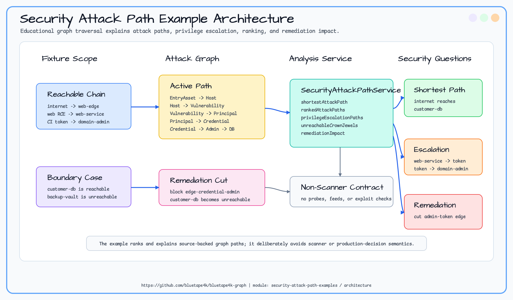

# security-attack-path-examples

> 🇺🇸 [English](README.md)

Entry asset, host, principal, credential, vulnerability, permission, crown-jewel system을 작은 security attack-path
graph로 모델링하는 예제입니다. path explanation, privilege escalation, risk ranking, remediation impact에 필요한
backend-independent traversal을 보여줍니다.

> 이 모듈은 교육용 graph-modeling 예제이며 security scanner가 아닙니다. vulnerability feed 수집, probe 실행,
> exploitability 검증, production security decision을 수행하지 않습니다.

## 예제 시나리오

샘플 그래프는 internet-facing entry asset에서 public web host로 진입한 뒤 exploit을 통해 service account로
pivot하고, admin credential을 발견해 customer database에 도달하는 흐름을 모델링합니다. backup vault는 도달할 수
없는 crown jewel로 둬서 reachable/unreachable target을 테스트합니다.

## 아키텍처



## Graph Model

| 요소 | Label | 주요 속성 | 목적 |
|---|---|---|---|
| Entry asset | `EntryAsset` | `assetId`, `exposure`, `status` | 외부 또는 내부 시작점입니다. |
| Host | `Host` | `hostId`, `exposure`, `criticality`, `status` | workload, data store, protected system입니다. |
| Principal | `Principal` | `principalId`, `kind`, `privilege`, `status` | human, service, assumed identity입니다. |
| Credential | `Credential` | `credentialId`, `kind`, `status` | pivot에 사용되는 token 또는 credential material입니다. |
| Vulnerability | `Vulnerability` | `vulnerabilityId`, `severity`, `status` | path ranking에 쓰는 교육용 risk signal입니다. |
| Permission | `Permission` | `permissionId`, `privilege`, `status` | protected host를 control할 수 있는 capability입니다. |

## Traversal Goals

| 질문 | API |
|---|---|
| entry asset에서 crown jewel까지의 최단 active path는 무엇인가? | `shortestAttackPath(sourceAssetId, targetHostId)` |
| risk signal이 큰 attack path는 무엇인가? | `rankedAttackPaths(sourceAssetId, targetHostId)` |
| 낮은 권한의 service account가 admin privilege에 어떻게 도달하는가? | `privilegeEscalationPaths(startPrincipalId)` |
| source에서 도달할 수 없는 crown jewel은 무엇인가? | `unreachableCrownJewels(sourceAssetId)` |
| 특정 edge를 끊으면 어떤 crown jewel이 unreachable이 되는가? | `remediationImpact(blockedEdgeId)` |

## Sample Dataset

모듈은 `src/main/resources/sample-data/security-attack-path/` 아래에 graph-io CSV fixture를 포함합니다.

| 파일 | 내용 |
|---|---|
| `vertices.csv` | entry asset, host, principal, credential, vulnerability, permission. |
| `edges.csv` | reachability, exploit, compromise, credential, permission, asset-control edge. |

```kotlin
val ops = TinkerGraphOperations()
val service = SecurityAttackPathService(ops)
service.initialize()

SecurityAttackPathSampleDatasetLoader.importCsv(ops)
val path = service.shortestAttackPath("internet", "customer-db")
val blocked = service.remediationImpact("edge-credential-admin")
```

## Expected Output

| Query | Expected IDs |
|---|---|
| `shortestAttackPath("internet", "customer-db")` | `internet`, `web-edge`, `vuln-web-rce`, `web-service`, `ci-admin-token`, `domain-admin`, `db-admin`, `customer-db` |
| `privilegeEscalationPaths("web-service")` | `web-service`, `ci-admin-token`, `domain-admin` |
| `unreachableCrownJewels("internet")` | `backup-vault` |
| `remediationImpact("edge-credential-admin")` | `customer-db` |

## 테스트 실행

```bash
./gradlew :security-attack-path-examples:test
```

첫 slice는 TinkerGraph smoke coverage와 graph-io CSV loader test를 사용합니다.
