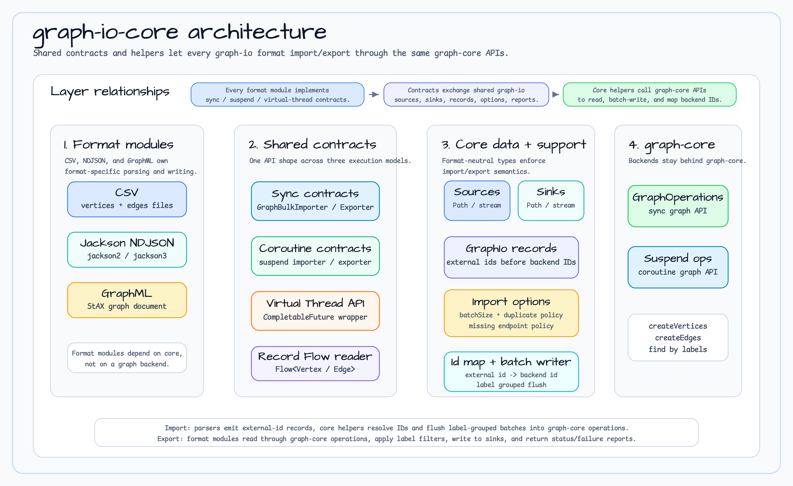

# graph-io-core

English | [한국어](README.ko.md)

Shared contracts, models, options, reports, and I/O helpers for the `graph-io` family of bulk importers and exporters.

## Overview

`graph-io-core` defines the abstract interfaces and data types that every `graph-io-*` format module (CSV, Jackson2 NDJSON, Jackson3 NDJSON, GraphML) depends on. It intentionally has **no format- or backend-specific code** — its only job is to let every format implement the same contracts across three execution models: synchronous, Kotlin coroutine `suspend`, and Java Virtual Thread-based `CompletableFuture`.

This module is not usually consumed directly — applications depend on one of the format modules (e.g. `graph-io-csv`, `graph-io-jackson3`) which transitively expose these types.

## Architecture



## What's Inside

### Execution Model Contracts (`io.bluetape4k.graph.io.contract`)

Seven interfaces — one exporter and one importer per execution model, plus a flow-based raw reader:

| Interface | Method | Returns |
|-----------|--------|---------|
| `GraphBulkExporter<T>` | `exportGraph(sink, ops, options)` | `GraphExportReport` |
| `GraphBulkImporter<S>` | `importGraph(source, ops, options)` | `GraphImportReport` |
| `GraphSuspendBulkExporter<T>` | `suspend exportGraphSuspending(sink, suspendOps, options)` | `GraphExportReport` |
| `GraphSuspendBulkImporter<S>` | `suspend importGraphSuspending(source, suspendOps, options)` | `GraphImportReport` |
| `GraphVirtualThreadBulkExporter<T>` | `exportGraphAsync(sink, ops, options)` | `CompletableFuture<GraphExportReport>` |
| `GraphVirtualThreadBulkImporter<S>` | `importGraphAsync(source, ops, options)` | `CompletableFuture<GraphImportReport>` |
| `GraphRecordFlowReader<S>` | `readVertices(source)` / `readEdges(source)` | `Flow<GraphIoVertexRecord>` / `Flow<GraphIoEdgeRecord>` |

`S` is the format-specific source type (e.g. `GraphImportSource`, `CsvGraphImportSource`) and `T` is the sink type (e.g. `GraphExportSink`, `CsvGraphExportSink`).

### Sources & Sinks (`io.bluetape4k.graph.io.source`)

Sealed interfaces that abstract over file paths and raw streams:

```kotlin
sealed interface GraphImportSource {
    data class PathSource(val path: Path, val charset: Charset = Charsets.UTF_8) : GraphImportSource
    data class InputStreamSource(val input: InputStream, val charset: Charset = Charsets.UTF_8, val closeInput: Boolean = false) : GraphImportSource
}

sealed interface GraphExportSink {
    data class PathSink(val path: Path, val charset: Charset = Charsets.UTF_8, val append: Boolean = false) : GraphExportSink
    data class OutputStreamSink(val output: OutputStream, val charset: Charset = Charsets.UTF_8, val closeOutput: Boolean = false) : GraphExportSink
}
```

### Records (`io.bluetape4k.graph.io.model`)

Intermediate records emitted by format parsers before the importer resolves external IDs to backend IDs:

- `GraphIoVertexRecord(externalId, label, properties)`
- `GraphIoEdgeRecord(externalId?, label, fromExternalId, toExternalId, properties)` — endpoints are **unresolved external IDs**; the importer resolves them against `GraphIoExternalIdMap`.

### Options (`io.bluetape4k.graph.io.options`)

```kotlin
data class GraphImportOptions(
    val batchSize: Int = 1_000,
    val maxEdgeBufferSize: Int = 100_000,
    val onDuplicateVertexId: DuplicateVertexPolicy = DuplicateVertexPolicy.FAIL,
    val onMissingEdgeEndpoint: MissingEndpointPolicy = MissingEndpointPolicy.FAIL,
    val defaultVertexLabel: String = "Vertex",
    val defaultEdgeLabel: String = "Edge",
    val preserveExternalIdProperty: String? = "_graphIoExternalId",
)

data class GraphExportOptions(
    val vertexLabels: Set<String> = emptySet(),  // empty = discover all labels
    val edgeLabels: Set<String> = emptySet(),    // empty = discover all labels
    val includeEmptyProperties: Boolean = true,
    val exportChunkSize: Int = 1_000,
)

enum class DuplicateVertexPolicy { FAIL, SKIP }
enum class MissingEndpointPolicy { FAIL, SKIP_EDGE }
```

`batchSize` controls backend write flushing during imports. Importers group pending vertices and edges by label, call `createVertices`/`createEdges` when a label buffer reaches this size, and flush final partial buffers at the end. It does not change duplicate-ID or missing-endpoint policy semantics.

`batchSize` must be positive. `GraphImportOptions`, `GraphIoBatchWriter`, and
`SuspendGraphIoBatchWriter` all reject zero or negative values through the shared
Bluetape `requirePositiveNumber` contract, including when a writer is constructed
directly.

`exportChunkSize` controls how many records streaming-capable exporters request
from chunk-aware repository methods such as `findVerticesByLabelChunked` and
`findEdgesByLabelChunked`. Backends that do not override those methods use the
compatible list/Flow fallback, while cursor-aware backends can avoid
whole-label materialization. Formats that need global headers, such as CSV, may
still need a second logical read. CSV and GraphML exporters satisfy that
contract with `GraphIoRecordSpool`: each backend chunk is staged once into
temporary disk records, then replayed for header discovery and output writing.
The spool normalizes property values using the writer string contract and
deletes its temporary files on normal completion, failure, or cancellation.

An empty label set requests all labels through `GraphLabelDiscovery`. A backend
without that capability must receive explicit labels; exporters fail clearly
instead of reporting a successful zero-record export.

`requireNotBlank` is enforced on label fields and on every element of label sets.

### Reports (`io.bluetape4k.graph.io.report`)

```kotlin
data class GraphImportReport(
    val status: GraphIoStatus,                // COMPLETED | PARTIAL | FAILED
    val format: GraphIoFormat,                // CSV | NDJSON_JACKSON2 | NDJSON_JACKSON3 | GRAPHML
    val verticesRead: Long,
    val verticesCreated: Long,
    val edgesRead: Long,
    val edgesCreated: Long,
    val skippedVertices: Long,
    val skippedEdges: Long,
    val elapsed: Duration,
    val failures: List<GraphIoFailure> = emptyList(),
)

data class GraphExportReport(
    val status: GraphIoStatus,
    val format: GraphIoFormat,
    val verticesWritten: Long,
    val edgesWritten: Long,
    val skippedVertices: Long,
    val skippedEdges: Long,
    val elapsed: Duration,
    val failures: List<GraphIoFailure> = emptyList(),
)

data class GraphIoFailure(
    val phase: GraphIoPhase,                  // READ_VERTEX | READ_EDGE | WRITE_VERTEX | WRITE_EDGE | ...
    val severity: GraphIoFailureSeverity = GraphIoFailureSeverity.ERROR,
    val location: String? = null,
    val sourceName: String? = null,
    val fileRole: GraphIoFileRole? = null,
    val recordId: String? = null,
    val columnName: String? = null,
    val elementName: String? = null,
    val message: String,
)
```

### Progress listeners and metrics

Every synchronous, suspend, and Virtual Thread format entry point keeps its
existing overload and also offers a required `GraphIoProgressListener` as the
last parameter. A listener receives one ordered lifecycle per invocation:
`STARTED`, cumulative `PROGRESS`/`PHASE_COMPLETED`, and exactly one terminal
`COMPLETED`, `FAILED`, or `CANCELLED` event. Listener callbacks are synchronous
on the work thread; callback exceptions are isolated and callback `Error`s stop
the reporter without changing the original operation failure.

The optional `bluetape4k-graph-io-micrometer` module adapts these events to
fixed-cardinality meters. It records operation, format, status, kind, and phase
enum tags only; source paths, record IDs, run IDs, and exception messages never
become tags. The core module has no Micrometer dependency.

```kotlin
val listener = GraphIoProgressListener { event ->
    println("${event.type} ${event.operation} ${event.format}")
}

CsvGraphBulkExporter().exportGraph(sink, graphOps, options, listener)
```

Add the bridge only when metrics are needed:

```kotlin
dependencies {
    implementation("io.github.bluetape4k.graph:bluetape4k-graph-io-micrometer:$version")
}
```

### Support Helpers (`io.bluetape4k.graph.io.support`)

- **`GraphIoPaths`** — opens `BufferedReader`/`BufferedWriter`/`InputStream`/`OutputStream` for any `GraphImportSource`/`GraphExportSink`, auto-creates parent directories for `PathSink`, honours the `closeInput`/`closeOutput` flag for caller-owned streams.
- **`GraphIoExternalIdMap`** — tracks external ID → backend `GraphElementId` mappings during import and enforces `DuplicateVertexPolicy` (`FAIL` or `SKIP`). Importers follow a 2-step pattern: `putFirstOrFail()` gates the duplicate policy with a temporary ID, then `put()` overwrites with the backend-issued ID. Calling `put()` before `putFirstOrFail()` throws `IllegalStateException` to surface duplicate-policy bypass at the caller site.
- **`GraphIoBatchWriter` / `SuspendGraphIoBatchWriter`** — label-grouped import write buffers that flush via `createVertices`/`createEdges` according to `GraphImportOptions.batchSize`.
- **`GraphImportWorkflow` / `GraphImportJobStateStore`** — validates a multi-source import manifest and persists ordered job states. The store's `update` boundary performs load/validate/save atomically for one JVM store instance; transitions use `copy(state = ...)` to preserve existing `sources`, `elapsed`, and `checkpoint` payload; its transform must be pure/retry-safe, and durable stores should override it with a native transaction or CAS. The in-memory reference store uses an interruptible, reference-counted reentrant lock per job so independent jobs can progress in parallel while same-job transitions remain serialized; idle lock entries are retired. This is JVM-local behavior, not a durable multi-process guarantee. The published `testFixtures` variant contains the reusable state-store contract TCK.
- **`GraphIoStopwatch`** — millisecond-precision timer used by format importers/exporters to populate `report.elapsed`.
- **`VirtualThreadGraphBulkAdapter`** — wraps a sync `GraphBulkImporter`/`GraphBulkExporter` as a Virtual-Thread-backed async variant via `CompletableFuture`.

### Durable State Store TCK

`graph-io-core` publishes a Gradle `testFixtures` variant so durable
`GraphImportJobStateStore` implementations can run the same contract tests
without copying test code:

```kotlin
dependencies {
    testImplementation(testFixtures(project(":bluetape4k-graph-io-core")))
}
```

For a published module, use the external test-fixtures notation instead:

```kotlin
dependencies {
    testImplementation(testFixtures("io.github.bluetape4k.graph:bluetape4k-graph-io-core:$version"))
}
```

Extend `AbstractGraphImportJobStateStoreContractTest` and provide
`createStore()` to verify latest-report updates, first-report creation,
`jobId` mismatch rejection without a save, and transform-failure atomicity.
Adapters that need an injected save failure can additionally extend
`AbstractGraphImportJobStateStoreFailureContractTest` and provide a
`GraphImportJobStateStoreFailureHarness` to verify the existing report is
unchanged when an atomic save rejects the update.
CAS or transaction-backed adapters can additionally extend
`AbstractGraphImportJobStateStoreRetryContractTest` and provide an
adapter-specific `GraphImportJobStateStoreRetryHarness` to inject a
contention retry. It verifies both retry-path `jobId` mismatch rejection and
that the stale first result is not saved. The retry contract requires a pure,
retry-safe transform and commits only the result calculated from the latest
report; it does not provide a durable implementation itself.

## Usage (Format Implementer's View)

Implementing a new format means depending on `graph-io-core` and providing the three executor variants:

```kotlin
class MyFormatBulkExporter : GraphBulkExporter<GraphExportSink> {
    override fun exportGraph(
        sink: GraphExportSink,
        operations: GraphOperations,
        options: GraphExportOptions,
    ): GraphExportReport {
        val sw = GraphIoStopwatch.start()
        val failures = mutableListOf<GraphIoFailure>()
        GraphIoPaths.openWriter(sink).use { writer ->
            // Stream vertices filtered by options.vertexLabels, then edges by options.edgeLabels
        }
        return GraphExportReport(
            status = if (failures.isEmpty()) GraphIoStatus.COMPLETED else GraphIoStatus.PARTIAL,
            format = GraphIoFormat.CSV,
            verticesWritten = 0, edgesWritten = 0,
            skippedVertices = 0, skippedEdges = 0,
            elapsed = sw.elapsed(),
            failures = failures,
        )
    }
}

class MyFormatVirtualThreadBulkExporter(
    private val sync: MyFormatBulkExporter = MyFormatBulkExporter(),
) : GraphVirtualThreadBulkExporter<GraphExportSink> {
    override fun exportGraphAsync(
        sink: GraphExportSink,
        operations: GraphOperations,
        options: GraphExportOptions,
    ): CompletableFuture<GraphExportReport> =
        VirtualThreadGraphBulkAdapter.wrapExporter(sync).exportGraphAsync(sink, operations, options)
}
```

## Usage (Consumer's View)

Application code rarely depends on `graph-io-core` directly; pick a format module instead:

```kotlin
// CSV example
import io.bluetape4k.graph.io.csv.CsvGraphBulkImporter
import io.bluetape4k.graph.io.csv.CsvGraphImportSource
import io.bluetape4k.graph.io.options.GraphImportOptions
import io.bluetape4k.graph.io.source.GraphImportSource
import java.nio.file.Paths

val importer = CsvGraphBulkImporter()
val source = CsvGraphImportSource(
    vertices = GraphImportSource.PathSource(Paths.get("vertices.csv")),
    edges = GraphImportSource.PathSource(Paths.get("edges.csv")),
)
val report = importer.importGraph(source, graphOps, GraphImportOptions())
println("Imported ${report.verticesCreated} / ${report.verticesRead} vertices")
```

Every format follows the same pattern — `*BulkImporter` / `*BulkExporter` (sync), `Suspend*BulkImporter` / `Suspend*BulkExporter` (coroutines), `*VirtualThreadBulkImporter` / `*VirtualThreadBulkExporter` (VT).

## Design Principles

- **Streaming by default.** No parser loads the whole file into memory; edges are buffered (bounded by `maxEdgeBufferSize`) to ensure all referenced vertices exist before edges are created.
- **Caller-owned streams.** `InputStreamSource` / `OutputStreamSink` default to `closeInput = false` / `closeOutput = false`; flush happens on close but the caller's stream stays open.
- **Partial success over fail-fast.** Per-record problems are reported via `GraphIoFailure` — the overall `status` becomes `PARTIAL` rather than aborting the whole run (except when `onDuplicateVertexId` or `onMissingEdgeEndpoint` is `FAIL`).
- **External IDs stay visible.** If `preserveExternalIdProperty` is set (default: `"_graphIoExternalId"`), the importer writes the original external ID as a vertex property so round-trips remain lossless.

### Backend-native bulk loading SPI

`io.bluetape4k.graph.io.nativebulk` is an additive contract for a backend-owned
native command lane. It is deliberately separate from `GraphBulkImporter`: a
backend adapter validates a caller-owned raw `R` source and returns a typed,
one-shot `GraphNativeBulkLoadValidatedSource<V>`. The native command receives
only that validated `V` handle and the same deadline-aware cancellation token.

`GraphNativeBulkLoaderCapabilities` declares supported source kinds,
transaction/failure semantics, URI policy, and a bounded shutdown guarantee.
Unsupported backends should use `UnsupportedGraphNativeBulkLoader`, which fails
with the fixed `UNSUPPORTED_SOURCE` code. Progress and reports are verified by
the base loader; raw adapter causes, paths, URIs, and source values are not
included in public exceptions or diagnostic events.

TinkerPop/TinkerGraph are intentionally excluded from this SPI: they are
in-memory/reference graph implementations without a server-owned native bulk
command or staging lifecycle. They continue to use the portable
`GraphBulkImporter` path.

URI access is denied by default. An adapter that opts in must enforce exact
scheme/host/port origins, redirect and private-network policy, and backend
revalidation at the execution point. FILE/DIRECTORY adapters must bind a
canonical artifact to an approved staging root. This core module does not open
files, dereference URIs, stage data, or provide Neo4j/Memgraph/AGE/FalkorDB
adapters; those concerns belong to follow-up backend issues and their
Testcontainers coverage.

## Dependency

```kotlin
dependencies {
    api("io.bluetape4k:graph-io-core:$version")
}
```

Transitive dependencies: `bluetape4k-graph-core`, `bluetape4k-coroutines`, `bluetape4k-virtualthread`, `bluetape4k-logging`.

## Related Modules

- `graph-io-csv` — CSV (two files: vertices + edges)
- `graph-io-jackson2` — NDJSON with Jackson 2.x
- `graph-io-jackson3` — NDJSON with Jackson 3.x (`tools.jackson`)
- `graph-io-graphml` — GraphML 2.4 via StAX

## Streaming reader contract

`GraphRecordFlowReader` is the record-streaming axis: `readVertices(source)` and
`readEdges(source)` emit records sequentially and preserve source order. `GraphImportOptions.batchSize`
is a separate backend write-flush axis for `createVertices`/`createEdges`; it does not change reader
buffering or source ownership. Path and explicitly owned sources are closed by the library, while
caller-owned sources remain open. NDJSON edge staging is bounded by `maxEdgeBufferSize`.
