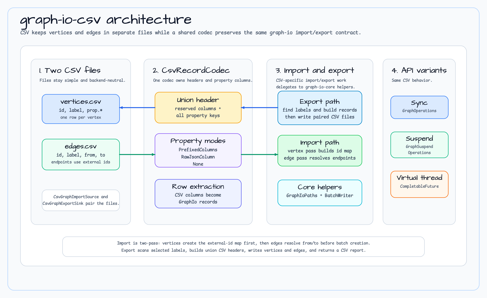

# graph-io-csv

[English](README.md) | 한국어

**bluetape4k-graph** 을 위한 CSV 포맷 벌크 임포터/익스포터. 그래프 정점과 간선을 CSV 파일로 원활하게 내보낼 수 있으며, 동기, 가상 스레드, Kotlin 코루틴 기반 suspend의 세 가지 실행 모델을 지원합니다.

## 기능

- **유연한 실행 모델**
  - **동기 (`CsvGraphBulkExporter`)**: 블로킹 I/O, 간단한 스크립트 및 배치 작업에 적합
  - **가상 스레드 (`CsvGraphVirtualThreadBulkExporter`)**: Java 가상 스레드를 통한 비동기, 가벼운 동시성
  - **Suspend (`SuspendCsvGraphBulkExporter`)**: Kotlin 코루틴 기반, `suspend` 함수를 통한 구조화된 동시성

- **속성 처리 모드**
  - `PrefixedColumns`: 속성을 접두사가 붙은 별도 컬럼으로 저장 (예: `prop.name`, `prop.age`)
  - `RawJsonColumn`: null, 중첩 map, list를 포함한 전체 속성 맵을 설정한 단일 JSON 컬럼에 저장
  - `None`: 속성 완전 제외

- **자동 스키마 합치기**: 헤더 생성이 레코드 전체의 모든 속성 키를 자동으로 발견

- **포괄적 보고**: 익스포트 보고서는 정점/간선 개수, 실행 시간, 상세 실패 추적을 포함

## 의존성

`build.gradle.kts`에 다음을 추가하세요:

```kotlin
dependencies {
    implementation("io.bluetape4k:graph-io-csv:$version")
}
```

## 아키텍처



CSV 모듈은 정점과 간선을 한 파일에 섞지 않고, 두 CSV 파일을 한 쌍으로 다룹니다:

- `vertices.csv`는 `id`, `label`, 선택적 속성 컬럼을 저장합니다.
- `edges.csv`는 `id`, `label`, `from`, `to`, 선택적 속성 컬럼을 저장합니다.
- `CsvRecordCodec`은 import/export 양쪽에서 union header 생성과 속성 추출을 담당합니다.
- Import는 2-pass 방식입니다. 먼저 정점으로 외부 ID 맵을 만든 뒤, 간선의 `from`/`to`를 해석합니다.
- 동기, 가상 스레드, suspend API는 같은 CSV 계약을 공유하고 실행 모델만 다릅니다.

## 사용법

### 동기식 익스포트

블로킹 I/O를 사용하여 그래프를 CSV 파일로 익스포트:

```kotlin
import io.bluetape4k.graph.io.csv.CsvGraphBulkExporter
import io.bluetape4k.graph.io.csv.CsvGraphExportSink
import io.bluetape4k.graph.io.options.GraphExportOptions
import io.bluetape4k.graph.io.source.GraphExportSink
import io.bluetape4k.graph.repository.GraphOperations
import java.nio.file.Paths

val exporter = CsvGraphBulkExporter()

val sink = CsvGraphExportSink(
    vertices = GraphExportSink.PathSink(Paths.get("vertices.csv")),
    edges = GraphExportSink.PathSink(Paths.get("edges.csv")),
)

val options = GraphExportOptions(
    vertexLabels = setOf("Person", "Company"),
    edgeLabels = setOf("works_for", "knows"),
)

val report = exporter.exportGraph(sink, graphOps, options)
println("${report.verticesWritten}개의 정점과 ${report.edgesWritten}개의 간선을 ${report.elapsed.toMillis()}ms에 익스포트했습니다")
```

### 가상 스레드 기반 익스포트

Java 가상 스레드를 사용하여 비동기로 익스포트:

```kotlin
import io.bluetape4k.graph.io.csv.CsvGraphVirtualThreadBulkExporter
import io.bluetape4k.graph.io.csv.CsvGraphExportSink
import io.bluetape4k.graph.io.options.GraphExportOptions
import io.bluetape4k.graph.io.source.GraphExportSink
import java.nio.file.Paths

val exporter = CsvGraphVirtualThreadBulkExporter()

val sink = CsvGraphExportSink(
    vertices = GraphExportSink.PathSink(Paths.get("vertices.csv")),
    edges = GraphExportSink.PathSink(Paths.get("edges.csv")),
)

val options = GraphExportOptions(
    vertexLabels = setOf("Person"),
    edgeLabels = setOf("knows"),
)

val future = exporter.exportGraphAsync(sink, graphOps, options)
val report = future.join()  // 완료 대기
println("${report.verticesWritten}개의 정점을 익스포트했습니다")
```

### 코루틴 기반 익스포트 (Suspend)

Kotlin 코루틴을 사용하여 구조화된 동시성으로 익스포트:

```kotlin
import io.bluetape4k.graph.io.csv.SuspendCsvGraphBulkExporter
import io.bluetape4k.graph.io.csv.CsvGraphExportSink
import io.bluetape4k.graph.io.csv.CsvGraphIoOptions
import io.bluetape4k.graph.io.csv.CsvPropertyMode
import io.bluetape4k.graph.io.options.GraphExportOptions
import io.bluetape4k.graph.io.source.GraphExportSink
import kotlinx.coroutines.runBlocking
import java.nio.file.Paths

val exporter = SuspendCsvGraphBulkExporter()

val sink = CsvGraphExportSink(
    vertices = GraphExportSink.PathSink(Paths.get("vertices.csv")),
    edges = GraphExportSink.PathSink(Paths.get("edges.csv")),
)

val options = GraphExportOptions(
    vertexLabels = setOf("Person", "Company"),
    edgeLabels = setOf("works_for"),
)

val csvOptions = CsvGraphIoOptions(
    propertyMode = CsvPropertyMode.PrefixedColumns(prefix = "attr."),
)

val report = runBlocking {
    exporter.exportGraphSuspending(sink, suspendGraphOps, options, csvOptions)
}
println("${report.verticesWritten}개의 정점과 ${report.edgesWritten}개의 간선을 익스포트했습니다")
```

## 임포트

CSV 파일에서 그래프를 임포트합니다. 정점과 간선 CSV 파일은 각각 별도의 파일로 제공해야 합니다.

### 동기식 임포트

```kotlin
import io.bluetape4k.graph.io.csv.CsvGraphBulkImporter
import io.bluetape4k.graph.io.csv.CsvGraphImportSource
import io.bluetape4k.graph.io.options.DuplicateVertexPolicy
import io.bluetape4k.graph.io.options.GraphImportOptions
import io.bluetape4k.graph.io.options.MissingEndpointPolicy
import io.bluetape4k.graph.io.source.GraphImportSource
import java.nio.file.Paths

val importer = CsvGraphBulkImporter()

val source = CsvGraphImportSource(
    vertices = GraphImportSource.PathSource(Paths.get("vertices.csv")),
    edges    = GraphImportSource.PathSource(Paths.get("edges.csv")),
)

val options = GraphImportOptions(
    defaultVertexLabel    = "Node",
    onDuplicateVertexId   = DuplicateVertexPolicy.SKIP,
    onMissingEdgeEndpoint = MissingEndpointPolicy.SKIP_EDGE,
)

val report = importer.importGraph(source, graphOps, options)
println("${report.verticesCreated}/${report.verticesRead}개의 정점과 " +
        "${report.edgesCreated}/${report.edgesRead}개의 간선을 임포트했습니다: ${report.status}")
```

### 임포트 CSV 형식

정점 CSV 파일:

```csv
id,label,prop.name,prop.age
v1,Person,Alice,30
v2,Person,Bob,25
```

간선 CSV 파일:

```csv
id,label,from,to,prop.since
,KNOWS,v1,v2,2024
```

### 임포트 옵션

| 옵션 | 타입 | 기본값 | 설명 |
|------|------|--------|------|
| `defaultVertexLabel` | `String` | `"Vertex"` | `label` 컬럼이 비어 있을 때 사용하는 기본 정점 레이블 |
| `defaultEdgeLabel` | `String` | `"Edge"` | `label` 컬럼이 비어 있을 때 사용하는 기본 간선 레이블 |
| `onDuplicateVertexId` | `DuplicateVertexPolicy` | `FAIL` | 중복 정점 ID 처리: 즉시 실패하거나 중복을 건너뜀 |
| `onMissingEdgeEndpoint` | `MissingEndpointPolicy` | `FAIL` | 누락된 간선 끝점 처리: 즉시 실패하거나 해당 간선을 건너뜀 |
| `preserveExternalIdProperty` | `String?` | `null` | 외부 ID를 속성으로 보존할 때 사용할 키 |

### 임포트 리포트

임포트 후 개수와 실패 정보를 확인합니다:

```kotlin
val report = importer.importGraph(source, graphOps, options)

println("상태: ${report.status}")              // COMPLETED, PARTIAL, FAILED
println("정점: ${report.verticesCreated}/${report.verticesRead}")
println("간선: ${report.edgesCreated}/${report.edgesRead}")
println("건너뛴 정점: ${report.skippedVertices}")
println("건너뛴 간선: ${report.skippedEdges}")
println("소요 시간: ${report.elapsed.toMillis()}ms")
```

### 가상 스레드 임포트

```kotlin
val importer = CsvGraphVirtualThreadBulkImporter()
val future = importer.importGraphAsync(source, graphOps, options)
val report = future.get()
```

### 코루틴 기반 임포트 (Suspend)

```kotlin
val importer = SuspendCsvGraphBulkImporter()
val report = coroutineScope {
    importer.importGraphSuspending(source, suspendGraphOps, options)
}
```

## 설정

### 속성 모드

그래프 속성이 CSV에서 직렬화되는 방식을 구성:

#### 접두사 컬럼 (기본값)

속성이 설정 가능한 접두사가 붙은 별도 컬럼으로 나타남:

```kotlin
val options = CsvGraphIoOptions(
    propertyMode = CsvPropertyMode.PrefixedColumns(prefix = "prop.")
)
// 컬럼: id, label, prop.name, prop.age, prop.email, ...
```

#### Raw JSON 컬럼

설정한 단일 컬럼에 전체 JSON 속성 payload를 저장합니다. 익스포트와
임포트가 같은 codec을 공유하므로 scalar, null, 중첩 map, list, 따옴표,
쉼표, 개행 값이 왕복에서 보존됩니다. 빈 속성 맵은 `{}`로 기록하며,
임포터는 잘못된 JSON이나 object가 아닌 JSON을 `IllegalArgumentException`으로
명시적으로 거부합니다.

```kotlin
val options = CsvGraphIoOptions(
    propertyMode = CsvPropertyMode.RawJsonColumn(columnName = "attributes")
)
// 컬럼: id, label, attributes (JSON 값 포함)
```

#### 없음

속성 완전 제외:

```kotlin
val options = CsvGraphIoOptions(
    propertyMode = CsvPropertyMode.None
)
// 컬럼: id, label만 포함
```

## 익스포트 보고서

익스포트 후 요약 통계 및 오류 세부 정보를 확인하려면 보고서를 검사하세요:

```kotlin
val report = exporter.exportGraph(sink, graphOps, options)

println("상태: ${report.status}")  // COMPLETED, PARTIAL, FAILED
println("정점: ${report.verticesWritten}")
println("간선: ${report.edgesWritten}")
println("소요 시간: ${report.elapsed.toMillis()}ms")

if (report.failures.isNotEmpty()) {
    report.failures.forEach { failure ->
        println("오류[${failure.phase}]: ${failure.message}")
    }
}
```

## 성능 고려사항

- **동기**: 소규모 데이터셋 또는 단순성을 선호할 때 최적
- **가상 스레드**: 최소한의 스레드 오버헤드로 중간 동시성에 이상적
- **Suspend**: 논블로킹 I/O 및 구조화된 동시성으로 대규모 작업에 최적

워크로드에 따라 선택하세요:
- **소규모 데이터셋** (<100K 레코드): 동기 사용
- **중간~대규모** (100K–1M 레코드): 가상 스레드 또는 suspend 사용
- **높은 동시성** 환경: 코루틴 감시자와 함께 suspend 사용

CSV export는 선택한 정점·간선 라벨을 `findVerticesByLabelChunked` /
`findEdgesByLabelChunked`로 읽습니다. 백엔드가 chunk-aware repository API를
override하거나 cursor 기반 구현을 제공하면, 각 bounded chunk를 공용
`GraphIoRecordSpool`에 한 번 저장한 뒤 header 탐색과 row 출력에서 불변 기준 데이터를
replay합니다. 이 spool은 exporter 자체의 전체 list materialization과 live backend
두 번째 조회를 없애지만, 호환성 list/Flow fallback은 exporter에 전달되기 전에 라벨
전체를 materialize할 수 있습니다. active replay stream은 spool 정리 때 닫고, 정리
실패는 원래 source·sink·취소 예외의 suppressed exception으로 연결합니다. 정상
완료·실패·코루틴 취소 시 임시 spool 파일을 삭제합니다.

공용 spool은 레코드별 인코딩을 128 MiB까지 제한하면서 전체 레코드의 두 번째
`toByteArray()` 복사본을 만들지 않습니다. constructor 초기화 중 뒤의 파일이나
output stream을 열지 못하면 먼저 만든 임시 파일과 stream도 정리합니다.

suspend replay는 각 record 경계에서 coroutine context를 확인하므로 취소 요청이
다음 row를 쓰기 전에 관찰됩니다. 이는 blocking write 하나를 interrupt한다는
뜻이 아니라 write 사이의 bounded checkpoint입니다. suspend cleanup은
`NonCancellable`에서 수행하며, 호출자 소유
`OutputStreamSink(closeOutput = false)`는 flush 후 열어 두고 owned sink만 닫으며,
정리 실패는 원래 예외의 suppressed exception으로 연결합니다.

CSV bounded-chunk TCK는 요청 chunk 크기, 선택한 label별 단일 조회, 첫 chunk 이후
backend mutation이 발생해도 stage 시점 값이 유지되는지를 검증합니다. 첫 chunk를
내보내기 전에 전체 label 조회가 실행될 수 있는 호환성 fallback의 source
boundedness를 주장하지는 않습니다.

## 스트리밍 reader 계약

`CsvGraphRecordFlowReader`는 정점과 간선 레코드를 cold·순차 `Flow`로 방출하며 입력 순서를 유지합니다.
`GraphImportOptions.batchSize`는 백엔드 쓰기 플러시만 제어하고 reader 버퍼링이나 source close 소유권은 바꾸지
않습니다. CSV import는 정점/간선 파일 쌍을 사용하며, path 또는 명시적으로 소유권을 넘긴 stream은 라이브러리가
닫고 호출자 소유 stream은 열린 상태로 둡니다.
