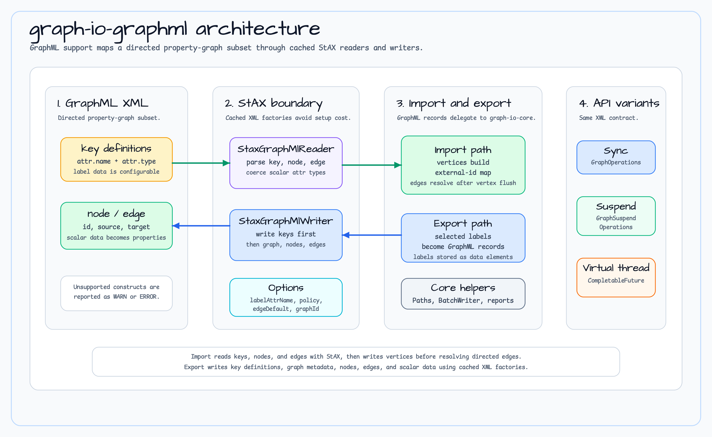

# graph-io-graphml

English | [한국어](README.ko.md)

GraphML (XML) bulk importer and exporter using StAX streaming parser for efficient memory usage and performance.

## Overview

The `graph-io-graphml` module provides three execution models for importing and exporting graph data in GraphML format:

1. **Synchronous API** - Blocking operations for simple use cases
2. **Coroutine Suspension API** - Async/await with `suspend` functions
3. **Virtual Thread API** - Thread-per-task execution using Java 21+ virtual threads

All implementations use StAX (Streaming API for XML) for memory-efficient parsing and writing of large GraphML files.

## Architecture



`graph-io-graphml` maps a directed GraphML property-graph subset through cached StAX readers and writers:

- `StaxGraphMlReader` parses `<key>`, `<node>`, `<edge>`, and scalar `<data>` into graph-io records.
- Import creates vertices first, records external IDs, then resolves directed edges.
- `StaxGraphMlWriter` writes key definitions before graph, node, edge, and data elements.
- `UnsupportedGraphMlElementPolicy` controls whether unsupported constructs become warnings or fail the import.
- Sync, virtual-thread, and suspend APIs share the same XML contract.

## Features

- **StAX-based streaming**: Memory-efficient parsing and serialization
- **GraphML subset support**: Directed graphs with nodes, edges, scalar data, and explicit reporting for unsupported constructs
- **Three execution models**: Sync, async, and virtual thread variants
- **Detailed import reports**: Comprehensive failure reporting with phase and severity tracking
- **Flexible configuration**: Customizable attribute names, default labels, and error handling policies
- **Bulk operations**: Optimized for large-scale graph import/export

## Installation

Add the dependency to your `build.gradle.kts`:

```kotlin
dependencies {
    implementation("io.bluetape4k:graph-io-graphml:$version")
}
```

## Usage Examples

### Synchronous Import

```kotlin
import io.bluetape4k.graph.io.graphml.GraphMlBulkImporter
import io.bluetape4k.graph.io.graphml.GraphMlImportOptions
import io.bluetape4k.graph.io.options.GraphImportOptions
import io.bluetape4k.graph.io.source.GraphImportSource
import io.bluetape4k.graph.repository.GraphOperations
import java.nio.file.Paths

val importer = GraphMlBulkImporter()
val source = GraphImportSource.PathSource(Paths.get("data.graphml"))
val ops: GraphOperations = /* your graph operations instance */

val report = importer.importGraph(
    source = source,
    operations = ops,
    options = GraphImportOptions(),
    graphMlOptions = GraphMlImportOptions(
        labelAttrName = "label",
        defaultVertexLabel = "Vertex",
        defaultEdgeLabel = "EDGE"
    )
)

println("Import completed: ${report.verticesCreated}/${report.verticesRead} vertices, " +
        "${report.edgesCreated}/${report.edgesRead} edges")
println("Status: ${report.status}")
```

### Coroutine-based Import

```kotlin
import io.bluetape4k.graph.io.graphml.SuspendGraphMlBulkImporter
import io.bluetape4k.graph.io.graphml.GraphMlImportOptions
import io.bluetape4k.graph.io.options.GraphImportOptions
import io.bluetape4k.graph.io.source.GraphImportSource
import io.bluetape4k.graph.repository.GraphSuspendOperations
import kotlinx.coroutines.runBlocking
import java.nio.file.Paths

val importer = SuspendGraphMlBulkImporter()
val source = GraphImportSource.PathSource(Paths.get("data.graphml"))
val ops: GraphSuspendOperations = /* your graph operations instance */

val report = runBlocking {
    importer.importGraphSuspending(
        source = source,
        operations = ops,
        options = GraphImportOptions(),
        graphMlOptions = GraphMlImportOptions()
    )
}

println("Import status: ${report.status}")
if (report.failures.isNotEmpty()) {
    report.failures.forEach { failure ->
        println("${failure.phase}: ${failure.message} (severity: ${failure.severity})")
    }
}
```

### Virtual Thread Export

```kotlin
import io.bluetape4k.graph.io.graphml.GraphMlVirtualThreadBulkExporter
import io.bluetape4k.graph.io.graphml.GraphMlExportOptions
import io.bluetape4k.graph.io.options.GraphExportOptions
import io.bluetape4k.graph.io.source.GraphExportSink
import io.bluetape4k.graph.repository.GraphOperations
import java.nio.file.Paths

val exporter = GraphMlVirtualThreadBulkExporter()
val sink = GraphExportSink.PathSink(Paths.get("output.graphml"))
val ops: GraphOperations = /* your graph operations instance */

val future = exporter.exportGraphAsync(
    sink = sink,
    operations = ops,
    options = GraphExportOptions(
        vertexLabels = setOf("Person", "Company"),
        edgeLabels = setOf("KNOWS", "WORKS_AT")
    ),
    graphMlOptions = GraphMlExportOptions()
)
val report = future.join()

println("Exported ${report.verticesWritten} vertices and ${report.edgesWritten} edges")
```

### Synchronous Export

```kotlin
import io.bluetape4k.graph.io.graphml.GraphMlBulkExporter
import io.bluetape4k.graph.io.options.GraphExportOptions
import io.bluetape4k.graph.io.source.GraphExportSink
import java.nio.file.Paths

val exporter = GraphMlBulkExporter()
val report = exporter.exportGraph(
    sink = GraphExportSink.PathSink(Paths.get("graph.graphml")),
    operations = ops,
    options = GraphExportOptions(
        vertexLabels = setOf("Person"),
        edgeLabels = setOf("KNOWS")
    )
)
```

## Configuration

### Import Options

`GraphMlImportOptions` allows customization of the import behavior:

```kotlin
data class GraphMlImportOptions(
    val labelAttrName: String = "label",                          // Attribute name for node/edge labels
    val unsupportedElementPolicy: UnsupportedGraphMlElementPolicy = UnsupportedGraphMlElementPolicy.SKIP,
    val defaultVertexLabel: String = "Vertex",                    // Default label for vertices without explicit label
    val defaultEdgeLabel: String = "EDGE"                         // Default label for edges without explicit label
)
```

Supported import subset:

- Directed `<graph>` documents with `<node>`, `<edge>`, and scalar `<data>` children.
- `key` definitions with scalar GraphML attribute types.
- Unsupported GraphML constructs such as undirected graphs, undirected edges, nested graphs, ports, and hyperedges are recorded in the import failure list.
- `UnsupportedGraphMlElementPolicy.SKIP` records `WARN` failures and continues with the supported subset.
- `UnsupportedGraphMlElementPolicy.FAIL` records `ERROR` failures and the bulk importer returns `FAILED` without creating graph elements.

### Compatibility Contract Beyond the Property-Graph Subset

| GraphML construct | Decision | Import behavior | Rationale |
|---|---|---|---|
| Directed graph with nodes, edges, scalar data, and scalar keys | Implemented | Imported/exported | Directly maps to `GraphVertex`, directed `GraphEdge`, and scalar properties. |
| Graph-level `edgedefault="undirected"` | Deferred | `SKIP` records `WARN`; `FAIL` returns `FAILED` before writes | `GraphEdge` is directed; auto-creating reverse edges would change edge counts and traversal semantics. |
| Edge-level `directed="false"` | Deferred | `SKIP` records `WARN` and keeps the source-to-target projection; `FAIL` returns `FAILED` before writes | The projection is useful for diagnostic imports but is not a faithful undirected-edge contract. |
| Nested `<graph>` | Rejected for this slice | `SKIP` records `WARN` and skips nested content; `FAIL` returns `FAILED` before writes | `GraphVertex` has no child graph scope. Flattening needs an explicit ownership mapping design. |
| `<hyperedge>` | Rejected | `SKIP` records `WARN`; `FAIL` returns `FAILED` before writes | `GraphEdge` has exactly one source and one target. Hyperedge support needs a reification-node policy. |
| `<port>` | Deferred | `SKIP` records `WARN`; `FAIL` returns `FAILED` before writes | Ports describe endpoint metadata, while current backend-neutral endpoints target vertices only. |
| XML extension payloads such as yFiles graphics | Deferred | Outside the supported contract | Visual metadata needs a namespaced extension-property policy before preservation. |

Representative fixtures under `src/test/resources/fixtures/graphml/` lock this contract for both permissive and strict import policies.

### Export Options

`GraphMlExportOptions` controls generated GraphML metadata and label data keys:

```kotlin
data class GraphMlExportOptions(
    val labelAttrName: String = "label",
    val edgeDefault: GraphMlEdgeDefault = GraphMlEdgeDefault.DIRECTED,
    val graphId: String = "G",
    val encoding: String = "UTF-8",
) : Serializable
```

## Performance Notes

### XMLFactory Caching (Critical)

`XMLInputFactory` and `XMLOutputFactory` instances are expensive to create. The module internally maintains singleton instances for optimal performance. **Do not create new instances for each operation.**

The `StaxGraphMlReader` and `StaxGraphMlWriter` classes use cached factories to avoid expensive initialization overhead.

### Memory Efficiency

The StAX streaming approach processes XML incrementally, making it suitable for large GraphML files that would not fit in memory with a DOM-based parser.

GraphML export uses `GraphExportOptions.exportChunkSize` for both vertex and edge repository reads. When the backend overrides the chunk-aware repository API (or provides a cursor-backed implementation), the exporter stages each bounded chunk once in the shared `GraphIoRecordSpool`, then replays the immutable disk snapshot for key discovery and XML writing. It avoids exporter-side whole-list materialization and a live second backend pass; the compatibility list/Flow fallback may still materialize a label before the exporter receives it. Active replay streams are closed during spool cleanup, and cleanup failures are suppressed behind the original source, sink, or cancellation failure. Temporary spool files are cleaned up on success, failure, and suspend cancellation.

The GraphML bounded-chunk TCK asserts the requested chunk size, one lookup per
selected label, and preservation of stage-time values when the backend mutates
after the first chunk. It does not claim bounded source execution for the
compatibility fallback, whose full label lookup can occur before the first
chunk is yielded.

The shared spool enforces a 128 MiB per-record encoding cap without creating a
second full-record `toByteArray()` copy. Constructor setup is fail-clean: if a
later temporary file or output stream cannot be opened, all resources acquired
before the failure are closed and deleted.

## Error Handling

Import operations return a detailed `GraphImportReport` containing:

- **Status**: COMPLETED, PARTIAL, or FAILED
- **Failures**: List of `GraphIoFailure` objects with:
  - Phase: READ_GRAPH, CREATE_VERTEX, CREATE_EDGE, READ_EDGE
  - Severity: INFO, WARN, ERROR
  - Message: Descriptive error message
  - RecordId: ID of the problematic record

Failures are collected and reported rather than failing fast, allowing partial imports to complete.

## Implementation Details

- `GraphMlBulkImporter` / `GraphMlBulkExporter`: Synchronous implementations
- `SuspendGraphMlBulkImporter` / `SuspendGraphMlBulkExporter`: Coroutine-based implementations with `Dispatchers.IO`
- `GraphMlVirtualThreadBulkImporter` / `GraphMlVirtualThreadBulkExporter`: Virtual thread implementations for Java 21+
- `StaxGraphMlReader` / `StaxGraphMlWriter`: Low-level streaming XML handling

## Dependencies

- `graph-io-core`: Core graph I/O interfaces and models
- `bluetape4k-coroutines`: Coroutine utilities
- `bluetape4k-virtualthread`: Virtual thread support for Java 21+

## Streaming reader contract

`GraphMlRecordFlowReader` parses nodes and edges through a cold `Flow` in source order. StAX events
are handed off incrementally; production import does not materialize a full vertex/edge list and
edge staging is bounded by `maxEdgeBufferSize`. `GraphImportOptions.batchSize` controls backend
write flushing only. Path and owned inputs are closed by the library, while caller-owned inputs remain open.
