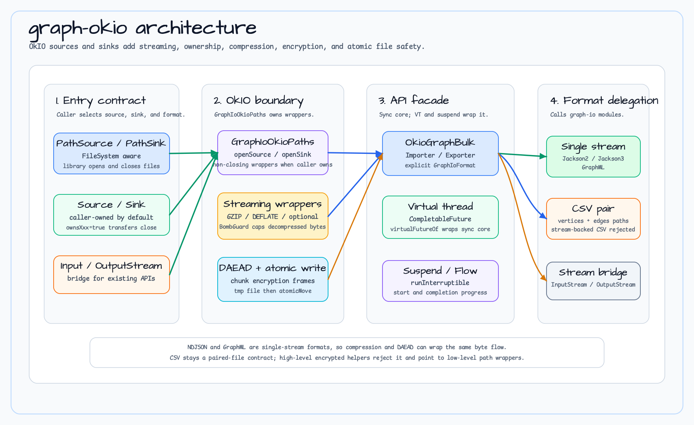

# graph-okio

[English](README.md) | [한국어](README.ko.md)

OkIO-based graph I/O layer. Fully compatible with the existing `graph-io-csv`,
`graph-io-jackson2`, `graph-io-jackson3`, and `graph-io-graphml` modules while
adding OkIO segment-based streaming, compression chaining, and `FileSystem`
abstraction.

## Architecture



`graph-okio` is an adapter layer around existing graph-io formats, not a new graph serialization format:

- `OkioGraphImportSource` and `OkioGraphExportSink` define path, OkIO source/sink, and stream entry points with explicit ownership.
- `GraphIoOkioPaths` opens buffered OkIO sources and sinks, then applies compression, DAEAD chunk encryption, decompression guards, and atomic file writes.
- `OkioGraphBulkImporter` and `OkioGraphBulkExporter` require an explicit `GraphIoFormat`; they do not infer format from file extensions.
- NDJSON and GraphML are single-stream formats and can use compression and encrypted helper APIs directly.
- CSV remains a paired-file contract, so high-level encrypted helpers reject it and low-level path wrappers must be composed manually for custom layouts.
- Virtual-thread and suspend adapters wrap the same sync core and return the same graph-io reports.

## Why OkIO

| java.io approach | OkIO approach |
|-----------------|---------------|
| Loads entire file into heap | 64 KB segment streaming — heap-efficient |
| Compression requires extra stream wrapping | Declarative chaining via `Compressors.Streaming.*` |
| File paths only | Three entry points: `PathSource`, `BufferedSource`, `InputStream` |
| No atomic writes | `PathSink(atomicWrite=true)` prevents partial-write corruption by default |
| No `FakeFileSystem` | `okio-fakefilesystem` simplifies tests |

## Supported Formats

| Format | `GraphIoFormat` | Description |
|--------|----------------|-------------|
| CSV | `CSV` | Separate vertex/edge files (`{stem}_vertices.csv` + `{stem}_edges.csv`) |
| NDJSON (Jackson 2) | `NDJSON_JACKSON2` | Newline-delimited JSON, Jackson 2.x |
| NDJSON (Jackson 3) | `NDJSON_JACKSON3` | Newline-delimited JSON, Jackson 3.x |
| GraphML | `GRAPHML` | XML/StAX-based graph interchange format |

## Core Types

### Source / Sink sealed interfaces

```kotlin
// Import source — three variants
sealed interface OkioGraphImportSource {
    data class PathSource(val path: Path, val fileSystem: FileSystem = FileSystem.SYSTEM) : OkioGraphImportSource
    data class SourceBased(val source: Source, val ownsSource: Boolean = false) : OkioGraphImportSource
    data class InputStreamBased(val inputStream: InputStream, val ownsStream: Boolean = false) : OkioGraphImportSource
}

// Export sink — three variants
sealed interface OkioGraphExportSink {
    data class PathSink(
        val path: Path,
        val fileSystem: FileSystem = FileSystem.SYSTEM,
        val mustCreate: Boolean = false,
        val mustExist: Boolean = false,
        val createParentDirectories: Boolean = true,
        val atomicWrite: Boolean = true,   // default: atomic write enabled
    ) : OkioGraphExportSink
    data class SinkBased(val sink: Sink, val ownsSink: Boolean = false) : OkioGraphExportSink
    data class OutputStreamBased(val outputStream: OutputStream, val ownsStream: Boolean = false) : OkioGraphExportSink
}
```

### Ownership Policy

| Variant | Default owner | Meaning |
|---------|--------------|---------|
| `PathSource` / `PathSink` | **Library** | Library opens and closes the file |
| `SourceBased(ownsSource=false)` | **Caller** | Source is not closed after import |
| `SinkBased(ownsSink=false)` | **Caller** | Sink is not closed after export |
| `SourceBased(ownsSource=true)` | **Library** | Library closes the Source on completion |

`ownsXxx=false` is the default, so externally-provided `Source`/`Sink`/`Stream`
instances are managed by the caller.

### Compression

```kotlin
enum class Compressor { GZIP, DEFLATE, LZ4, SNAPPY, ZSTD, BZIP2 }
```

| Compressor | Dependency | Always available |
|-----------|-----------|:---------------:|
| `GZIP` | JDK built-in | ✅ |
| `DEFLATE` | JDK built-in | ✅ |
| `LZ4` | `org.lz4:lz4-java` | Optional |
| `SNAPPY` | `org.xerial.snappy:snappy-java` | Optional |
| `ZSTD` | `com.github.luben:zstd-jni` | Optional |
| `BZIP2` | `org.apache.commons:commons-compress` | Optional |

Using LZ4/Snappy/Zstd/Bzip2 without the optional dependency throws
`IllegalStateException` with a `build.gradle.kts` snippet to resolve it.

## Usage

### Sync API

```kotlin
val importer = OkioGraphBulkImporter()
val exporter = OkioGraphBulkExporter()

// Export to file path (atomic write by default)
exporter.exportGraph(
    OkioGraphExportSink.PathSink("/data/graph.ndjson".toPath()),
    GraphIoFormat.NDJSON_JACKSON3,
    graphOperations,
    GraphExportOptions(vertexLabels = setOf("Person"), edgeLabels = setOf("KNOWS")),
)

// Import from file path
importer.importGraph(
    OkioGraphImportSource.PathSource("/data/graph.ndjson".toPath()),
    GraphIoFormat.NDJSON_JACKSON3,
    graphOperations,
    GraphImportOptions(),
)
```

### GZIP Compression

```kotlin
// export → .ndjson.gz
exporter.exportGraphGzip(
    OkioGraphExportSink.PathSink("/data/graph.ndjson.gz".toPath()),
    GraphIoFormat.NDJSON_JACKSON3,
    graphOperations,
    exportOptions,
)

// import ← .ndjson.gz
importer.importGraphGzip(
    OkioGraphImportSource.PathSource("/data/graph.ndjson.gz".toPath()),
    GraphIoFormat.NDJSON_JACKSON3,
    graphOperations,
    importOptions,
)
```

### Format-specific Extension Functions

```kotlin
// Jackson 2/3
jackson2Exporter.exportGraph(sink, operations, options)
jackson2Exporter.exportGraphGzip(sink, operations, options)
jackson2Importer.importGraph(source, operations, options)
jackson2Importer.importGraphGzip(source, operations, options)

// GraphML
graphMlExporter.exportGraph(sink, operations, options)
graphMlExporter.exportGraphGzip(sink, operations, options)
graphMlImporter.importGraph(source, operations, options)
graphMlImporter.importGraphGzip(source, operations, options)

// CSV (PathSource/PathSink only)
csvExporter.exportGraph(sink, operations, options)
csvImporter.importGraph(source, operations, options)
```

### Virtual Thread (async)

```kotlin
val adapter = VirtualThreadGraphIoOkioBulkAdapter()

val future: CompletableFuture<GraphExportReport> = adapter.exportGraphAsync(
    sink, GraphIoFormat.NDJSON_JACKSON3, operations, options
)
val future: CompletableFuture<GraphImportReport> = adapter.importGraphAsync(
    source, GraphIoFormat.NDJSON_JACKSON3, operations, options
)

// Extension function variants
exporter.exportGraphAsync(sink, operations, options)
importer.importGraphAsync(source, operations, options)
```

### Coroutine (suspend / Flow)

```kotlin
val adapter = SuspendGraphIoOkioBulkAdapter()

// Returns a completion report
val report: GraphExportReport = adapter.exportGraphAwait(sink, GraphIoFormat.NDJSON_JACKSON3, ops, options)
val report: GraphImportReport = adapter.importGraphAwait(source, GraphIoFormat.NDJSON_JACKSON3, ops, options)

// Progress as Flow
adapter.exportGraph(sink, GraphIoFormat.NDJSON_JACKSON3, ops, options).collect { progress ->
    println("exported: ${progress.exported}")
}
adapter.importGraph(source, GraphIoFormat.NDJSON_JACKSON3, ops, options).collect { progress ->
    println("processed: ${progress.processed}")
}

// Extension function variants
exporter.exportGraphAwait(sink, operations, options)
exporter.exportGraphFlow(sink, operations, options)
importer.importGraphAwait(source, operations, options)
importer.importGraphFlow(source, operations, options)
```

### Compression Chaining

```kotlin
// GZIP convenience
GraphIoOkioPaths.openGzipSink(sink)      // BufferedSink (GZIP-compressed)
GraphIoOkioPaths.openGzipSource(source)  // BufferedSource (GZIP-decompressed, 512 MiB limit)

// Generic compression
GraphIoOkioPaths.openCompressedSink(rawSink, Compressor.ZSTD)
GraphIoOkioPaths.openDecompressedSource(rawSource, Compressor.ZSTD, maxDecompressedBytes = 1_073_741_824L)
```

### DAEAD Chunk Encryption

`graph-okio` can wrap single-stream formats with deterministic DAEAD chunk
encryption from `bluetape4k-okio`. Use this for NDJSON or GraphML payloads
that must be authenticated and encrypted while still flowing through OkIO
streaming APIs.

```kotlin
val daead = TinkDaeads.AES256_SIV
val associatedData = "tenant-a:graph-export".encodeToByteArray()

exporter.exportGraphDaead(
    sink = OkioGraphExportSink.PathSink("/data/graph.ndjson.enc".toPath()),
    format = GraphIoFormat.NDJSON_JACKSON3,
    daead = daead,
    operations = graphOperations,
    associatedData = associatedData,
)

importer.importGraphDaead(
    source = OkioGraphImportSource.PathSource("/data/graph.ndjson.enc".toPath()),
    format = GraphIoFormat.NDJSON_JACKSON3,
    daead = daead,
    operations = graphOperations,
    associatedData = associatedData,
)
```

For compress-then-encrypt pipelines, use the convenience helpers:

```kotlin
exporter.exportGraphGzipDaead(sink, GraphIoFormat.NDJSON_JACKSON3, daead, graphOperations)
importer.importGraphDaeadGzip(source, GraphIoFormat.NDJSON_JACKSON3, daead, graphOperations)
```

CSV is a paired-file format, so the high-level encrypted helpers intentionally
reject `GraphIoFormat.CSV`. Use `GraphIoOkioPaths.openDaeadEncryptedSink()` and
`openDaeadDecryptedSource()` directly to build a custom encrypted CSV file-pair
layout.

### Atomic Writes

When `PathSink(atomicWrite = true)` (the default):

1. Writes to `{target}.tmp.{UUID}` temporary file.
2. On success → `atomicMove(tmp, target)`.
3. On failure → temp file deleted; target file remains untouched.

```kotlin
// Disable atomic writes (direct write)
val sink = OkioGraphExportSink.PathSink(path, atomicWrite = false)
```

### FakeFileSystem Testing Pattern

```kotlin
class MyGraphIoTest {
    private val fakeFs = FakeFileSystem()

    @AfterEach
    fun cleanup() {
        fakeFs.checkNoOpenFiles()  // detect file handle leaks
    }

    @Test
    fun `round trip test`() {
        val path = "/graph.ndjson".toPath()
        val exporter = OkioGraphBulkExporter()

        exporter.exportGraph(
            OkioGraphExportSink.PathSink(path, fakeFs),
            GraphIoFormat.NDJSON_JACKSON3,
            myOperations,
            exportOptions,
        )

        // import + verify
    }
}
```

## Performance (JMH — `small`: 1K vertices / 2K edges | `medium`: 10K vertices / 20K edges)

> Run with `./gradlew :graph-io-benchmark:benchmark`.
> Environment: Java 25, Apple M3 Pro, 1 warmup / 3 iterations / 2 s each (quick measurement).
> For production-grade numbers, use defaults (3 warmup / 5 iterations / 3 s).

### NDJSON (Jackson3) — Export (AverageTime, ms/op, lower is better)

| Scenario | small | medium |
|----------|------:|-------:|
| `jackson3JavaIoExport` (baseline) | 1.23 | 18.06 |
| `jackson3OkioExport` | 1.53 | 19.69 |
| `jackson3OkioGzipExport` | 3.09 | 39.87 |
| `jackson3VtOkioExport` (VirtualThread) | 1.47 | 19.34 |

### NDJSON (Jackson3) — Import / RoundTrip

| Scenario | small | medium |
|----------|------:|-------:|
| `jackson3JavaIoImport` (baseline) | 17.26 | 183.93 |
| `jackson3OkioImport` | 17.40 | 184.61 |
| `jackson3OkioGzipImport` | 20.06 | 226.40 |
| `jackson3OkioRoundTrip` | 17.34 | 192.44 |
| `jackson3OkioGzipRoundTrip` | 20.04 | 212.96 |
| `jackson3VtOkioImport` (VirtualThread) | 16.99 | 184.68 |
| `jackson3VtOkioRoundTrip` | 17.27 | 191.34 |

### GraphML (StAX) — Export / Import / RoundTrip

| Scenario | small | medium |
|----------|------:|-------:|
| `graphMlJavaIoExport` (baseline) | 2.37 | 33.88 |
| `graphMlOkioExport` | 3.70 | 39.36 |
| `graphMlJavaIoImport` (baseline) | 18.74 | 215.44 |
| `graphMlOkioImport` | 19.93 | 220.84 |
| `graphMlOkioRoundTrip` | 20.75 | 215.05 |

**Observations:**
- NDJSON OkIO export is +25% slower (small) / +9% (medium) vs java.io baseline; import is on par.
- Virtual Thread overhead is negligible (same as sync OkIO).
- GZIP export is ~2× slower than plain; GZIP import is only +15%.
- GraphML OkIO adds +10–15% overhead due to StAX → InputStream adapter conversion.

## Security

- **XXE prevention**: GraphML StAX parser applies `SUPPORT_DTD=false` and
  `IS_SUPPORTING_EXTERNAL_ENTITIES=false` (delegated to the existing implementation).
- **Decompression bomb protection**: `BombGuardSource` tracks decompressed bytes and
  throws `IOException` when `maxDecompressedBytes` is exceeded.
  - Default limit: 512 MiB (`DEFAULT_MAX_DECOMPRESSED_BYTES`)
  - Custom limit: `openDecompressedSource(source, compressor, maxDecompressedBytes = 1L * 1024 * 1024 * 1024)`
- **DAEAD deterministic encryption**: Repeated plaintext chunks encrypted with the same
  key and associated data produce repeated ciphertext chunks. Choose associated data
  deliberately (tenant / purpose / schema version) and manage keys outside this module.
- **CSV GZIP streaming**: Both `importGraphGzip` and `exportGraphGzip` are single-pass
  streaming — no intermediate buffering.

## Gradle Dependency

```kotlin
// build.gradle.kts
dependencies {
    implementation("io.github.bluetape4k.graph:bluetape4k-graph-okio:VERSION")

    // Optional compression libraries — add only what you need
    implementation("org.lz4:lz4-java:1.8.0")
    implementation("org.xerial.snappy:snappy-java:1.1.10.7")
    implementation("com.github.luben:zstd-jni:1.5.6-6")
    implementation("org.apache.commons:commons-compress:1.28.0")
}
```

## Roadmap

- **v2**: Stream-based CSV without `PathSource`/`PathSink` constraint
