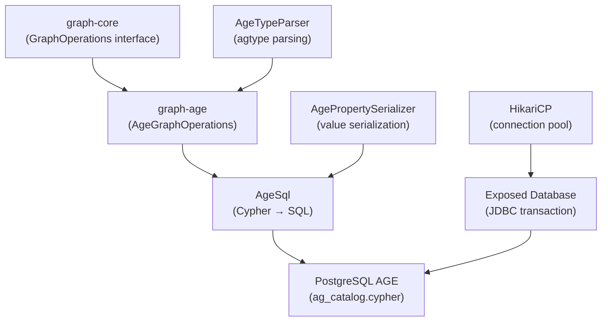

# graph-age

`GraphOperations` implementation based on Apache AGE (PostgreSQL graph extension). Executes Cypher queries translated to SQL on top of PostgreSQL, leveraging JetBrains Exposed ORM and the HikariCP connection pool.

> 🇰🇷 [한국어 문서](README.ko.md)

## Module Description

- **Apache AGE-based**: Performs graph operations by executing Cypher through PostgreSQL's built-in Cypher engine as SQL queries
- **Exposed + JDBC**: Data access via JetBrains Exposed transactions and the PostgreSQL JDBC driver
- **SQL Builder**: The `AgeSql` object generates Cypher-over-SQL query strings
- **agtype Parsing**: Converts PostgreSQL `agtype` results into graph domain models
- **Coroutine-Based**: All methods are `suspend` functions and run on `Dispatchers.IO`

## Architecture

### Module Layer Structure



## Key Classes

| Class | Description |
|-------|-------------|
| `AgeGraphOperations` | Synchronous `GraphOperations` implementation backed by Exposed + JDBC |
| `AgeGraphSuspendOperations` | Coroutine-based `GraphSuspendOperations` implementation |
| `AgeSql` | Produces SQL strings that wrap Cypher queries for Apache AGE |
| `AgePropertySerializer` | Serializes Kotlin values into AGE-compatible literals |
| `AgeTypeParser` | Parses `agtype` results into `GraphVertex`, `GraphEdge`, and `GraphPath` |

## Dependencies

```kotlin
dependencies {
    api(project(":graph-core"))
    api(Libs.exposed_core)
    api(Libs.exposed_jdbc)
    api(Libs.postgresql_driver)
    api(Libs.kotlinx_coroutines_core)
}
```

## HikariCP + PostgreSQL AGE Setup

Apache AGE requires every connection to load the extension and set the search path.

```kotlin
val hikariConfig = HikariConfig().apply {
    jdbcUrl = "jdbc:postgresql://localhost:5432/postgres"
    username = "postgres"
    password = "postgres"
    driverClassName = "org.postgresql.Driver"
    connectionInitSql = """LOAD 'age'; SET search_path = ag_catalog, "${'$'}user", public"""
}
val dataSource = HikariDataSource(hikariConfig)
val database = Database.connect(dataSource)
```

## Usage Example

```kotlin
val ops = AgeGraphOperations("my_graph")

// Create graph
ops.createGraph("my_graph")

// Create vertex
val alice = ops.createVertex(
    label = "Person",
    properties = mapOf("name" to "Alice", "age" to 30),
)

// Create edge
val bob = ops.createVertex("Person", mapOf("name" to "Bob", "age" to 28))
val knows = ops.createEdge(
    startId = alice.id,
    endId = bob.id,
    label = "KNOWS",
    properties = mapOf("since" to LocalDate.now()),
)

// Shortest path
val path = ops.shortestPath(alice.id, bob.id, edgeLabel = "KNOWS", maxDepth = 5)

// Neighbors
val neighbors = ops.neighbors(alice.id, edgeLabel = "KNOWS", direction = Direction.OUTGOING)
```

## Notes

### ID Type
Apache AGE stores vertex/edge IDs as `agtype` (BIGINT). The abstraction wraps them as strings in `GraphElementId`.

### agtype Parsing Limitations
Nested JSON structures inside AGE results are parsed by `AgeTypeParser`. Extremely deep or exotic types may require custom handling.

### HikariCP `connectionInitSql`
The `LOAD 'age'` and `search_path` statement **must** be set via `connectionInitSql` — otherwise each connection pulled from the pool will fail to recognize AGE functions.

### Transaction Isolation
All operations run inside Exposed transactions. For long-running traversals, consider using the coroutine variant with `Dispatchers.IO`.

## Testing

Integration tests use Testcontainers with the `apache/age:PG16_latest` image.

```bash
./gradlew :graph-age:test
```

## Graph Algorithms

### Algorithm Support Matrix

| Algorithm | Implementation | Notes |
|-----------|---------------|-------|
| `degreeCentrality` | Cypher-over-SQL native (`AgeSql.degreeCypher`) | |
| `bfs` / `dfs` | JVM fallback (`BfsDfsRunner`) | AGE lacks native BFS/DFS functions |
| `detectCycles` | JVM fallback (`CycleDetector`) | |
| `connectedComponents` | JVM fallback (`UnionFind`) | |
| `pageRank` | JVM fallback (`PageRankCalculator`) | |

### Usage Example

```kotlin
val ops = AgeGraphOperations("social")

// Degree centrality (native Cypher-over-SQL)
val degree = ops.degreeCentrality(alice.id, DegreeOptions(edgeLabel = "KNOWS"))
println("in=${degree.inDegree} out=${degree.outDegree}")

// BFS (JVM fallback)
val visits = ops.bfs(alice.id, BfsDfsOptions(edgeLabel = "KNOWS", maxDepth = 3))

// PageRank (JVM fallback)
val top10 = ops.pageRank(PageRankOptions(vertexLabel = "Person", topK = 10))
top10.forEach { println("${it.vertex.properties["name"]}: ${it.score}") }
```

## References

- [Apache AGE](https://age.apache.org/)
- [JetBrains Exposed](https://github.com/JetBrains/Exposed)
- [HikariCP](https://github.com/brettwooldridge/HikariCP)
