# graph-age

Apache AGE (PostgreSQL 그래프 확장)를 기반으로 한 `GraphOperations` 구현체. PostgreSQL 위에서 Cypher 쿼리를 SQL로 변환하여 실행하며, JetBrains Exposed ORM과 HikariCP 연결 풀을 활용한다.

## 모듈 설명

- **Apache AGE 기반**: PostgreSQL 내장 Cypher 엔진으로 SQL 쿼리로 그래프 연산 수행
- **Exposed + JDBC**: JetBrains Exposed 트랜잭션과 PostgreSQL JDBC 드라이버로 데이터 접근
- **SQL 빌더**: `AgeSql` 객체로 Cypher-over-SQL 쿼리 문자열 생성
- **agtype 파싱**: PostgreSQL의 `agtype` 결과를 Graph 모델로 변환
- **코루틴 기반**: 모든 메서드가 `suspend` 함수이며 `Dispatchers.IO`에서 실행

## 아키텍처

### 모듈 레이어 구조

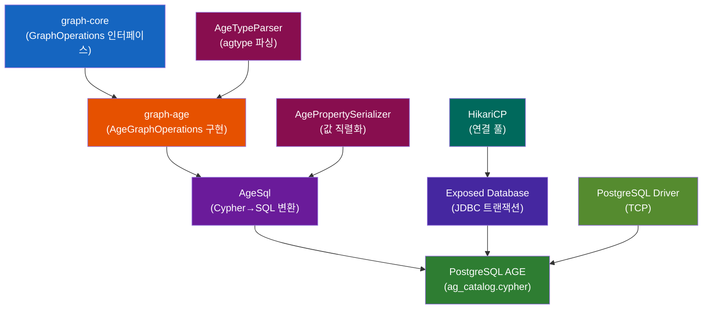

### Apache AGE 동작 흐름

```mermaid
graph LR
    A["GraphOperations 메서드<br/>createVertex, shortestPath 등"] --> B["AgeGraphOperations<br/>withContext IO"]
    B --> C["Exposed transaction"]
    C --> D["AgeSql 빌더<br/>Cypher-over-SQL"]
    D --> E["SQL 쿼리 문자열<br/>SELECT * FROM ag_catalog.cypher"]
    E --> F["PostgreSQL<br/>AGE Extension"]
    F --> G["Cypher 엔진<br/>MATCH RETURN CREATE"]
    G --> H["결과 agtype<br/>JSON 유사 포맷"]
    H --> I["AgeTypeParser<br/>agtype → GraphVertex/Edge"]
    I --> J["GraphVertex<br/>GraphEdge<br/>GraphPath"]

    style A fill:#E65100,color:#fff
    style B fill:#6A1B9A,color:#fff
    style C fill:#4527A0,color:#fff
    style D fill:#880E4F,color:#fff
    style E fill:#00695C,color:#fff
    style F fill:#2E7D32,color:#fff
    style G fill:#388E3C,color:#fff
    style H fill:#827717,color:#fff
    style I fill:#880E4F,color:#fff
    style J fill:#388E3C,color:#fff
```

## 주요 클래스

### AgeGraphOperations 클래스 다이어그램

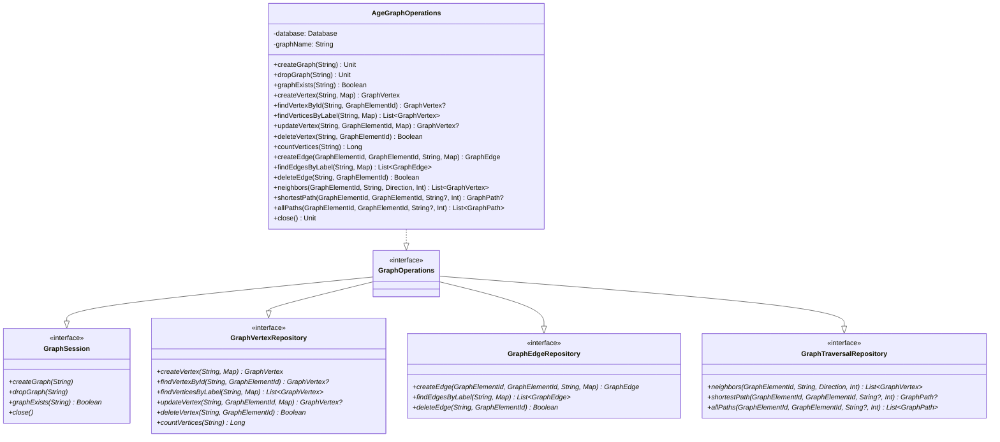

### AgeSql 클래스 다이어그램

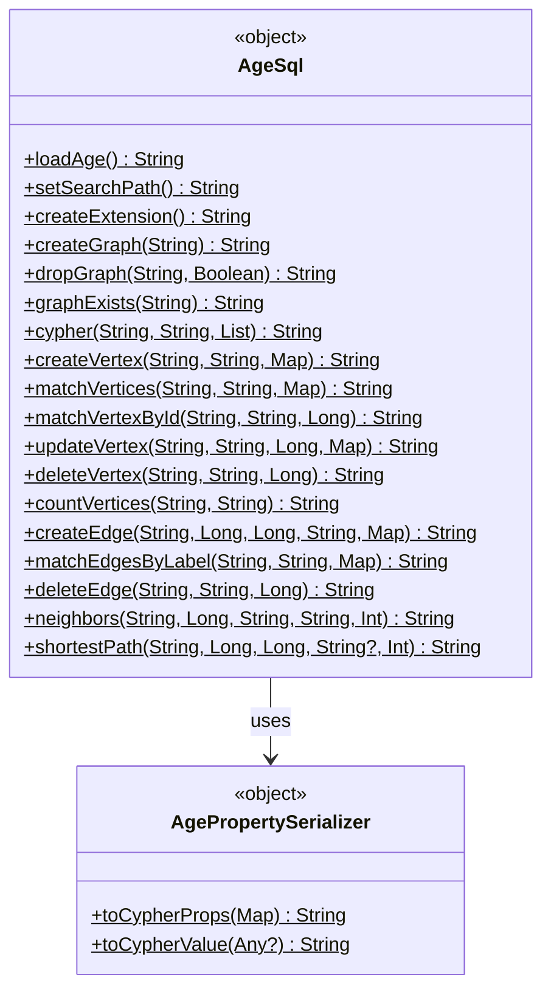

### AgeTypeParser 클래스 다이어그램

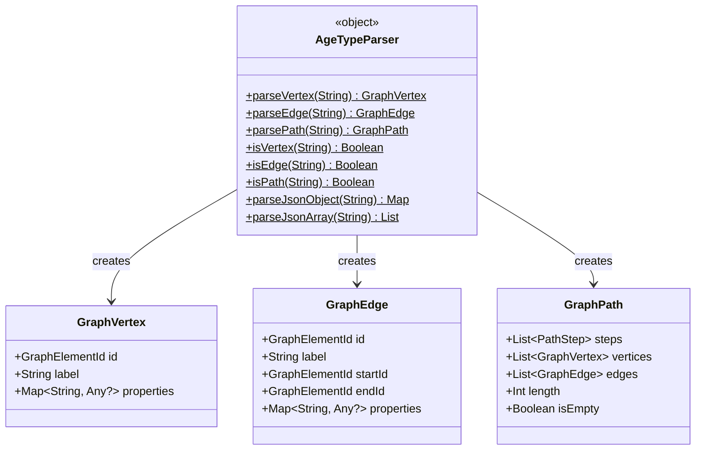

## 시퀀스 다이어그램

### createVertex 호출 흐름

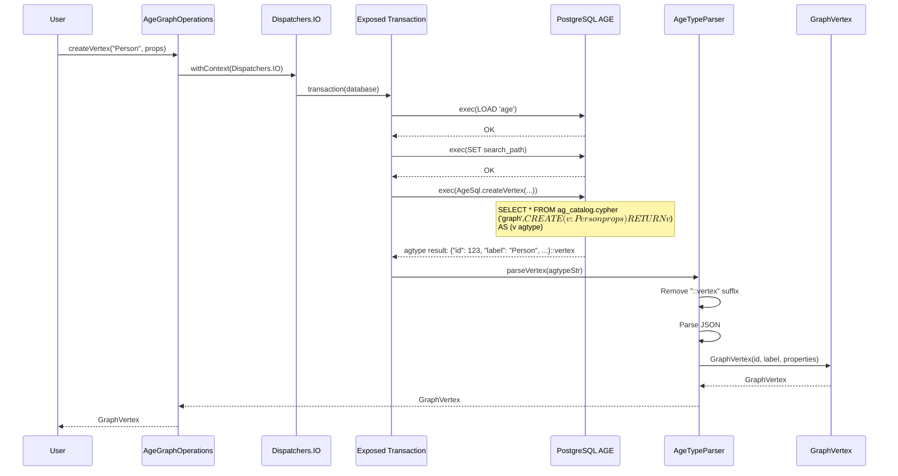

### createEdge 호출 흐름

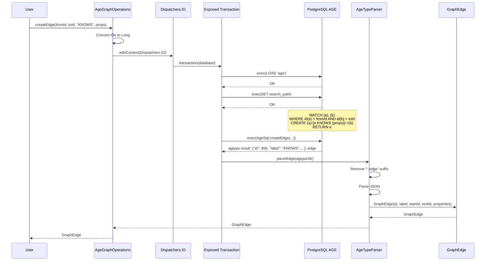

### shortestPath 호출 흐름

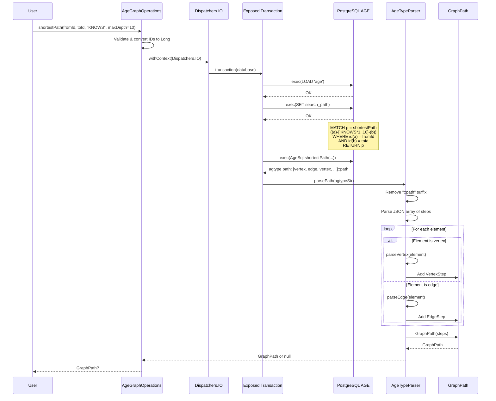

### neighbors 탐색 (방향별)

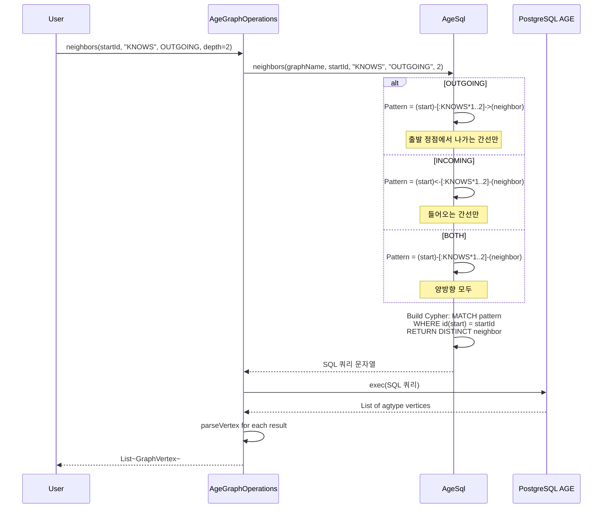

## agtype 파싱 플로우

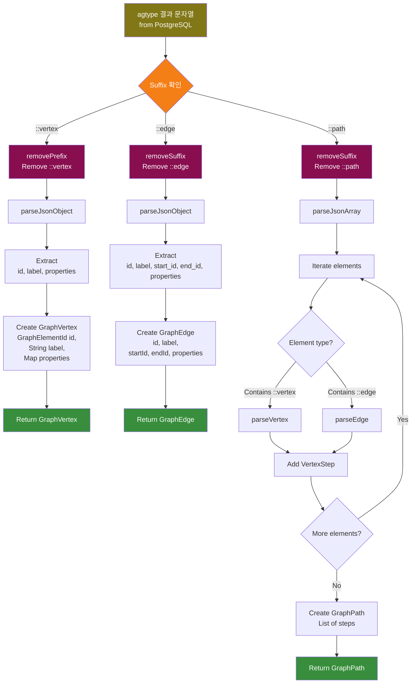

## HikariCP 연결 초기화

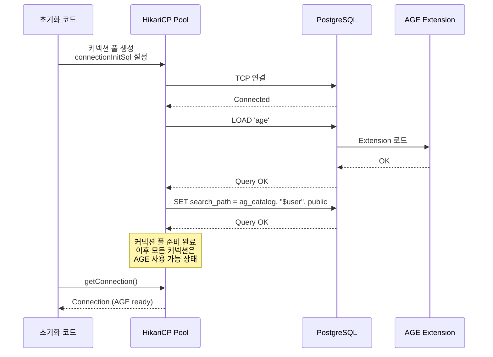

## 테스트 환경 구성

```mermaid
graph TD
    A["테스트 시작"] --> B["PostgreSQLAgeServer<br/>Testcontainers"]
    B --> C["Docker 이미지<br/>apache/age:PG16_latest"]
    C --> D["PostgreSQL 16<br/>+ AGE Extension"]
    D --> E["CREATE EXTENSION<br/>IF NOT EXISTS age<br/>자동 실행"]

    E --> F["HikariCP DataSource"]
    F --> G["connectionInitSql<br/>LOAD 'age'<br/>SET search_path"]
    G --> H["Exposed Database"]
    H --> I["AgeGraphOperations"]
    I --> J["테스트 메서드<br/>runTest"]

    J --> K["suspend 메서드 호출<br/>createVertex 등"]
    K --> L["withContext<br/>Dispatchers.IO"]
    L --> M["transaction"]
    M --> N["PostgreSQL 쿼리"]
    N --> O["agtype 결과"]
    O --> P["AgeTypeParser"]
    P --> Q["GraphVertex<br/>GraphEdge<br/>GraphPath"]
    Q --> R["테스트 검증"]
    R --> S["테스트 완료"]
    S --> T["컨테이너 정리"]

    style A fill:#388E3C,color:#fff
    style B fill:#2E7D32,color:#fff
    style C fill:#388E3C,color:#fff
    style D fill:#a5d6a7,color:#fff
    style F fill:#4527A0,color:#fff
    style H fill:#6A1B9A,color:#fff
    style I fill:#E65100,color:#fff
    style J fill:#388E3C,color:#fff
    style T fill:#ffcdd2,color:#fff
```

## 코드 예시

### 의존성

```kotlin
// build.gradle.kts
dependencies {
    api(project(":graph-core"))
    api(Libs.exposed_core)
    api(Libs.exposed_dao)
    api(Libs.exposed_jdbc)
    api(Libs.exposed_java_time)
    api(Libs.postgresql_driver)
    api(Libs.kotlinx_coroutines_core)

    testImplementation(Libs.bluetape4k_junit5)
    testImplementation(Libs.bluetape4k_testcontainers)
    testImplementation(Libs.testcontainers_postgresql)
    testImplementation(Libs.hikaricp)
    testImplementation(Libs.kotlinx_coroutines_test)
}
```

### HikariCP + PostgreSQL AGE 설정

```kotlin
import com.zaxxer.hikari.HikariConfig
import com.zaxxer.hikari.HikariDataSource
import org.jetbrains.exposed.v1.jdbc.Database

// PostgreSQL AGE 서버 시작 (Testcontainers)
val pgServer = PostgreSQLAgeServer().also { it.start() }

// HikariCP 설정: AGE LOAD + search_path 자동 실행
val hikariConfig = HikariConfig().apply {
    jdbcUrl = pgServer.jdbcUrl
    username = pgServer.username
    password = pgServer.password
    driverClassName = "org.postgresql.Driver"

    // 각 커넥션 획득 시 AGE 초기화
    connectionInitSql = """
        LOAD 'age';
        SET search_path = ag_catalog, "${'$'}user", public
    """.trimIndent()

    maximumPoolSize = 5
    minimumIdle = 2
}
val datasource = HikariDataSource(hikariConfig)

// Exposed Database 생성
val database = Database.connect(datasource)

// AgeGraphOperations 인스턴스
val graphOps = AgeGraphOperations(
    database = database,
    graphName = "my_graph"
)
```

### 그래프 초기화

```kotlin
// 그래프 생성 (첫 사용 시)
graphOps.createGraph("my_graph")

// 또는 존재 여부 확인 후 생성
if (!graphOps.graphExists("my_graph")) {
    graphOps.createGraph("my_graph")
}
```

### 정점 생성

```kotlin
runTest {
    // 단순 정점 생성
    val alice = graphOps.createVertex(
        label = "Person",
        properties = mapOf(
            "name" to "Alice",
            "age" to 30,
            "email" to "alice@example.com"
        )
    )
    // GraphVertex(id=GraphElementId("12345"), label="Person", properties={...})

    val bob = graphOps.createVertex(
        label = "Person",
        properties = mapOf(
            "name" to "Bob",
            "age" to 28,
            "email" to "bob@example.com"
        )
    )
}
```

### 간선 생성

```kotlin
runTest {
    val knows = graphOps.createEdge(
        fromId = alice.id,
        toId = bob.id,
        label = "KNOWS",
        properties = mapOf(
            "since" to LocalDate.of(2020, 1, 15),
            "strength" to 5
        )
    )
    // GraphEdge(
    //   id=GraphElementId("456"),
    //   label="KNOWS",
    //   startId=alice.id,
    //   endId=bob.id,
    //   properties={since: LocalDate, strength: 5}
    // )
}
```

### 최단 경로 찾기

```kotlin
runTest {
    val path = graphOps.shortestPath(
        fromId = alice.id,
        toId = bob.id,
        edgeLabel = "KNOWS",
        maxDepth = 10
    )

    if (path != null && !path.isEmpty) {
        println("경로 길이: ${path.length} (간선 수)")
        println("정점 수: ${path.vertices.size}")

        // 경로의 모든 단계 순회
        path.steps.forEachIndexed { idx, step ->
            when (step) {
                is PathStep.VertexStep -> {
                    println("[$idx] 정점: ${step.vertex.properties["name"]}")
                }
                is PathStep.EdgeStep -> {
                    println("[$idx] 간선: ${step.edge.label}")
                }
            }
        }
    }
}
```

### 인접 정점 탐색

```kotlin
runTest {
    // 나가는 간선 (OUTGOING)
    val friends = graphOps.neighbors(
        startId = alice.id,
        edgeLabel = "KNOWS",
        direction = Direction.OUTGOING,
        depth = 1
    )
    // [bob, charlie, dave] - alice가 KNOWS하는 사람들

    // 들어오는 간선 (INCOMING)
    val admirers = graphOps.neighbors(
        startId = alice.id,
        edgeLabel = "KNOWS",
        direction = Direction.INCOMING,
        depth = 1
    )
    // [eve, frank] - alice를 KNOWS하는 사람들

    // 양방향
    val allConnected = graphOps.neighbors(
        startId = alice.id,
        edgeLabel = "KNOWS",
        direction = Direction.BOTH,
        depth = 1
    )
    // [bob, charlie, dave, eve, frank] - 모든 연결된 사람들

    // 깊이 기반 탐색 (2촌)
    val secondDegree = graphOps.neighbors(
        startId = alice.id,
        edgeLabel = "KNOWS",
        direction = Direction.OUTGOING,
        depth = 2
    )
}
```

### 모든 경로 탐색

```kotlin
runTest {
    val allPaths = graphOps.allPaths(
        fromId = alice.id,
        toId = charlie.id,
        edgeLabel = "KNOWS",
        maxDepth = 5
    )

    println("총 경로 수: ${allPaths.size}")

    for ((idx, path) in allPaths.withIndex()) {
        println("경로 $idx: ${path.length}개 간선, ${path.vertices.size}개 정점")
        val names = path.vertices.map { it.properties["name"] }
        println("  $names")
    }
}
```

### 정점 수정

```kotlin
runTest {
    val updated = graphOps.updateVertex(
        label = "Person",
        id = alice.id,
        properties = mapOf(
            "age" to 31,
            "email" to "alice.updated@example.com"
        )
    )
    // 수정된 GraphVertex 반환
    println("Updated: ${updated?.properties}")
}
```

### 정점/간선 조회 및 삭제

```kotlin
runTest {
    // ID로 조회
    val vertex = graphOps.findVertexById("Person", alice.id)
    println("Found: $vertex")

    // 레이블로 전체 조회
    val allPersons = graphOps.findVerticesByLabel("Person")
    println("All persons: ${allPersons.size}")

    // 필터 조건으로 조회
    val engineers = graphOps.findVerticesByLabel(
        "Person",
        filter = mapOf("role" to "Engineer")
    )

    // 정점 개수
    val count = graphOps.countVertices("Person")
    println("Total persons: $count")

    // 간선 조회
    val knowsEdges = graphOps.findEdgesByLabel("KNOWS")

    // 간선 필터
    val strongRelations = graphOps.findEdgesByLabel(
        "KNOWS",
        filter = mapOf("strength" to 5)
    )

    // 정점 삭제
    val deleted = graphOps.deleteVertex("Person", alice.id)
    println("Deleted: $deleted")

    // 간선 삭제
    val edgeDeleted = graphOps.deleteEdge("KNOWS", knows.id)
}
```

## 내부 구현 상세

### AgeSql 쿼리 생성 예

정점 생성 시 생성되는 SQL:

```sql
SELECT *
FROM ag_catalog.cypher(
    'my_graph',
    $$ CREATE (v:Person {name: 'Alice', age: 30}) RETURN v $$
) AS (v agtype)
```

간선 생성 시 생성되는 SQL:

```sql
SELECT *
FROM ag_catalog.cypher(
    'my_graph',
    $$ MATCH (a), (b)
       WHERE id(a) = 123 AND id(b) = 456
       CREATE (a)-[e:KNOWS {since: '2020-01-15', strength: 5}]->(b)
       RETURN e $$
) AS (e agtype)
```

최단 경로 쿼리:

```sql
SELECT *
FROM ag_catalog.cypher(
    'my_graph',
    $$ MATCH p = shortestPath((a)-[:KNOWS*1..10]-(b))
       WHERE id(a) = 123 AND id(b) = 456
       RETURN p $$
) AS (p agtype)
```

### AgePropertySerializer 변환

Kotlin 값을 Cypher 맵으로 변환:

```kotlin
// 입력
mapOf(
    "name" to "Alice",
    "age" to 30,
    "joinedAt" to LocalDate.of(2020, 1, 15),
    "tags" to listOf("engineer", "kotlin"),
    "metadata" to mapOf("level" to "senior")
)

// 출력 (Cypher 문자열)
{name: 'Alice', age: 30, joinedAt: '2020-01-15', tags: ['engineer', 'kotlin'], metadata: {level: 'senior'}}
```

### AgeTypeParser agtype 파싱

PostgreSQL AGE의 agtype 응답:

```json
{"id": 12345, "label": "Person", "properties": {"name": "Alice", "age": 30}}::vertex
```

파싱 결과:

```kotlin
GraphVertex(
    id = GraphElementId("12345"),
    label = "Person",
    properties = mapOf("name" to "Alice", "age" to 30)
)
```

## 주의사항

### ID 타입

- **AGE 내부 ID**: Long 형식 (64bit)
- **GraphElementId**: String 래퍼
- **변환**: `id.value.toLongOrNull()` 사용 후 전달

예외 발생 조건:
```kotlin
val longId = id.value.toLongOrNull()
    ?: throw GraphQueryException("AGE requires numeric ID, got: ${id.value}")
```

### agtype 파싱 한계

현재 `AgeTypeParser`는 Jackson/Gson 없이 단순 JSON 파싱을 수행:

- 깊게 중첩된 객체 파싱에 한계
- 특수 문자 이스케이핑 기본 처리만 지원
- 복잡한 구조는 Jackson 도입 고려

### HikariCP connectionInitSql

각 커넥션 획득 시 `LOAD 'age'` 실행:

```kotlin
connectionInitSql = "LOAD 'age'; SET search_path = ag_catalog, \"${'$'}user\", public"
```

주의: 스크립트 여러 줄은 세미콜론(`;`)으로 구분하되, 마지막 문장도 세미콜론 포함

### 트랜잭션 격리

모든 메서드는 `withContext(Dispatchers.IO) { transaction { ... } }` 내에서 실행:

- 각 메서드는 독립적인 트랜잭션
- 외부 트랜잭션 관리 불가
- 멀티 쿼리 원자성 필요 시 별도 API 확장 필요

## 의존성

```kotlin
// 필수
api(project(":graph-core"))
api(Libs.exposed_core)
api(Libs.exposed_jdbc)
api(Libs.postgresql_driver)
api(Libs.kotlinx_coroutines_core)

// 테스트
testImplementation(Libs.bluetape4k_junit5)
testImplementation(Libs.bluetape4k_testcontainers)
testImplementation(Libs.testcontainers_postgresql)
testImplementation(Libs.hikaricp)
testImplementation(Libs.kotlinx_coroutines_test)
```

## 참고

- **Apache AGE 공식 문서**: https://age.apache.org/
- **PostgreSQL Cypher 문법**: AGE는 openCypher 표준 준수
- **Exposed 문서**: https://github.com/JetBrains/Exposed
- **graph-core**: 백엔드 독립 모델 및 인터페이스
- **graph-neo4j**: Neo4j 기반 다른 GraphOperations 구현체
