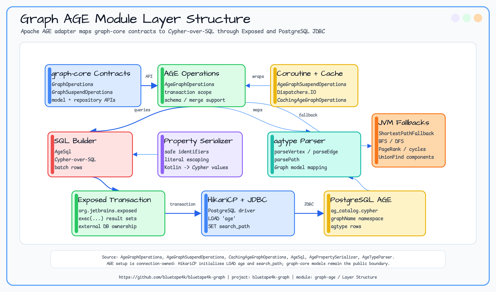
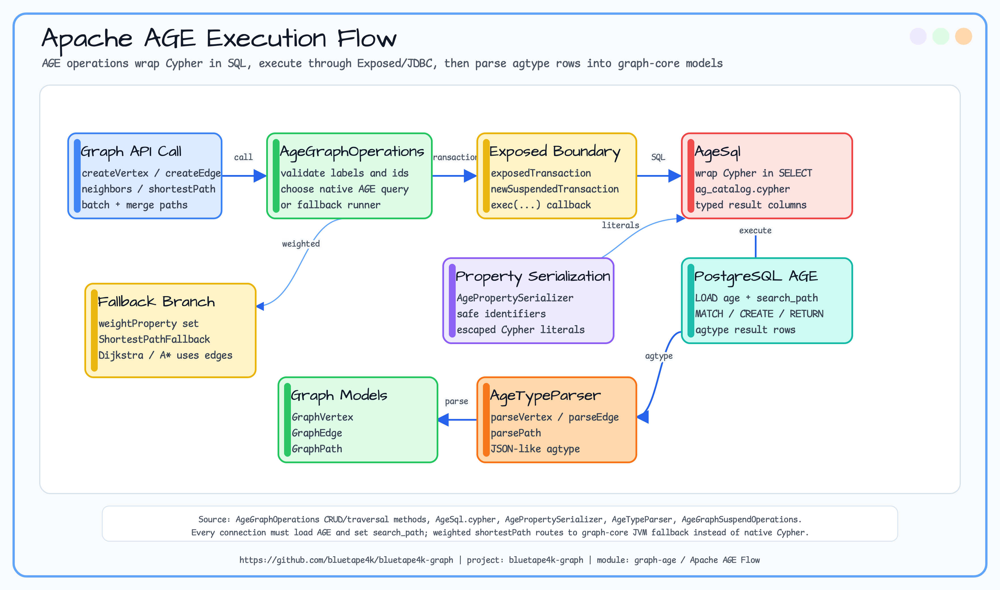
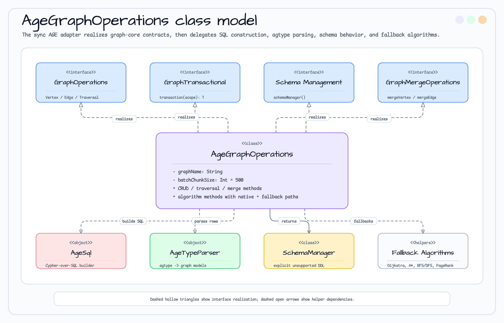
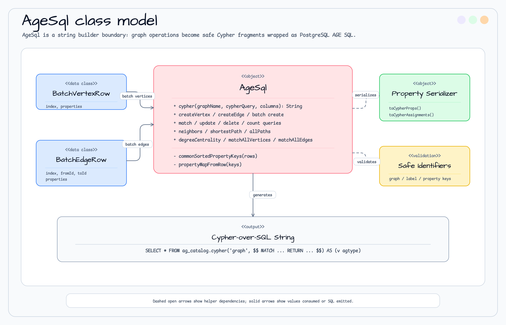
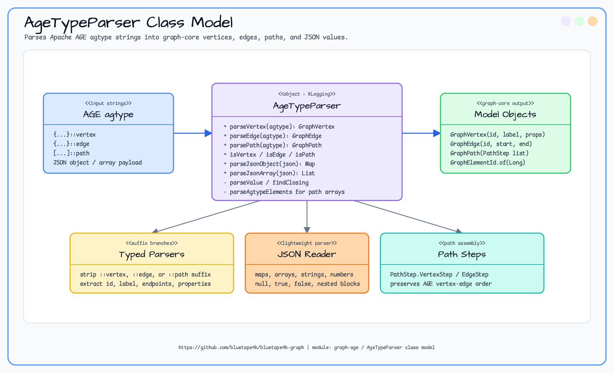
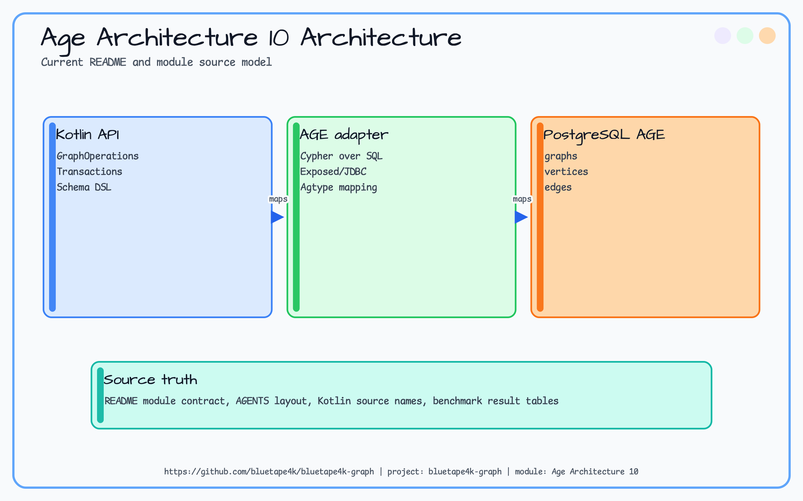
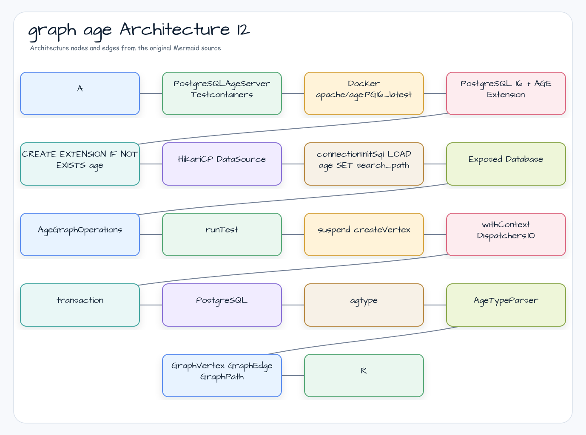

# graph-age

`GraphOperations` implementation based on Apache AGE (PostgreSQL graph extension). Executes Cypher queries translated to SQL on top of PostgreSQL, leveraging JetBrains Exposed ORM and the HikariCP connection pool.

> 🇰🇷 [한국어 문서](README.ko.md)

## Module Description

- **Apache AGE-based**: Performs graph operations by executing Cypher through PostgreSQL's built-in Cypher engine as SQL queries
- **Exposed + JDBC**: Data access via JetBrains Exposed transactions and the PostgreSQL JDBC driver
- **SQL Builder**: The `AgeSql` object generates Cypher-over-SQL query strings
- **agtype Parsing**: Converts PostgreSQL `agtype` results into graph domain models
- **Coroutine Variant**: `AgeGraphSuspendOperations` exposes `suspend` and `Flow` APIs over Exposed JDBC work

## Architecture

### Module Layer Structure



### Cypher-over-SQL Execution Flow



## Key Classes

| Class | Description |
|-------|-------------|
| `AgeGraphOperations` | Synchronous `GraphOperations` implementation backed by Exposed + JDBC |
| `AgeGraphSuspendOperations` | Coroutine-based `GraphSuspendOperations` implementation |
| `CachingAgeGraphOperations` | Caffeine bounded/expiring caching decorator over `AgeGraphOperations` |
| `AgeGraphSchemaManager` | Explicit unsupported schema manager for AGE-specific index DDL |
| `AgeSql` | Produces SQL strings that wrap Cypher queries for Apache AGE |
| `AgePropertySerializer` | Serializes Kotlin values into AGE-compatible literals |
| `AgeTypeParser` | Parses `agtype` results into `GraphVertex`, `GraphEdge`, and `GraphPath` |

### AgeGraphOperations Class Model



### AgeSql Class Model



### AgeTypeParser Class Model



## Dependencies

```kotlin
dependencies {
    api("io.github.bluetape4k.graph:bluetape4k-graph-core:${bluetape4kVersion}")
    api(Libs.exposed_core)
    api(Libs.exposed_jdbc)
    api(Libs.postgresql_driver)
    api(Libs.kotlinx_coroutines_core)
}
```

## HikariCP + PostgreSQL AGE Setup

Apache AGE requires every connection to load the extension and set the search path.

```kotlin
val hikariConfig = HikariConfig().apply {
    jdbcUrl = "jdbc:postgresql://localhost:5432/postgres"
    username = "postgres"
    password = "postgres"
    driverClassName = "org.postgresql.Driver"
    connectionInitSql = """LOAD 'age'; SET search_path = ag_catalog, "${'$'}user", public"""
}
val dataSource = HikariDataSource(hikariConfig)
val database = Database.connect(dataSource)
```

## Usage Example

```kotlin
val ops = AgeGraphOperations("my_graph")

// Create graph
ops.createGraph("my_graph")

// Create vertex
val alice = ops.createVertex(
    label = "Person",
    properties = mapOf("name" to "Alice", "age" to 30),
)

// Create edge
val bob = ops.createVertex("Person", mapOf("name" to "Bob", "age" to 28))
val knows = ops.createEdge(
    startId = alice.id,
    endId = bob.id,
    label = "KNOWS",
    properties = mapOf("since" to LocalDate.now()),
)

// Shortest path
val path = ops.shortestPath(alice.id, bob.id, edgeLabel = "KNOWS", maxDepth = 5)

// Neighbors
val neighbors = ops.neighbors(alice.id, edgeLabel = "KNOWS", direction = Direction.OUTGOING)
```

## Schema / Index Management

`AgeGraphOperations` exposes `schemaManager()` so callers receive explicit unsupported failures instead of silent no-op
schema setup. PostgreSQL-side AGE expression indexes depend on graph label tables and `agtype` operators and are not
portable in this module yet.

```kotlin
import io.bluetape4k.graph.schema.schemaManager

val schema = ops.schemaManager()
schema.listIndexes() // empty
schema.createIndex("Person", "email") // UnsupportedOperationException
```

## Merge / Upsert and Transaction DSL

AGE supports `GraphMergeOperations` through a transactional match/update/create fallback because the current test image
does not support `ON CREATE SET` / `ON MATCH SET`. The `Transaction DSL` runs vertex and edge work inside the Exposed
transaction used by `AgeGraphOperations`.

```kotlin
import io.bluetape4k.graph.repository.mergeVertex
import io.bluetape4k.graph.repository.transaction

val alice = ops.mergeVertex(
    label = "Person",
    matchProperties = mapOf("email" to "alice@example.com"),
    setProperties = mapOf("name" to "Alice"),
)

val edge = ops.transaction {
    val bob = createVertex("Person", mapOf("email" to "bob@example.com"))
    createEdge(alice.id, bob.id, "KNOWS")
}
```

## Caching Decorator

`CachingAgeGraphOperations` wraps an `AgeGraphOperations` instance and memoizes all read results in six Caffeine caches. Each cache applies the configured `maxSize` entry bound and `expireAfterWrite` TTL, making the decorator suitable for read-heavy workloads such as benchmarks or repeated graph traversals.

### Cache Behaviour

| Operation | Effect |
|-----------|--------|
| `findVertexById`, `findVerticesByLabel`, `neighbors`, `shortestPath`, `allPaths`, `findEdgesByLabel` | Results cached on first call; subsequent calls return the cached value without hitting the DB |
| `maxSize` | Applied independently to each of the six read caches; it bounds entries per cache, not the wrapper's combined entries or heap bytes. Must be positive |
| `expireAfterWrite`, `ticker` | `expireAfterWrite` is the positive TTL for each cache; `ticker` defaults to the system clock and can be replaced with a fake clock for deterministic tests |
| `createVertex`, `createEdge` | Every call delegates to the underlying operation, even with identical arguments. Read caches are invalidated after the write |
| `updateVertex`, `deleteVertex`, `deleteEdge` | All read caches invalidated |
| `dropGraph` | Delegates first and invalidates all read caches after a successful graph deletion |
| `transaction { ... }` | Forwards the backend transaction capability; commit invalidates all read caches, while rollback keeps the existing cache |

Each cache miss captures a generation before the delegate read. If a wrapper-visible write, `dropGraph`, or committed transaction advances that generation while the read is in flight, the returned value is not reinserted into the cache. The in-flight call may still return the value it read before the write; writes performed through another delegate instance remain outside this wrapper's invalidation boundary.

`maxSize` is a per-cache entry policy: six caches can each retain up to the configured bound, and the bound is not a heap-size guarantee. A successful miss stores its value and runs Caffeine maintenance immediately so small bounds remain observable on the next lookup; the maintenance trade-off is recorded in the [cache maintenance lesson](../../docs/lessons/2026-08-14-issue-500-cache-maintenance.md).

### Usage Example

```kotlin
import java.time.Duration

Database.connect(dataSource)
val baseOps = AgeGraphOperations("my_graph")

// Wrap with bounded/expiring caching decorator
val ops = CachingAgeGraphOperations(
    baseOps,
    maxSize = 1_000,
    expireAfterWrite = Duration.ofMinutes(5),
)

// First call: DB query (JDBC round-trip)
val alice = ops.findVertexById("Person", aliceId)

// Second call: cache hit, no DB round-trip
val aliceCached = ops.findVertexById("Person", aliceId)

// Supported write methods invalidate all read caches automatically
ops.deleteVertex("Person", aliceId)
val afterDelete = ops.findVertexById("Person", aliceId)  // null (cache miss → DB)
```

## Notes

### ID Type
Apache AGE stores vertex/edge IDs as `agtype` (BIGINT). The abstraction wraps them as strings in `GraphElementId`.

### agtype Parsing Flow



### agtype Parsing Limitations
Nested JSON structures inside AGE results are parsed by `AgeTypeParser`. Extremely deep or exotic types may require custom handling.

### HikariCP `connectionInitSql`
The `LOAD 'age'` and `search_path` statement **must** be set via `connectionInitSql` — otherwise each connection pulled from the pool will fail to recognize AGE functions.

### Transaction Isolation
Synchronous operations run inside independent Exposed transactions. The coroutine variant uses Exposed suspended transactions for direct AGE queries and delegates selected blocking fallback algorithms to an IO dispatcher. Direct `Flow` queries run their JDBC cursor on `Dispatchers.IO`, emit rows through channel backpressure, and release the `ResultSet` and transaction when collection completes or is cancelled. They do not first materialize the complete result into a `MutableList`.

`suspendTransaction { ... }` has a different ownership boundary: a `Flow` returned from the transaction scope is materialized before commit so it remains readable after the transaction closes. Use direct `AgeGraphSuspendOperations` query methods when lazy, bounded collection is required.

## Testing

Integration tests use Testcontainers with the `apache/age:release_PG18_1.7.0` image.



```bash
./gradlew :graph-age:test
```

## Graph Algorithms

### Algorithm Support Matrix

| Algorithm | Implementation | Notes |
|-----------|---------------|-------|
| `degreeCentrality` | Cypher-over-SQL native (`AgeSql.degreeCypher`) | |
| `bfs` / `dfs` | JVM fallback (`BfsDfsRunner`) | AGE lacks native BFS/DFS functions |
| `detectCycles` | JVM fallback (`CycleDetector`) | |
| `connectedComponents` | JVM fallback (`UnionFind`) | |
| `pageRank` | JVM fallback (`PageRankCalculator`) | |

### Usage Example

```kotlin
val ops = AgeGraphOperations("social")

// Degree centrality (native Cypher-over-SQL)
val degree = ops.degreeCentrality(alice.id, DegreeOptions(edgeLabel = "KNOWS"))
println("in=${degree.inDegree} out=${degree.outDegree}")

// BFS (JVM fallback)
val visits = ops.bfs(alice.id, BfsDfsOptions(edgeLabel = "KNOWS", maxDepth = 3))

// PageRank (JVM fallback)
val top10 = ops.pageRank(PageRankOptions(vertexLabel = "Person", topK = 10))
top10.forEach { println("${it.vertex.properties["name"]}: ${it.score}") }
```

## References

- [Apache AGE](https://age.apache.org/)
- [JetBrains Exposed](https://github.com/JetBrains/Exposed)
- [HikariCP](https://github.com/brettwooldridge/HikariCP)
