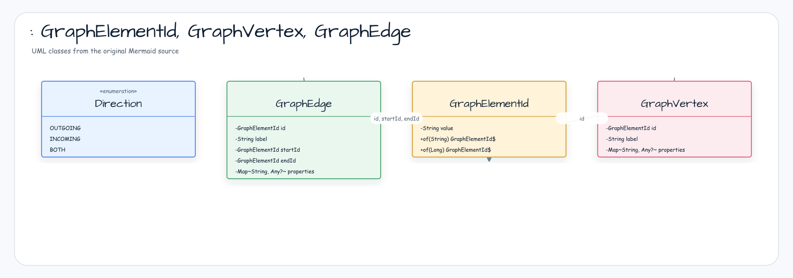
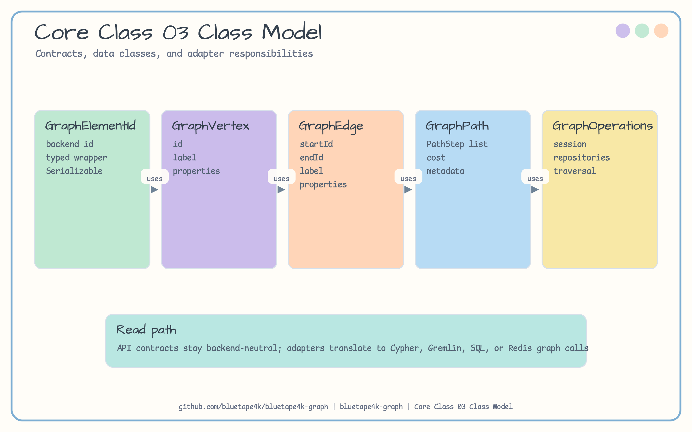
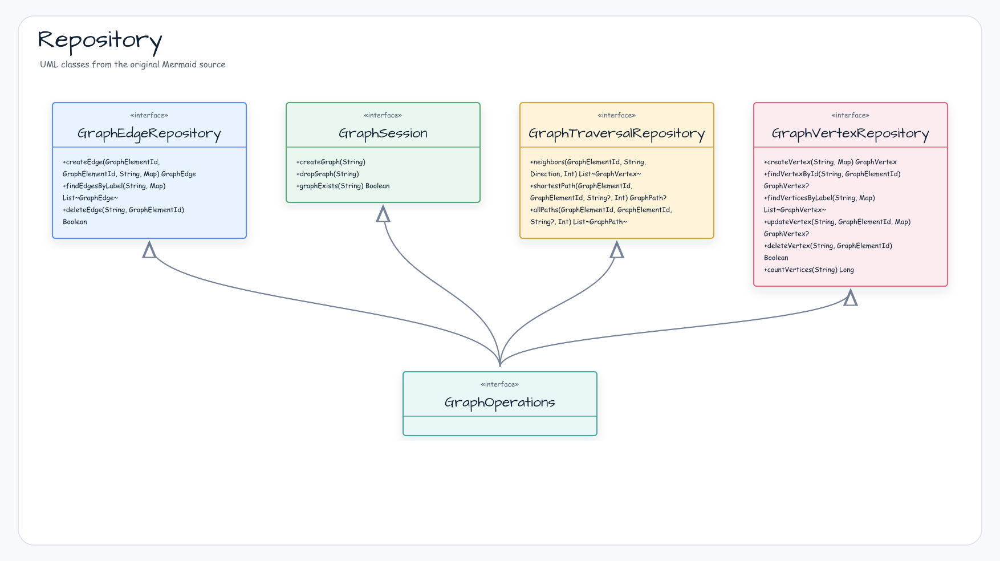
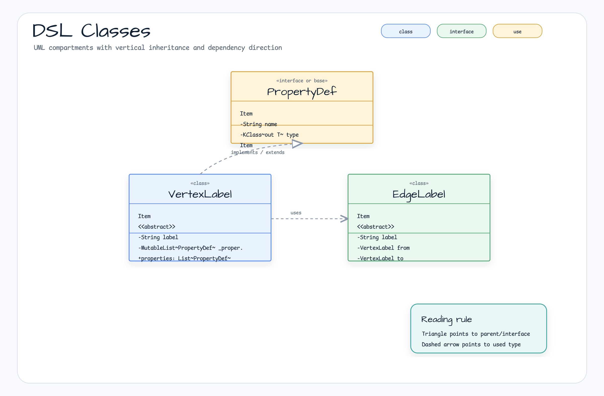
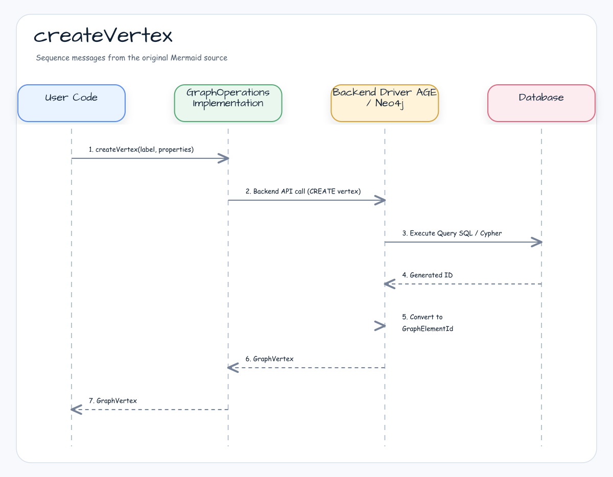
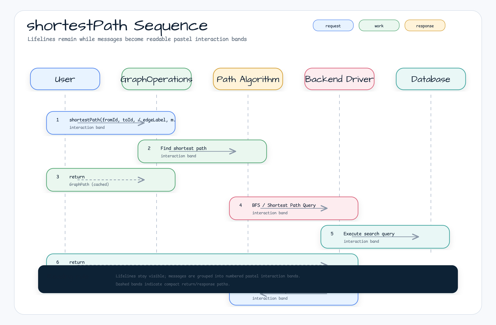
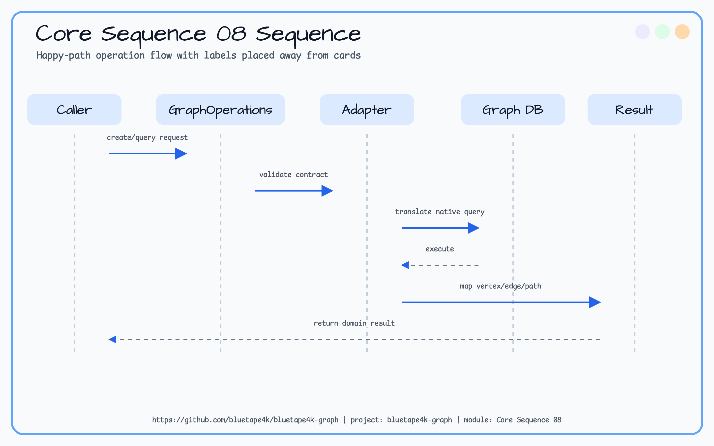
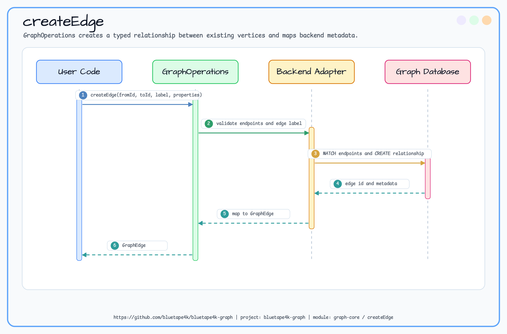
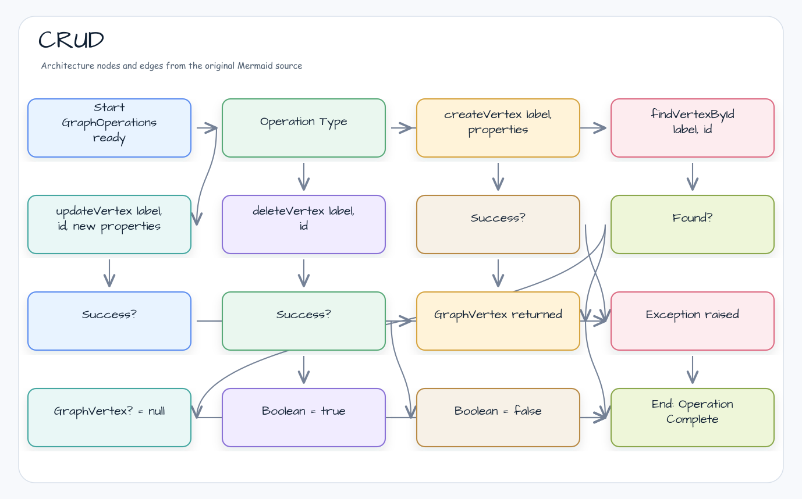
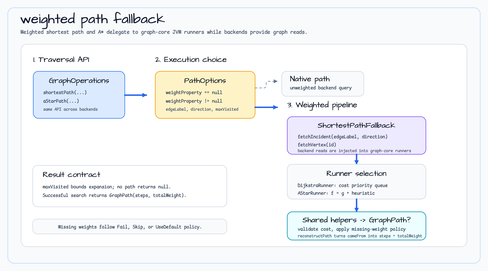

# graph-core

Graph Database (Apache AGE, Neo4j, Memgraph, Apache TinkerPop 등) 공통 추상화 계층. 백엔드 독립 모델 및 Repository 인터페이스를 제공하여 여러 그래프 데이터베이스 구현체가 동일한 API로 작동할 수 있도록 한다.

> 🇺🇸 [English](README.md)

## 모듈 설명

- **백엔드 독립 추상화**: Apache AGE, Neo4j, Memgraph, TinkerPop 등 다양한 그래프 데이터베이스의 공통 인터페이스
- **동기/코루틴 API 병행**: `GraphOperations`와 `GraphSuspendOperations`를 모두 제공
- **Schema DSL**: `VertexLabel`, `EdgeLabel`을 통한 선언적 스키마 정의
- **Path 추적**: 최단 경로, 모든 경로 탐색 결과를 `GraphPath` 모델로 표현

## 아키텍처 개요


## 주요 클래스

### 모델 계층

#### 기본 모델: GraphElementId, GraphVertex, GraphEdge



#### PathStep 및 GraphPath 모델



**PathStep 교차 순서 예시**:
```
A --KNOWS--> B --WORKS_AT--> Company
steps = [VertexStep(A), EdgeStep(KNOWS), VertexStep(B), EdgeStep(WORKS_AT), VertexStep(Company)]
length = 2  (간선 개수)
```

### Repository 계층



### Capability 조회

선택 기능을 호출하기 전에 `capabilities()`를 조회한다. 반환되는 불변
`GraphCapabilities`는 예외를 발생시켜 추측하지 않고 지원 여부, `core-0.7`
계약 버전, capability별 제약을 제공한다.

```kotlin
import io.bluetape4k.graph.repository.GraphCapability
import io.bluetape4k.graph.repository.capabilities

val capabilities = ops.capabilities()
if (capabilities.supports(GraphCapability.MERGE)) {
    ops.mergeVertex("Person", matchProperties = mapOf("email" to "alice@example.com"))
}
```

`GRAPH_ALGORITHM`은 portable JVM 알고리즘을 의미한다. `NATIVE_ALGORITHM`은
명시적으로 설치한 backend provider가 있을 때만 보고되며, 플래그가 없다고
자동 fallback이 보장되는 것은 아니다. Kotlin `by` 위임을 사용하는 decorator는
delegate 매핑을 보존하기 위해 `GraphCapabilitiesOperations`를 구현해야 한다.

#### Capability 호환성 정책

`GraphCapability` enum 이름은 serialization 경계의 계약이다. 새 값은 기존
ordinal을 보존하도록 enum 마지막에만 추가하지만, 소비자는 `ordinal`을 저장하거나
비교하지 말고 enum `name`을 사용해야 한다. capability를 `when`으로 처리하는
외부 소비자는 이후 라이브러리에서 값이 추가될 수 있으므로 반드시 명시적인
`else` 분기를 둬야 한다. 이 분기는 알 수 없는 값을 unsupported로 취급하고
(필요하면 telemetry를 남기며) 확인하지 않은 연산을 호출하지 않아야 한다.

설정·저장소·remote peer에서 capability 이름을 읽을 때는
`GraphCapability.fromSerializedNameOrNull(name)`을 사용한다. 이후 버전에서
추가된 이름은 `null`을 반환하며 `Enum.valueOf`처럼 예외를 발생시키지 않는다.
이는 forward-compatible parsing 경계일 뿐, 구버전 binary가 신규 연산을
자동으로 이해하게 하지는 않는다.

CORE-2 conformance slice는 `MERGE`, `SCHEMA`, `TRANSACTION`, `BATCH_INSERT`,
`CHUNKED_READ`, `CHUNKED_EXPORT`, `BOUNDED_CHUNKED_READ`,
`BOUNDED_CHUNKED_EXPORT`, `WEIGHTED_PATH`, `GRAPH_ALGORITHM`,
`NATIVE_ALGORITHM` 플래그를 공통 계약으로 검증한다. `CHUNKED_*`는 API 결과를
chunk로 나누는 계약일 뿐이다. backend source가 전체 결과를 먼저 materialize하지
않는다는 근거가 있을 때만 `BOUNDED_CHUNKED_*`를 광고할 수 있다. 지원하지 않는
optional 연산은 조용히 무시하지 않고 `UnsupportedOperationException`으로
명시적으로 실패해야 한다.

### Cross-backend capability conformance

재사용 가능한 `AbstractGraphCapabilityConformanceTest` fixture가 TinkerGraph
인메모리 lane과 각 container backend에 같은 계약을 적용한다. Testcontainers
lifecycle이 겹치지 않도록 아래 task를 순차 실행한다.

```bash
./gradlew :bluetape4k-graph-tinkerpop:test --tests '*GraphCapabilityConformanceTest'
./gradlew :bluetape4k-graph-neo4j:test --tests '*GraphCapabilityConformanceTest'
./gradlew :bluetape4k-graph-memgraph:test --tests '*GraphCapabilityConformanceTest'
./gradlew :bluetape4k-graph-age:test --tests '*GraphCapabilityConformanceTest'
./gradlew :bluetape4k-graph-falkordb:test --tests '*GraphCapabilityConformanceTest'
```

`graph-core` 변경은 일반 CI의 backend test job을 트리거하며, 전체 container
matrix는 Full Nightly scope에서 실행한다. TinkerGraph는 빠른 인메모리 기준
lane으로 유지한다.

## 순회와 알고리즘 API


`GraphTraversalRepository`는 정점 주변이나 정점 사이의 경로를 묻는 API다.

- `neighbors(startId, NeighborOptions)`: 시작 정점 주변의 `GraphVertex` 목록을 반환한다.
- `shortestPath(fromId, toId, PathOptions)`: 제한 깊이 안에서 가장 좋은 `GraphPath?`를 반환한다.
- `allPaths(fromId, toId, PathOptions)`: 제한 깊이 안의 단순 경로 목록을 반환한다.
- A* path 검색은 `aStarPath(fromId, toId, PathOptions, heuristic)`로 호출하며, 가중치와 휴리스틱을 사용하는 최단 `GraphPath?`를 반환한다.

`GraphAlgorithmRepository`는 그래프 전체 관점의 분석 결과를 반환하는 API다.

- `pageRank(PageRankOptions)`: 점수 내림차순 `PageRankScore` 목록을 반환한다.
- `degreeCentrality(vertexId, DegreeOptions)`: in/out/total degree를 담은 `DegreeResult`를 반환한다.
- `connectedComponents(ComponentOptions)`: 연결 컴포넌트별 `GraphComponent` 목록을 반환한다.
- `bfs(startId, BfsDfsOptions)` / `dfs(startId, BfsDfsOptions)`: 방문 순서를 담은 `TraversalVisit` 목록을 반환한다.
- `detectCycles(CycleOptions)`: 순환 경로를 담은 `GraphCycle` 목록을 반환한다.

### 선택적 Native Algorithm Provider SPI

`graph-core`는 GDS/MAGE SDK를 base backend에 추가하지 않고 선택 모듈이
native capability를 선언할 수 있도록 `GraphAlgorithmProvider`,
`GraphAlgorithmProviderDescriptor`, `GraphAlgorithmProviderSelector`를
제공한다. `AUTO` 정책은 descriptor가 요청 알고리즘을 실제로 선언한
provider만 선택하며, provider가 없으면 `JVM_FALLBACK`과 이유를 함께
기록한다. `NATIVE_ONLY`에서 capability가 없으면 조용히 JVM으로 바꾸지
않고 `GraphAlgorithmProviderUnavailableException`을 발생시킨다.

```kotlin
val execution = GraphAlgorithmProviderSelector.select(GraphAlgorithmId.PAGE_RANK)
check(execution.path == GraphAlgorithmExecutionPath.JVM_FALLBACK)
```

native provider 모듈의 driver 호출은 이 모듈의 범위가 아니다. backend는
`GraphAlgorithmExecutionObservable`로 마지막 실행 경로를 노출하고,
`GraphAlgorithmExecutionObserver`로 metrics/audit 관찰 callback을 받을 수
있다. 현재 Neo4j와 Memgraph의 PageRank는 `NO_PROVIDER` 이유의 JVM
fallback으로 관찰된다.

### 스키마 DSL 클래스



## 스키마 정의 (DSL)

### Schema Drift 계획

`GraphSchemaDefinition`으로 desired 선언과 live metadata를 비교한 뒤 DDL 적용 계획을 만들 수 있습니다.
기본값은 dry-run이며, extra index는 destructive drop을 명시적으로 허용하기 전까지 `SKIP`으로 남습니다.
공통 manager에는 constraint 삭제 API가 없으므로 constraint drop은 `UNSUPPORTED`로 보고됩니다.

```kotlin
val desired = GraphSchemaDefinition(
    indexes = setOf(GraphIndex("ignored", "Person", "email")),
)
val plan = ops.schemaManager().plan(desired) // 기본 dry-run
val report = plan.apply(ops.schemaManager())
```

삭제가 필요한 승인된 migration에서만 `GraphSchemaPlanOptions(dryRun = false, allowDestructiveDrops = true)`를
사용하세요. backend가 지원하지 않는 작업은 조용히 성공 처리하지 않고 `UNSUPPORTED` 결과로 남습니다.

### VertexLabel 정의

```kotlin
// 기본 정점 스키마
object PersonLabel : VertexLabel("Person") {
    val id = string("id")
    val name = string("name")
    val age = integer("age")
    val email = string("email")
    val skills = stringList("skills")
    val joinedAt = localDate("joined_at")
    val metadata = json("metadata")
}

// 다른 정점 예
object CompanyLabel : VertexLabel("Company") {
    val id = string("id")
    val name = string("name")
    val industry = string("industry")
    val foundedAt = localDate("founded_at")
    val employees = integer("employee_count")
}

object PostLabel : VertexLabel("Post") {
    val id = string("id")
    val title = string("title")
    val content = string("content")
    val publishedAt = localDateTime("published_at")
    val tags = stringList("tags")
}
```

**지원 타입**:
- `string(name)` - 문자열
- `integer(name)` - 32bit 정수
- `long(name)` - 64bit 정수
- `boolean(name)` - 불린
- `stringList(name)` - 문자열 배열
- `json(name)` - JSON 객체
- `localDate(name)` - 날짜 (ISO 8601)
- `localDateTime(name)` - 날짜/시간
- `enum(name, enumClass)` - 열거형

### EdgeLabel 정의

```kotlin
// Person-to-Person 관계 (양방향)
object KnowsLabel : EdgeLabel("KNOWS", PersonLabel, PersonLabel) {
    val since = localDate("since")
    val strength = integer("strength")
    val notes = string("notes")
}

// Person -> Company 관계 (일방향)
object WorksAtLabel : EdgeLabel("WORKS_AT", PersonLabel, CompanyLabel) {
    val startDate = localDate("start_date")
    val role = string("role")
    val department = string("department")
    val salary = long("salary")
}

// Person -> Post 관계 (작성)
object AuthorLabel : EdgeLabel("AUTHOR", PersonLabel, PostLabel) {
    val createdAt = localDateTime("created_at")
}

// Person -> Post 관계 (좋아요)
object LikesLabel : EdgeLabel("LIKES", PersonLabel, PostLabel) {
    val likedAt = localDateTime("liked_at")
}

// Person -> Person 관계 (팔로우)
object FollowsLabel : EdgeLabel("FOLLOWS", PersonLabel, PersonLabel) {
    val followedAt = localDateTime("followed_at")
    val notifications = boolean("notifications_enabled")
}
```

**제약**:
- `from`, `to`는 시작 정점과 도착 정점의 `VertexLabel` (방향 그래프)
- 무방향 관계는 `BOTH` 방향으로 쿼리하면 됨

## 작업 흐름 다이어그램

### createVertex 시퀀스



### shortestPath 시퀀스



### neighbors 순회



### createEdge 시퀀스



## 계약 및 알고리즘 다이어그램

### Vertex/Edge CRUD 계약



### Weighted path fallback



### 가중치 경로의 `maxDepth` 계약

`graph-core`의 `DijkstraRunner`와 `AStarRunner`는 모든 백엔드가 공유하는
`ShortestPathFallback` 구현이다. 가중치 탐색은 `PathOptions.maxDepth`를 간선 수의
포함 상한으로 적용한다. 탐색 상태에 현재 깊이를 포함하므로 더 싸지만 깊은 경로가
유효한 얕은 경로를 가리지 않는다. `maxDepth = 0`이면 source와 target이 같은
vertex-only 결과만 허용한다.

| 필드 | 기본값 | 설명 |
|------|--------|------|
| `weightProperty` | `null` | 간선 weight 속성 이름. 가중치 탐색에서 필수다. |
| `edgeLabel` | `null` | 간선 label 필터. `null`이면 모든 label을 사용한다. |
| `maxDepth` | `10` | 가중치 경로의 최대 간선 수. |
| `missingWeightPolicy` | `Fail` | weight가 없는 간선의 처리 정책. |
| `direction` | `OUTGOING` | 탐색 방향. |
| `maxVisited` | `100_000` | 가중치 탐색 상태의 최대 방문 수. |

### 가중치 경로 백엔드 매트릭스

다섯 백엔드는 sync와 suspend 가중치 경로에서 같은 JVM runner를 사용한다.
virtual-thread API는 각 백엔드의 sync 구현에 위임하므로 세 표면의 depth 계약이
같다. native 백엔드 경로 쿼리는 unweighted 구현이며 자체 `PathOptions.maxDepth`
처리를 계속 따른다.

| 백엔드 | Sync weighted path | Suspend weighted path | Virtual-thread weighted path | 증거 |
|--------|--------------------|-----------------------|------------------------------|------|
| Neo4j | `ShortestPathFallback` | `Dispatchers.IO`의 sync delegate | sync delegate | Testcontainers weighted-path TCK |
| Memgraph | `ShortestPathFallback` | `Dispatchers.IO`의 sync delegate | sync delegate | Testcontainers weighted-path TCK |
| Apache AGE | `ShortestPathFallback` | `Dispatchers.IO`의 sync delegate | sync delegate | Testcontainers weighted-path TCK |
| TinkerGraph | `ShortestPathFallback` | `Dispatchers.IO`의 sync delegate | sync delegate | in-memory weighted-path TCK |
| FalkorDB | `ShortestPathFallback` | `Dispatchers.IO`의 sync delegate | sync delegate | Testcontainers weighted-path TCK |

### Serializable option invariant 계약

`GraphTraversalOptions`, `GraphAlgorithmOptions`의 구체 옵션과
`MissingWeightPolicy.UseDefault`는 안정적인 Java serialization 계약을 구현한다.
round-trip은 public property와 `serialVersionUID = 1L`을 보존한다. 생성자는 잘못된
값을 `IllegalArgumentException`으로 거부하고, 역직렬화도 같은 검사를 반복해 변조된
payload를 잘못된 필드명과 값이 포함된 `InvalidObjectException`으로 거부한다. Java
serialization은 신뢰 경계가 아니므로 신뢰할 수 없는 stream에는
`ObjectInputFilter`를 설정해야 한다.

## 사용 예시

### 완전한 그래프 구축 예시

```kotlin
// Suspend context 내에서 실행 (코루틴)
suspend fun buildSocialNetwork(ops: GraphOperations) {
    // === 1. 정점 생성 ===

    // 사람 정점 생성
    val alice = ops.createVertex(
        label = PersonLabel.label,
        properties = mapOf(
            PersonLabel.id.name to "person-1",
            PersonLabel.name.name to "Alice",
            PersonLabel.age.name to 30,
            PersonLabel.email.name to "alice@example.com",
            PersonLabel.joinedAt.name to LocalDate.of(2020, 1, 15)
        )
    )

    val bob = ops.createVertex(
        label = PersonLabel.label,
        properties = mapOf(
            PersonLabel.id.name to "person-2",
            PersonLabel.name.name to "Bob",
            PersonLabel.age.name to 28,
            PersonLabel.email.name to "bob@example.com",
            PersonLabel.joinedAt.name to LocalDate.of(2021, 6, 20)
        )
    )

    val charlie = ops.createVertex(
        label = PersonLabel.label,
        properties = mapOf(
            PersonLabel.id.name to "person-3",
            PersonLabel.name.name to "Charlie",
            PersonLabel.age.name to 32,
            PersonLabel.email.name to "charlie@example.com",
            PersonLabel.joinedAt.name to LocalDate.of(2019, 3, 10)
        )
    )

    // 회사 정점 생성
    val techCorp = ops.createVertex(
        label = CompanyLabel.label,
        properties = mapOf(
            CompanyLabel.id.name to "company-1",
            CompanyLabel.name.name to "TechCorp",
            CompanyLabel.industry.name to "Technology",
            CompanyLabel.foundedAt.name to LocalDate.of(2010, 5, 1),
            CompanyLabel.employees.name to 150
        )
    )

    // 포스트 정점 생성
    val post1 = ops.createVertex(
        label = PostLabel.label,
        properties = mapOf(
            PostLabel.id.name to "post-1",
            PostLabel.title.name to "GraphDB Best Practices",
            PostLabel.content.name to "Here are some tips for working with graph databases...",
            PostLabel.publishedAt.name to LocalDateTime.now(),
            PostLabel.tags.name to listOf("graphdb", "tutorial", "kotlin")
        )
    )

    // === 2. 간선 생성 (관계 연결) ===

    // 친구 관계: Alice - Bob
    val knows1 = ops.createEdge(
        fromId = alice.id,
        toId = bob.id,
        label = KnowsLabel.label,
        properties = mapOf(
            KnowsLabel.since.name to LocalDate.of(2015, 1, 1),
            KnowsLabel.strength.name to 9
        )
    )

    // 친구 관계: Bob - Charlie
    val knows2 = ops.createEdge(
        fromId = bob.id,
        toId = charlie.id,
        label = KnowsLabel.label,
        properties = mapOf(
            KnowsLabel.since.name to LocalDate.of(2018, 6, 1),
            KnowsLabel.strength.name to 7
        )
    )

    // 일자리 관계: Alice works at TechCorp
    val worksAt1 = ops.createEdge(
        fromId = alice.id,
        toId = techCorp.id,
        label = WorksAtLabel.label,
        properties = mapOf(
            WorksAtLabel.startDate.name to LocalDate.of(2021, 1, 15),
            WorksAtLabel.role.name to "Senior Engineer",
            WorksAtLabel.department.name to "Backend",
            WorksAtLabel.salary.name to 120000L
        )
    )

    // 작성 관계: Alice authored post1
    val author1 = ops.createEdge(
        fromId = alice.id,
        toId = post1.id,
        label = AuthorLabel.label,
        properties = mapOf(
            AuthorLabel.createdAt.name to LocalDateTime.now()
        )
    )

    // 좋아요 관계: Bob likes post1
    val likes1 = ops.createEdge(
        fromId = bob.id,
        toId = post1.id,
        label = LikesLabel.label,
        properties = mapOf(
            LikesLabel.likedAt.name to LocalDateTime.now()
        )
    )

    // 팔로우 관계: Charlie follows Alice
    val follows1 = ops.createEdge(
        fromId = charlie.id,
        toId = alice.id,
        label = FollowsLabel.label,
        properties = mapOf(
            FollowsLabel.followedAt.name to LocalDateTime.now(),
            FollowsLabel.notifications.name to true
        )
    )

    return Triple(
        listOf(alice, bob, charlie, techCorp, post1),
        listOf(knows1, knows2, worksAt1, author1, likes1, follows1),
        mapOf("alice" to alice.id, "bob" to bob.id, "charlie" to charlie.id)
    )
}
```

### 정점 생성 (기본)

```kotlin
// 간단한 정점 생성
val person = ops.createVertex(
    label = "Person",
    properties = mapOf(
        "name" to "Alice",
        "age" to 30,
        "email" to "alice@example.com"
    )
)
```

### 간선 생성

```kotlin
// 정점 간 관계 생성
val knows = ops.createEdge(
    fromId = alice.id,
    toId = bob.id,
    label = "KNOWS",
    properties = mapOf(
        "since" to LocalDate.of(2020, 1, 15),
        "strength" to 5
    )
)

// Direction을 고려한 쿼리
val worksAt = ops.createEdge(
    fromId = alice.id,
    toId = companyId,
    label = "WORKS_AT",
    properties = mapOf(
        "role" to "Engineer",
        "department" to "Backend"
    )
)
```

### 정점 조회

```kotlin
// ID로 조회
val vertex = ops.findVertexById("Person", alice.id)

// 레이블로 전체 조회
val allPersons = ops.findVerticesByLabel("Person")

// 필터 조건으로 조회
val engineers = ops.findVerticesByLabel(
    "Person",
    filter = mapOf("role" to "Engineer")
)

// 정점 개수
val count = ops.countVertices("Person")
```

### 정점 수정 및 삭제

```kotlin
// 정점 수정
val updated = ops.updateVertex(
    label = "Person",
    id = alice.id,
    properties = mapOf(
        "age" to 31,
        "email" to "alice.updated@example.com"
    )
)

// 정점 삭제
val deleted = ops.deleteVertex("Person", alice.id)
```

### 간선 조회 및 삭제

```kotlin
// 모든 KNOWS 간선 조회
val allKnowsEdges = ops.findEdgesByLabel(KnowsLabel.label)
println("Total KNOWS relationships: ${allKnowsEdges.size}")

// 필터 조건으로 조회 (strength >= 5)
val strongRelations = ops.findEdgesByLabel(
    KnowsLabel.label,
    filter = mapOf(KnowsLabel.strength.name to 5)
)
println("Strong relationships: ${strongRelations.size}")

// WORKS_AT 간선 조회
val employmentEdges = ops.findEdgesByLabel(WorksAtLabel.label)
employmentEdges.forEach { edge ->
    println("Person ${edge.startId.value} works at ${edge.endId.value}")
}

// 특정 간선 삭제
val deleted = ops.deleteEdge(KnowsLabel.label, someEdgeId)
if (deleted) {
    println("Relationship removed successfully")
}

// 모든 LIKES 간선 배치 삭제
val allLikes = ops.findEdgesByLabel(LikesLabel.label)
for (likeEdge in allLikes) {
    ops.deleteEdge(LikesLabel.label, likeEdge.id)
}
println("Deleted ${allLikes.size} likes")
```

### 정점 조회 및 수정

```kotlin
// ID로 조회
val vertex = ops.findVertexById(PersonLabel.label, alice.id)
println("Found: ${vertex?.properties?.get(PersonLabel.name.name)}")

// 레이블로 전체 조회
val allPersons = ops.findVerticesByLabel(PersonLabel.label)
println("Total persons: ${allPersons.size}")

// 필터 조건으로 조회 (나이가 30 이상)
val experienced = ops.findVerticesByLabel(
    PersonLabel.label,
    filter = mapOf(PersonLabel.age.name to 30)
)

// 정점 개수
val count = ops.countVertices(PersonLabel.label)

// 정점 수정
val updated = ops.updateVertex(
    label = PersonLabel.label,
    id = alice.id,
    properties = mapOf(
        PersonLabel.age.name to 31,
        PersonLabel.email.name to "alice.new@example.com"
    )
)

// 정점 삭제
val deleted = ops.deleteVertex(PersonLabel.label, alice.id)
```

### 그래프 순회 (경로 탐색)

#### 1단계 이웃 (인접 정점)

```kotlin
// 나가는 관계 (OUTGOING): Alice가 아는 사람들
val alicesFriends = ops.neighbors(
    startId = alice.id,
    edgeLabel = KnowsLabel.label,
    direction = Direction.OUTGOING,
    depth = 1
)
println("Alice's direct friends: ${alicesFriends.map { it.properties[PersonLabel.name.name] }}")
// Output: [Bob, ...]

// 들어오는 관계 (INCOMING): Alice를 아는 사람들
val alicesAdmirers = ops.neighbors(
    startId = alice.id,
    edgeLabel = KnowsLabel.label,
    direction = Direction.INCOMING,
    depth = 1
)

// 양방향 (BOTH): Alice와 연결된 모든 사람들
val allConnected = ops.neighbors(
    startId = alice.id,
    edgeLabel = KnowsLabel.label,
    direction = Direction.BOTH,
    depth = 1
)
```

#### 깊이 기반 탐색 (N촌 친구)

```kotlin
// 2촌: Alice → Friend → Friend
val secondDegree = ops.neighbors(
    startId = alice.id,
    edgeLabel = KnowsLabel.label,
    direction = Direction.OUTGOING,
    depth = 2
)
println("Alice's 2nd degree friends: ${secondDegree.size} people")

// 3촌 이상
val thirdDegree = ops.neighbors(
    startId = alice.id,
    edgeLabel = KnowsLabel.label,
    direction = Direction.OUTGOING,
    depth = 3
)
println("Alice's 3rd degree friends: ${thirdDegree.size} people")

// 다양한 관계로 네트워크 확장
val networkWithoutEdgeFilter = ops.neighbors(
    startId = alice.id,
    edgeLabel = null,  // 모든 관계 타입 포함
    direction = Direction.OUTGOING,
    depth = 2
)
```

#### 최단 경로

```kotlin
// Case 1: 특정 간선 타입으로만 경로 찾기 (KNOWS)
val pathViaKnows = ops.shortestPath(
    fromId = alice.id,
    toId = charlie.id,
    edgeLabel = KnowsLabel.label,
    maxDepth = 10
)

if (pathViaKnows != null) {
    println("Shortest KNOWS path from Alice to Charlie:")
    println("  Length: ${pathViaKnows.length} edges")
    println("  Vertices: ${pathViaKnows.vertices.mapIndexed { i, v ->
        "#${i}: ${v.properties[PersonLabel.name.name]}"
    }}")

    // 경로 시각화
    val pathStr = pathViaKnows.steps.joinToString(" → ") { step ->
        when (step) {
            is PathStep.VertexStep -> "[${step.vertex.properties[PersonLabel.name.name]}]"
            is PathStep.EdgeStep -> "-${step.edge.label}->"
        }
    }
    println("Path: $pathStr")
}

// Case 2: 모든 간선 타입 포함 (null)
val anyPath = ops.shortestPath(
    fromId = alice.id,
    toId = charlie.id,
    edgeLabel = null,
    maxDepth = 5
)
if (anyPath != null) {
    println("Shortest ANY path: ${anyPath.length} edges")
}

// Case 3: 경로가 없는 경우
val impossiblePath = ops.shortestPath(
    fromId = alice.id,
    toId = disconnectedPerson.id,
    maxDepth = 100
)
if (impossiblePath == null) {
    println("No path exists between Alice and disconnected person")
}
```

#### 모든 경로 탐색

```kotlin
// Alice에서 Charlie로 가는 모든 경로 (KNOWS만, 최대 5 단계)
val allKnowsPaths = ops.allPaths(
    fromId = alice.id,
    toId = charlie.id,
    edgeLabel = KnowsLabel.label,
    maxDepth = 5
)

println("Found ${allKnowsPaths.size} paths from Alice to Charlie:")
for ((idx, path) in allKnowsPaths.withIndex()) {
    println("\nPath #${idx + 1} (length: ${path.length}):")

    // 방법 1: 정점과 간선 분리
    println("  Vertices: ${path.vertices.map { it.properties[PersonLabel.name.name] }}")
    println("  Edges: ${path.edges.map { it.label }}")

    // 방법 2: 단계별 상세 출력
    path.steps.forEachIndexed { i, step ->
        when (step) {
            is PathStep.VertexStep -> {
                val vName = step.vertex.properties[PersonLabel.name.name]
                println("    [$i] Vertex: $vName (${step.vertex.id.value})")
            }
            is PathStep.EdgeStep -> {
                println("    [$i] Edge: ${step.edge.label}")
            }
        }
    }
}

// 경로들 비교
if (allKnowsPaths.size > 1) {
    val shortestPath = allKnowsPaths.minByOrNull { it.length }
    val longestPath = allKnowsPaths.maxByOrNull { it.length }
    println("\nShortest: ${shortestPath?.length} edges")
    println("Longest: ${longestPath?.length} edges")
}
```

### 그래프 세션 관리

```kotlin
// === Graph Lifecycle ===

// 1. 그래프 생성
ops.createGraph("social_network")
ops.createGraph("knowledge_graph")

// 2. 그래프 존재 확인
val socialExists = ops.graphExists("social_network")
val knowledgeExists = ops.graphExists("knowledge_graph")

println("social_network exists: $socialExists")
println("knowledge_graph exists: $knowledgeExists")

// 3. 그래프 사용
suspend fun useGraph(ops: GraphOperations) {
    val vertex = ops.createVertex("Person", mapOf("name" to "Alice"))
    val neighbors = ops.neighbors(vertex.id, "KNOWS")
}

// 4. 그래프 삭제
ops.dropGraph("knowledge_graph")

// 5. 리소스 해제 (AutoCloseable)
try {
    ops.use { graph ->
        // 그래프 작업 수행
        graph.createVertex("Person", mapOf("name" to "Bob"))
    }
    // 자동으로 close() 호출
} catch (e: Exception) {
    println("Error: ${e.message}")
}
```

### 트랜잭션 및 배치 작업

```kotlin
// 여러 작업을 동시에 수행 (코루틴)
suspend fun batchCreatePersons(ops: GraphOperations, names: List<String>) {
    val persons = coroutineScope {
        names.map { name ->
            async {
                ops.createVertex(
                    PersonLabel.label,
                    mapOf(PersonLabel.name.name to name)
                )
            }
        }.awaitAll()
    }
    println("Created ${persons.size} persons")
    return persons
}

// 대량 간선 생성
suspend fun createFriendships(ops: GraphOperations, persons: List<GraphVertex>) {
    for (i in persons.indices) {
        for (j in (i + 1) until persons.size) {
            ops.createEdge(
                persons[i].id,
                persons[j].id,
                KnowsLabel.label,
                mapOf(KnowsLabel.since.name to LocalDate.now())
            )
        }
    }
}
```

### 단위 테스트 예시

```kotlin
class GraphOperationsTest {
    @Test
    fun testVertexCRUD() = runTest {
        val ops = createTestGraphOperations()

        // CREATE
        val vertex = ops.createVertex(PersonLabel.label, mapOf(
            PersonLabel.name.name to "Bob"
        ))
        assertNotNull(vertex.id)
        assertEquals(PersonLabel.label, vertex.label)

        // READ
        val found = ops.findVertexById(PersonLabel.label, vertex.id)
        assertEquals("Bob", found?.properties?.get(PersonLabel.name.name))

        // UPDATE
        val updated = ops.updateVertex(PersonLabel.label, vertex.id, mapOf(
            PersonLabel.name.name to "Charlie"
        ))
        assertEquals("Charlie", updated?.properties?.get(PersonLabel.name.name))

        // DELETE
        val deleted = ops.deleteVertex(PersonLabel.label, vertex.id)
        assertTrue(deleted)
    }

    @Test
    fun testEdgeCRUD() = runTest {
        val ops = createTestGraphOperations()

        // 정점 생성
        val v1 = ops.createVertex(PersonLabel.label, mapOf(
            PersonLabel.name.name to "Alice"
        ))
        val v2 = ops.createVertex(PersonLabel.label, mapOf(
            PersonLabel.name.name to "Bob"
        ))

        // CREATE Edge
        val edge = ops.createEdge(
            v1.id, v2.id,
            KnowsLabel.label,
            mapOf(KnowsLabel.since.name to LocalDate.now())
        )
        assertNotNull(edge.id)
        assertEquals(v1.id, edge.startId)
        assertEquals(v2.id, edge.endId)

        // READ Edges
        val edges = ops.findEdgesByLabel(KnowsLabel.label)
        assertEquals(1, edges.size)

        // DELETE Edge
        val deleted = ops.deleteEdge(KnowsLabel.label, edge.id)
        assertTrue(deleted)
    }

    @Test
    fun testShortestPath() = runTest {
        val ops = createTestGraphOperations()

        // 3개 정점 생성
        val v1 = ops.createVertex(PersonLabel.label, mapOf(PersonLabel.name.name to "A"))
        val v2 = ops.createVertex(PersonLabel.label, mapOf(PersonLabel.name.name to "B"))
        val v3 = ops.createVertex(PersonLabel.label, mapOf(PersonLabel.name.name to "C"))

        // 간선: A → B → C
        ops.createEdge(v1.id, v2.id, KnowsLabel.label)
        ops.createEdge(v2.id, v3.id, KnowsLabel.label)

        // 최단 경로 탐색
        val path = ops.shortestPath(v1.id, v3.id, KnowsLabel.label, maxDepth = 10)

        assertNotNull(path)
        assertEquals(2, path!!.length)
        assertEquals(3, path.vertices.size)
        assertEquals(listOf("A", "B", "C"), path.vertices.map {
            it.properties[PersonLabel.name.name]
        })
    }

    @Test
    fun testNeighbors() = runTest {
        val ops = createTestGraphOperations()

        // Star topology 생성: center --KNOWS--> [v1, v2, v3]
        val center = ops.createVertex(PersonLabel.label, mapOf(
            PersonLabel.name.name to "Center"
        ))
        val v1 = ops.createVertex(PersonLabel.label, mapOf(PersonLabel.name.name to "V1"))
        val v2 = ops.createVertex(PersonLabel.label, mapOf(PersonLabel.name.name to "V2"))
        val v3 = ops.createVertex(PersonLabel.label, mapOf(PersonLabel.name.name to "V3"))

        ops.createEdge(center.id, v1.id, KnowsLabel.label)
        ops.createEdge(center.id, v2.id, KnowsLabel.label)
        ops.createEdge(center.id, v3.id, KnowsLabel.label)

        // 이웃 조회
        val neighbors = ops.neighbors(center.id, KnowsLabel.label, Direction.OUTGOING, depth = 1)

        assertEquals(3, neighbors.size)
        assertTrue(neighbors.any { it.properties[PersonLabel.name.name] == "V1" })
        assertTrue(neighbors.any { it.properties[PersonLabel.name.name] == "V2" })
        assertTrue(neighbors.any { it.properties[PersonLabel.name.name] == "V3" })
    }

    @Test
    fun testAllPaths() = runTest {
        val ops = createTestGraphOperations()

        // Diamond pattern: A → [B, C] → D
        val a = ops.createVertex(PersonLabel.label, mapOf(PersonLabel.name.name to "A"))
        val b = ops.createVertex(PersonLabel.label, mapOf(PersonLabel.name.name to "B"))
        val c = ops.createVertex(PersonLabel.label, mapOf(PersonLabel.name.name to "C"))
        val d = ops.createVertex(PersonLabel.label, mapOf(PersonLabel.name.name to "D"))

        ops.createEdge(a.id, b.id, KnowsLabel.label)
        ops.createEdge(b.id, d.id, KnowsLabel.label)
        ops.createEdge(a.id, c.id, KnowsLabel.label)
        ops.createEdge(c.id, d.id, KnowsLabel.label)

        // 모든 경로 탐색
        val allPaths = ops.allPaths(a.id, d.id, KnowsLabel.label, maxDepth = 10)

        assertEquals(2, allPaths.size)  // A→B→D, A→C→D
        assertTrue(allPaths.all { it.length == 2 })
    }

    private suspend fun createTestGraphOperations(): GraphOperations {
        // 테스트용 GraphOperations 구현체 반환
        // 실제로는 mock 또는 in-memory 구현
        return MockGraphOperations()
    }
}
```

## GraphPath 상세

`GraphPath`는 경로를 단계별로 추적한다:

```kotlin
data class GraphPath(
    val steps: List<PathStep>  // [VertexStep, EdgeStep, VertexStep, EdgeStep, ...]
) {
    val vertices: List<GraphVertex>  // 경로의 모든 정점
    val edges: List<GraphEdge>       // 경로의 모든 간선
    val length: Int                  // 간선 개수
    val isEmpty: Boolean             // 경로가 비어있는지 확인
}
```

### GraphPath 구성 예

alice -> KNOWS -> bob -> WORKS_AT -> company 경로:

```
steps = [
    VertexStep(alice),
    EdgeStep(KNOWS),
    VertexStep(bob),
    EdgeStep(WORKS_AT),
    VertexStep(company)
]

vertices = [alice, bob, company]
edges = [KNOWS, WORKS_AT]
length = 2  // 간선 2개
```

## GraphElementId

백엔드 독립적인 요소 ID 표현:

```kotlin
@JvmInline
value class GraphElementId(val value: String) {
    companion object {
        fun of(value: String) = GraphElementId(value)
        fun of(value: Long) = GraphElementId(value.toString())
    }
}

// 사용
val id1 = GraphElementId.of("some-uuid")
val id2 = GraphElementId.of(12345L)
```

**변환**:
- Apache AGE: Long 내부 ID → `GraphElementId("$longId")`
- Neo4j: `elementId()` (String) → `GraphElementId` 직접 매핑

## 코루틴 기반 설계

모든 Repository 메서드는 `suspend` 함수이므로 코루틴 내에서 사용:

```kotlin
coroutineScope {
    // 정점 생성 (suspend)
    val alice = ops.createVertex("Person", mapOf("name" to "Alice"))

    // 간선 생성 (suspend)
    val bob = ops.createVertex("Person", mapOf("name" to "Bob"))
    ops.createEdge(alice.id, bob.id, "KNOWS", emptyMap())

    // 경로 탐색 (suspend)
    val path = ops.shortestPath(alice.id, bob.id, "KNOWS")

    // 수백 개의 작업을 동시 실행
    val friends = async { ops.neighbors(alice.id, "KNOWS", depth = 1) }
    val paths = async { ops.allPaths(alice.id, bob.id, maxDepth = 5) }

    val f = friends.await()
    val p = paths.await()
}
```

## 모델 빌더 유틸리티

생성자를 직접 호출하지 않고 편리하게 모델 객체를 만들 수 있는 최상위 함수들.

```kotlin
// GraphElementId
val id1 = graphElementIdOf("node-abc")          // String → GraphElementId
val id2 = graphElementIdOf(42L)                  // Long → GraphElementId("42")
val id3 = graphElementIdOf(existingId)           // GraphElementId 그대로 반환 (이중 변환 없음)

// GraphVertex
val v1 = graphVertexOf(GraphElementId.of("v1"), "Person", mapOf("name" to "Alice"))
val v2 = graphVertexOf("v2", "Person")           // Any 타입 id 오버로드
val v3 = graphVertexOf(42L, "Item", mapOf("weight" to 10.0))

// GraphPath — vararg 오버로드
val pathFromSteps    = graphPathOf(PathStep.VertexStep(v1), PathStep.EdgeStep(e1), PathStep.VertexStep(v2))
val pathFromVertices = graphPathOf(v1, v2, v3)   // 정점만 있는 경로
val pathFromEdges    = graphPathOf(e1, e2)        // 간선만 있는 경로
val empty            = emptyGraphPath()           // GraphPath.EMPTY

// GraphCycle
val cycle = detectedPath.toCycle()               // GraphPath → GraphCycle
println("cycle length = ${cycle.length}")
```

## 의존성

```kotlin
// build.gradle.kts
dependencies {
    api(Libs.kotlinx_coroutines_core)

    testImplementation(Libs.bluetape4k_junit5)
    testImplementation(Libs.bluetape4k_testcontainers)
    testImplementation(Libs.kotlinx_coroutines_test)
}
```

## 구현체

이 모듈의 인터페이스를 구현하는 백엔드별 모듈:

| 모듈 | 설명 |
|------|------|
| `graph-age` | Apache AGE + PostgreSQL + Exposed (관계형 DB 위의 그래프) |
| `graph-neo4j` | Neo4j Java Driver + Coroutines (전용 그래프 DB) |

각 구현체는 `GraphOperations` 인터페이스를 구현하며, graph-core의 모델과 인터페이스를 사용한다.

## 참고

- **AutoCloseable**: `GraphOperations`는 `GraphSession`을 상속하며 `AutoCloseable`을 구현. 외부 리소스(Database/Driver)의 생명주기는 호출자가 관리.
- **트랜잭션**: `GraphTransactionalOperations` 또는 `GraphSuspendTransactionalOperations`를 구현한 백엔드는 `ops.transaction { }` / `ops.suspendTransaction { }` DSL을 제공한다. 미지원 백엔드는 auto-commit fallback 없이 명시적으로 실패한다.
- **백엔드 차이**: AGE는 SQL 기반이므로 쿼리 최적화, Neo4j는 Cypher 쿼리 최적화에 따라 성능이 달라질 수 있음.

### 트랜잭션 DSL

```kotlin
import io.bluetape4k.graph.repository.transaction

val edge = ops.transaction {
    val alice = createVertex("Person", mapOf("name" to "Alice"))
    val bob = createVertex("Person", mapOf("name" to "Bob"))
    createEdge(alice.id, bob.id, "KNOWS")
}
```

```kotlin
import io.bluetape4k.graph.repository.suspendTransaction

val edge = suspendOps.suspendTransaction {
    val alice = createVertex("Person", mapOf("name" to "Alice"))
    val bob = createVertex("Person", mapOf("name" to "Bob"))
    createEdge(alice.id, bob.id, "KNOWS")
}
```

코루틴 transaction 결과 계약은 transaction을 지원하는 모든 코루틴 backend에서 동일하다. 최상위 `Flow`는 commit
전에 materialize하므로 transaction이 반환된 뒤에도 수집할 수 있다. `Pair`, `Triple`, `Map`, `Collection`, 배열
안에 중첩된 `Flow`는 `IllegalArgumentException`으로 거부한다. composite 값을 반환해야 하면 transaction block
안에서 `toList()` 등으로 명시적으로 materialize한 뒤 반환한다. `Sequence`와 임의 사용자 wrapper/data class 내부는
검사하지 않으므로 해당 carrier의 materialization은 호출자가 책임진다.

이번 1차 구현은 Neo4j, Memgraph, AGE, TinkerGraph의 동기/코루틴 트랜잭션을 지원한다.
FalkorDB는 Redis `MULTI`에서 그래프 쿼리 결과가 `EXEC`까지 지연되어, 생성한 정점 ID를 같은 DSL 블록의 다음 호출에서 즉시 사용해야 하는 repository DSL과 맞지 않으므로 명시적으로 미지원한다.

### Merge / Upsert

`GraphMergeOperations`를 구현한 백엔드는 정점/간선 upsert를 `mergeVertex`, `mergeEdge` 확장 함수로 제공한다.
`matchProperties`는 안정적인 식별자이며, 정점 merge에서는 비어 있을 수 없다. `setProperties`는 생성된 요소와
기존 요소 모두에 적용되며, match key를 덮어쓸 수 없다.

```kotlin
import io.bluetape4k.graph.repository.mergeEdge
import io.bluetape4k.graph.repository.mergeVertex

val alice = ops.mergeVertex(
    label = "Person",
    matchProperties = mapOf("email" to "alice@example.com"),
    setProperties = mapOf("name" to "Alice", "age" to 31),
)

val edge = ops.mergeEdge(
    fromId = alice.id,
    toId = bob.id,
    label = "KNOWS",
    setProperties = mapOf("since" to 2024),
)
```

코루틴 백엔드는 같은 API를 suspend 함수로 제공한다. 레이블과 속성 이름은 쿼리 생성 전에 검증되므로
안전하지 않은 식별자는 백엔드에 도달하기 전에 실패한다.

| 백엔드 | 정점 merge | 간선 merge | 비고 |
|--------|------------|------------|------|
| Neo4j | 네이티브 `MERGE` | 네이티브 relationship `MERGE` | endpoint 조회에 `elementId()` 사용 |
| Memgraph | 네이티브 `MERGE` | 네이티브 relationship `MERGE` | endpoint 조회에 정수 `id()` 사용 |
| FalkorDB | 네이티브 `MERGE` | 네이티브 relationship `MERGE` | 속성별 파라미터 사용 |
| AGE | 트랜잭션 기반 match/update/create fallback | 트랜잭션 기반 match/update/create fallback | 현재 AGE 이미지가 `ON CREATE SET` / `ON MATCH SET` 미지원 |
| TinkerGraph | Gremlin get-or-create/update | Gremlin get-or-create/update | in-memory semantics |

## 그래프 알고리즘

`graph-core`는 `GraphAlgorithmRepository` / `GraphSuspendAlgorithmRepository` 인터페이스를 정의하고, 네이티브 쿼리가 없는 백엔드를 위한 JVM 폴백 구현체(`UnionFind`, `BfsDfsRunner`, `CycleDetector`, `PageRankCalculator`)를 제공한다.

### 알고리즘 지원 매트릭스

| 알고리즘 | 인터페이스 메서드 | 옵션 타입 | 결과 타입 |
|----------|-----------------|-----------|-----------|
| PageRank | `pageRank(options)` | `PageRankOptions` | `List<PageRankScore>` |
| Degree Centrality | `degreeCentrality(vertexId, options)` | `DegreeOptions` | `DegreeResult` |
| Connected Components | `connectedComponents(options)` | `ComponentOptions` | `List<GraphComponent>` |
| BFS | `bfs(startId, options)` | `BfsDfsOptions` | `List<TraversalVisit>` |
| DFS | `dfs(startId, options)` | `BfsDfsOptions` | `List<TraversalVisit>` |
| Cycle Detection | `detectCycles(options)` | `CycleOptions` | `List<GraphCycle>` |

### 복합 인터페이스 구조

```
GraphOperations = GraphSession
                + GraphVertexRepository
                + GraphEdgeRepository
                + GraphGenericRepository      // 순회 + 알고리즘
                + GraphVirtualThreadAlgorithmRepository

GraphSuspendOperations = GraphSuspendSession
                       + GraphSuspendVertexRepository
                       + GraphSuspendEdgeRepository
                       + GraphSuspendGenericRepository
```

### 사용 예제

```kotlin
val ops: GraphOperations = Neo4jGraphOperations(driver)

// PageRank — 상위 10명
val top10 = ops.pageRank(PageRankOptions(vertexLabel = "Person", topK = 10))
top10.forEach { println("${it.vertex.label}: ${it.score}") }

// Degree centrality
val degree = ops.degreeCentrality(alice.id, DegreeOptions(edgeLabel = "KNOWS"))
println("in=${degree.inDegree} out=${degree.outDegree}")

// BFS 탐색
val visits = ops.bfs(alice.id, BfsDfsOptions(edgeLabel = "KNOWS", maxDepth = 3))

// 사이클 탐지
val cycles = ops.detectCycles(CycleOptions(edgeLabel = "KNOWS", maxDepth = 5))
```

## Virtual Threads

`virtualFutureOf`와 `virtualFutureOfNullable`은 상위 `bluetape4k-core`
의존성이 제공한다. `graph-core`는 공식 helper를 import하고 패키지 로컬 복사본을
더 이상 배포하지 않으므로 `io.bluetape4k.concurrent.virtualthread`에 세 번째
소유자를 추가하지 않는다. 현재 upstream dependency train에서는
`bluetape4k-core`와 `bluetape4k-virtualthread-api` 사이의 split package가 남아
있으며 [#563](https://github.com/bluetape4k/bluetape4k-graph/issues/563)에서
추적한다. Kotlin source import 경로는 그대로지만 삭제된 generated
`CompletableFutureNullableSupportKt` 클래스를 직접 참조한 소비자 코드는 공식
`CompletableFutureSupportKt` 소유자에 맞춰 다시 컴파일해야 하며 외부 ABI migration은
[#562](https://github.com/bluetape4k/bluetape4k-graph/issues/562)에서 검증한다.

`GraphOperations`를 Virtual Thread 어댑터로 감싸면 Java 상호운용을 위한
`CompletableFuture` 기반 비동기 API를 사용할 수 있다. 어댑터는 Bluetape4k의
`virtualFutureOf` helper를 사용하며 별도 executor를 만들지 않는다.

`GraphVirtualThreadOperations.capabilities()`는 facade에서 실제 호출할 수 있는
비동기 surface를 보고한다. 빌린 동기 delegate의 전체 capability 매핑은
`delegateCapabilities()`로 확인한다. delegate가 `GraphMergeOperations`,
`GraphSchemaManagementOperations`, `GraphTransactionalOperations` 중 하나를
구현한 경우 대응하는 optional async surface가 제공된다. 지원하지 않는 delegate는
해당 capability를 광고하지 않으며 optional future를
`UnsupportedOperationException`으로 완료한다.

지원하는 optional surface는 다음과 같다.

- `mergeVertexAsync` / `mergeEdgeAsync`
- `createIndexAsync`, `createUniqueConstraintAsync`, `dropIndexAsync`,
  `listIndexesAsync`, `listConstraintsAsync`
- 전체 block을 하나의 virtual thread에서 실행하는 `transactionAsync`
- `findVerticesByLabelChunkedAsync` / `findEdgesByLabelChunkedAsync`

각 operation block은 Bluetape4k virtual-thread task 하나에서 실행된다.
Completion-stage callback의 executor는 호출자가 선택하며, 동기 delegate 예외는
원인 예외를 보존한 exceptional completion으로 전달된다. 표준
`CompletableFuture.cancel(true)`와 `orTimeout`의 상태는 관찰할 수 있지만 blocking
driver의 중단까지 보장하지 않으므로 backend별 interruption 계약은 호출자가
확인해야 한다. 어댑터는 delegate를 빌려 쓴다. 따라서 `close()`는 facade만 닫고
delegate는 닫지 않으며, chunk source는 끝까지 소비한 뒤 닫는다.

```kotlin
import io.bluetape4k.graph.repository.GraphCapability
import io.bluetape4k.graph.vt.asVirtualThread

val ops: GraphOperations = TinkerGraphOperations()

// Virtual Thread executor 로 감싸기
val vtOps = ops.asVirtualThread()

check(vtOps.capabilities().supports(GraphCapability.GRAPH_ALGORITHM))
check(vtOps.capabilities().supports(GraphCapability.MERGE))
check(vtOps.delegateCapabilities() == ops.capabilities())

// CompletableFuture<List<PageRankScore>> 반환
val future = vtOps.pageRankAsync(PageRankOptions(topK = 5))
val scores = future.join()

// optional merge/schema/transaction/chunked surface
val alice = vtOps.mergeVertexAsync(
    "Person",
    matchProperties = mapOf("email" to "alice@example.com"),
    setProperties = mapOf("name" to "Alice"),
).join()
vtOps.createIndexAsync("Person", "email").join()
val transactionResult = vtOps.transactionAsync {
    createVertex("Person", mapOf("name" to "Bob"))
}.join()
val chunks = vtOps.findVerticesByLabelChunkedAsync("Person", chunkSize = 100).join()

// 파이프라인 조합
val pipeline = vtOps.pageRankAsync()
    .thenApply { list -> list.take(3) }
    .thenAccept { top -> top.forEach { println(it) } }
pipeline.join()
```

기존 facade에서 `capabilities()`를 delegate 조회 용도로 사용하던 호출자는
`delegateCapabilities()`로 같은 정보를 읽고, 새 비동기 API 호출 전에는
`capabilities()`로 surface 지원 여부를 확인한다. 비동기 chunk 결과는 chunk 경계를
유지하지만 future 완료 전에 전체 결과를 materialize한다. streaming 또는 조기
close가 필요하면 synchronous close-aware cursor API를 사용한다.
