# graph-core

Graph Database (Apache AGE, Neo4j) 공통 추상화 계층. 백엔드 독립 모델 및 Repository 인터페이스를 제공하여 여러 그래프 데이터베이스 구현체가 동일한 API로 작동할 수 있도록 한다.

## 모듈 설명

- **백엔드 독립 추상화**: Apache AGE, Neo4j 등 다양한 그래프 데이터베이스의 공통 인터페이스
- **코루틴 기반 API**: 모든 Repository 메서드가 `suspend` 함수 (Kotlin Coroutines)
- **Schema DSL**: `VertexLabel`, `EdgeLabel`을 통한 선언적 스키마 정의
- **Path 추적**: 최단 경로, 모든 경로 탐색 결과를 `GraphPath` 모델로 표현

## 아키텍처 개요

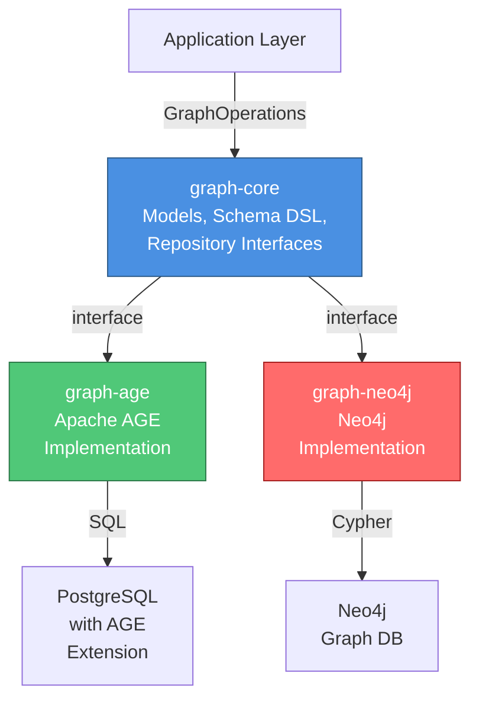

## 주요 클래스

### 모델 계층

#### 기본 모델: GraphElementId, GraphVertex, GraphEdge

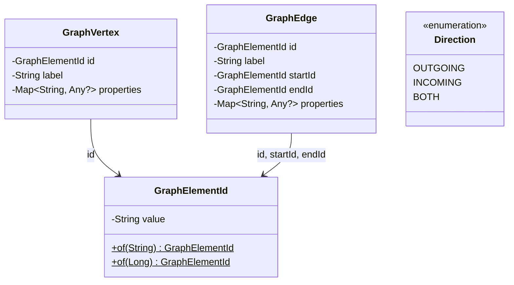

#### PathStep 및 GraphPath 모델

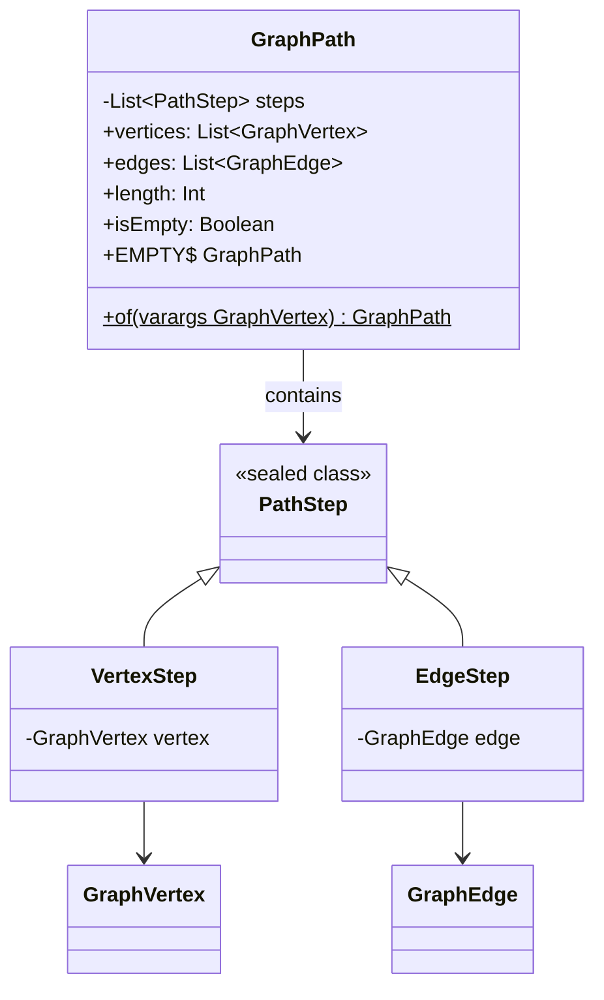

**PathStep 교차 순서 예시**:
```
A --KNOWS--> B --WORKS_AT--> Company
steps = [VertexStep(A), EdgeStep(KNOWS), VertexStep(B), EdgeStep(WORKS_AT), VertexStep(Company)]
length = 2  (간선 개수)
```

### Repository 계층

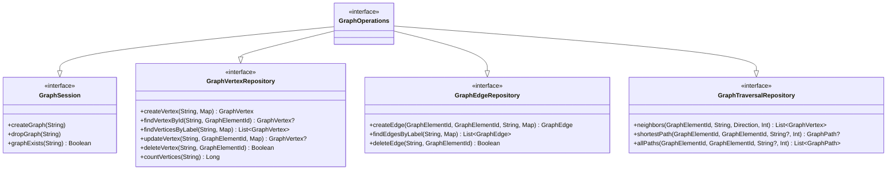

### 스키마 DSL 클래스

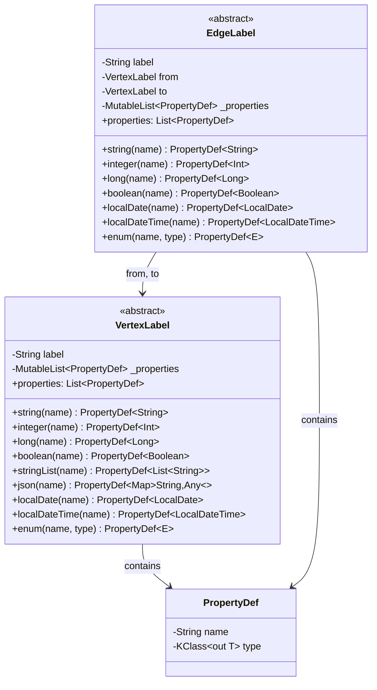

## 스키마 정의 (DSL)

### VertexLabel 정의

```kotlin
// 기본 정점 스키마
object PersonLabel : VertexLabel("Person") {
    val id = string("id")
    val name = string("name")
    val age = integer("age")
    val email = string("email")
    val skills = stringList("skills")
    val joinedAt = localDate("joined_at")
    val metadata = json("metadata")
}

// 다른 정점 예
object CompanyLabel : VertexLabel("Company") {
    val id = string("id")
    val name = string("name")
    val industry = string("industry")
    val foundedAt = localDate("founded_at")
    val employees = integer("employee_count")
}

object PostLabel : VertexLabel("Post") {
    val id = string("id")
    val title = string("title")
    val content = string("content")
    val publishedAt = localDateTime("published_at")
    val tags = stringList("tags")
}
```

**지원 타입**:
- `string(name)` - 문자열
- `integer(name)` - 32bit 정수
- `long(name)` - 64bit 정수
- `boolean(name)` - 불린
- `stringList(name)` - 문자열 배열
- `json(name)` - JSON 객체
- `localDate(name)` - 날짜 (ISO 8601)
- `localDateTime(name)` - 날짜/시간
- `enum(name, enumClass)` - 열거형

### EdgeLabel 정의

```kotlin
// Person-to-Person 관계 (양방향)
object KnowsLabel : EdgeLabel("KNOWS", PersonLabel, PersonLabel) {
    val since = localDate("since")
    val strength = integer("strength")
    val notes = string("notes")
}

// Person -> Company 관계 (일방향)
object WorksAtLabel : EdgeLabel("WORKS_AT", PersonLabel, CompanyLabel) {
    val startDate = localDate("start_date")
    val role = string("role")
    val department = string("department")
    val salary = long("salary")
}

// Person -> Post 관계 (작성)
object AuthorLabel : EdgeLabel("AUTHOR", PersonLabel, PostLabel) {
    val createdAt = localDateTime("created_at")
}

// Person -> Post 관계 (좋아요)
object LikesLabel : EdgeLabel("LIKES", PersonLabel, PostLabel) {
    val likedAt = localDateTime("liked_at")
}

// Person -> Person 관계 (팔로우)
object FollowsLabel : EdgeLabel("FOLLOWS", PersonLabel, PersonLabel) {
    val followedAt = localDateTime("followed_at")
    val notifications = boolean("notifications_enabled")
}
```

**제약**:
- `from`, `to`는 시작 정점과 도착 정점의 `VertexLabel` (방향 그래프)
- 무방향 관계는 `BOTH` 방향으로 쿼리하면 됨

## 작업 흐름 다이어그램

### createVertex 시퀀스

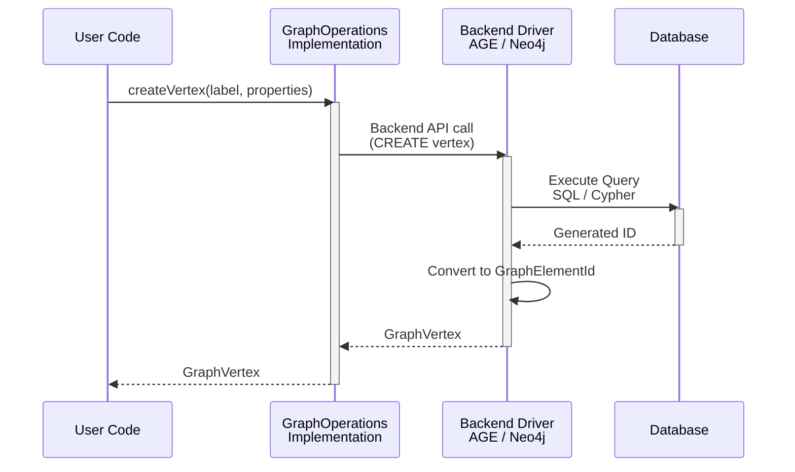

### shortestPath 시퀀스

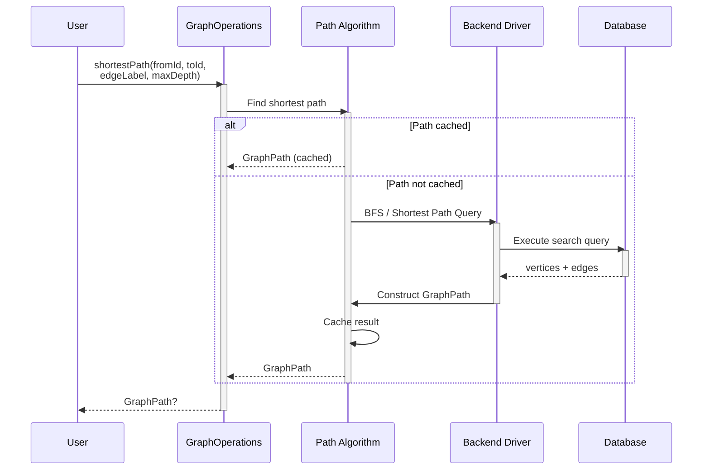

### neighbors 순회

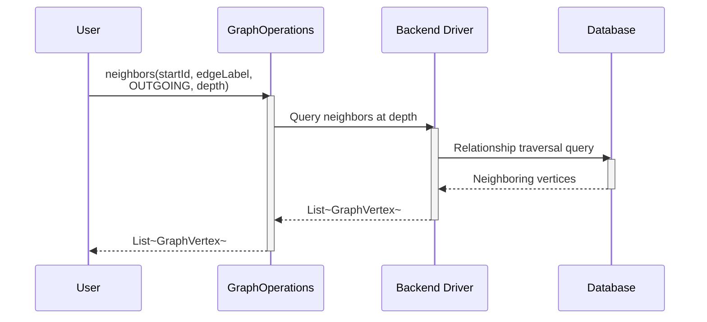

### createEdge 시퀀스

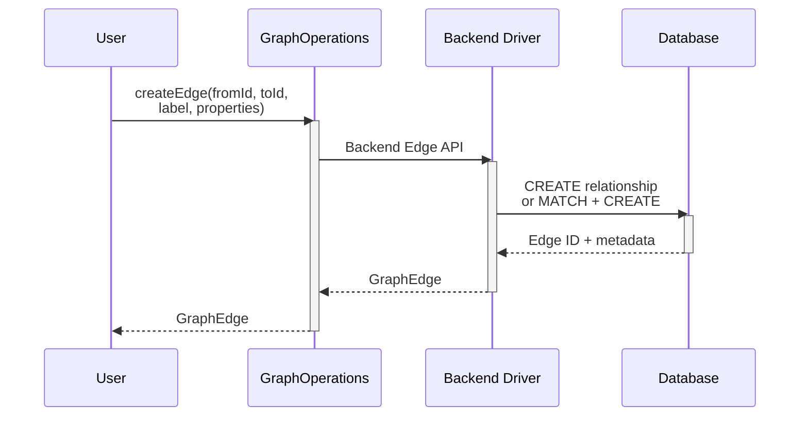

## 상태 다이어그램

### GraphPath 라이프사이클

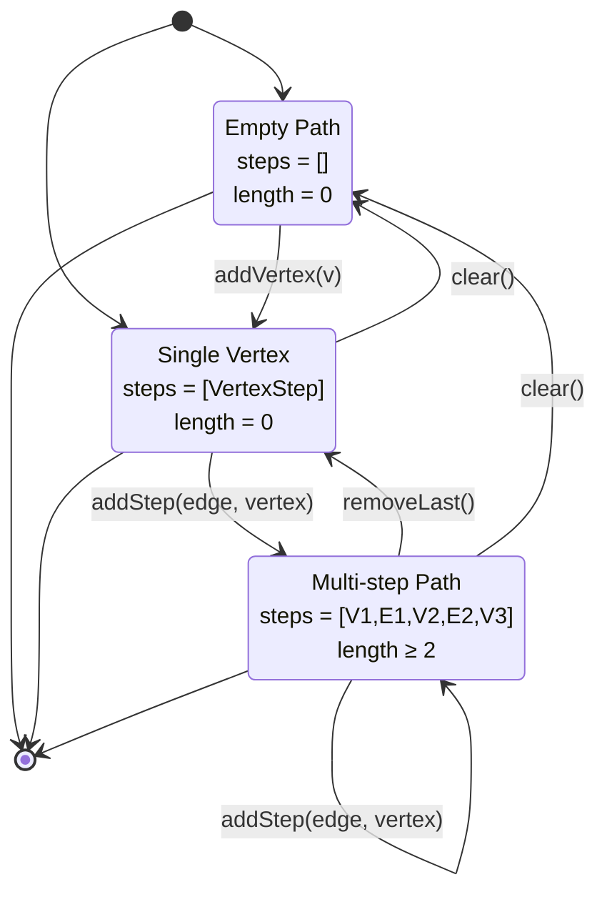

### GraphOperations 사용 상태

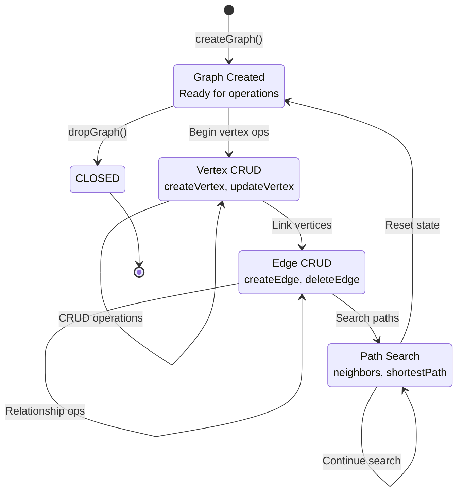

## 플로우차트 다이어그램

### 스키마 DSL 정의 및 사용 흐름

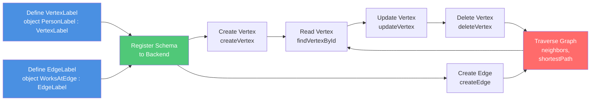

### CRUD 작업 플로우

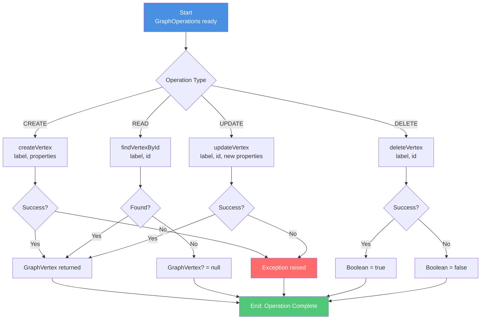

### 경로 탐색 알고리즘 플로우

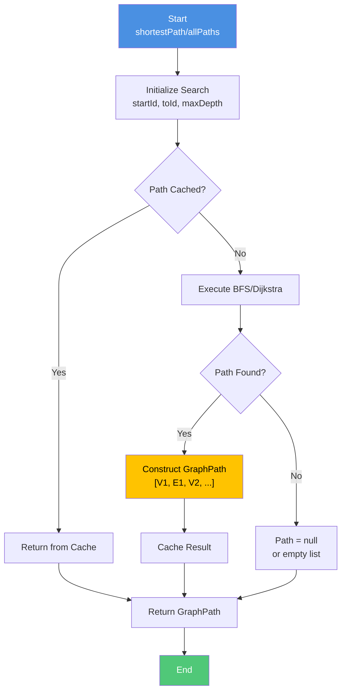

## 사용 예시

### 완전한 그래프 구축 예시

```kotlin
// Suspend context 내에서 실행 (코루틴)
suspend fun buildSocialNetwork(ops: GraphOperations) {
    // === 1. 정점 생성 ===

    // 사람 정점 생성
    val alice = ops.createVertex(
        label = PersonLabel.label,
        properties = mapOf(
            PersonLabel.id.name to "person-1",
            PersonLabel.name.name to "Alice",
            PersonLabel.age.name to 30,
            PersonLabel.email.name to "alice@example.com",
            PersonLabel.joinedAt.name to LocalDate.of(2020, 1, 15)
        )
    )

    val bob = ops.createVertex(
        label = PersonLabel.label,
        properties = mapOf(
            PersonLabel.id.name to "person-2",
            PersonLabel.name.name to "Bob",
            PersonLabel.age.name to 28,
            PersonLabel.email.name to "bob@example.com",
            PersonLabel.joinedAt.name to LocalDate.of(2021, 6, 20)
        )
    )

    val charlie = ops.createVertex(
        label = PersonLabel.label,
        properties = mapOf(
            PersonLabel.id.name to "person-3",
            PersonLabel.name.name to "Charlie",
            PersonLabel.age.name to 32,
            PersonLabel.email.name to "charlie@example.com",
            PersonLabel.joinedAt.name to LocalDate.of(2019, 3, 10)
        )
    )

    // 회사 정점 생성
    val techCorp = ops.createVertex(
        label = CompanyLabel.label,
        properties = mapOf(
            CompanyLabel.id.name to "company-1",
            CompanyLabel.name.name to "TechCorp",
            CompanyLabel.industry.name to "Technology",
            CompanyLabel.foundedAt.name to LocalDate.of(2010, 5, 1),
            CompanyLabel.employees.name to 150
        )
    )

    // 포스트 정점 생성
    val post1 = ops.createVertex(
        label = PostLabel.label,
        properties = mapOf(
            PostLabel.id.name to "post-1",
            PostLabel.title.name to "GraphDB Best Practices",
            PostLabel.content.name to "Here are some tips for working with graph databases...",
            PostLabel.publishedAt.name to LocalDateTime.now(),
            PostLabel.tags.name to listOf("graphdb", "tutorial", "kotlin")
        )
    )

    // === 2. 간선 생성 (관계 연결) ===

    // 친구 관계: Alice - Bob
    val knows1 = ops.createEdge(
        fromId = alice.id,
        toId = bob.id,
        label = KnowsLabel.label,
        properties = mapOf(
            KnowsLabel.since.name to LocalDate.of(2015, 1, 1),
            KnowsLabel.strength.name to 9
        )
    )

    // 친구 관계: Bob - Charlie
    val knows2 = ops.createEdge(
        fromId = bob.id,
        toId = charlie.id,
        label = KnowsLabel.label,
        properties = mapOf(
            KnowsLabel.since.name to LocalDate.of(2018, 6, 1),
            KnowsLabel.strength.name to 7
        )
    )

    // 일자리 관계: Alice works at TechCorp
    val worksAt1 = ops.createEdge(
        fromId = alice.id,
        toId = techCorp.id,
        label = WorksAtLabel.label,
        properties = mapOf(
            WorksAtLabel.startDate.name to LocalDate.of(2021, 1, 15),
            WorksAtLabel.role.name to "Senior Engineer",
            WorksAtLabel.department.name to "Backend",
            WorksAtLabel.salary.name to 120000L
        )
    )

    // 작성 관계: Alice authored post1
    val author1 = ops.createEdge(
        fromId = alice.id,
        toId = post1.id,
        label = AuthorLabel.label,
        properties = mapOf(
            AuthorLabel.createdAt.name to LocalDateTime.now()
        )
    )

    // 좋아요 관계: Bob likes post1
    val likes1 = ops.createEdge(
        fromId = bob.id,
        toId = post1.id,
        label = LikesLabel.label,
        properties = mapOf(
            LikesLabel.likedAt.name to LocalDateTime.now()
        )
    )

    // 팔로우 관계: Charlie follows Alice
    val follows1 = ops.createEdge(
        fromId = charlie.id,
        toId = alice.id,
        label = FollowsLabel.label,
        properties = mapOf(
            FollowsLabel.followedAt.name to LocalDateTime.now(),
            FollowsLabel.notifications.name to true
        )
    )

    return Triple(
        listOf(alice, bob, charlie, techCorp, post1),
        listOf(knows1, knows2, worksAt1, author1, likes1, follows1),
        mapOf("alice" to alice.id, "bob" to bob.id, "charlie" to charlie.id)
    )
}
```

### 정점 생성 (기본)

```kotlin
// 간단한 정점 생성
val person = ops.createVertex(
    label = "Person",
    properties = mapOf(
        "name" to "Alice",
        "age" to 30,
        "email" to "alice@example.com"
    )
)
```

### 간선 생성

```kotlin
// 정점 간 관계 생성
val knows = ops.createEdge(
    fromId = alice.id,
    toId = bob.id,
    label = "KNOWS",
    properties = mapOf(
        "since" to LocalDate.of(2020, 1, 15),
        "strength" to 5
    )
)

// Direction을 고려한 쿼리
val worksAt = ops.createEdge(
    fromId = alice.id,
    toId = companyId,
    label = "WORKS_AT",
    properties = mapOf(
        "role" to "Engineer",
        "department" to "Backend"
    )
)
```

### 정점 조회

```kotlin
// ID로 조회
val vertex = ops.findVertexById("Person", alice.id)

// 레이블로 전체 조회
val allPersons = ops.findVerticesByLabel("Person")

// 필터 조건으로 조회
val engineers = ops.findVerticesByLabel(
    "Person",
    filter = mapOf("role" to "Engineer")
)

// 정점 개수
val count = ops.countVertices("Person")
```

### 정점 수정 및 삭제

```kotlin
// 정점 수정
val updated = ops.updateVertex(
    label = "Person",
    id = alice.id,
    properties = mapOf(
        "age" to 31,
        "email" to "alice.updated@example.com"
    )
)

// 정점 삭제
val deleted = ops.deleteVertex("Person", alice.id)
```

### 간선 조회 및 삭제

```kotlin
// 모든 KNOWS 간선 조회
val allKnowsEdges = ops.findEdgesByLabel(KnowsLabel.label)
println("Total KNOWS relationships: ${allKnowsEdges.size}")

// 필터 조건으로 조회 (strength >= 5)
val strongRelations = ops.findEdgesByLabel(
    KnowsLabel.label,
    filter = mapOf(KnowsLabel.strength.name to 5)
)
println("Strong relationships: ${strongRelations.size}")

// WORKS_AT 간선 조회
val employmentEdges = ops.findEdgesByLabel(WorksAtLabel.label)
employmentEdges.forEach { edge ->
    println("Person ${edge.startId.value} works at ${edge.endId.value}")
}

// 특정 간선 삭제
val deleted = ops.deleteEdge(KnowsLabel.label, someEdgeId)
if (deleted) {
    println("Relationship removed successfully")
}

// 모든 LIKES 간선 배치 삭제
val allLikes = ops.findEdgesByLabel(LikesLabel.label)
for (likeEdge in allLikes) {
    ops.deleteEdge(LikesLabel.label, likeEdge.id)
}
println("Deleted ${allLikes.size} likes")
```

### 정점 조회 및 수정

```kotlin
// ID로 조회
val vertex = ops.findVertexById(PersonLabel.label, alice.id)
println("Found: ${vertex?.properties?.get(PersonLabel.name.name)}")

// 레이블로 전체 조회
val allPersons = ops.findVerticesByLabel(PersonLabel.label)
println("Total persons: ${allPersons.size}")

// 필터 조건으로 조회 (나이가 30 이상)
val experienced = ops.findVerticesByLabel(
    PersonLabel.label,
    filter = mapOf(PersonLabel.age.name to 30)
)

// 정점 개수
val count = ops.countVertices(PersonLabel.label)

// 정점 수정
val updated = ops.updateVertex(
    label = PersonLabel.label,
    id = alice.id,
    properties = mapOf(
        PersonLabel.age.name to 31,
        PersonLabel.email.name to "alice.new@example.com"
    )
)

// 정점 삭제
val deleted = ops.deleteVertex(PersonLabel.label, alice.id)
```

### 그래프 순회 (경로 탐색)

#### 1단계 이웃 (인접 정점)

```kotlin
// 나가는 관계 (OUTGOING): Alice가 아는 사람들
val alicesFriends = ops.neighbors(
    startId = alice.id,
    edgeLabel = KnowsLabel.label,
    direction = Direction.OUTGOING,
    depth = 1
)
println("Alice's direct friends: ${alicesFriends.map { it.properties[PersonLabel.name.name] }}")
// Output: [Bob, ...]

// 들어오는 관계 (INCOMING): Alice를 아는 사람들
val alicesAdmirers = ops.neighbors(
    startId = alice.id,
    edgeLabel = KnowsLabel.label,
    direction = Direction.INCOMING,
    depth = 1
)

// 양방향 (BOTH): Alice와 연결된 모든 사람들
val allConnected = ops.neighbors(
    startId = alice.id,
    edgeLabel = KnowsLabel.label,
    direction = Direction.BOTH,
    depth = 1
)
```

#### 깊이 기반 탐색 (N촌 친구)

```kotlin
// 2촌: Alice → Friend → Friend
val secondDegree = ops.neighbors(
    startId = alice.id,
    edgeLabel = KnowsLabel.label,
    direction = Direction.OUTGOING,
    depth = 2
)
println("Alice's 2nd degree friends: ${secondDegree.size} people")

// 3촌 이상
val thirdDegree = ops.neighbors(
    startId = alice.id,
    edgeLabel = KnowsLabel.label,
    direction = Direction.OUTGOING,
    depth = 3
)
println("Alice's 3rd degree friends: ${thirdDegree.size} people")

// 다양한 관계로 네트워크 확장
val networkWithoutEdgeFilter = ops.neighbors(
    startId = alice.id,
    edgeLabel = null,  // 모든 관계 타입 포함
    direction = Direction.OUTGOING,
    depth = 2
)
```

#### 최단 경로

```kotlin
// Case 1: 특정 간선 타입으로만 경로 찾기 (KNOWS)
val pathViaKnows = ops.shortestPath(
    fromId = alice.id,
    toId = charlie.id,
    edgeLabel = KnowsLabel.label,
    maxDepth = 10
)

if (pathViaKnows != null) {
    println("Shortest KNOWS path from Alice to Charlie:")
    println("  Length: ${pathViaKnows.length} edges")
    println("  Vertices: ${pathViaKnows.vertices.mapIndexed { i, v ->
        "#${i}: ${v.properties[PersonLabel.name.name]}"
    }}")

    // 경로 시각화
    val pathStr = pathViaKnows.steps.joinToString(" → ") { step ->
        when (step) {
            is PathStep.VertexStep -> "[${step.vertex.properties[PersonLabel.name.name]}]"
            is PathStep.EdgeStep -> "-${step.edge.label}->"
        }
    }
    println("Path: $pathStr")
}

// Case 2: 모든 간선 타입 포함 (null)
val anyPath = ops.shortestPath(
    fromId = alice.id,
    toId = charlie.id,
    edgeLabel = null,
    maxDepth = 5
)
if (anyPath != null) {
    println("Shortest ANY path: ${anyPath.length} edges")
}

// Case 3: 경로가 없는 경우
val impossiblePath = ops.shortestPath(
    fromId = alice.id,
    toId = disconnectedPerson.id,
    maxDepth = 100
)
if (impossiblePath == null) {
    println("No path exists between Alice and disconnected person")
}
```

#### 모든 경로 탐색

```kotlin
// Alice에서 Charlie로 가는 모든 경로 (KNOWS만, 최대 5 단계)
val allKnowsPaths = ops.allPaths(
    fromId = alice.id,
    toId = charlie.id,
    edgeLabel = KnowsLabel.label,
    maxDepth = 5
)

println("Found ${allKnowsPaths.size} paths from Alice to Charlie:")
for ((idx, path) in allKnowsPaths.withIndex()) {
    println("\nPath #${idx + 1} (length: ${path.length}):")

    // 방법 1: 정점과 간선 분리
    println("  Vertices: ${path.vertices.map { it.properties[PersonLabel.name.name] }}")
    println("  Edges: ${path.edges.map { it.label }}")

    // 방법 2: 단계별 상세 출력
    path.steps.forEachIndexed { i, step ->
        when (step) {
            is PathStep.VertexStep -> {
                val vName = step.vertex.properties[PersonLabel.name.name]
                println("    [$i] Vertex: $vName (${step.vertex.id.value})")
            }
            is PathStep.EdgeStep -> {
                println("    [$i] Edge: ${step.edge.label}")
            }
        }
    }
}

// 경로들 비교
if (allKnowsPaths.size > 1) {
    val shortestPath = allKnowsPaths.minByOrNull { it.length }
    val longestPath = allKnowsPaths.maxByOrNull { it.length }
    println("\nShortest: ${shortestPath?.length} edges")
    println("Longest: ${longestPath?.length} edges")
}
```

### 그래프 세션 관리

```kotlin
// === Graph Lifecycle ===

// 1. 그래프 생성
ops.createGraph("social_network")
ops.createGraph("knowledge_graph")

// 2. 그래프 존재 확인
val socialExists = ops.graphExists("social_network")
val knowledgeExists = ops.graphExists("knowledge_graph")

println("social_network exists: $socialExists")
println("knowledge_graph exists: $knowledgeExists")

// 3. 그래프 사용
suspend fun useGraph(ops: GraphOperations) {
    val vertex = ops.createVertex("Person", mapOf("name" to "Alice"))
    val neighbors = ops.neighbors(vertex.id, "KNOWS")
}

// 4. 그래프 삭제
ops.dropGraph("knowledge_graph")

// 5. 리소스 해제 (AutoCloseable)
try {
    ops.use { graph ->
        // 그래프 작업 수행
        graph.createVertex("Person", mapOf("name" to "Bob"))
    }
    // 자동으로 close() 호출
} catch (e: Exception) {
    println("Error: ${e.message}")
}
```

### 트랜잭션 및 배치 작업

```kotlin
// 여러 작업을 동시에 수행 (코루틴)
suspend fun batchCreatePersons(ops: GraphOperations, names: List<String>) {
    val persons = coroutineScope {
        names.map { name ->
            async {
                ops.createVertex(
                    PersonLabel.label,
                    mapOf(PersonLabel.name.name to name)
                )
            }
        }.awaitAll()
    }
    println("Created ${persons.size} persons")
    return persons
}

// 대량 간선 생성
suspend fun createFriendships(ops: GraphOperations, persons: List<GraphVertex>) {
    for (i in persons.indices) {
        for (j in (i + 1) until persons.size) {
            ops.createEdge(
                persons[i].id,
                persons[j].id,
                KnowsLabel.label,
                mapOf(KnowsLabel.since.name to LocalDate.now())
            )
        }
    }
}
```

### 단위 테스트 예시

```kotlin
class GraphOperationsTest {
    @Test
    fun testVertexCRUD() = runTest {
        val ops = createTestGraphOperations()

        // CREATE
        val vertex = ops.createVertex(PersonLabel.label, mapOf(
            PersonLabel.name.name to "Bob"
        ))
        assertNotNull(vertex.id)
        assertEquals(PersonLabel.label, vertex.label)

        // READ
        val found = ops.findVertexById(PersonLabel.label, vertex.id)
        assertEquals("Bob", found?.properties?.get(PersonLabel.name.name))

        // UPDATE
        val updated = ops.updateVertex(PersonLabel.label, vertex.id, mapOf(
            PersonLabel.name.name to "Charlie"
        ))
        assertEquals("Charlie", updated?.properties?.get(PersonLabel.name.name))

        // DELETE
        val deleted = ops.deleteVertex(PersonLabel.label, vertex.id)
        assertTrue(deleted)
    }

    @Test
    fun testEdgeCRUD() = runTest {
        val ops = createTestGraphOperations()

        // 정점 생성
        val v1 = ops.createVertex(PersonLabel.label, mapOf(
            PersonLabel.name.name to "Alice"
        ))
        val v2 = ops.createVertex(PersonLabel.label, mapOf(
            PersonLabel.name.name to "Bob"
        ))

        // CREATE Edge
        val edge = ops.createEdge(
            v1.id, v2.id,
            KnowsLabel.label,
            mapOf(KnowsLabel.since.name to LocalDate.now())
        )
        assertNotNull(edge.id)
        assertEquals(v1.id, edge.startId)
        assertEquals(v2.id, edge.endId)

        // READ Edges
        val edges = ops.findEdgesByLabel(KnowsLabel.label)
        assertEquals(1, edges.size)

        // DELETE Edge
        val deleted = ops.deleteEdge(KnowsLabel.label, edge.id)
        assertTrue(deleted)
    }

    @Test
    fun testShortestPath() = runTest {
        val ops = createTestGraphOperations()

        // 3개 정점 생성
        val v1 = ops.createVertex(PersonLabel.label, mapOf(PersonLabel.name.name to "A"))
        val v2 = ops.createVertex(PersonLabel.label, mapOf(PersonLabel.name.name to "B"))
        val v3 = ops.createVertex(PersonLabel.label, mapOf(PersonLabel.name.name to "C"))

        // 간선: A → B → C
        ops.createEdge(v1.id, v2.id, KnowsLabel.label)
        ops.createEdge(v2.id, v3.id, KnowsLabel.label)

        // 최단 경로 탐색
        val path = ops.shortestPath(v1.id, v3.id, KnowsLabel.label, maxDepth = 10)

        assertNotNull(path)
        assertEquals(2, path!!.length)
        assertEquals(3, path.vertices.size)
        assertEquals(listOf("A", "B", "C"), path.vertices.map {
            it.properties[PersonLabel.name.name]
        })
    }

    @Test
    fun testNeighbors() = runTest {
        val ops = createTestGraphOperations()

        // Star topology 생성: center --KNOWS--> [v1, v2, v3]
        val center = ops.createVertex(PersonLabel.label, mapOf(
            PersonLabel.name.name to "Center"
        ))
        val v1 = ops.createVertex(PersonLabel.label, mapOf(PersonLabel.name.name to "V1"))
        val v2 = ops.createVertex(PersonLabel.label, mapOf(PersonLabel.name.name to "V2"))
        val v3 = ops.createVertex(PersonLabel.label, mapOf(PersonLabel.name.name to "V3"))

        ops.createEdge(center.id, v1.id, KnowsLabel.label)
        ops.createEdge(center.id, v2.id, KnowsLabel.label)
        ops.createEdge(center.id, v3.id, KnowsLabel.label)

        // 이웃 조회
        val neighbors = ops.neighbors(center.id, KnowsLabel.label, Direction.OUTGOING, depth = 1)

        assertEquals(3, neighbors.size)
        assertTrue(neighbors.any { it.properties[PersonLabel.name.name] == "V1" })
        assertTrue(neighbors.any { it.properties[PersonLabel.name.name] == "V2" })
        assertTrue(neighbors.any { it.properties[PersonLabel.name.name] == "V3" })
    }

    @Test
    fun testAllPaths() = runTest {
        val ops = createTestGraphOperations()

        // Diamond pattern: A → [B, C] → D
        val a = ops.createVertex(PersonLabel.label, mapOf(PersonLabel.name.name to "A"))
        val b = ops.createVertex(PersonLabel.label, mapOf(PersonLabel.name.name to "B"))
        val c = ops.createVertex(PersonLabel.label, mapOf(PersonLabel.name.name to "C"))
        val d = ops.createVertex(PersonLabel.label, mapOf(PersonLabel.name.name to "D"))

        ops.createEdge(a.id, b.id, KnowsLabel.label)
        ops.createEdge(b.id, d.id, KnowsLabel.label)
        ops.createEdge(a.id, c.id, KnowsLabel.label)
        ops.createEdge(c.id, d.id, KnowsLabel.label)

        // 모든 경로 탐색
        val allPaths = ops.allPaths(a.id, d.id, KnowsLabel.label, maxDepth = 10)

        assertEquals(2, allPaths.size)  // A→B→D, A→C→D
        assertTrue(allPaths.all { it.length == 2 })
    }

    private suspend fun createTestGraphOperations(): GraphOperations {
        // 테스트용 GraphOperations 구현체 반환
        // 실제로는 mock 또는 in-memory 구현
        return MockGraphOperations()
    }
}
```

## GraphPath 상세

`GraphPath`는 경로를 단계별로 추적한다:

```kotlin
data class GraphPath(
    val steps: List<PathStep>  // [VertexStep, EdgeStep, VertexStep, EdgeStep, ...]
) {
    val vertices: List<GraphVertex>  // 경로의 모든 정점
    val edges: List<GraphEdge>       // 경로의 모든 간선
    val length: Int                  // 간선 개수
    val isEmpty: Boolean             // 경로가 비어있는지 확인
}
```

### GraphPath 구성 예

alice -> KNOWS -> bob -> WORKS_AT -> company 경로:

```
steps = [
    VertexStep(alice),
    EdgeStep(KNOWS),
    VertexStep(bob),
    EdgeStep(WORKS_AT),
    VertexStep(company)
]

vertices = [alice, bob, company]
edges = [KNOWS, WORKS_AT]
length = 2  // 간선 2개
```

## GraphElementId

백엔드 독립적인 요소 ID 표현:

```kotlin
@JvmInline
value class GraphElementId(val value: String) {
    companion object {
        fun of(value: String) = GraphElementId(value)
        fun of(value: Long) = GraphElementId(value.toString())
    }
}

// 사용
val id1 = GraphElementId.of("some-uuid")
val id2 = GraphElementId.of(12345L)
```

**변환**:
- Apache AGE: Long 내부 ID → `GraphElementId("$longId")`
- Neo4j: `elementId()` (String) → `GraphElementId` 직접 매핑

## 코루틴 기반 설계

모든 Repository 메서드는 `suspend` 함수이므로 코루틴 내에서 사용:

```kotlin
coroutineScope {
    // 정점 생성 (suspend)
    val alice = ops.createVertex("Person", mapOf("name" to "Alice"))

    // 간선 생성 (suspend)
    val bob = ops.createVertex("Person", mapOf("name" to "Bob"))
    ops.createEdge(alice.id, bob.id, "KNOWS", emptyMap())

    // 경로 탐색 (suspend)
    val path = ops.shortestPath(alice.id, bob.id, "KNOWS")

    // 수백 개의 작업을 동시 실행
    val friends = async { ops.neighbors(alice.id, "KNOWS", depth = 1) }
    val paths = async { ops.allPaths(alice.id, bob.id, maxDepth = 5) }

    val f = friends.await()
    val p = paths.await()
}
```

## 의존성

```kotlin
// build.gradle.kts
dependencies {
    api(Libs.kotlinx_coroutines_core)

    testImplementation(Libs.bluetape4k_junit5)
    testImplementation(Libs.bluetape4k_testcontainers)
    testImplementation(Libs.kotlinx_coroutines_test)
}
```

## 구현체

이 모듈의 인터페이스를 구현하는 백엔드별 모듈:

| 모듈 | 설명 |
|------|------|
| `graph-age` | Apache AGE + PostgreSQL + Exposed (관계형 DB 위의 그래프) |
| `graph-neo4j` | Neo4j Java Driver + Coroutines (전용 그래프 DB) |

각 구현체는 `GraphOperations` 인터페이스를 구현하며, graph-core의 모델과 인터페이스를 사용한다.

## 참고

- **AutoCloseable**: `GraphOperations`는 `GraphSession`을 상속하며 `AutoCloseable`을 구현. 외부 리소스(Database/Driver)의 생명주기는 호출자가 관리.
- **트랜잭션**: 구현체에서 트랜잭션 관리 (graph-core에는 명시적인 트랜잭션 API 없음).
- **백엔드 차이**: AGE는 SQL 기반이므로 쿼리 최적화, Neo4j는 Cypher 쿼리 최적화에 따라 성능이 달라질 수 있음.
