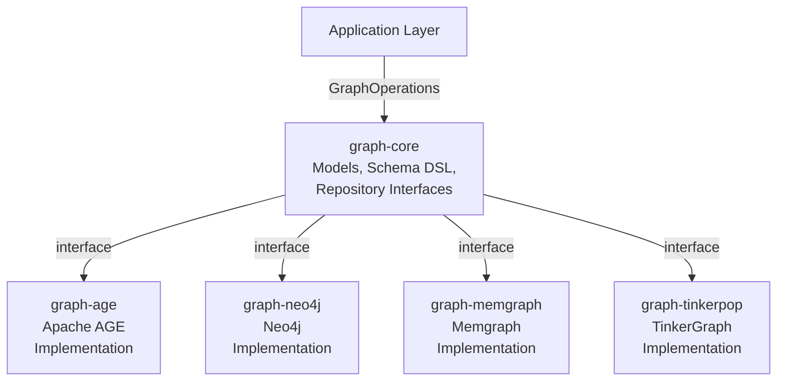

# graph-core

Common abstraction layer for Graph Databases (Apache AGE, Neo4j, Memgraph, Apache TinkerPop). Provides backend-independent models and repository interfaces so that multiple graph database implementations can work under the same API.

> 🇰🇷 [한국어 문서](README.ko.md)

## Module Description

- **Backend-Independent Abstraction**: Common interface for various graph databases (Apache AGE, Neo4j, Memgraph, TinkerPop, etc.)
- **Coroutine-Based API**: All suspend-variant repository methods use Kotlin Coroutines
- **Dual API Pattern**: Both synchronous (`GraphOperations`) and coroutine (`GraphSuspendOperations`) interfaces
- **Schema DSL**: Declarative schema definition through `VertexLabel` and `EdgeLabel`
- **Path Tracing**: Shortest-path and all-paths results represented with the `GraphPath` model

## Architecture Overview



## Key Classes

### Model Layer

```kotlin
@JvmInline
value class GraphElementId(val value: String)

data class GraphVertex(
    val id: GraphElementId,
    val label: String,
    val properties: Map<String, Any?>,
)

data class GraphEdge(
    val id: GraphElementId,
    val label: String,
    val startId: GraphElementId,
    val endId: GraphElementId,
    val properties: Map<String, Any?>,
)

sealed class PathStep {
    data class VertexStep(val vertex: GraphVertex) : PathStep()
    data class EdgeStep(val edge: GraphEdge) : PathStep()
}

data class GraphPath(val steps: List<PathStep>)
```

### Repository Layer

```
GraphOperations = GraphSession
                + GraphVertexRepository
                + GraphEdgeRepository
                + GraphTraversalRepository

GraphSuspendOperations = GraphSuspendSession
                       + GraphSuspendVertexRepository
                       + GraphSuspendEdgeRepository
                       + GraphSuspendTraversalRepository
```

| Interface | Responsibility |
|-----------|----------------|
| `GraphSession` / `GraphSuspendSession` | Session / transaction lifecycle |
| `GraphVertexRepository` | Vertex CRUD (create / find / update / delete / count) |
| `GraphEdgeRepository` | Edge CRUD and relationship queries |
| `GraphTraversalRepository` | `neighbors`, `shortestPath`, `allPaths`, etc. |

### Schema DSL

Exposed Table-style declarative schema. Works across backends.

```kotlin
object PersonLabel : VertexLabel("Person") {
    val id       = string("id")
    val name     = string("name")
    val age      = integer("age")
    val email    = string("email")
    val joinedAt = localDate("joinedAt")
}

object KnowsLabel : EdgeLabel("KNOWS") {
    val since = localDate("since")
}
```

## Usage Example

```kotlin
// Create vertex
val alice = graphOps.createVertex(
    label = "Person",
    properties = mapOf(
        "name" to "Alice",
        "age" to 30,
        "email" to "alice@example.com",
    ),
)

// Create edge
val knows = graphOps.createEdge(
    startId = alice.id,
    endId = bob.id,
    label = "KNOWS",
    properties = mapOf("since" to LocalDate.now()),
)

// Traverse
val neighbors = graphOps.neighbors(
    vertexId = alice.id,
    edgeLabel = "KNOWS",
    direction = Direction.OUTGOING,
    depth = 1,
)

// Shortest path
val path = graphOps.shortestPath(
    fromId = alice.id,
    toId = charlie.id,
    edgeLabel = "KNOWS",
    maxDepth = 5,
)
```

## Dependencies

```kotlin
dependencies {
    implementation("io.github.bluetape4k.graph:graph-core:0.0.1")

    // pick one backend
    implementation("io.github.bluetape4k.graph:graph-neo4j:0.0.1")
    // implementation("io.github.bluetape4k.graph:graph-age:0.0.1")
    // implementation("io.github.bluetape4k.graph:graph-memgraph:0.0.1")
    // implementation("io.github.bluetape4k.graph:graph-tinkerpop:0.0.1")
}
```

## References

- [bluetape4k](https://github.com/bluetape4k/bluetape4k-projects) — base ecosystem
- [Apache AGE](https://age.apache.org/) — PostgreSQL graph extension
- [Neo4j](https://neo4j.com/) — native graph database
- [Memgraph](https://memgraph.com/) — in-memory graph database
- [Apache TinkerPop](https://tinkerpop.apache.org/) — graph computing framework

## Graph Algorithms

`graph-core` defines the `GraphAlgorithmRepository` / `GraphSuspendAlgorithmRepository` interfaces and ships JVM fallback implementations (`UnionFind`, `BfsDfsRunner`, `CycleDetector`, `PageRankCalculator`) used by backends that do not have a native query for a given algorithm.

### Algorithm Support Matrix

| Algorithm | Interface method | Options type | Result type |
|-----------|-----------------|--------------|-------------|
| PageRank | `pageRank(options)` | `PageRankOptions` | `List<PageRankScore>` |
| Degree Centrality | `degreeCentrality(vertexId, options)` | `DegreeOptions` | `DegreeResult` |
| Connected Components | `connectedComponents(options)` | `ComponentOptions` | `List<GraphComponent>` |
| BFS | `bfs(startId, options)` | `BfsDfsOptions` | `List<TraversalVisit>` |
| DFS | `dfs(startId, options)` | `BfsDfsOptions` | `List<TraversalVisit>` |
| Cycle Detection | `detectCycles(options)` | `CycleOptions` | `List<GraphCycle>` |

### Composite Interface

```
GraphOperations = GraphSession
                + GraphVertexRepository
                + GraphEdgeRepository
                + GraphGenericRepository      // traversal + algorithm
                + GraphVirtualThreadAlgorithmRepository

GraphSuspendOperations = GraphSuspendSession
                       + GraphSuspendVertexRepository
                       + GraphSuspendEdgeRepository
                       + GraphSuspendGenericRepository
```

### Usage Example

```kotlin
val ops: GraphOperations = Neo4jGraphOperations(driver)

// PageRank — top 10 persons
val top10 = ops.pageRank(PageRankOptions(vertexLabel = "Person", topK = 10))
top10.forEach { println("${it.vertex.label}: ${it.score}") }

// Degree centrality
val degree = ops.degreeCentrality(alice.id, DegreeOptions(edgeLabel = "KNOWS"))
println("in=${degree.inDegree} out=${degree.outDegree}")

// BFS
val visits = ops.bfs(alice.id, BfsDfsOptions(edgeLabel = "KNOWS", maxDepth = 3))

// Cycle detection
val cycles = ops.detectCycles(CycleOptions(edgeLabel = "KNOWS", maxDepth = 5))
```

## Virtual Threads

`GraphAlgorithmRepository` can be wrapped with a Virtual Thread adapter to expose `CompletableFuture`-based async APIs for Java interop.

```kotlin
import io.bluetape4k.graph.algo.asVirtualThread

val ops: GraphOperations = TinkerGraphOperations()

// Wrap with virtual-thread executor
val vtOps = ops.asVirtualThread()

// Returns CompletableFuture<List<PageRankScore>>
val future = vtOps.pageRankAsync(PageRankOptions(topK = 5))
val scores = future.join()

// Composed pipeline
val pipeline = vtOps.pageRankAsync()
    .thenApply { list -> list.take(3) }
    .thenAccept { top -> top.forEach { println(it) } }
pipeline.join()
```
