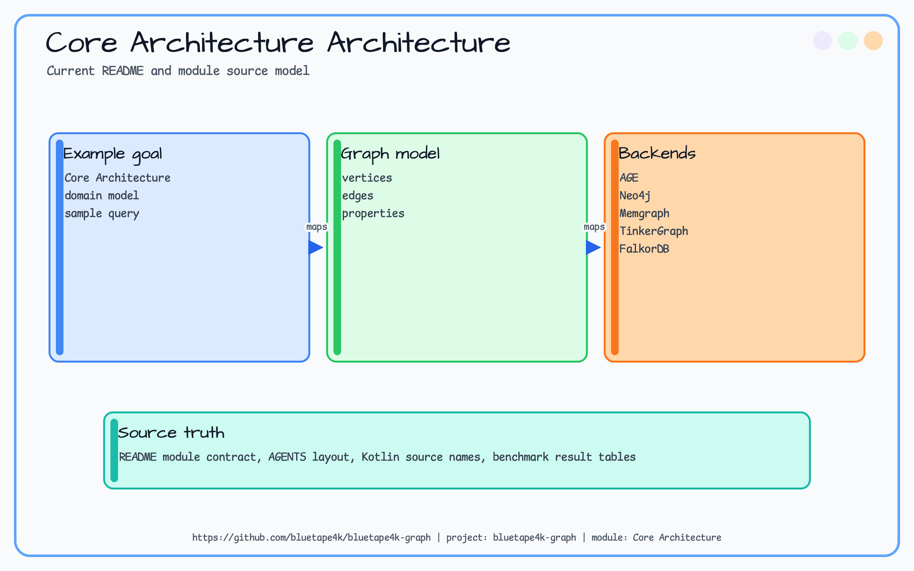
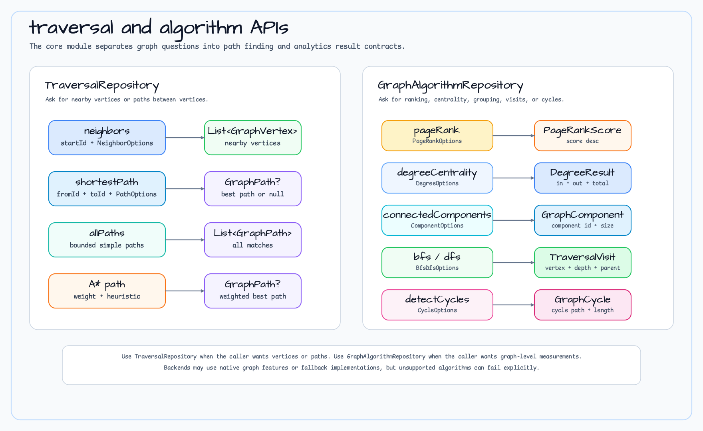

# graph-core

Common abstraction layer for Graph Databases (Apache AGE, Neo4j, Memgraph, Apache TinkerPop). Provides backend-independent models and repository interfaces so that multiple graph database implementations can work under the same API.

> 🇰🇷 [한국어 문서](README.ko.md)

## Module Description

- **Backend-Independent Abstraction**: Common interface for various graph databases (Apache AGE, Neo4j, Memgraph, TinkerPop, etc.)
- **Coroutine-Based API**: All suspend-variant repository methods use Kotlin Coroutines
- **Dual API Pattern**: Both synchronous (`GraphOperations`) and coroutine (`GraphSuspendOperations`) interfaces
- **Schema DSL**: Declarative schema definition through `VertexLabel` and `EdgeLabel`
- **Path Tracing**: Shortest-path and all-paths results represented with the `GraphPath` model

## Architecture Overview



## Key Classes

### Model Layer

```kotlin
@JvmInline
value class GraphElementId(val value: String)

data class GraphVertex(
    val id: GraphElementId,
    val label: String,
    val properties: Map<String, Any?>,
)

data class GraphEdge(
    val id: GraphElementId,
    val label: String,
    val startId: GraphElementId,
    val endId: GraphElementId,
    val properties: Map<String, Any?>,
)

sealed class PathStep {
    data class VertexStep(val vertex: GraphVertex) : PathStep()
    data class EdgeStep(val edge: GraphEdge) : PathStep()
}

data class GraphPath(val steps: List<PathStep>)
```

### Repository Layer

```
GraphOperations = GraphSession
                + GraphVertexRepository
                + GraphEdgeRepository
                + GraphTraversalRepository

GraphSuspendOperations = GraphSuspendSession
                       + GraphSuspendVertexRepository
                       + GraphSuspendEdgeRepository
                       + GraphSuspendTraversalRepository
```

| Interface | Responsibility |
|-----------|----------------|
| `GraphSession` / `GraphSuspendSession` | Graph lifecycle and connection-facing session operations |
| `GraphVertexRepository` | Vertex CRUD (create / find / update / delete / count) |
| `GraphEdgeRepository` | Edge CRUD and relationship queries |
| `GraphTraversalRepository` | `neighbors`, `shortestPath`, `allPaths`, etc. |
| `GraphTransactionalOperations` | Optional sync transaction capability used by `ops.transaction { }` |
| `GraphSuspendTransactionalOperations` | Optional coroutine transaction capability used by `ops.suspendTransaction { }` |
| `GraphSchemaManagementOperations` | Optional sync schema/index capability used by `ops.schemaManager()` |
| `GraphSuspendSchemaManagementOperations` | Optional coroutine schema/index capability used by `suspendOps.schemaManager()` |
| `GraphMergeOperations` | Optional sync merge/upsert capability used by `ops.mergeVertex()` and `ops.mergeEdge()` |
| `GraphSuspendMergeOperations` | Optional coroutine merge/upsert capability used by suspend merge extensions |

### Capability Discovery

Use `capabilities()` before invoking optional operations. The returned immutable
`GraphCapabilities` value exposes support flags, the `core-0.7` contract version,
and capability-specific constraints without probing by exception.

```kotlin
import io.bluetape4k.graph.repository.GraphCapability
import io.bluetape4k.graph.repository.capabilities

val capabilities = ops.capabilities()
if (capabilities.supports(GraphCapability.MERGE)) {
    ops.mergeVertex("Person", matchProperties = mapOf("email" to "alice@example.com"))
}
```

`GRAPH_ALGORITHM` means portable JVM algorithms. `NATIVE_ALGORITHM` is reported
only by an explicitly installed backend provider; an absent flag must not be
interpreted as a silent fallback guarantee. Decorators that use Kotlin
`by`-delegation must implement `GraphCapabilitiesOperations` to preserve their
delegate mapping.

#### Capability compatibility policy

`GraphCapability` enum names are the serialization-facing contract. New values
are appended to the enum so existing ordinals remain stable, but consumers must
not persist or compare `ordinal`; use the enum `name` instead. A consumer that
handles capabilities with `when` must include an explicit `else` branch because
new values can be added in a later library version. The branch should treat an
unknown value as unsupported (and may emit telemetry) rather than invoking an
operation it cannot verify.

When reading capability names from configuration, storage, or a remote peer,
use `GraphCapability.fromSerializedNameOrNull(name)`. It returns `null` for a
name introduced by a newer library, while `Enum.valueOf` throws. This is a
forward-compatible parsing boundary; it does not make an older binary aware of
new operations.

The CORE-2 conformance slice covers `MERGE`, `SCHEMA`, `TRANSACTION`,
`BATCH_INSERT`, `CHUNKED_READ`, `CHUNKED_EXPORT`, `BOUNDED_CHUNKED_READ`,
`BOUNDED_CHUNKED_EXPORT`, `WEIGHTED_PATH`, `GRAPH_ALGORITHM`, and
`NATIVE_ALGORITHM`. `CHUNKED_*` is an API chunking contract only. A backend may
advertise `BOUNDED_CHUNKED_*` only when its source traversal does not
materialize the complete result before producing chunks. Unsupported optional
operations must remain explicit `UnsupportedOperationException` failures.

### Cross-backend capability conformance

The reusable `AbstractGraphCapabilityConformanceTest` fixture runs the same
contract against the in-memory TinkerGraph lane and each container backend. Run
the lanes sequentially so Testcontainers lifecycles do not overlap:

```bash
./gradlew :bluetape4k-graph-tinkerpop:test --tests '*GraphCapabilityConformanceTest'
./gradlew :bluetape4k-graph-neo4j:test --tests '*GraphCapabilityConformanceTest'
./gradlew :bluetape4k-graph-memgraph:test --tests '*GraphCapabilityConformanceTest'
./gradlew :bluetape4k-graph-age:test --tests '*GraphCapabilityConformanceTest'
./gradlew :bluetape4k-graph-falkordb:test --tests '*GraphCapabilityConformanceTest'
```

The normal CI backend jobs are triggered by `graph-core` changes. The complete
container matrix belongs to the Full Nightly scope; TinkerGraph remains the
fast in-memory reference lane.

## Traversal and Algorithm APIs



`GraphTraversalRepository` answers path-oriented questions:

- `neighbors(startId, NeighborOptions)` returns nearby `GraphVertex` values.
- `shortestPath(fromId, toId, PathOptions)` returns the best bounded `GraphPath?`.
- `allPaths(fromId, toId, PathOptions)` returns all bounded simple `GraphPath` results.
- A* path search via `aStarPath(fromId, toId, PathOptions, heuristic)` returns a weighted best `GraphPath?`.

`GraphAlgorithmRepository` answers graph-level analytics questions:

- `pageRank(PageRankOptions)` returns `PageRankScore` results sorted by score descending.
- `degreeCentrality(vertexId, DegreeOptions)` returns a `DegreeResult` with in/out/total degree.
- `connectedComponents(ComponentOptions)` returns `GraphComponent` groups.
- `bfs(startId, BfsDfsOptions)` and `dfs(startId, BfsDfsOptions)` return ordered `TraversalVisit` events.
- `detectCycles(CycleOptions)` returns `GraphCycle` paths.

### Optional Native Algorithm Provider SPI

`graph-core` exposes a dependency-free provider boundary through
`GraphAlgorithmProvider`, `GraphAlgorithmProviderDescriptor`, and
`GraphAlgorithmProviderSelector`. Optional modules can advertise native
capabilities without adding a GDS/MAGE SDK to a base backend. `AUTO` selects a
provider only when its descriptor lists the requested algorithm; otherwise the
selector returns an explicit `JVM_FALLBACK` observation. `NATIVE_ONLY` fails
with `GraphAlgorithmProviderUnavailableException` instead of silently changing
the execution path.

```kotlin
val execution = GraphAlgorithmProviderSelector.select(GraphAlgorithmId.PAGE_RANK)
check(execution.path == GraphAlgorithmExecutionPath.JVM_FALLBACK)
```

Native provider modules and their driver calls are intentionally outside this
module. Backends expose the last selected path through
`GraphAlgorithmExecutionObservable` and may receive a
`GraphAlgorithmExecutionObserver` for metrics or audit logging.

### Transaction DSL

Backends that implement `GraphTransactionalOperations` can expose a sync transaction block through the
`transaction` extension. Unsupported backends fail explicitly instead of silently falling back to auto-commit.

```kotlin
import io.bluetape4k.graph.repository.transaction

val edge = ops.transaction {
    val alice = createVertex("Person", mapOf("name" to "Alice"))
    val bob = createVertex("Person", mapOf("name" to "Bob"))
    createEdge(alice.id, bob.id, "KNOWS")
}
```

Coroutine backends that implement `GraphSuspendTransactionalOperations` expose the same vertex/edge CRUD scope through
`suspendTransaction`.

```kotlin
import io.bluetape4k.graph.repository.suspendTransaction

val edge = suspendOps.suspendTransaction {
    val alice = createVertex("Person", mapOf("name" to "Alice"))
    val bob = createVertex("Person", mapOf("name" to "Bob"))
    createEdge(alice.id, bob.id, "KNOWS")
}
```

The coroutine transaction result contract is shared by every transaction-capable coroutine backend. A top-level `Flow`
is materialized before commit and can be collected after the transaction returns. A `Flow` nested in a `Pair`,
`Triple`, `Map`, `Collection`, or array is rejected with `IllegalArgumentException`; call `toList()` (or another
explicit materializer) inside the transaction block before returning a composite value. `Sequence` and arbitrary
user-wrapper/data-class internals are not inspected, so callers own materialization for those carriers.

This first slice adds transaction support for Neo4j, Memgraph, AGE, and TinkerGraph sync/coroutine backends.
FalkorDB remains explicitly unsupported because its Redis `MULTI` API queues graph query results until `EXEC`, while
this repository DSL needs each created vertex ID immediately for later calls in the same block.

### Schema / Index Manager

Backends that implement `GraphSchemaManagementOperations` expose schema DDL through `schemaManager()`.
The API validates labels and property names before building backend DDL, and unsupported backends fail explicitly
instead of silently pretending that constraints were enforced.

```kotlin
import io.bluetape4k.graph.schema.schemaManager

ops.schemaManager().createIndex("Person", "email")
ops.schemaManager().createUniqueConstraint("Person", "email")
val indexes = ops.schemaManager().listIndexes()
```

The same manager is available for coroutine backends:

```kotlin
val schema = suspendOps.schemaManager()
schema.createIndex("Person", "email")
```

Support matrix:

| Backend | Indexes | Unique constraints | Notes |
|---------|---------|--------------------|-------|
| Neo4j | Create / list / drop | Create / list | Uses Neo4j `CREATE INDEX` and `CREATE CONSTRAINT` |
| Memgraph | Create / list / drop | Create / list | Uses Memgraph `SHOW INDEX INFO` and `SHOW CONSTRAINT INFO` |
| TinkerGraph | In-memory recorded no-op | Unsupported | Constraints cannot be enforced by TinkerGraph |
| AGE | Unsupported | Unsupported | PostgreSQL-side AGE indexes are not portable yet |
| FalkorDB | Create / list / drop | Unsupported | Unique constraints require raw `GRAPH.CONSTRAINT CREATE` support |

### Schema Drift Planning

Use `GraphSchemaDefinition` to compare a desired declaration with live metadata before applying DDL.
Planning is dry-run by default; extra live indexes become `SKIP` entries until destructive drops are explicitly enabled.
Constraint drops are reported as `UNSUPPORTED` because the common manager intentionally has no drop-constraint API.

```kotlin
import io.bluetape4k.graph.model.GraphIndex
import io.bluetape4k.graph.schema.GraphSchemaDefinition
import io.bluetape4k.graph.schema.GraphSchemaPlanOptions
import io.bluetape4k.graph.schema.plan

val desired = GraphSchemaDefinition(
    indexes = setOf(GraphIndex("ignored", "Person", "email")),
)
val plan = ops.schemaManager().plan(desired) // dry-run, no mutation
val report = plan.apply(ops.schemaManager()) // applies creates only when dryRun=false
```

Set `GraphSchemaPlanOptions(dryRun = false, allowDestructiveDrops = true)` only in an explicitly approved
migration path. A failed backend operation is surfaced as `UNSUPPORTED` rather than treated as a silent success.

### Merge / Upsert

Backends that implement `GraphMergeOperations` expose idempotent vertex and edge upserts through extension functions.
`matchProperties` are stable identity keys and cannot be empty for vertices. `setProperties` are applied to both the
create and match branches and cannot overwrite match keys.

```kotlin
import io.bluetape4k.graph.repository.mergeEdge
import io.bluetape4k.graph.repository.mergeVertex

val alice = ops.mergeVertex(
    label = "Person",
    matchProperties = mapOf("email" to "alice@example.com"),
    setProperties = mapOf("name" to "Alice", "age" to 31),
)

val edge = ops.mergeEdge(
    fromId = alice.id,
    toId = bob.id,
    label = "KNOWS",
    setProperties = mapOf("since" to 2024),
)
```

Coroutine backends expose the same API as suspend functions. Merge keys are validated before query construction, so
unsafe labels and property names fail before reaching the backend.

Support matrix:

| Backend | Vertex merge | Edge merge | Notes |
|---------|--------------|------------|-------|
| Neo4j | Native `MERGE` | Native relationship `MERGE` | Uses `elementId()` for endpoints |
| Memgraph | Native `MERGE` | Native relationship `MERGE` | Uses integer `id()` endpoint lookup |
| FalkorDB | Native `MERGE` | Native relationship `MERGE` | Uses per-property parameters |
| AGE | Transactional match/update/create fallback | Transactional match/update/create fallback | AGE image does not support `ON CREATE SET` / `ON MATCH SET` |
| TinkerGraph | Gremlin get-or-create/update | Gremlin get-or-create/update | In-memory semantics |

### Schema DSL

Exposed Table-style declarative schema. Works across backends.

```kotlin
object PersonLabel : VertexLabel("Person") {
    val id       = string("id")
    val name     = string("name")
    val age      = integer("age")
    val email    = string("email")
    val joinedAt = localDate("joinedAt")
}

object KnowsLabel : EdgeLabel("KNOWS", PersonLabel, PersonLabel) {
    val since = localDate("since")
}
```

## Model Builder Utilities

Convenience top-level functions for constructing model objects without verbose constructors.

```kotlin
// GraphElementId
val id1 = graphElementIdOf("node-abc")          // from String
val id2 = graphElementIdOf(42L)                  // from Long → "42"
val id3 = graphElementIdOf(existingId)           // GraphElementId pass-through (no double-wrap)

// GraphVertex
val v1 = graphVertexOf(GraphElementId.of("v1"), "Person", mapOf("name" to "Alice"))
val v2 = graphVertexOf("v2", "Person")           // Any id overload
val v3 = graphVertexOf(42L, "Item", mapOf("weight" to 10.0))

// GraphPath — vararg overloads
val pathFromSteps    = graphPathOf(PathStep.VertexStep(v1), PathStep.EdgeStep(e1), PathStep.VertexStep(v2))
val pathFromVertices = graphPathOf(v1, v2, v3)   // vertex-only path
val pathFromEdges    = graphPathOf(e1, e2)        // edge-only path
val empty            = emptyGraphPath()           // GraphPath.EMPTY

// GraphCycle
val cycle = detectedPath.toCycle()               // GraphPath → GraphCycle
println("cycle length = ${cycle.length}")
```

## Usage Example

```kotlin
// Create vertex
val alice = graphOps.createVertex(
    label = "Person",
    properties = mapOf(
        "name" to "Alice",
        "age" to 30,
        "email" to "alice@example.com",
    ),
)

// Create edge
val knows = graphOps.createEdge(
    startId = alice.id,
    endId = bob.id,
    label = "KNOWS",
    properties = mapOf("since" to LocalDate.now()),
)

// Traverse
val neighbors = graphOps.neighbors(
    vertexId = alice.id,
    edgeLabel = "KNOWS",
    direction = Direction.OUTGOING,
    depth = 1,
)

// Shortest path
val path = graphOps.shortestPath(
    fromId = alice.id,
    toId = charlie.id,
    edgeLabel = "KNOWS",
    maxDepth = 5,
)
```

## Dependencies

```kotlin
dependencies {
    implementation("io.github.bluetape4k.graph:bluetape4k-graph-core:<version>")

    // pick one backend
    implementation("io.github.bluetape4k.graph:bluetape4k-graph-neo4j:<version>")
    // implementation("io.github.bluetape4k.graph:bluetape4k-graph-age:<version>")
    // implementation("io.github.bluetape4k.graph:bluetape4k-graph-memgraph:<version>")
    // implementation("io.github.bluetape4k.graph:bluetape4k-graph-tinkerpop:<version>")
}
```

## References

- [bluetape4k](https://github.com/bluetape4k/bluetape4k-projects) — base ecosystem
- [Apache AGE](https://age.apache.org/) — PostgreSQL graph extension
- [Neo4j](https://neo4j.com/) — native graph database
- [Memgraph](https://memgraph.com/) — in-memory graph database
- [Apache TinkerPop](https://tinkerpop.apache.org/) — graph computing framework

## Weighted Shortest Path

`graph-core` ships pure-JVM `DijkstraRunner` and `AStarRunner` used by all backends via `ShortestPathFallback`. Both algorithms read `PathOptions.weightProperty` from edge properties and delegate fetching to backend-specific lambdas. Weighted search treats `PathOptions.maxDepth` as an inclusive edge-count bound, including depth in its search state so a cheaper deep route cannot hide a valid shallower route.

### PathOptions

| Field | Default | Description |
|-------|---------|-------------|
| `weightProperty` | `null` | Edge property name for weight. Required for weighted traversal. |
| `edgeLabel` | `null` | Filter edges by label (`null` = all labels). |
| `maxDepth` | `10` | Inclusive maximum number of edges in a weighted path. `0` allows only a vertex-only source-to-self result. |
| `missingWeightPolicy` | `Fail` | What to do when an edge lacks the weight property. |
| `direction` | `OUTGOING` | Edge direction to follow. |
| `maxVisited` | `100_000` | Abort if more weighted search states are visited. |

### Weighted path backend matrix

All five backends use the same JVM weighted runner for sync and suspend APIs. The
virtual-thread API delegates to the corresponding sync implementation, so the
depth contract is identical across all three surfaces. Native backend path
queries remain the unweighted path implementation and are still bounded by
their own `PathOptions.maxDepth` handling.

| Backend | Sync weighted path | Suspend weighted path | Virtual-thread weighted path | Evidence |
|---------|--------------------|-----------------------|------------------------------|----------|
| Neo4j | `ShortestPathFallback` | sync delegate on `Dispatchers.IO` | sync delegate | Testcontainers weighted-path TCK |
| Memgraph | `ShortestPathFallback` | sync delegate on `Dispatchers.IO` | sync delegate | Testcontainers weighted-path TCK |
| Apache AGE | `ShortestPathFallback` | sync delegate on `Dispatchers.IO` | sync delegate | Testcontainers weighted-path TCK |
| TinkerGraph | `ShortestPathFallback` | sync delegate on `Dispatchers.IO` | sync delegate | in-memory weighted-path TCK |
| FalkorDB | `ShortestPathFallback` | sync delegate on `Dispatchers.IO` | sync delegate | Testcontainers weighted-path TCK |

### MissingWeightPolicy

```kotlin
sealed class MissingWeightPolicy {
    object Fail    : MissingWeightPolicy()   // throws MissingWeightException (default)
    object Skip    : MissingWeightPolicy()   // treats edge as absent (returns null path)
    data class UseDefault(val weight: Double) : MissingWeightPolicy()  // substitutes value
}
```

### Serializable option invariant

`GraphTraversalOptions` and `GraphAlgorithmOptions` concrete options, plus
`MissingWeightPolicy.UseDefault`, implement a stable Java serialization contract.
Round-trips preserve public properties and `serialVersionUID = 1L`. Constructors
reject invalid values with `IllegalArgumentException`; deserialization repeats
the checks and rejects forged payloads with `InvalidObjectException` that names
the invalid field and value. Java serialization is not a trust boundary, so
configure an `ObjectInputFilter` for untrusted streams.

### Usage Example

```kotlin
val ops: GraphOperations = Neo4jGraphOperations(driver)

// Dijkstra — weighted shortest path
val path = ops.shortestPath(
    fromId = alice.id,
    toId   = charlie.id,
    options = PathOptions(
        weightProperty      = "cost",
        edgeLabel           = "ROAD",
        missingWeightPolicy = MissingWeightPolicy.UseDefault(1.0),
    ),
)
println("total cost: ${path?.totalWeight}")

// A* — with Euclidean heuristic
val aStarPath = ops.aStarPath(
    fromId  = alice.id,
    toId    = charlie.id,
    options = PathOptions(weightProperty = "cost", edgeLabel = "ROAD"),
) { v ->
    val vx = v.properties["x"] as? Double ?: 0.0
    val vy = v.properties["y"] as? Double ?: 0.0
    sqrt((vx - goalX) * (vx - goalX) + (vy - goalY) * (vy - goalY))
}
```

### GraphPath fields

```kotlin
data class GraphPath(
    val vertices : List<GraphVertex>,
    val edges    : List<GraphEdge>,
    val steps    : List<PathStep>,          // interleaved VertexStep / EdgeStep
    val totalWeight: Double = 0.0,          // sum of edge weights (0.0 for unweighted)
)
```

## Graph Algorithms

`graph-core` defines the `GraphAlgorithmRepository` / `GraphSuspendAlgorithmRepository` interfaces and ships JVM fallback implementations (`UnionFind`, `BfsDfsRunner`, `CycleDetector`, `PageRankCalculator`) used by backends that do not have a native query for a given algorithm.

### Algorithm Support Matrix

| Algorithm | Interface method | Options type | Result type |
|-----------|-----------------|--------------|-------------|
| Dijkstra (weighted) | `shortestPath(from, to, options)` | `PathOptions` | `GraphPath?` |
| A* (weighted) | `aStarPath(from, to, options, heuristic)` | `PathOptions` | `GraphPath?` |
| PageRank | `pageRank(options)` | `PageRankOptions` | `List<PageRankScore>` |
| Degree Centrality | `degreeCentrality(vertexId, options)` | `DegreeOptions` | `DegreeResult` |
| Connected Components | `connectedComponents(options)` | `ComponentOptions` | `List<GraphComponent>` |
| BFS | `bfs(startId, options)` | `BfsDfsOptions` | `List<TraversalVisit>` |
| DFS | `dfs(startId, options)` | `BfsDfsOptions` | `List<TraversalVisit>` |
| Cycle Detection | `detectCycles(options)` | `CycleOptions` | `List<GraphCycle>` |

### Composite Interface

```
GraphOperations = GraphSession
                + GraphVertexRepository
                + GraphEdgeRepository
                + GraphGenericRepository      // traversal + algorithm
                + GraphVirtualThreadAlgorithmRepository

GraphSuspendOperations = GraphSuspendSession
                       + GraphSuspendVertexRepository
                       + GraphSuspendEdgeRepository
                       + GraphSuspendGenericRepository
```

### Usage Example

```kotlin
val ops: GraphOperations = Neo4jGraphOperations(driver)

// PageRank — top 10 persons
val top10 = ops.pageRank(PageRankOptions(vertexLabel = "Person", topK = 10))
top10.forEach { println("${it.vertex.label}: ${it.score}") }

// Degree centrality
val degree = ops.degreeCentrality(alice.id, DegreeOptions(edgeLabel = "KNOWS"))
println("in=${degree.inDegree} out=${degree.outDegree}")

// BFS
val visits = ops.bfs(alice.id, BfsDfsOptions(edgeLabel = "KNOWS", maxDepth = 3))

// Cycle detection
val cycles = ops.detectCycles(CycleOptions(edgeLabel = "KNOWS", maxDepth = 5))
```

## Virtual Threads

The `virtualFutureOf` and `virtualFutureOfNullable` helpers come from the
upstream `bluetape4k-core` dependency. `graph-core` imports the official
helpers and no longer publishes a package-local copy, so it does not add a
third owner for `io.bluetape4k.concurrent.virtualthread`. The current upstream
dependency train still has a split package between `bluetape4k-core` and
`bluetape4k-virtualthread-api`; that dependency boundary is tracked in
[#563](https://github.com/bluetape4k/bluetape4k-graph/issues/563). Kotlin source
imports remain unchanged. Consumers that directly reference the removed
generated `CompletableFutureNullableSupportKt` class must be recompiled against
the official `CompletableFutureSupportKt` owner; the external ABI migration is
tracked in [#562](https://github.com/bluetape4k/bluetape4k-graph/issues/562).

The #562 ABI TCK keeps a minimal Java consumer precompiled against the removed
owner and runs it without the legacy class to reproduce the expected
`NoClassDefFoundError`. A second fixture is recompiled against the official
owner and must complete a nullable `CompletableFuture` successfully. The TCK
also checks the classfile owner reference and the official owner's
`ProtectionDomain.codeSource`, so a source-level compile alone is not treated as
proof of artifact ownership.

`GraphOperations` can be wrapped with a Virtual Thread adapter to expose
`CompletableFuture`-based async APIs for Java interop. The adapter uses the
Bluetape4k `virtualFutureOf` helpers and does not create a second executor.

`GraphVirtualThreadOperations.capabilities()` reports the async surface that the
facade can call. `delegateCapabilities()` keeps the complete capability mapping
of the borrowed synchronous delegate. A delegate implementing
`GraphMergeOperations`, `GraphSchemaManagementOperations`, or
`GraphTransactionalOperations` exposes the corresponding optional async
surface; unsupported delegates omit that capability and complete the optional
future exceptionally with `UnsupportedOperationException`.

The optional surface is:

- `mergeVertexAsync` / `mergeEdgeAsync`
- `createIndexAsync`, `createUniqueConstraintAsync`, `dropIndexAsync`,
  `listIndexesAsync`, and `listConstraintsAsync`
- `transactionAsync`, whose whole block runs on one virtual thread
- `findVerticesByLabelChunkedAsync` / `findEdgesByLabelChunkedAsync`

Each operation body runs on one Bluetape4k virtual-thread task. Completion-stage
callbacks use the executor selected by the caller. A synchronous delegate
exception becomes the original cause of exceptional completion. Standard
`CompletableFuture.cancel(true)` and `orTimeout` remain observable, but neither
guarantees that a blocking driver stops; backend-specific interruption remains
the caller's responsibility. The adapter borrows the delegate: `close()` closes
only the facade, while a chunk source is closed after it has been drained.

```kotlin
import io.bluetape4k.graph.repository.GraphCapability
import io.bluetape4k.graph.vt.asVirtualThread

val ops: GraphOperations = TinkerGraphOperations()

// Wrap with virtual-thread executor
val vtOps = ops.asVirtualThread()

check(vtOps.capabilities().supports(GraphCapability.GRAPH_ALGORITHM))
check(vtOps.capabilities().supports(GraphCapability.MERGE))
check(vtOps.delegateCapabilities() == ops.capabilities())

// Returns CompletableFuture<List<PageRankScore>>
val future = vtOps.pageRankAsync(PageRankOptions(topK = 5))
val scores = future.join()

// Optional merge/schema/transaction/chunked surfaces
val alice = vtOps.mergeVertexAsync(
    "Person",
    matchProperties = mapOf("email" to "alice@example.com"),
    setProperties = mapOf("name" to "Alice"),
).join()
vtOps.createIndexAsync("Person", "email").join()
val transactionResult = vtOps.transactionAsync {
    createVertex("Person", mapOf("name" to "Bob"))
}.join()
val chunks = vtOps.findVerticesByLabelChunkedAsync("Person", chunkSize = 100).join()

// Composed pipeline
val pipeline = vtOps.pageRankAsync()
    .thenApply { list -> list.take(3) }
    .thenAccept { top -> top.forEach { println(it) } }
pipeline.join()
```

For callers migrating from a facade whose `capabilities()` represented only
the delegate, use `delegateCapabilities()` for that old lookup and use
`capabilities()` to gate calls on the new async surface. Chunked async results
preserve chunk boundaries but are fully materialized before the future
completes; use the synchronous close-aware cursor when streaming or early close
is required.
