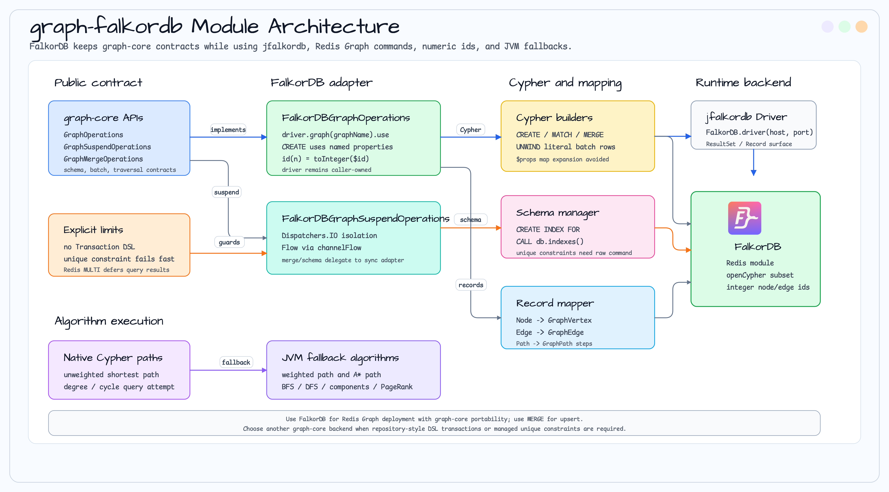

# graph-falkordb

FalkorDB graph database backend for bluetape4k-graph.

> 🇰🇷 [한국어 문서](README.ko.md)

## Overview

[FalkorDB](https://falkordb.com/) is a Redis-module based graph database supporting openCypher queries.
This module provides sync and coroutine implementations of `GraphOperations` / `GraphSuspendOperations`
using the [jfalkordb](https://github.com/FalkorDB/jfalkordb) 0.8.0 Java driver.

## Architecture Diagram



## Dependencies

```kotlin
// build.gradle.kts
dependencies {
    implementation("io.bluetape4k:graph-falkordb:<version>")
}
```

## Usage

```kotlin
import com.falkordb.FalkorDB
import io.bluetape4k.graph.falkordb.FalkorDBGraphOperations

val driver = FalkorDB.driver("localhost", 6379)
val ops = FalkorDBGraphOperations(driver, graphName = "social")

val alice = ops.createVertex("Person", mapOf("name" to "Alice", "age" to 30))
val bob   = ops.createVertex("Person", mapOf("name" to "Bob",   "age" to 25))
ops.createEdge(alice.id, bob.id, "KNOWS", mapOf("since" to 2024))

val count = ops.countVertices("Person")  // 2
driver.close()
```

## Schema / Index Management

FalkorDB supports range indexes through Cypher. Unique constraints require the raw Redis
`GRAPH.CONSTRAINT CREATE` command, so this manager fails explicitly for unique constraints until that command path is
added.

```kotlin
import io.bluetape4k.graph.schema.schemaManager

val schema = ops.schemaManager()
schema.createIndex("Person", "email")
val indexes = schema.listIndexes()
schema.dropIndex("Person", "email")
```

## Merge / Upsert and Transaction DSL

FalkorDB supports `GraphMergeOperations` with native Cypher `MERGE` for vertices and relationships.
It does not expose the repository-style `Transaction DSL` because Redis `MULTI` defers graph query results until
`EXEC`, while the DSL needs created vertex IDs immediately inside the same block.

```kotlin
import io.bluetape4k.graph.repository.mergeEdge
import io.bluetape4k.graph.repository.mergeVertex

val alice = ops.mergeVertex(
    label = "Person",
    matchProperties = mapOf("email" to "alice@example.com"),
    setProperties = mapOf("name" to "Alice"),
)

val bob = ops.mergeVertex(
    label = "Person",
    matchProperties = mapOf("email" to "bob@example.com"),
)

val edge = ops.mergeEdge(
    fromId = alice.id,
    toId = bob.id,
    label = "KNOWS",
)
```

### Coroutine (Suspend) API

```kotlin
import io.bluetape4k.graph.falkordb.FalkorDBGraphSuspendOperations

val driver = FalkorDB.driver("localhost", 6379)
val ops = FalkorDBGraphSuspendOperations(driver, graphName = "social")

runBlocking {
    val alice = ops.createVertex("Person", mapOf("name" to "Alice"))
    val neighbors = ops.neighbors(alice.id, NeighborOptions()).toList()
}
driver.close()
```

## Testing

Uses Testcontainers (`FalkorDBServer`) to spin up `falkordb/falkordb:v4.20.2`:

```kotlin
val server = FalkorDBServer.Launcher.falkordb
val driver = FalkorDB.driver(server.host, server.port)
```

```bash
./gradlew :graph-falkordb:test
```

## Notes

- FalkorDB Cypher subset does **not** support `$props` map-expansion in `CREATE` — properties are passed as individual named parameters.
- Node IDs are integers; `GraphElementId.value` must be numeric for ID-based lookups.
- `FalkorDB.driver()` is the entry point (not Neo4j Driver).
