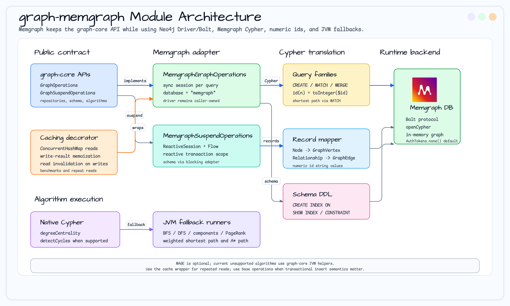

# graph-memgraph

`GraphOperations` / `GraphSuspendOperations` implementation for the Memgraph graph database.

> 🇰🇷 [한국어 문서](README.ko.md)

## Overview

[Memgraph](https://memgraph.com/) is an in-memory graph database that is fully compatible with the Neo4j Bolt protocol and openCypher.
It can be connected to with `neo4j-java-driver` as-is.

## Architecture Diagram



`graph-memgraph` keeps the `graph-core` repository contracts and maps them to Memgraph through the Neo4j Java Driver, Memgraph Cypher syntax, numeric `id()` values, schema DDL, and JVM algorithm fallbacks.

The module uses the driver API directly and does not expose the `graph-neo4j`
implementation module transitively. Its Caffeine cache is declared as a direct
implementation dependency.

## Key Classes

| Class | Description |
|-------|-------------|
| `MemgraphGraphOperations` | Synchronous (blocking) graph operations |
| `MemgraphGraphSuspendOperations` | Coroutine (suspend/Flow) graph operations |
| `CachingMemgraphGraphOperations` | Caffeine bounded/expiring caching decorator over `MemgraphGraphOperations` |
| `MemgraphGraphSchemaManager` | Schema/index manager for Memgraph indexes and unique constraints |

## Usage

```kotlin
import java.time.Duration

val driver = GraphDatabase.driver("bolt://localhost:7687", AuthTokens.none())

// Synchronous
val ops = MemgraphGraphOperations(driver)
val vertex = ops.createVertex("Person", mapOf("name" to "Alice"))

// Coroutine
val suspendOps = MemgraphGraphSuspendOperations(driver)
val vertex = suspendOps.createVertex("Person", mapOf("name" to "Alice"))
```

## Schema / Index Management

```kotlin
import io.bluetape4k.graph.schema.schemaManager

val schema = ops.schemaManager()
schema.createIndex("Person", "email")
schema.createUniqueConstraint("Person", "email")

val indexes = schema.listIndexes()
val constraints = schema.listConstraints()

schema.dropIndex("Person", "email")
```

Memgraph uses `CREATE INDEX ON :Label(property)`, `SHOW INDEX INFO`,
`CREATE CONSTRAINT ON (n:Label) ASSERT n.property IS UNIQUE`, and `SHOW CONSTRAINT INFO`.

## Merge / Upsert and Transaction DSL

Memgraph supports `GraphMergeOperations` through Cypher `MERGE` and the repository-style `Transaction DSL`.
Use `matchProperties` as stable vertex identity keys and keep mutable values in `setProperties`.

```kotlin
import io.bluetape4k.graph.repository.mergeVertex
import io.bluetape4k.graph.repository.transaction

val alice = ops.mergeVertex(
    label = "Person",
    matchProperties = mapOf("email" to "alice@example.com"),
    setProperties = mapOf("name" to "Alice"),
)

val edge = ops.transaction {
    val bob = createVertex("Person", mapOf("email" to "bob@example.com"))
    createEdge(alice.id, bob.id, "KNOWS")
}
```

## Differences from Neo4j

| Item | Neo4j | Memgraph |
|------|-------|----------|
| Default database parameter | `"neo4j"` | `"memgraph"` |
| `elementId()` support | Yes (5.x) | Yes (2.x+) |
| `shortestPath` | Yes | Yes |
| Authentication | Basic auth | None by default (`AuthTokens.none()`) |

## Graph Algorithms

Memgraph shares the same Cypher-based algorithm implementations as `graph-neo4j` (both use the Neo4j Bolt protocol).

### Algorithm Support Matrix

| Algorithm | Implementation | Notes |
|-----------|---------------|-------|
| `degreeCentrality` | Cypher native (`OPTIONAL MATCH ... count`) | |
| `bfs` / `dfs` | JVM fallback (`BfsDfsRunner`) | |
| `detectCycles` | Cypher native (variable-length path) | |
| `connectedComponents` | JVM fallback (`UnionFind`) | |
| `pageRank` | JVM fallback (`PageRankCalculator`) | Memgraph MAGE optional module planned |

### Usage Example

```kotlin
val driver = GraphDatabase.driver("bolt://localhost:7687", AuthTokens.none())
val ops = MemgraphGraphOperations(driver)

val degree = ops.degreeCentrality(alice.id, DegreeOptions(edgeLabel = "KNOWS"))
val cycles = ops.detectCycles(CycleOptions(edgeLabel = "KNOWS", maxDepth = 5))
val top10  = ops.pageRank(PageRankOptions(vertexLabel = "Person", topK = 10))
```

## Caching Decorator

`CachingMemgraphGraphOperations` wraps a `MemgraphGraphOperations` instance and memoizes all read results in six Caffeine caches. Each cache applies the configured `maxSize` entry bound and `expireAfterWrite` TTL, making the decorator suitable for read-heavy workloads such as benchmarks or repeated graph traversals.

### Cache Behaviour

| Operation | Effect |
|-----------|--------|
| `findVertexById`, `findVerticesByLabel`, `neighbors`, `shortestPath`, `allPaths`, `findEdgesByLabel` | Results cached on first call; subsequent calls return the cached value without hitting the DB |
| `maxSize`, `expireAfterWrite` | Applied to every read cache; both values must be positive |
| `createVertex`, `createEdge` | Every call delegates to the underlying operation, even with identical arguments. Read caches are invalidated after the write |
| `updateVertex`, `deleteVertex`, `deleteEdge` | All read caches invalidated |
| `dropGraph` | Delegates first and invalidates all read caches after a successful graph deletion |
| `transaction { ... }` | Forwards the backend transaction capability; commit invalidates all read caches, while rollback keeps the existing cache |

Each cache miss captures a generation before the delegate read. If a wrapper-visible write, `dropGraph`, or committed transaction advances that generation while the read is in flight, the returned value is not reinserted into the cache. The in-flight call may still return the value it read before the write; writes performed through another delegate instance remain outside this wrapper's invalidation boundary.

### Usage Example

```kotlin
import java.time.Duration

val driver = GraphDatabase.driver("bolt://localhost:7687", AuthTokens.none())
val baseOps = MemgraphGraphOperations(driver)

// Wrap with bounded/expiring caching decorator
val ops = CachingMemgraphGraphOperations(
    baseOps,
    maxSize = 1_000,
    expireAfterWrite = Duration.ofMinutes(5),
)

// First call: DB query
val alice = ops.findVertexById("Person", aliceId)

// Second call: cache hit, no DB round-trip
val aliceCached = ops.findVertexById("Person", aliceId)

// Supported write methods invalidate all read caches automatically
ops.deleteVertex("Person", aliceId)
val afterDelete = ops.findVertexById("Person", aliceId)  // null (cache miss → DB)
```

## Testing

Testcontainers automatically launches the `memgraph/memgraph:latest` image.

```bash
./gradlew :graph-memgraph:test
```
