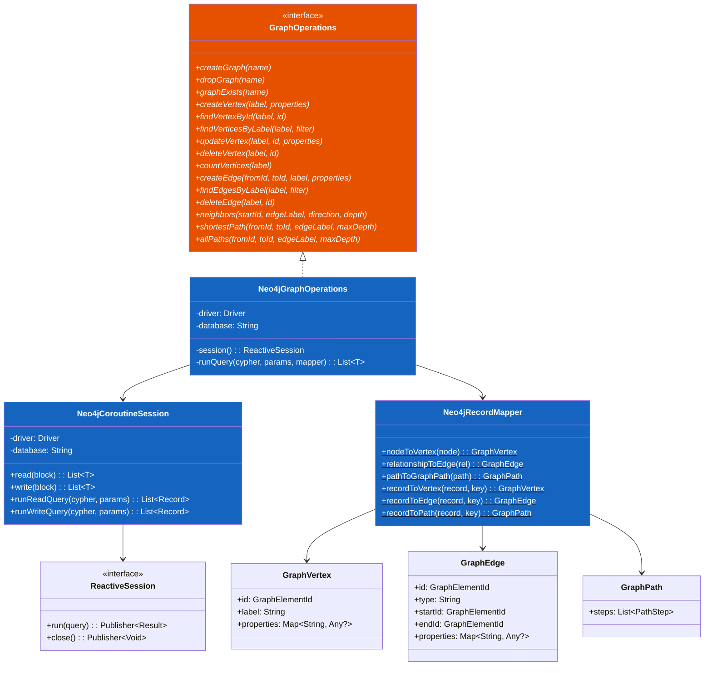
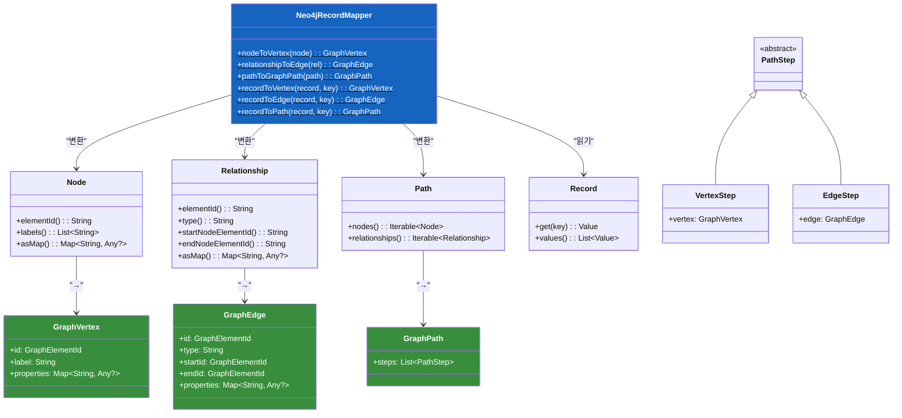
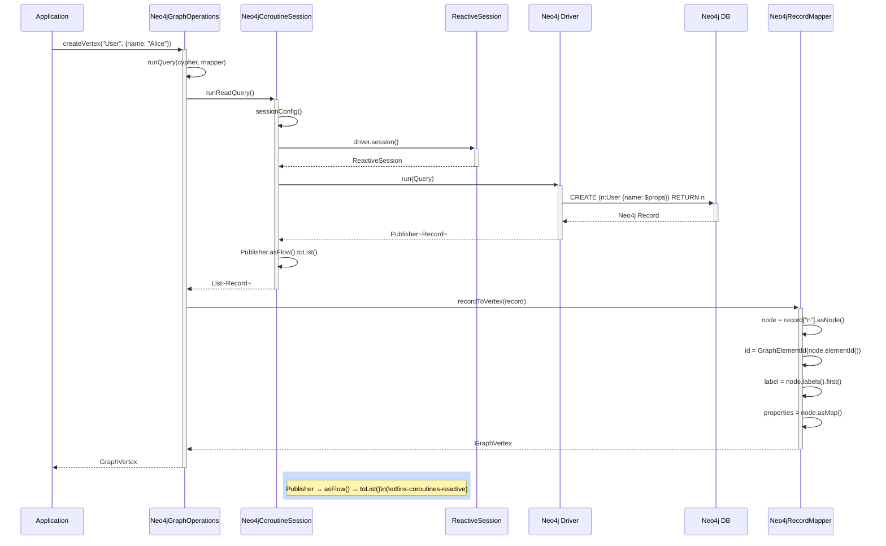
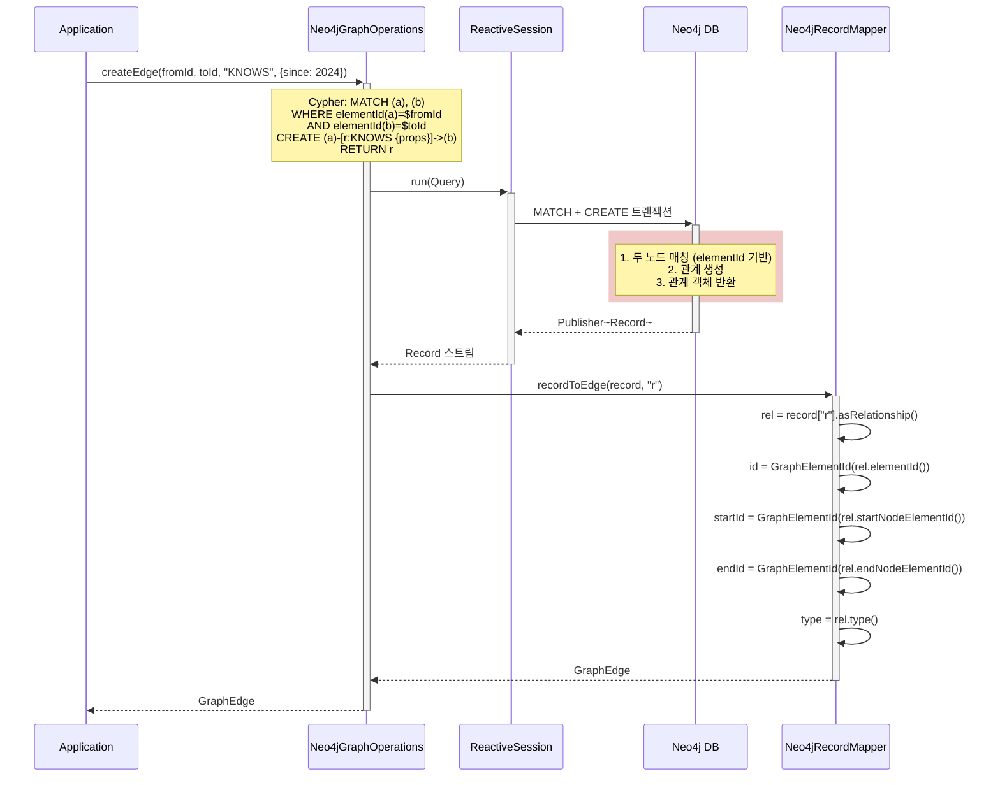
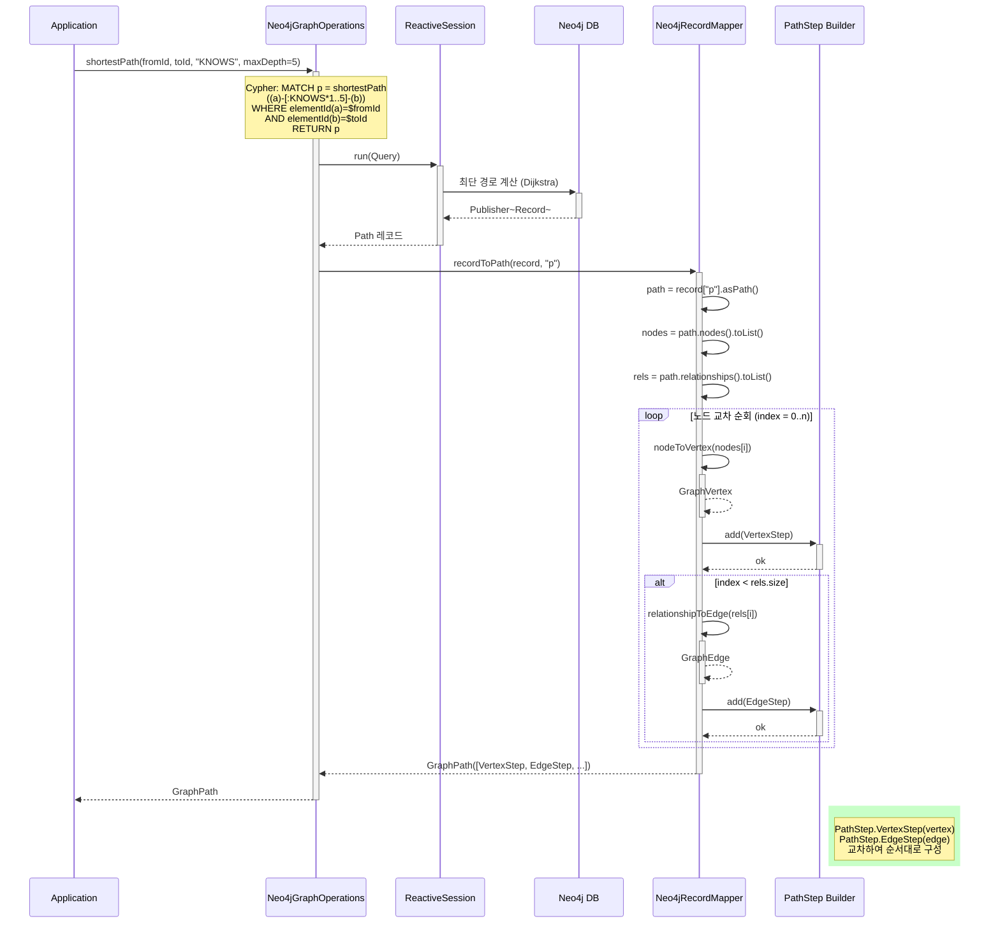
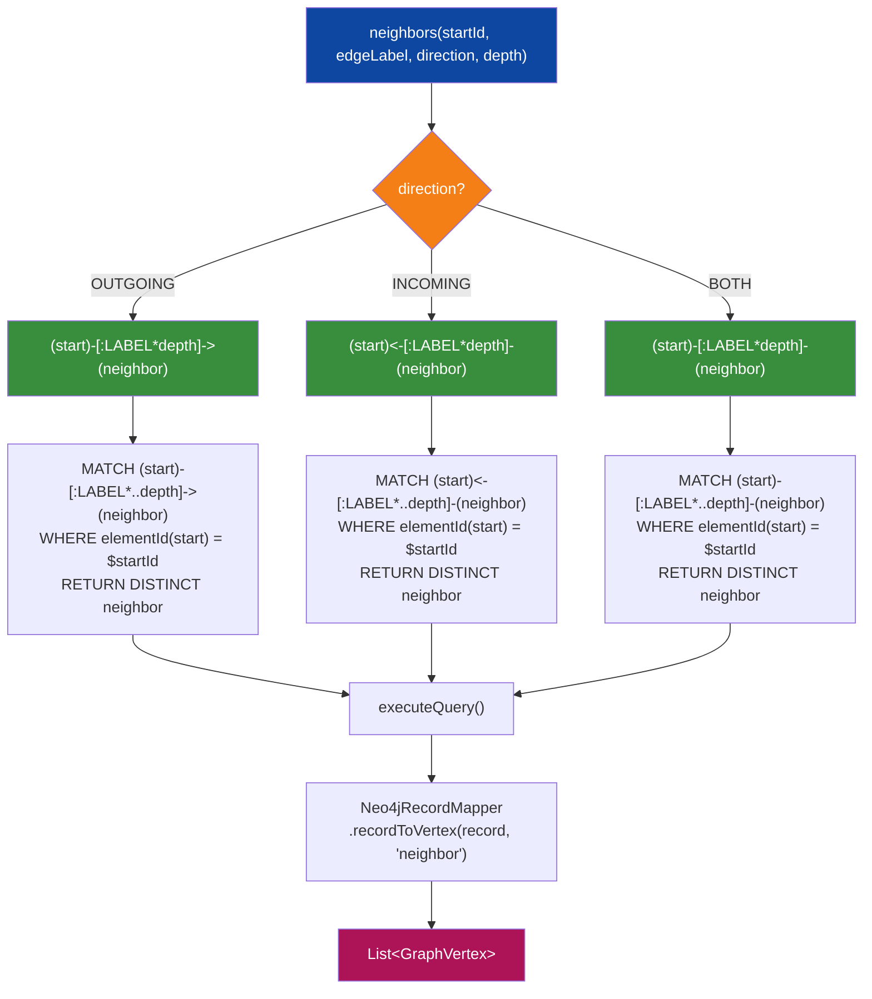
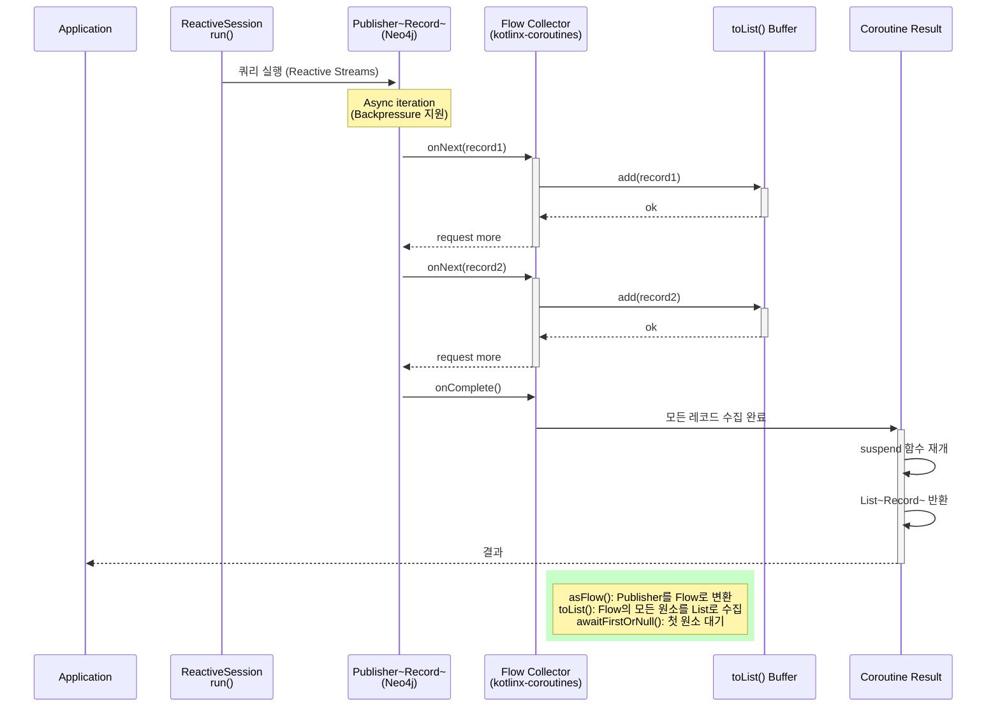
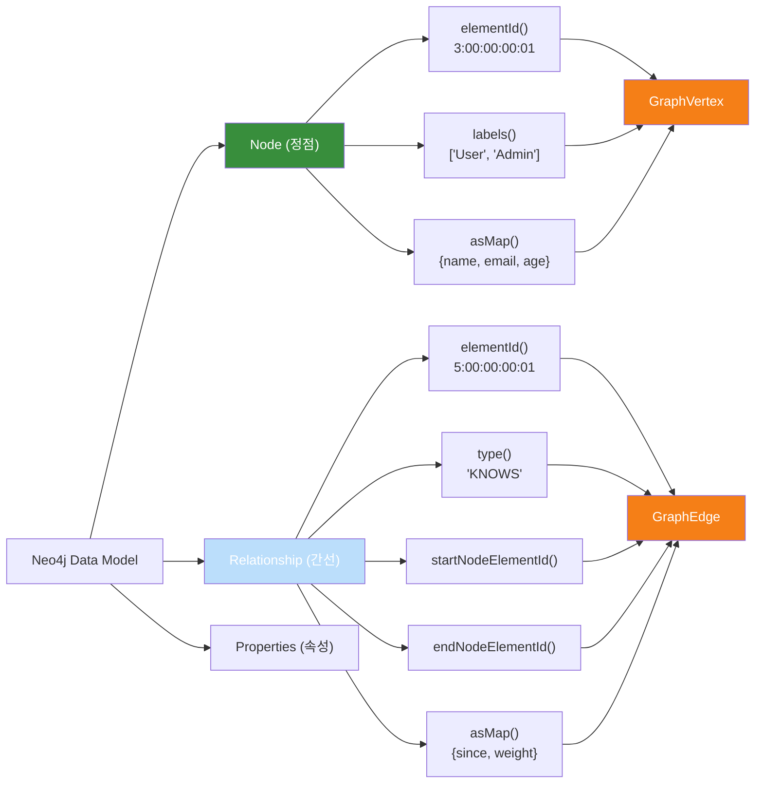
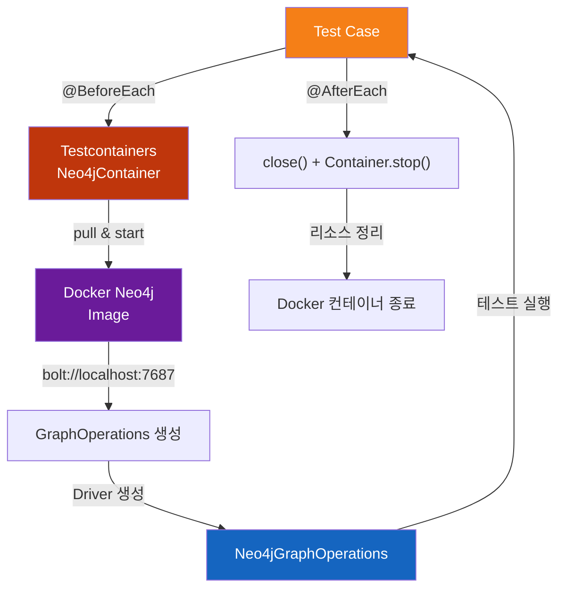

# Module graph-neo4j

Neo4j Java Driver 5.x + Kotlin Coroutines를 사용하여 `GraphOperations` 인터페이스를 구현한 모듈입니다.
Reactive Streams API를 `kotlinx-coroutines-reactive`로 브릿지하여 Virtual Thread/Coroutines 친화적이고 non-blocking한 그래프 데이터베이스 접근을 제공합니다.

## 개요

- **Neo4j Reactive API** (`org.neo4j.driver.reactivestreams.ReactiveSession`) 사용
- **Coroutine 기반 suspend API** — `Publisher<T>.asFlow()` / `Publisher<T>.awaitFirstOrNull()`로 async 변환
- **Virtual Thread 친화적** — blocking 호출 없음, 효율적인 리소스 활용
- **elementId() 기반 조회** — Neo4j 5.x의 stable element ID 지원
- **Neo4j Cypher 쿼리 직접 사용** — 복잡한 그래프 연산 (최단 경로, 모든 경로, 이웃 탐색)

## 최근 변경

- Reactive API 기반 `Neo4jCoroutineSession`으로 모든 쿼리를 suspend 메서드로 제공
- `Neo4jRecordMapper`가 Path 객체를 `PathStep` 리스트로 변환 (VertexStep + EdgeStep 교차)
- Direction 기반 neighbors 쿼리 패턴 (OUTGOING / INCOMING / BOTH)
- elementId() 기반 고유 레코드 검색 및 업데이트

```mermaid
graph TD
    App["Application"]
    OpsIface["GraphOperations<br/>(graph-core)"]
    Impl["Neo4jGraphOperations"]
    Session["Neo4jCoroutineSession"]
    Mapper["Neo4jRecordMapper"]
    ReactiveSession["ReactiveSession<br/>(Neo4j Driver)"]
    Cypher["Cypher 쿼리 엔진"]
    Neo4j["Neo4j Database"]

    App --> OpsIface
    OpsIface <|.. Impl
    Impl --> Session
    Impl --> Mapper
    Session --> ReactiveSession
    ReactiveSession --> Cypher
    Cypher --> Neo4j

    style Impl fill:#1565C0,color:#fff
    style Session fill:#1565C0,color:#fff
    style Mapper fill:#1565C0,color:#fff
    style OpsIface fill:#E65100,color:#fff
    style Neo4j fill:#6A1B9A,color:#fff
```

## 핵심 아키텍처

### Reactive-Coroutine 브릿지 원리

```mermaid
graph LR
    ReactiveSession["ReactiveSession"]
    Query["Query 실행"]
    Publisher["Publisher&lt;Record&gt;"]
    Reactive["kotlinx-coroutines-reactive"]
    Flow["Flow&lt;Record&gt;"]
    Suspend["suspend fun"]
    App["Application"]

    ReactiveSession -->|"run(query)"| Query
    Query -->|"Publisher 반환"| Publisher
    Publisher -->|"asFlow()"| Reactive
    Reactive -->|"변환"| Flow
    Flow -->|"toList()"| Suspend
    Suspend -->|"List&lt;Record&gt;"| App

    style Publisher fill:#F57F17,color:#fff
    style Reactive fill:#388E3C,color:#fff
    style Flow fill:#388E3C,color:#fff
    style Suspend fill:#BF360C,color:#fff
```



## 클래스 설계

### Neo4jGraphOperations 구현 구조



### Neo4jCoroutineSession 상세 설계

```mermaid
classDiagram
    class Driver {
        <<interface>>
        +session(type, config): T
    }

    class ReactiveSession {
        <<interface>>
        +run(query): Publisher~Result~
        +close(): Publisher~Void~
    }

    class Neo4jCoroutineSession {
        -driver: Driver
        -database: String = "neo4j"
        +read(block): List~T~
        +write(block): List~T~
        +runReadQuery(cypher, params): List~Record~
        +runWriteQuery(cypher, params): List~Record~
        +close()
        -sessionConfig(): SessionConfig
    }

    class SessionConfig {
        +withDatabase(name): SessionConfig
        +build(): SessionConfig
    }

    class Publisher~T~ {
        <<interface>>
        +subscribe(subscriber)
        +asFlow(): Flow~T~
        +awaitFirstOrNull(): T?
    }

    class Flow~T~ {
        <<interface>>
        +toList(): List~T~
    }

    Driver --> ReactiveSession: "session<ReactiveSession>()"
    Neo4jCoroutineSession --> Driver
    Neo4jCoroutineSession --> SessionConfig
    ReactiveSession --> Publisher
    Publisher --|"kotlinx-coroutines-reactive"| Flow

    note for Neo4jCoroutineSession "Driver는 외부 소유, close()에서 닫지 않음"
```

### Neo4jRecordMapper 변환 메서드



## 시퀀스 다이어그램

### createVertex 흐름



### createEdge 트랜잭션 흐름



### shortestPath 조회 흐름



### neighbors 방향별 Cypher 패턴



### Publisher → Coroutine 변환 메커니즘



### Neo4j 데이터 모델



### 테스트 환경 구성



## 주요 메서드

### Vertex 관리

```kotlin
// Vertex 생성
suspend fun createVertex(label: String, properties: Map<String, Any?>): GraphVertex
// CYPHER: CREATE (n:$label {$props}) RETURN n

// Vertex 단건 조회 (elementId 기반)
suspend fun findVertexById(label: String, id: GraphElementId): GraphVertex?
// CYPHER: MATCH (n:$label) WHERE elementId(n) = $id RETURN n

// 레이블 + 필터로 조회
suspend fun findVerticesByLabel(label: String, filter: Map<String, Any?>): List<GraphVertex>
// CYPHER: MATCH (n:$label) WHERE n.key1 = $key1 AND ... RETURN n

// Vertex 업데이트
suspend fun updateVertex(label: String, id: GraphElementId, properties: Map<String, Any?>): GraphVertex?
// CYPHER: MATCH (n:$label) WHERE elementId(n) = $id SET n.prop1 = $prop1 ... RETURN n

// Vertex 삭제 (관련 간선 모두 제거)
suspend fun deleteVertex(label: String, id: GraphElementId): Boolean
// CYPHER: MATCH (n:$label) WHERE elementId(n) = $id DETACH DELETE n

// Vertex 개수 조회
suspend fun countVertices(label: String): Long
// CYPHER: MATCH (n:$label) RETURN count(n)
```

### Edge 관리

```kotlin
// Edge 생성
suspend fun createEdge(
    fromId: GraphElementId,
    toId: GraphElementId,
    label: String,
    properties: Map<String, Any?>,
): GraphEdge
// CYPHER: MATCH (a), (b) WHERE elementId(a) = $fromId AND elementId(b) = $toId
//         CREATE (a)-[r:$label {$props}]->(b) RETURN r

// 레이블 + 필터로 조회
suspend fun findEdgesByLabel(label: String, filter: Map<String, Any?>): List<GraphEdge>
// CYPHER: MATCH ()-[r:$label]->() WHERE r.key1 = $key1 ... RETURN r

// Edge 삭제
suspend fun deleteEdge(label: String, id: GraphElementId): Boolean
// CYPHER: MATCH ()-[r:$label]->() WHERE elementId(r) = $id DELETE r
```

### 그래프 탐색

```kotlin
// 이웃 조회 (방향 지정)
suspend fun neighbors(
    startId: GraphElementId,
    edgeLabel: String,
    direction: Direction,  // OUTGOING, INCOMING, BOTH
    depth: Int,
): List<GraphVertex>
// direction=OUTGOING: (start)-[:LABEL*..depth]->(neighbor)
// direction=INCOMING: (start)<-[:LABEL*..depth]-(neighbor)
// direction=BOTH:     (start)-[:LABEL*..depth]-(neighbor)

// 최단 경로 조회
suspend fun shortestPath(
    fromId: GraphElementId,
    toId: GraphElementId,
    edgeLabel: String? = null,
    maxDepth: Int,
): GraphPath?
// CYPHER: MATCH p = shortestPath((a)-[relPattern]-(b))
//         WHERE elementId(a) = $fromId AND elementId(b) = $toId RETURN p

// 모든 경로 조회
suspend fun allPaths(
    fromId: GraphElementId,
    toId: GraphElementId,
    edgeLabel: String? = null,
    maxDepth: Int,
): List<GraphPath>
// CYPHER: MATCH p = (a)-[relPattern]-(b)
//         WHERE elementId(a) = $fromId AND elementId(b) = $toId RETURN p
```

## 사용 예시

### 의존성 추가

```kotlin
// build.gradle.kts
dependencies {
    implementation(project(":graph-neo4j"))
    implementation(Libs.neo4j_java_driver)
    implementation(Libs.kotlinx_coroutines_reactive)
}
```

### Neo4j Driver 생성 및 GraphOperations 초기화

```kotlin
import org.neo4j.driver.GraphDatabase
import io.bluetape4k.graph.neo4j.Neo4jGraphOperations

// Driver 생성 (외부 관리)
val driver = GraphDatabase.driver("bolt://localhost:7687")

// GraphOperations 생성
val graphOps = Neo4jGraphOperations(driver, database = "neo4j")
```

### createVertex 예시

```kotlin
runTest {
    val driver = GraphDatabase.driver("bolt://localhost:7687")
    val graphOps = Neo4jGraphOperations(driver)

    try {
        // Vertex 생성
        val user = graphOps.createVertex(
            label = "User",
            properties = mapOf(
                "name" to "Alice",
                "email" to "alice@example.com",
                "age" to 30,
            ),
        )

        println("Created vertex: $user")
        // GraphVertex(id=GraphElementId(...), label=User, properties={name=Alice, email=alice@example.com, age=30})

        // Vertex 조회
        val found = graphOps.findVertexById("User", user.id)
        println("Found: $found")

        // Vertex 개수
        val count = graphOps.countVertices("User")
        println("Total users: $count")
    } finally {
        driver.close()
    }
}
```

### createEdge 예시

```kotlin
runTest {
    val driver = GraphDatabase.driver("bolt://localhost:7687")
    val graphOps = Neo4jGraphOperations(driver)

    try {
        // 두 개의 Vertex 생성
        val alice = graphOps.createVertex("User", mapOf("name" to "Alice"))
        val bob = graphOps.createVertex("User", mapOf("name" to "Bob"))

        // Edge 생성 (Alice -> Bob)
        val knows = graphOps.createEdge(
            fromId = alice.id,
            toId = bob.id,
            label = "KNOWS",
            properties = mapOf("since" to 2024),
        )

        println("Created edge: $knows")
        // GraphEdge(id=..., type=KNOWS, startId=..., endId=..., properties={since=2024})

        // Edge 조회
        val edges = graphOps.findEdgesByLabel("KNOWS", emptyMap())
        println("Total KNOWS edges: ${edges.size}")
    } finally {
        driver.close()
    }
}
```

### shortestPath 예시

```kotlin
runTest {
    val driver = GraphDatabase.driver("bolt://localhost:7687")
    val graphOps = Neo4jGraphOperations(driver)

    try {
        // 그래프 구성: A --KNOWS--> B --KNOWS--> C
        val a = graphOps.createVertex("Person", mapOf("name" to "A"))
        val b = graphOps.createVertex("Person", mapOf("name" to "B"))
        val c = graphOps.createVertex("Person", mapOf("name" to "C"))

        graphOps.createEdge(a.id, b.id, "KNOWS", emptyMap())
        graphOps.createEdge(b.id, c.id, "KNOWS", emptyMap())

        // 최단 경로 조회: A -> C
        val path = graphOps.shortestPath(
            fromId = a.id,
            toId = c.id,
            edgeLabel = "KNOWS",
            maxDepth = 5,
        )

        if (path != null) {
            println("Path found with ${path.steps.size} steps")
            path.steps.forEach { step ->
                when (step) {
                    is PathStep.VertexStep -> println("  Vertex: ${step.vertex.properties["name"]}")
                    is PathStep.EdgeStep -> println("  Edge: ${step.edge.type}")
                }
            }
        }
    } finally {
        driver.close()
    }
}
```

### neighbors 예시 (방향별)

```kotlin
runTest {
    val driver = GraphDatabase.driver("bolt://localhost:7687")
    val graphOps = Neo4jGraphOperations(driver)

    try {
        // 그래프 구성: A -> B, A -> C, D -> A
        val a = graphOps.createVertex("Node", mapOf("name" to "A"))
        val b = graphOps.createVertex("Node", mapOf("name" to "B"))
        val c = graphOps.createVertex("Node", mapOf("name" to "C"))
        val d = graphOps.createVertex("Node", mapOf("name" to "D"))

        graphOps.createEdge(a.id, b.id, "LINK", emptyMap())
        graphOps.createEdge(a.id, c.id, "LINK", emptyMap())
        graphOps.createEdge(d.id, a.id, "LINK", emptyMap())

        // OUTGOING: A -> ?
        val outgoing = graphOps.neighbors(a.id, "LINK", Direction.OUTGOING, depth = 1)
        println("Outgoing neighbors: ${outgoing.map { it.properties["name"] }}")  // [B, C]

        // INCOMING: ? -> A
        val incoming = graphOps.neighbors(a.id, "LINK", Direction.INCOMING, depth = 1)
        println("Incoming neighbors: ${incoming.map { it.properties["name"] }}")  // [D]

        // BOTH: <-> A
        val both = graphOps.neighbors(a.id, "LINK", Direction.BOTH, depth = 1)
        println("Both neighbors: ${both.map { it.properties["name"] }}")  // [B, C, D]
    } finally {
        driver.close()
    }
}
```

## Testcontainers 설정

### 의존성

```kotlin
// build.gradle.kts
testImplementation(Libs.bluetape4k_testcontainers)
testImplementation(Libs.testcontainers_neo4j)
testImplementation(Libs.kotlinx_coroutines_test)
```

### 싱글턴 컨테이너 패턴

```kotlin
import org.testcontainers.containers.Neo4jContainer
import kotlinx.coroutines.test.runTest

class Neo4jGraphOperationsTest {
    companion object {
        @JvmStatic
        val neo4jContainer = Neo4jContainer("neo4j:5.18")
            .withoutAuthentication()
            .start()

        fun getBoltUrl() = neo4jContainer.getBoltUrl()
    }

    @Test
    fun `should create and find vertex`() = runTest {
        val driver = GraphDatabase.driver(getBoltUrl())
        val graphOps = Neo4jGraphOperations(driver)

        try {
            val vertex = graphOps.createVertex("User", mapOf("name" to "Test"))
            assertNotNull(vertex)
            assertEquals("User", vertex.label)

            val found = graphOps.findVertexById("User", vertex.id)
            assertEquals(vertex.id, found?.id)
        } finally {
            driver.close()
        }
    }
}
```

## AGE vs Neo4j 비교

| 항목 | Apache AGE | Neo4j |
|------|-----------|-------|
| **기반 DB** | PostgreSQL (확장) | 그래프 전용 DB |
| **쿼리 언어** | Cypher (SQL 래퍼) | Native Cypher |
| **드라이버** | JDBC / PostgreSQL 드라이버 | Neo4j Java Driver (Reactive API) |
| **성능** | 관계형 최적화 → 그래프 쿼리 저하 | 그래프 최적화 (아직도 가장 빠름) |
| **확장성** | PostgreSQL 상속 (horizontal scale 어려움) | Cluster / Federation 지원 |
| **RESP3 / Reactive** | 제한적 | 완전 지원 (Client Tracking) |
| **Virtual Thread / Coroutine** | 일반적 JDBC → Loom 미지원 | ReactiveSession → Non-blocking |
| **사용 사례** | 기존 PostgreSQL에 그래프 추가 | 그래프 전용 시스템 (소셜, 추천, 보안) |

## 제공 클래스

| 클래스 | 역할 |
|--------|------|
| `Neo4jGraphOperations` | `GraphOperations` 구현체 (모든 CRUD + 탐색) |
| `Neo4jCoroutineSession` | Reactive API를 Coroutine으로 브릿지 |
| `Neo4jRecordMapper` | Neo4j Record → Domain 모델 변환 |

## 주의사항

### Driver 소유권

```kotlin
// Driver 생성은 호출자가 관리
val driver = GraphDatabase.driver("bolt://localhost:7687")
val graphOps = Neo4jGraphOperations(driver)

// close() 호출 시에도 driver를 닫지 않음 (호출자 책임)
graphOps.close()  // no-op
driver.close()    // 호출자가 명시적으로 닫아야 함
```

### elementId() 사용

Neo4j 5.x에서는 `elementId()` (stable ID)를 사용하므로, 4.x 드라이버와 호환 불가.

```kotlin
// ❌ 잘못된 사용 (4.x)
val id = node.id()  // deprecated, unstable

// ✅ 올바른 사용 (5.x)
val id = GraphElementId(node.elementId())  // stable, recommended
```

### Cypher 파라미터화

모든 쿼리는 파라미터화되어 Cypher Injection 방지:

```kotlin
// ✅ 파라미터화 (안전)
runQuery("MATCH (n:User) WHERE n.name = \$name", mapOf("name" to userInput))

// ❌ 문자열 연결 (위험 - 코드에서 사용하지 않음)
val cypher = "MATCH (n:User) WHERE n.name = '$userInput'"
```

### 깊이 제약

최단 경로/모든 경로 쿼리는 반드시 `maxDepth` 설정:

```kotlin
// ✅ 깊이 제한
graphOps.shortestPath(fromId, toId, edgeLabel = "KNOWS", maxDepth = 10)

// ❌ 무한 탐색 (timeout 위험)
// maxDepth 없이 호출하면 안 됨
```

## 성능 팁

### 인덱스 활용

큰 그래프에서는 Neo4j 인덱스를 미리 생성하면 조회 성능 향상:

```cypher
CREATE INDEX idx_user_name FOR (u:User) ON (u.name)
CREATE INDEX idx_person_age FOR (p:Person) ON (p.age)
```

### Batch 작업

대량의 Vertex/Edge 생성 시 Neo4j 트랜잭션으로 묶기:

```kotlin
// Neo4j 트랜잭션 내 반복
val batchSize = 1000
for (i in 0 until items.size step batchSize) {
    // 트랜잭션 열기
    graphOps.createVertex(...)  // runQuery 내부에서 트랜잭션)
}
```

### 쿼리 프로파일링

복잡한 Cypher 쿼리 성능 확인:

```cypher
PROFILE MATCH p = shortestPath((a)-[:KNOWS*..10]-(b))
WHERE elementId(a) = $fromId AND elementId(b) = $toId RETURN p
```

## 라이선스

bluetape4k-experimental는 실험적 프로토타입 저장소입니다.
