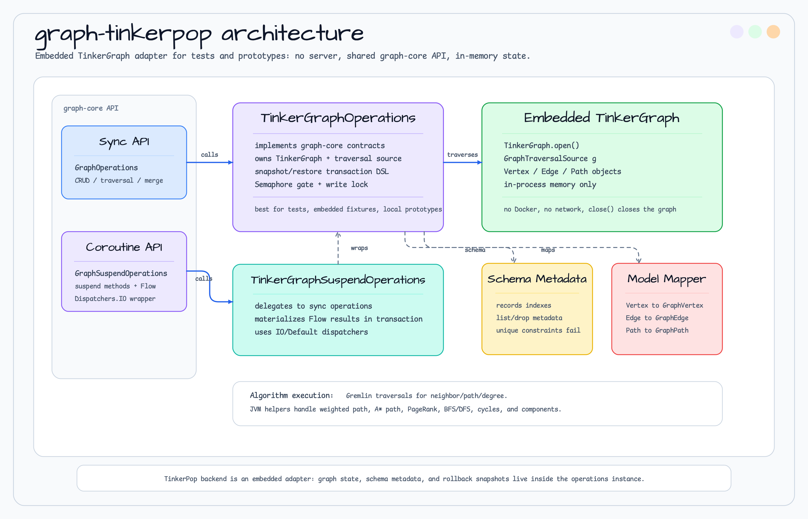
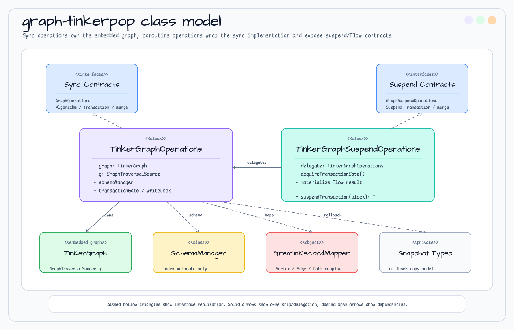

# graph-tinkerpop

`GraphOperations` / `GraphSuspendOperations` implementation based on Apache TinkerPop Gremlin.

> 🇰🇷 [한국어 문서](README.ko.md)

## Overview

Implements the `graph-core` interfaces using TinkerGraph (an in-memory JVM graph DB).
It runs standalone without an external server, making it well suited for testing and prototyping.



## Key Classes

| Class | Description |
|-------|-------------|
| `TinkerGraphOperations` | Synchronous (blocking) implementation |
| `TinkerGraphSuspendOperations` | Coroutine (suspend + Flow) implementation |
| `TinkerGraphSchemaManager` | In-memory schema/index manager for test-friendly index metadata |
| `GremlinRecordMapper` | Converts TinkerPop Vertex/Edge/Path into GraphVertex/GraphEdge/GraphPath |

## Class Model



## Dependencies

```kotlin
dependencies {
    api("io.github.bluetape4k.graph:bluetape4k-graph-core:${bluetape4kVersion}")
    api(Libs.tinkerpop_gremlin_core)
    api(Libs.tinkergraph_gremlin)
}
```

## Usage Example

```kotlin
val ops = TinkerGraphOperations()

// Create vertices
val alice = ops.createVertex("Person", mapOf("name" to "Alice"))
val bob   = ops.createVertex("Person", mapOf("name" to "Bob"))

// Create edge
ops.createEdge(alice.id, bob.id, "KNOWS", mapOf("since" to 2024L))

// Traverse neighbors
val neighbors = ops.neighbors(alice.id, NeighborOptions(edgeLabel = "KNOWS"))

ops.close()
```

## Schema / Index Management

TinkerGraph has no durable schema DDL. `schemaManager().createIndex(label, property)` records index metadata in the
current operations instance so tests can assert expected schema setup. Unique constraints fail explicitly because
TinkerGraph cannot enforce them.

```kotlin
import io.bluetape4k.graph.schema.schemaManager

val schema = ops.schemaManager()
schema.createIndex("Person", "email")
schema.listIndexes()
```

## Merge / Upsert and Transaction DSL

TinkerGraph supports `GraphMergeOperations` with Gremlin get-or-create/update semantics and an in-memory
`Transaction DSL`. This keeps tests and local prototypes on the same API surface as server-backed modules.

```kotlin
import io.bluetape4k.graph.repository.mergeVertex
import io.bluetape4k.graph.repository.transaction

val alice = ops.mergeVertex(
    label = "Person",
    matchProperties = mapOf("email" to "alice@example.com"),
    setProperties = mapOf("name" to "Alice"),
)

ops.transaction {
    val bob = createVertex("Person", mapOf("email" to "bob@example.com"))
    createEdge(alice.id, bob.id, "KNOWS")
}
```

## Graph Algorithms

TinkerPop uses Gremlin traversals for graph access and local JVM helpers where TinkerGraph does not expose the
required GraphComputer-style execution path. Weighted shortest path and A* path also use the shared graph-core
fallback implementations.

### Algorithm Support Matrix

| Algorithm | Implementation | Notes |
|-----------|---------------|-------|
| `degreeCentrality` | Gremlin edge counts | Uses `inE` / `outE` counts |
| `bfs` | JVM helper over Gremlin-loaded adjacency | Deterministic ordering across TinkerPop versions |
| `dfs` | JVM helper over Gremlin-loaded adjacency | Deterministic ordering across TinkerPop versions |
| `detectCycles` | JVM helper over Gremlin-loaded adjacency | Builds `GraphCycle` from mapped vertices and edges |
| `connectedComponents` | JVM `UnionFind` over Gremlin-loaded edges | Consistent component ordering |
| `pageRank` | JVM `PageRankCalculator` | Avoids GraphComputer dependency in standard TinkerGraph |

### Usage Example

```kotlin
val ops = TinkerGraphOperations()

// All algorithms run natively on TinkerGraph (no Docker required)
val degree = ops.degreeCentrality(alice.id, DegreeOptions(edgeLabel = "KNOWS"))
println("in=${degree.inDegree} out=${degree.outDegree}")

val visits = ops.bfs(alice.id, BfsDfsOptions(edgeLabel = "KNOWS", maxDepth = 3))
println("BFS visited ${visits.size} nodes")

val components = ops.connectedComponents(ComponentOptions(edgeLabel = "KNOWS"))
println("Found ${components.size} connected components")

val top10 = ops.pageRank(PageRankOptions(topK = 10))
top10.forEach { println("${it.vertex.label}: ${it.score}") }

// Virtual Thread usage
val vtOps = ops.asVirtualThread()
val future = vtOps.pageRankAsync()
val scores = future.join()
```
