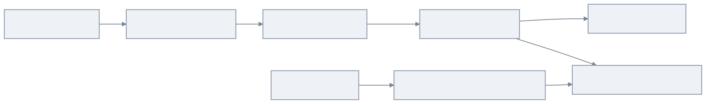

# graph-ktor

> 🇰🇷 [한국어 문서](README.ko.md)

Ktor 3.x plugin integration for `bluetape4k-graph`. It exposes `GraphOperations` and `GraphSuspendOperations` through Ktor `Application` and `ApplicationCall` extensions while keeping backend selection explicit.

## Architecture



## Features

- Ktor `createApplicationPlugin(...)` based integration.
- Explicit backend selection; no implicit production fallback.
- `Application.graphOperations()` / `Application.graphSuspendOperations()`.
- `ApplicationCall.graphOperations()` / `ApplicationCall.graphSuspendOperations()` for route handlers.
- Backend helper functions for TinkerGraph, Neo4j, Memgraph, Apache AGE, and FalkorDB.
- Lifecycle cleanup for plugin-owned resources.

## Dependencies

Use `graph-ktor` with the backend module your application actually runs.

```kotlin
dependencies {
    implementation("io.github.bluetape4k.graph:bluetape4k-graph-ktor")
    implementation("io.github.bluetape4k.graph:bluetape4k-graph-tinkerpop") // or graph-neo4j, graph-age, ...
    implementation("io.ktor:ktor-server-core")
}
```

## Usage

### TinkerGraph

```kotlin
fun Application.module() {
    install(GraphPlugin) {
        tinkerGraph()
    }

    routing {
        get("/cities/count") {
            call.respondText(call.graphSuspendOperations().countVertices("City").toString())
        }
    }
}
```

### Existing Operations

```kotlin
fun Application.module(syncOps: GraphOperations, suspendOps: GraphSuspendOperations) {
    install(GraphPlugin) {
        operations(syncOps, suspendOps)
    }
}
```

### Neo4j

```kotlin
fun Application.module(driver: Driver) {
    install(GraphPlugin) {
        neo4j(driver, database = "neo4j")
    }
}
```

## Backend Notes

| Backend | Helper | Lifecycle |
|---|---|---|
| TinkerGraph | `tinkerGraph()` | Plugin creates and closes the in-memory graph delegate. |
| Neo4j | `neo4j(driver, database)` | Driver is caller-owned and is not closed by the plugin. |
| Memgraph | `memgraph(driver, database)` | Driver is caller-owned and is not closed by the plugin. |
| Apache AGE | `age(graphName)` | Caller must call Exposed `Database.connect(...)` before graph use. |
| FalkorDB | `falkorDB(driver, graphName)` | Driver is caller-owned and is not closed by the plugin. |

## Testing

```bash
./gradlew :graph-ktor:test
```

The test suite includes Ktor `testApplication` checks plus small Testcontainers smoke tests for
Neo4j, Memgraph, Apache AGE, and FalkorDB helper wiring. Docker is required for those backend
runtime checks.
